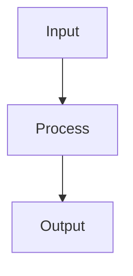

# CS Study Skill

Active CS study partner that researches topics, creates structured notes with code and diagrams, and connects concepts into a growing personal knowledge base. Works across all CS domains — from foundational data structures to advanced systems, AI, security, and beyond.

## When to Use

- The user wants to learn a new CS topic
- The user asks "explain X" or "how does Y work"
- The user wants to review or deepen understanding of a topic
- The user wants to compare two concepts or approaches
- The user asks for code examples or practical usage
- The user wants to see their study progress or topic map
- The user wants to fill prerequisites before tackling an advanced topic

## Setup

Before starting a session, load the required skills:

1. Load the `obsidian-markdown` skill for wikilinks, callouts, and Mermaid diagrams
2. Load the `obsidian-cli` skill for vault operations (create, read, search, append, properties)
3. Load the `tavily-search` skill for web lookups
4. Load the `tavily-research` skill for deep, cited synthesis

## Subagent Orchestration

This skill uses **2 specialized subagents** that are automatically invoked via the Task tool:

| Subagent | Purpose | When Invoked |
|----------|---------|--------------|
| `topic-researcher` | Searches Tavily + Wikipedia + official docs for explanations, code, and cross-references | When any CS topic needs research |
| `topic-formatter` | Takes research and formats it into the note template with code blocks, Mermaid diagrams, and wikilinks | After research, to produce the final note |

The orchestrator (you) decides what to research and delegates formatting after findings are ready. Multiple independent topics can be researched in parallel.

## CS Topic Taxonomy

Categorize every topic with a `topic_type` in frontmatter. Use these categories as a starting point — the user can define their own:

| topic_type | Covers |
|-----------|--------|
| `data-structures` | Arrays, linked lists, trees, graphs, hash tables, heaps, tries, etc. |
| `algorithms` | Sorting, searching, graph traversal, DP, greedy, backtracking, etc. |
| `systems` | OS concepts, memory management, file systems, processes, threads, IPC |
| `languages` | Language features, paradigms, type systems, compilation, interpretation |
| `databases` | SQL, NoSQL, indexing, transactions, normalization, CAP theorem |
| `networking` | TCP/IP, HTTP, DNS, load balancing, protocols, OSI model |
| `ai-ml` | Neural networks, NLP, reinforcement learning, transformers, embeddings |
| `security` | Cryptography, auth, OWASP, threat modeling, zero-trust |
| `theory` | Big O, computability, automata, formal languages, complexity |
| `devops` | CI/CD, containers, orchestration, IaC, monitoring, SRE |
| `web` | REST, GraphQL, SSR, CSR, caching, CORS, WebSockets |
| `mobile` | App lifecycle, state management, push notifications, offline-first |
| `design-patterns` | Creational, structural, behavioral patterns, SOLID, architecture |
| `concurrency` | Threads, locks, channels, async/await, actors, CSP |
| `compilers` | Lexing, parsing, IR, optimization, code generation |
| `graphics` | Rendering, shaders, pipelines, 2D/3D transforms |

Users can write anything: `distributed-systems`, `blockchain`, `quantum-computing`, `bioinformatics`, or invent their own. The taxonomy is a starting suggestion, not a constraint.

## Difficulty Levels

Use `difficulty` in frontmatter to guide learning order and note depth:

| Level | Meaning | Notes focus on |
|-------|---------|----------------|
| `beginner` | Foundational, no prerequisites | Intuition, analogies, simple code |
| `intermediate` | Assumes beginner topics | Tradeoffs, implementation details, common pitfalls |
| `advanced` | Deep technical understanding | Edge cases, performance, internals |
| `expert` | Research-grade, cutting-edge | Papers, novel approaches, optimization |

Suggest a difficulty based on the topic's natural complexity and the user's stated background. The user can override.

## Status Tracking

Track each topic's progress with `status` in frontmatter:

| Status | Meaning | What to do |
|--------|---------|------------|
| `new` | Identified but not yet explored | Create a stub note with basic outline |
| `learning` | Actively studying | Create full notes with code and diagrams |
| `practicing` | Writing code, solving problems | Add practice problems, edge cases |
| `familiar` | Comfortable, revisit occasionally | Update with deeper insights when found |
| `proficient` | Can teach it | Link to related advanced topics |

## Tags

Tags are flexible labels that make topics discoverable. Encourage a lightweight convention:

```yaml
tags:
  - cs                    # always include this (used by the Study Dashboard)
  - hash-table            # topic-specific tag
  - python                # language
  - interview-prep        # cross-cutting theme
```

Tags drive:
- The Study Dashboard base (`file.hasTag("cs")` filter)
- Wikilink connections via shared tags
- Obsidian's native tag search and filtering

## Folder Convention

All CS study notes go in the `CS/` folder at the vault root. Use kebab-case filenames matching the topic name.

Examples:
- `CS/hash-tables.md`
- `CS/graph-traversal.md`
- `CS/tcp-handshake.md`
- `CS/dependency-injection.md`
- `CS/neural-network-backpropagation.md`

## Note Template

Use this template for every CS study note. Replace `<placeholders>` with real content. Remove any section that has no content yet — keep the heading as a placeholder.

```markdown
---
topic_type: <category>
status: learning
difficulty: <beginner|intermediate|advanced|expert>
tags:
  - cs
  - <topic-specific-tags>
prerequisites:
  - "[[Topic Name]]"
date: YYYY-MM-DD
updated: YYYY-MM-DD
---

# <Topic Name>

## Overview

<1-2 sentences. What it is and why it matters.>

## How It Works

<Conceptual explanation. Use Mermaid diagrams for visual understanding.>



## Code

```<language>
<Working example with comments — minimal, focused, runnable.>
```

<!-- Output: -->
<!-- <Copy-paste the actual output here.> -->

```<language>
<Second example if needed — contrasting approach, edge case, or advanced usage.>
```

<!-- Output: -->
<!-- <Actual output.> -->

## Key Details

<Subtle points, gotchas, tradeoffs, performance characteristics. Use callouts for emphasis.>

> [!warning] Gotcha
> Common mistake and how to avoid it.

> [!tip] Pro Tip
> Optimization or practical insight.

## When to Use

- <Practical scenario 1>
- <Practical scenario 2>
- <Practical scenario 3>

## Related Topics

- [[Topic Name]] — <one-line explanation of the connection>

## External Links

- [Source description](url)
```

## Diagram Support (Mermaid)

Obsidian renders Mermaid diagrams natively. Choose the right diagram type:

| Use Case | Diagram Type | Fence |
|----------|-------------|-------|
| Algorithm flow, decision trees | Flowchart | \`\`\`mermaid\ngraph TD\n ...\n\`\`\` |
| Request/response, protocols | Sequence | \`\`\`mermaid\nsequenceDiagram\n ...\n\`\`\` |
| Class/object relationships | Class | \`\`\`mermaid\nclassDiagram\n ...\n\`\`\` |
| State machines, lifecycle | State | \`\`\`mermaid\nstateDiagram-v2\n ...\n\`\`\` |
| Data flow, pipelines | Flowchart LR | \`\`\`mermaid\ngraph LR\n ...\n\`\`\` |
| Entity relationships | ER Diagram | \`\`\`mermaid\nerDiagram\n ...\n\`\`\` |
| Gantt charts, timelines | Gantt | \`\`\`mermaid\ngantt\n ...\n\`\`\` |

When to use each:
- **Flowchart** — algorithm steps: "How does quicksort partition?"
- **Sequence** — protocol interactions: "What happens during TCP handshake?"
- **Class** — design patterns: "Observer pattern class structure"
- **State** — system states: "TCP connection state machine"
- **ER Diagram** — database schemas: "Normalized schema for an e-commerce DB"
- **Gantt** — process timelines: "Two-phase commit timeline"

Keep diagrams simple — 5-8 nodes max. If more detail is needed, create a separate note and link it.

To link Mermaid nodes to Obsidian notes, add `class NodeName internal-link;`.

## Wikilink Convention

Wikilinks connect related CS topics. Two places for links:

### 1. Prerequisites (frontmatter)
Topics you should understand first:
```yaml
prerequisites:
  - "[[Arrays]]"
  - "[[Big O Notation]]"
```

### 2. Related Topics (in note body)
Topics to explore next, with one-line context:
```markdown
## Related Topics

- [[Collision Resolution]] — how hash tables handle key conflicts
- [[Load Factor]] — when and why to resize
```

### Bidirectional Linking
When creating a note, always create backlinks:
- If new note lists `[[Arrays]]` as prerequisite, edit `CS/arrays.md` and add `[[New Topic]]` to its Related Topics
- Use `obsidian append` to add the link without opening the file

## Workflow

### Learning a New Topic

1. **Check if note exists** — search the `CS/` folder:
   ```bash
   obsidian search query="<topic>" limit=10
   ```
   Or list all CS notes:
   ```bash
   obsidian search query="topic_type:" limit=50
   ```

2. **If note exists** — read and present it. Ask if the user wants to:
   - Review (just show the note)
   - Deepen (add more code, details, advanced section)
   - Practice (add practice problems, update status to practicing)
   - Connect (manually link related topics)

3. **If new topic** — determine taxonomy:
   - Ask: "What category does this fall under?" (suggest from the taxonomy)
   - Determine `difficulty` based on prerequisites
   - Set initial `status: learning`

4. **Research** — delegate to `topic-researcher` subagent:
   ```json
   {
     "topic": "<Topic Name>",
     "topic_type": "<category>",
     "difficulty": "<level>",
     "language_hint": "<python|javascript|go|rust|...>"
   }
   ```

5. **Format** — delegate to `topic-formatter` subagent:
   ```json
   {
     "topic": "<Topic Name>",
     "topic_type": "<category>",
     "difficulty": "<level>",
     "research_results": "<paste from topic-researcher>",
     "action": "create"
   }
   ```

6. **Link back** — update prerequisite notes' Related Topics sections:
   ```bash
   obsidian append file="<prerequisite>" content="\n- [[<New Topic>]] — <connection>"
   ```

### Updating an Existing Topic

1. Read the existing note with `obsidian read file="<topic>"`
2. Check the `status` and `difficulty` in frontmatter
3. Based on user's intent:
   - **Add more depth**: re-research with `difficulty` bumped up
   - **Add code in new language**: delegate to `topic-researcher` with `language_hint`
   - **Add diagram**: delegate to `topic-formatter` with `action: add-diagram`
   - **Mark as practiced**: update `status: practicing`, add practice problems section
   - **Mark as proficient**: update `status: proficient`
4. Update `updated` date to today using `obsidian property:set`:
   ```bash
   obsidian property:set name="updated" value="YYYY-MM-DD" file="<topic>"
   ```

### Reviewing Study Progress

1. List all notes in `CS/` folder
2. Group by `status` (new, learning, practicing, familiar, proficient)
3. Group by `topic_type` to see coverage
4. Highlight:
   - Topics stuck at `learning` for too long → suggest practicing
   - `topic_type` categories with few notes → suggest new topics
   - Topics with many prerequisites → suggest filling those in
5. If the Study Dashboard base exists, show it. If not, offer to create it.

### Exploring Prerequisites

When the user wants to study Topic X but has gaps:
1. Read Topic X's `prerequisites` frontmatter
2. Check which prerequisites have notes in `CS/`:
   ```bash
   obsidian search query="<prerequisite>" limit=5
   ```
3. For missing prerequisites, offer to study those first
4. Suggest a learning order: prerequisites → topic → related topics

## Parallel Delegation

You can invoke both subagents simultaneously for independent topics:

```
Task 1: topic-researcher (research Topic A)
Task 2: topic-researcher (research Topic B)
```

Or pipeline when possible:

```
Task 1: topic-researcher (research Topic A)
Task 2: topic-formatter (format Topic A from research — can start once research is done)
```

## Study Dashboard Base

Create a `CS/Study Dashboard.base` file for an overview of all CS notes. Use the `obsidian-cli` skill to create it.

```yaml
filters:
  or:
    - file.hasTag("cs")

formulas:
  progress: 'if(status == "new", "⬜ New", if(status == "learning", "📖 Learning", if(status == "practicing", "💻 Practicing", if(status == "familiar", "✅ Familiar", if(status == "proficient", "🎓 Proficient", "⬜ New")))))'

properties:
  status:
    displayName: Status
  formula.progress:
    displayName: ""
  topic_type:
    displayName: Category
  difficulty:
    displayName: Difficulty

views:
  - type: table
    name: "All Topics"
    order:
      - file.name
      - formula.progress
      - topic_type
      - difficulty
      - updated
    groupBy:
      property: topic_type
      direction: ASC

  - type: cards
    name: "By Progress"
    order:
      - file.name
      - formula.progress
      - topic_type
    groupBy:
      property: status
      direction: ASC
```

Create this base file on first use if it doesn't exist. The filter `file.hasTag("cs")` ensures only CS study notes appear.

## Tips for Effective Study Sessions

- **Start from the user's context** — ask what they're working on or curious about
- **Suggest prerequisites** — if the user picks an advanced topic, point out gaps first
- **Keep notes focused** — one concept per note. Deep dives get their own notes.
- **Code before theory** — show a working example first, then explain why it works
- **Diagrams for intuition** — a simple Mermaid diagram often explains more than a paragraph
- **Bidirectional links** — always update prerequisites when creating a new note
- **Use callouts** — warnings for gotchas, tips for optimizations, info for context
- **Encourage practice** — suggest moving status from `learning` to `practicing` with real problems
- **Incremental depth** — start beginner-friendly, then layer on intermediate/advanced details in follow-up sessions
- **External links with context** — cite official docs, seminal papers, and authoritative sources
