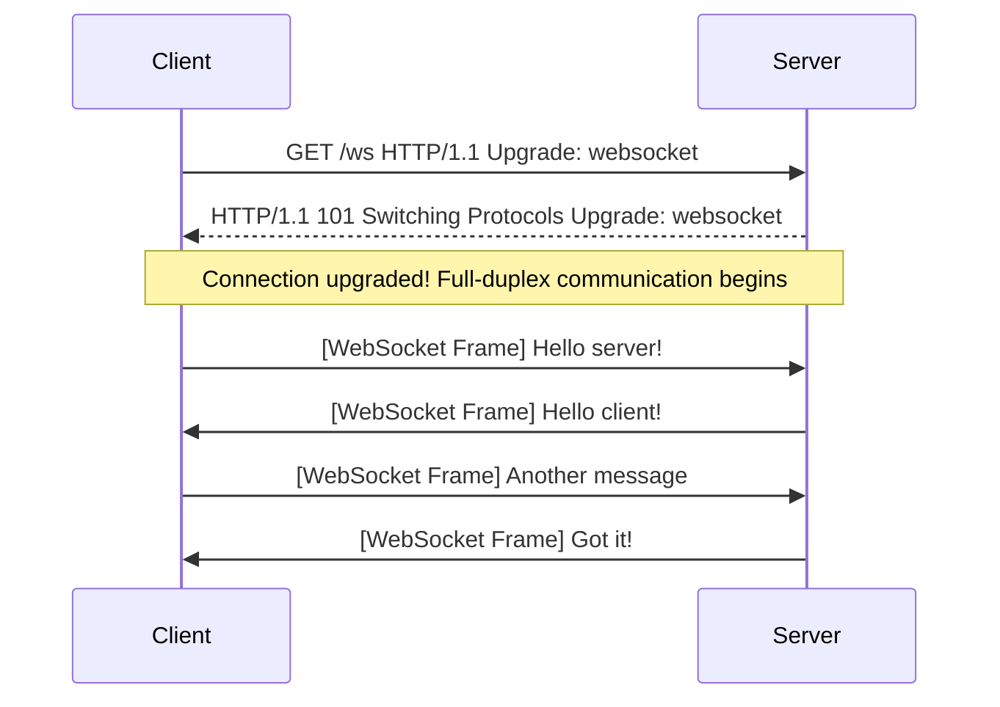
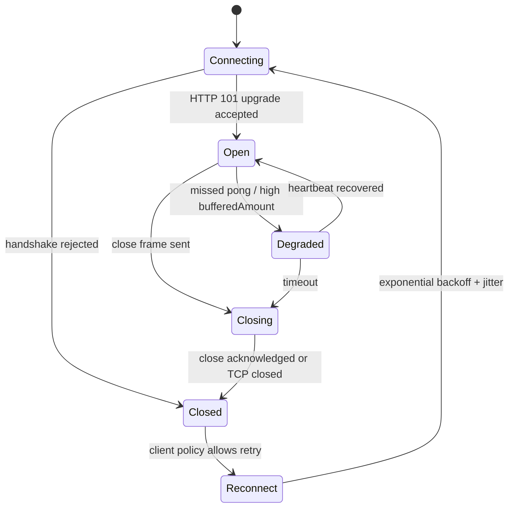
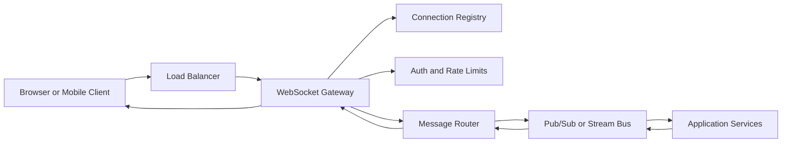
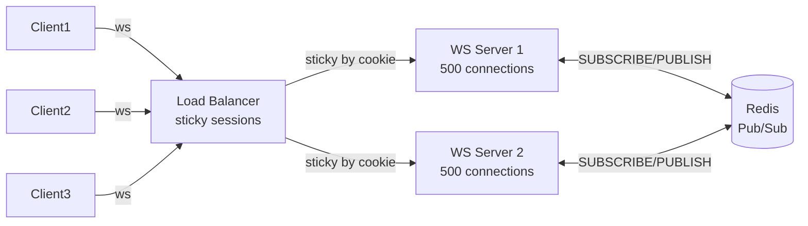

# WebSockets

## Overview

WebSockets is a protocol that provides **full-duplex, bidirectional communication** between a client and server over a single, persistent TCP connection. Unlike HTTP's request-response model, WebSockets allow either party to send data at any time, making it ideal for real-time applications like chat, gaming, and collaborative tools.

## How It Works

WebSockets start with an HTTP **upgrade handshake**. The client sends a special HTTP request asking to upgrade to the WebSocket protocol. If the server agrees, it responds with `101 Switching Protocols`, and the connection transitions from HTTP to the WebSocket protocol. From that point on, both client and server can send messages freely over the same TCP connection.

### The Handshake



### Handshake Headers

**Client Request:**
```
GET /ws HTTP/1.1
Host: example.com
Upgrade: websocket
Connection: Upgrade
Sec-WebSocket-Key: dGhlIHNhbXBsZSBub25jZQ==
Sec-WebSocket-Version: 13
Sec-WebSocket-Protocol: chat, json
Origin: https://example.com
```

**Server Response:**
```
HTTP/1.1 101 Switching Protocols
Upgrade: websocket
Connection: Upgrade
Sec-WebSocket-Accept: s3pPLMBiTxaQ9kYGzzhZRbK+xOo=
Sec-WebSocket-Protocol: chat
```

### Sec-WebSocket-Accept Computation

The server computes `Sec-WebSocket-Accept` to prove it understands the WebSocket protocol:

```
Sec-WebSocket-Accept = base64(SHA-1(Sec-WebSocket-Key + "258EAFA5-E914-47DA-95CA-C5AB0DC85B11"))
```

The magic GUID `258EAFA5-E914-47DA-95CA-C5AB0DC85B11` is defined in RFC 6455 and prevents non-WebSocket servers from accidentally accepting the upgrade.

### Connection Lifecycle



In production, the WebSocket protocol is only the transport. The application still needs a message schema, authentication, authorization, heartbeat policy, reconnection policy, idempotency rules, and backpressure handling.

### WebSocket Framing

After the handshake, data is exchanged in **frames**. Each frame has a specific format:

```
 0                   1                   2                   3
 0 1 2 3 4 5 6 7 8 9 0 1 2 3 4 5 6 7 8 9 0 1 2 3 4 5 6 7 8 9 0 1
+-+-+-+-+-------+-+-------------+-------------------------------+
|F|R|R|R| opcode|M| Payload len |    Extended payload length    |
|I|S|S|S|  (4)  |A|     (7)     |             (16/64)           |
|N|V|V|V|       |S|             |   (if payload len==126/127)   |
| |1|2|3|       |K|             |                               |
+-+-+-+-+-------+-+-------------+ - - - - - - - - - - - - - - - +
|     Extended payload length continued, if payload len == 127  |
+ - - - - - - - - - - - - - - - +-------------------------------+
|                               |Masking-key, if MASK set to 1  |
+-------------------------------+-------------------------------+
| Masking-key (continued)       |          Payload Data         |
+-------------------------------- - - - - - - - - - - - - - - - +
:                     Payload Data continued ...                :
+ - - - - - - - - - - - - - - - - - - - - - - - - - - - - - - - +
|                     Payload Data (continued)                  |
+---------------------------------------------------------------+
```

**Key fields:**

| Field | Description |
|-------|-------------|
| **FIN** (1 bit) | If `1`, this is the final frame of a message. If `0`, more frames follow (fragmentation) |
| **RSV1-3** (3 bits) | Reserved for extensions (must be `0` unless an extension is negotiated) |
| **Opcode** (4 bits) | Frame type: `0x0` continuation, `0x1` text, `0x2` binary, `0x8` close, `0x9` ping, `0xA` pong |
| **MASK** (1 bit) | `1` if payload is masked (client→server **must** be masked, server→client **must not**) |
| **Payload len** (7 bits) | Payload length: 0-125 = actual length, 126 = next 2 bytes are length, 127 = next 8 bytes are length |
| **Masking-key** (4 bytes) | Present if MASK=1. Used to XOR the payload data |
| **Payload Data** | The actual message data |

> [!info] Why Client Frames Are Masked
> Client-to-server frames are masked to prevent **cache poisoning attacks** in HTTP proxies. Masking is NOT for security — it's a protocol-level defense against intermediaries that might misinterpret WebSocket data as HTTP requests.

### Production Architecture



Sticky sessions are useful but not enough by themselves. Once you run more than one gateway instance, messages produced by one service must reach the gateway that owns the target connection. That usually requires a shared pub/sub layer, stream bus, or connection registry.

## Code

### Client-Side (JavaScript WebSocket API)

```javascript
// Connect to WebSocket server
const ws = new WebSocket("ws://localhost:3000");

// Connection opened
ws.onopen = () => {
  console.log("Connected to server");
  ws.send(JSON.stringify({ type: "join", user: "Alice" }));
};

// Receive messages
ws.onmessage = (event) => {
  const data = JSON.parse(event.data);
  console.log("Received:", data);
};

// Handle errors
ws.onerror = (error) => {
  console.error("WebSocket error:", error);
};

// Connection closed
ws.onclose = (event) => {
  console.log(`Disconnected: code=${event.code}, reason=${event.reason}`);
};

// Send different data types
ws.send("Hello server!");                    // Text
ws.send(JSON.stringify({ action: "move" })); // JSON
ws.send(new ArrayBuffer(8));                 // Binary

// Close connection
// ws.close(1000, "Normal closure");

// ReadyState values:
// WebSocket.CONNECTING = 0
// WebSocket.OPEN = 1
// WebSocket.CLOSING = 2
// WebSocket.CLOSED = 3
```

### Server-Side: Node.js (ws library)

```javascript
// npm install ws
const { WebSocketServer } = require("ws");

const wss = new WebSocketServer({ port: 3000 });

wss.on("connection", (ws, req) => {
  const clientIp = req.socket.remoteAddress;
  console.log(`Client connected: ${clientIp}`);

  // Send welcome message
  ws.send(JSON.stringify({ type: "welcome", message: "Connected!" }));

  // Handle incoming messages
  ws.on("message", (data) => {
    const message = JSON.parse(data);
    console.log("Received:", message);

    // Broadcast to all connected clients
    wss.clients.forEach((client) => {
      if (client.readyState === 1) { // WebSocket.OPEN
        client.send(JSON.stringify({
          type: "broadcast",
          from: clientIp,
          data: message,
        }));
      }
    });
  });

  // Handle disconnection
  ws.on("close", (code, reason) => {
    console.log(`Client disconnected: ${code} - ${reason}`);
  });

  // Handle errors
  ws.on("error", (error) => {
    console.error("WebSocket error:", error);
  });
});

console.log("WebSocket server running on ws://localhost:3000");
```

<!-- Output: -->
<!-- WebSocket server running on ws://localhost:3000 -->

### Server-Side: Node.js with Subprotocols and Ping/Pong

```javascript
const { WebSocketServer } = require("ws");

const wss = new WebSocketServer({
  port: 3000,
  handleProtocols: (protocols) => {
    // Negotiate subprotocol
    if (protocols.has("chat")) return "chat";
    return false;
  },
});

wss.on("connection", (ws) => {
  console.log("Subprotocol:", ws.protocol);

  // Send ping every 30 seconds
  const pingInterval = setInterval(() => {
    if (ws.readyState === 1) {
      ws.ping();
    }
  }, 30000);

  // Handle pong response
  ws.on("pong", () => {
    console.log("Client is alive");
  });

  ws.on("close", () => {
    clearInterval(pingInterval);
  });
});
```

### Server-Side: Python (websockets library)

```python
# pip install websockets asyncio
import asyncio
import json
import websockets

connected_clients = set()

async def handler(websocket, path):
    connected_clients.add(websocket)
    try:
        # Send welcome message
        await websocket.send(json.dumps({
            "type": "welcome",
            "message": "Connected!"
        }))

        # Handle incoming messages
        async for message in websocket:
            data = json.loads(message)
            print(f"Received: {data}")

            # Broadcast to all clients
            broadcast_data = json.dumps({
                "type": "broadcast",
                "data": data,
            })
            # websockets.broadcast is available in newer versions
            await asyncio.gather(
                *[client.send(broadcast_data) for client in connected_clients],
                return_exceptions=True
            )
    except websockets.exceptions.ConnectionClosed:
        pass
    finally:
        connected_clients.remove(websocket)

async def main():
    async with websockets.serve(handler, "localhost", 3000):
        print("WebSocket server running on ws://localhost:3000")
        await asyncio.Future()  # Run forever

asyncio.run(main())
```

<!-- Output: -->
<!-- WebSocket server running on ws://localhost:3000 -->

### WSS (Secure WebSockets)

```javascript
// Node.js with TLS
const https = require("https");
const { WebSocketServer } = require("ws");
const fs = require("fs");

const server = https.createServer({
  cert: fs.readFileSync("cert.pem"),
  key: fs.readFileSync("key.pem"),
});

const wss = new WebSocketServer({ server });

wss.on("connection", (ws) => {
  ws.send("Secure connection established!");
});

server.listen(443);
```

## Key Details

### WebSockets vs SSE vs HTTP Polling

| Feature | WebSockets | SSE | HTTP Polling |
|---------|------------|-----|--------------|
| **Direction** | Full duplex (bidirectional) | Server → Client only | Client → Server (request/response) |
| **Protocol** | `ws://` or `wss://` (upgrade from HTTP) | HTTP/1.1 or HTTP/2 | HTTP/1.1 or HTTP/2 |
| **Data format** | Binary or text | UTF-8 text only | Any (JSON, XML, etc.) |
| **Auto-reconnect** | Manual implementation | Built-in | N/A |
| **Firewall/proxy friendly** | May be blocked (non-HTTP protocol) | Yes (standard HTTP) | Yes |
| **Overhead** | Low (2-14 bytes per frame) | Low (HTTP headers once) | High (repeated HTTP requests) |
| **Latency** | Lowest (push-based, binary) | Low (push-based) | High (polling interval) |
| **Complexity** | Moderate | Simple | Simple but inefficient |

> [!warning] Proxy and Load Balancer Issues
> WebSockets use a non-HTTP protocol after the upgrade. Many proxies, load balancers, and firewalls may:
> - Drop the connection after a timeout
> - Buffer data (defeating real-time delivery)
> - Block the upgrade entirely
> 
> Always configure your infrastructure for WebSocket support (e.g., nginx: `proxy_set_header Upgrade $http_upgrade;`)

> [!tip] Connection Management at Scale
> Each WebSocket connection consumes server memory and a file descriptor. For 100k+ concurrent connections:
> - Use event-driven architectures (Node.js, Go, Erlang)
> - Implement horizontal scaling with a message broker (Redis Pub/Sub, Kafka)
> - Use connection pooling and efficient serialization (MessagePack, Protocol Buffers)

> [!warning] No Built-in Reconnection
> Unlike SSE, WebSockets do NOT auto-reconnect. You must implement reconnection logic manually with exponential backoff + jitter:

```typescript
interface WsOptions {
  maxRetries?: number;
  onMessage?: (data: string) => void;
}

function createReconnectingWs(url: string, opts: WsOptions = {}) {
  const { maxRetries = 10, onMessage } = opts;
  let retries = 0;
  let ws: WebSocket;
  let heartbeatTimer: ReturnType<typeof setInterval>;

  function connect() {
    ws = new WebSocket(url);

    ws.onopen = () => {
      retries = 0;
      startHeartbeat();
    };

    ws.onmessage = (e) => {
      if (e.data === "pong") return; // heartbeat reply
      onMessage?.(e.data);
    };

    ws.onclose = () => {
      clearInterval(heartbeatTimer);
      if (retries < maxRetries) {
        // Exponential backoff with full jitter: delay = random(0, min(cap, base * 2^n))
        const base = Math.min(30000, 500 * Math.pow(2, retries));
        const jitter = Math.random() * base;
        retries++;
        setTimeout(connect, jitter);
      }
    };
  }

  function startHeartbeat() {
    heartbeatTimer = setInterval(() => {
      if (ws.readyState === WebSocket.OPEN) {
        ws.send("ping");
      }
    }, 25_000); // below typical 30s proxy idle timeout
  }

  connect();
  return { close: () => ws.close() };
}
```

**Why jitter?** Pure exponential backoff causes a thundering herd when many clients disconnect simultaneously (e.g., server restart). Jitter spreads reconnect attempts across the window, reducing server spike load.

## Horizontal Scaling

A single WebSocket server is a single point of failure and a scaling ceiling. When you run multiple server instances, a message broadcast from server A won't reach clients connected to server B — you need a pub/sub layer to fan out messages across all nodes.



```typescript
import { WebSocketServer, WebSocket } from "ws";
import { createClient } from "redis";

const wss = new WebSocketServer({ port: 8080 });
const clients = new Set<WebSocket>();

// Separate publisher and subscriber clients (Redis requires separate connections)
const pub = createClient();
const sub = createClient();
await pub.connect();
await sub.connect();

// Subscribe to broadcast channel — receive messages from ALL server instances
await sub.subscribe("broadcast", (message) => {
  // Fan out to all clients connected to THIS server
  for (const ws of clients) {
    if (ws.readyState === WebSocket.OPEN) ws.send(message);
  }
});

wss.on("connection", (ws) => {
  clients.add(ws);
  ws.on("message", async (data) => {
    // Publish — Redis delivers to all subscribers on all servers
    await pub.publish("broadcast", data.toString());
  });
  ws.on("close", () => clients.delete(ws));
});
```

**Sticky sessions (load balancer config):** WebSocket connections are long-lived — the load balancer must route the same client to the same server for the connection's lifetime. Configure `stickiness` by session cookie in ALB or nginx `ip_hash`.

**Scaling limits:** Redis Pub/Sub is fire-and-forget (no persistence, no acknowledgement). For reliable delivery with many servers, use Redis Streams or Kafka instead.

## Production Checklist

- Use `wss://` in production and validate `Origin` during the upgrade to reduce cross-site WebSocket hijacking risk.
- Authenticate during the handshake or immediately after connect; avoid long-lived bearer tokens in query strings.
- Define envelope fields such as `type`, `id`, `version`, and `correlationId` so messages can evolve safely.
- Track `bufferedAmount` or server-side send queues; disconnect or degrade slow consumers before memory grows without bound.
- Send ping/pong heartbeats and close stale connections quickly enough for load balancers and clients to recover.
- Make reconnects idempotent: clients should resubscribe and request missed state using last-seen sequence IDs.

## When to Use

- **Real-time chat** — Messaging apps, Slack-style communication
- **Multiplayer gaming** — Low-latency game state synchronization
- **Collaborative editing** — Google Docs-style real-time collaboration
- **Live trading platforms** — Stock/crypto tickers with bidirectional control
- **VoIP and video signaling** — WebRTC signaling servers
- **IoT device control** — Bidirectional command and telemetry
- **Real-time dashboards** — When clients also send frequent commands/filters

## When NOT to Use

- **Server-to-client only updates** (use [[sse]] — simpler, auto-reconnect)
- **Infrequent updates** (use HTTP requests or long polling)
- **When firewalls block non-HTTP traffic** (fall back to SSE or polling)
- **Simple notification systems** (SSE is easier to implement and debug)

## Related Topics

- [[HTTP]] — WebSockets start with an HTTP upgrade handshake
- [[TCP]] — WebSockets run over a persistent TCP connection
- [[sse]] — Simpler alternative for server-to-client push
- [[HTTP/2]] — Server push and multiplexing as alternatives to WebSockets
- [[WebRTC]] — Real-time peer-to-peer audio/video/data communication

## External Links

- [RFC 6455 — The WebSocket Protocol](https://datatracker.ietf.org/doc/html/rfc6455)
- [MDN — WebSockets API](https://developer.mozilla.org/en-US/docs/Web/API/WebSockets_API)
- [MDN — Writing WebSocket servers](https://developer.mozilla.org/en-US/docs/Web/API/WebSockets_API/Writing_WebSocket_servers)
- [High Performance Browser Networking — WebSockets chapter](https://hpbn.co/websocket/)
- [ws library (Node.js)](https://github.com/websockets/ws)
- [websockets library (Python)](https://websockets.readthedocs.io/)


- [[microservices]] — real-time communication patterns in distributed systems
