# Microservices Architecture

## Overview

Microservices architecture is an architectural style that structures an application as a collection of small, loosely coupled, independently deployable services, each owning a specific business capability. Unlike monolithic architectures where all components are tightly coupled in a single codebase, microservices communicate over well-defined APIs and can be developed, deployed, and scaled independently.

## Decision Model

Microservices solve organizational and scaling problems, not basic code organization problems. Start with a modular monolith until independent deployment, team ownership, or scaling pressure is strong enough to pay the distributed-systems cost.

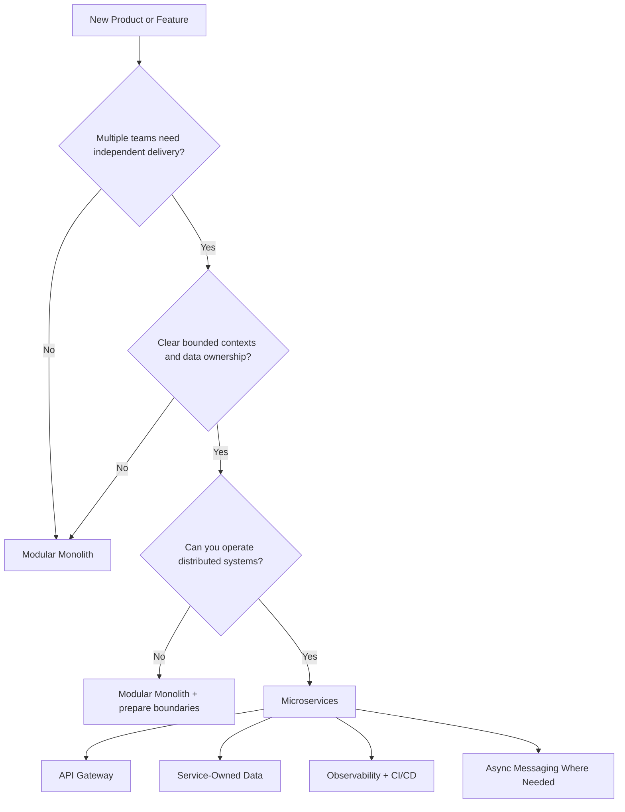

| Use Microservices When | Stay Modular Monolith When |
|------------------------|----------------------------|
| Teams deploy independently | One team owns most code |
| Domains have separate data lifecycles | Boundaries are still unclear |
| Hotspots need independent scaling | Scale bottleneck is not proven |
| Failures must be isolated by capability | Operational maturity is low |
| Contracts can be versioned and tested | Shared transactions dominate |

## How It Works

### Monolith vs Microservices

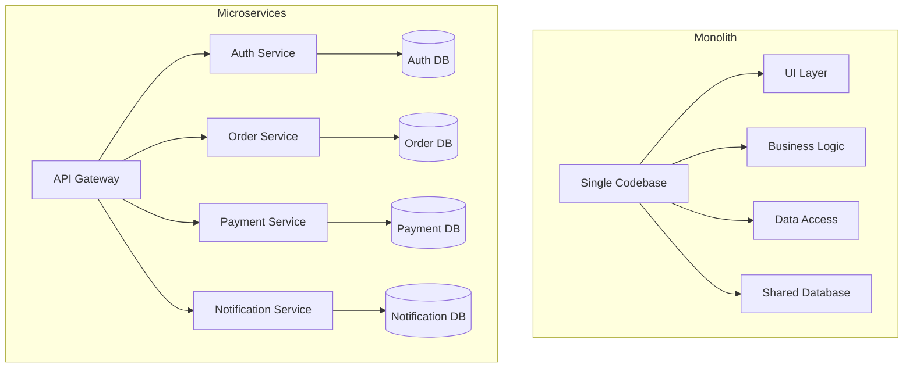

| Aspect | Monolith | Microservices |
|--------|----------|---------------|
| Codebase | Single, unified | Multiple, independent |
| Deployment | All-or-nothing | Per-service |
| Scaling | Vertical (bigger server) | Horizontal (per-service) |
| Database | Shared | Database per service |
| Tech Stack | Uniform | Polyglot (per service) |
| Failure Isolation | Single point of failure | Fault isolation |
| Team Size | Works for small teams | Suits large orgs (10+ devs) |
| Complexity | Low initially, grows | High initially, manageable |

### Core Principles

1. **Single Responsibility** — Each service owns one business capability (e.g., Order Service, Payment Service)
2. **Independent Deployability** — Services can be deployed without coordinating with other teams
3. **Decentralized Data Management** — Each service owns its database; no shared databases
4. **Loose Coupling** — Services interact through well-defined APIs, not internal implementation details
5. **Bounded Contexts** — Service boundaries align with domain boundaries (Domain-Driven Design)

> [!warning] The Distributed Monolith Anti-Pattern
> A "distributed monolith" occurs when services are tightly coupled through synchronous dependencies, shared databases, or coordinated deployments. You get all the complexity of distributed systems with none of the benefits. Signs include: cascading failures, deployment coordination required across teams, and services that cannot be tested in isolation.

### Conway's Law

> "Organizations which design systems are constrained to produce designs which are copies of the communication structures of these organizations." — Melvin Conway, 1967

If your team is organized by technology (frontend team, backend team, DBA team), your architecture will reflect those silos. If organized by business capability (checkout team, search team, recommendations team), your services will align with those domains. The **inverse Conway maneuver** means: structure your teams the way you want your architecture to look.

## Communication Patterns

### Synchronous Communication

#### REST/HTTP

The most common pattern. Services expose HTTP endpoints with JSON payloads.

```typescript
// order-service/src/routes/orders.ts
import express, { Request, Response } from 'express';

const router = express.Router();

// GET /orders/:id — fetch order details
router.get('/:id', async (req: Request, res: Response) => {
  const order = await db.orders.findById(req.params.id);
  if (!order) return res.status(404).json({ error: 'Order not found' });
  res.json(order);
});

// POST /orders — create new order
router.post('/', async (req: Request, res: Response) => {
  const { customerId, items, total } = req.body;
  const order = await db.orders.create({
    customerId,
    items,
    total,
    status: 'PENDING',
    createdAt: new Date(),
  });
  res.status(201).json(order);
});

export default router;
```

> [!tip] REST Best Practices
> - Use proper HTTP status codes (200, 201, 400, 404, 500)
> - Version your APIs (`/v1/orders`, `/v2/orders`)
> - Define OpenAPI/Swagger specs for contracts
> - Implement idempotency keys for POST/PUT operations

#### gRPC

High-performance RPC framework using Protocol Buffers (binary serialization) over HTTP/2. Ideal for internal service-to-service communication.

```protobuf
// proto/orders.proto
syntax = "proto3";
package orders;

service OrderService {
  rpc GetOrder (OrderRequest) returns (OrderResponse);
  rpc CreateOrder (CreateOrderRequest) returns (OrderResponse);
  rpc StreamOrderUpdates (OrderRequest) returns (stream OrderEvent);
}

message OrderRequest {
  string order_id = 1;
}

message CreateOrderRequest {
  string customer_id = 1;
  repeated OrderItem items = 2;
  double total = 3;
}

message OrderItem {
  string product_id = 1;
  int32 quantity = 2;
  double price = 3;
}

message OrderResponse {
  string order_id = 1;
  string customer_id = 2;
  string status = 3;
  double total = 4;
  repeated OrderItem items = 5;
}

message OrderEvent {
  string order_id = 1;
  string status = 2;
  string timestamp = 3;
}
```

```typescript
// order-service/src/grpc-server.ts
import { Server, ServerCredentials } from '@grpc/grpc-js';
import { OrderServiceService } from './generated/orders_grpc_pb';
import { GetOrder, CreateOrder, StreamOrderUpdates } from './generated/orders_pb';

function getOrder(call: any, callback: Function) {
  const orderId = call.request.getOrderId();
  // Fetch from database
  const response = new OrderResponse();
  response.setOrderId(orderId);
  response.setStatus('COMPLETED');
  callback(null, response);
}

const server = new Server();
server.addService(OrderServiceService, {
  getOrder,
  createOrder,
  streamOrderUpdates,
});

server.bindAsync('0.0.0.0:50051', ServerCredentials.createInsecure(), () => {
  server.start();
  console.log('gRPC server running on port 50051');
});
```

| REST | gRPC |
|------|------|
| JSON (human-readable) | Protobuf (binary, compact) |
| HTTP/1.1 or HTTP/2 | HTTP/2 only |
| Browser-native support | Requires gRPC-Web for browsers |
| Higher latency, larger payloads | Lower latency, smaller payloads |
| Best for: external APIs | Best for: internal service-to-service |

### Asynchronous Communication

#### Message Queues (RabbitMQ, AWS SQS)

Point-to-point messaging where each message is consumed by exactly one consumer.

```typescript
// payment-service/src/queue-consumer.ts
import amqp from 'amqplib';

async function startConsumer() {
  const connection = await amqp.connect('amqp://localhost');
  const channel = await connection.createChannel();

  await channel.assertQueue('payment-processing', { durable: true });

  // Process at most 1 message at a time (fair dispatch)
  await channel.prefetch(1);

  channel.consume('payment-processing', async (msg) => {
    if (!msg) return;

    try {
      const payment = JSON.parse(msg.content.toString());
      console.log(`Processing payment: ${payment.orderId}`);

      // Process payment logic
      await processPayment(payment);

      // Acknowledge successful processing
      channel.ack(msg);
    } catch (error) {
      console.error('Payment processing failed:', error);
      // Reject and requeue (or send to dead letter queue)
      channel.nack(msg, false, true);
    }
  });
}

startConsumer();
```

#### Event Streaming (Kafka, AWS EventBridge)

Publish-subscribe model where events are stored in ordered, partitioned logs. Multiple consumers can read the same events.

```typescript
// order-service/src/kafka-producer.ts
import { Kafka } from 'kafkajs';

const kafka = new Kafka({
  clientId: 'order-service',
  brokers: ['localhost:9092'],
});

const producer = kafka.producer();

export async function publishOrderEvent(event: {
  type: string;
  orderId: string;
  data: Record<string, unknown>;
}) {
  await producer.connect();

  await producer.send({
    topic: 'order-events',
    messages: [
      {
        key: event.orderId, // Partition key — same order events go to same partition
        value: JSON.stringify({
          eventType: event.type,
          orderId: event.orderId,
          timestamp: new Date().toISOString(),
          data: event.data,
        }),
        headers: {
          'event-type': event.type,
          'correlation-id': event.orderId,
        },
      },
    ],
  });

  await producer.disconnect();
}

// Usage:
await publishOrderEvent({
  type: 'order.created',
  orderId: 'ORD-12345',
  data: { customerId: 'CUST-1', total: 99.99 },
});
```

```typescript
// notification-service/src/kafka-consumer.ts
import { Kafka } from 'kafkajs';

const kafka = new Kafka({
  clientId: 'notification-service',
  brokers: ['localhost:9092'],
});

const consumer = kafka.consumer({ groupId: 'notification-service' });

async function startConsumer() {
  await consumer.connect();
  await consumer.subscribe({ topic: 'order-events', fromBeginning: true });

  await consumer.run({
    eachMessage: async ({ topic, partition, message }) => {
      const event = JSON.parse(message.value.toString());
      console.log(`[${topic}] Received: ${event.eventType}`);

      switch (event.eventType) {
        case 'order.created':
          await sendOrderConfirmationEmail(event.data);
          break;
        case 'order.shipped':
          await sendShippingNotification(event.data);
          break;
        case 'order.cancelled':
          await sendCancellationEmail(event.data);
          break;
      }
    },
  });
}

startConsumer();
```

### Communication Pattern Comparison

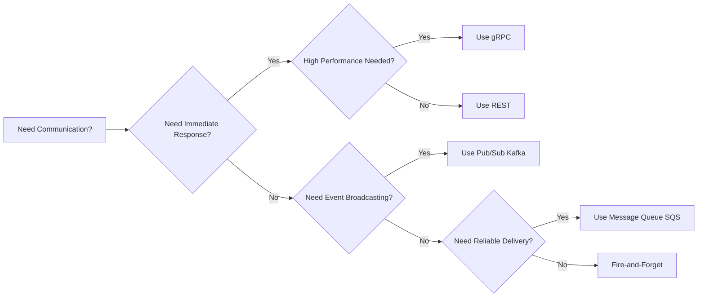

| Pattern | Coupling | Delivery | Use Case |
|---------|----------|----------|----------|
| REST | Tight (direct call) | At-most-once | Simple request-response |
| gRPC | Tight (typed contract) | At-most-once | High-performance internal calls |
| Message Queue | Loose (via broker) | At-least-once | Reliable async processing |
| Event Streaming | Loose (via log) | At-least-once / Exactly-once | Event-driven architecture, replay |

### Saga Pattern for Distributed Transactions

Since each service has its own database, you cannot use ACID transactions across services. The Saga pattern manages distributed transactions through a sequence of local transactions, each with a compensating action for rollback.

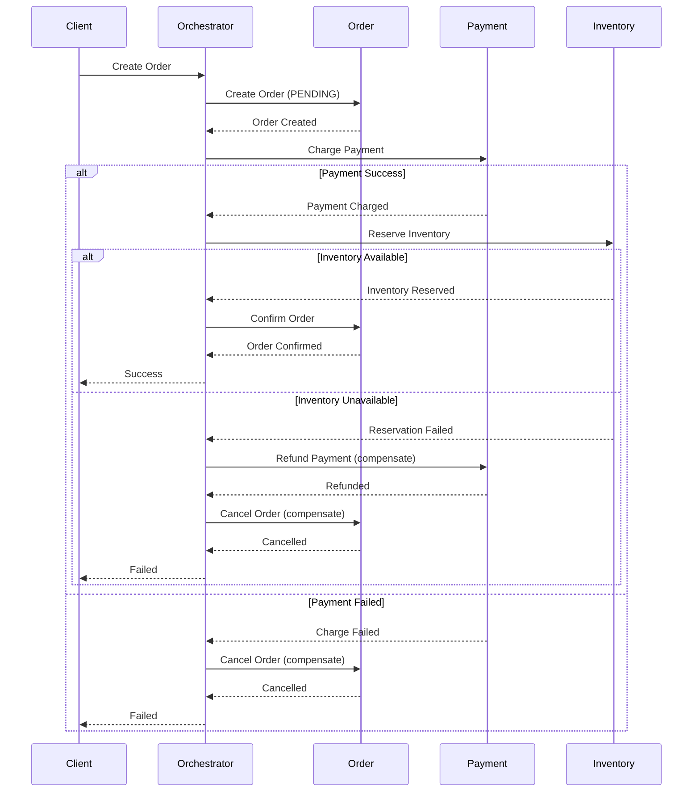

```typescript
// saga-orchestrator/src/order-saga.ts
import { Kafka } from 'kafkajs';

type SagaState = 'RUNNING' | 'COMPLETED' | 'FAILED' | 'COMPENSATING';
type SagaStep = 'CREATE_ORDER' | 'PROCESS_PAYMENT' | 'RESERVE_INVENTORY' | 'COMPLETE';

interface SagaInstance {
  sagaId: string;
  orderId: string;
  currentStep: SagaStep;
  completedSteps: SagaStep[];
  state: SagaState;
}

export class OrderSagaOrchestrator {
  private sagas: Map<string, SagaInstance> = new Map();

  constructor(private kafka: Kafka) {}

  async startSaga(orderData: { customerId: string; items: unknown[]; total: number }) {
    const sagaId = crypto.randomUUID();
    const saga: SagaInstance = {
      sagaId,
      orderId: `ORD-${sagaId.slice(0, 8)}`,
      currentStep: 'CREATE_ORDER',
      completedSteps: [],
      state: 'RUNNING',
    };
    this.sagas.set(sagaId, saga);

    // Step 1: Create order
    await this.executeStep(saga, 'CREATE_ORDER', orderData);
  }

  private async executeStep(saga: SagaInstance, step: SagaStep, data: unknown) {
    try {
      switch (step) {
        case 'CREATE_ORDER':
          await this.createOrder(saga, data);
          saga.completedSteps.push('CREATE_ORDER');
          saga.currentStep = 'PROCESS_PAYMENT';
          await this.executeStep(saga, 'PROCESS_PAYMENT', data);
          break;

        case 'PROCESS_PAYMENT':
          await this.processPayment(saga, data);
          saga.completedSteps.push('PROCESS_PAYMENT');
          saga.currentStep = 'RESERVE_INVENTORY';
          await this.executeStep(saga, 'RESERVE_INVENTORY', data);
          break;

        case 'RESERVE_INVENTORY':
          await this.reserveInventory(saga, data);
          saga.completedSteps.push('RESERVE_INVENTORY');
          saga.currentStep = 'COMPLETE';
          saga.state = 'COMPLETED';
          break;
      }
    } catch (error) {
      console.error(`Step ${step} failed:`, error);
      saga.state = 'COMPENSATING';
      await this.compensate(saga, step, error);
    }
  }

  private async compensate(saga: SagaInstance, failedStep: SagaStep, error: unknown) {
    // Execute compensating actions in reverse order
    for (const step of [...saga.completedSteps].reverse()) {
      try {
        switch (step) {
          case 'RESERVE_INVENTORY':
            await this.releaseInventory(saga);
            break;
          case 'PROCESS_PAYMENT':
            await this.refundPayment(saga);
            break;
          case 'CREATE_ORDER':
            await this.cancelOrder(saga);
            break;
        }
      } catch (compError) {
        console.error(`Compensation for ${step} failed:`, compError);
        // Log and continue — compensation must eventually succeed
      }
    }
    saga.state = 'FAILED';
  }

  private async createOrder(saga: SagaInstance, data: unknown) { /* ... */ }
  private async processPayment(saga: SagaInstance, data: unknown) { /* ... */ }
  private async reserveInventory(saga: SagaInstance, data: unknown) { /* ... */ }
  private async releaseInventory(saga: SagaInstance) { /* ... */ }
  private async refundPayment(saga: SagaInstance) { /* ... */ }
  private async cancelOrder(saga: SagaInstance) { /* ... */ }
}
```

> [!warning] Saga Gotcha
> Sagas provide **eventual consistency**, not strong consistency. Between steps, the system is in an intermediate state. Your UI must handle this — e.g., show "Processing" instead of "Confirmed" until the saga completes.

### Event Sourcing and CQRS

**Event Sourcing** stores state changes as an immutable sequence of events rather than the current state. The current state is derived by replaying events.

**CQRS** (Command Query Responsibility Segregation) separates read and write operations into different models, often with different databases.

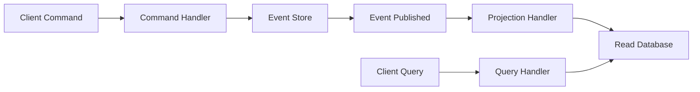

```typescript
// event-sourcing/src/event-store.ts
interface DomainEvent {
  eventId: string;
  aggregateId: string;
  eventType: string;
  timestamp: Date;
  data: Record<string, unknown>;
  version: number;
}

class EventStore {
  private events: DomainEvent[] = [];

  async saveEvents(aggregateId: string, newEvents: Omit<DomainEvent, 'version'>[]) {
    // Get current version for this aggregate
    const currentVersion = this.events
      .filter((e) => e.aggregateId === aggregateId)
      .length;

    // Append events with incremented versions
    const eventsToSave = newEvents.map((event, index) => ({
      ...event,
      aggregateId,
      version: currentVersion + index + 1,
    }));

    this.events.push(...eventsToSave);
    return eventsToSave;
  }

  async getEvents(aggregateId: string): Promise<DomainEvent[]> {
    return this.events
      .filter((e) => e.aggregateId === aggregateId)
      .sort((a, b) => a.version - b.version);
  }

  // Rebuild aggregate state from events
  async rebuildState<T>(aggregateId: string, applyEvent: (state: T, event: DomainEvent) => T): Promise<T> {
    const events = await this.getEvents(aggregateId);
    let state = {} as T;
    for (const event of events) {
      state = applyEvent(state, event);
    }
    return state;
  }
}

// Example: Order aggregate
interface OrderState {
  id: string;
  status: string;
  items: unknown[];
  total: number;
}

function applyOrderEvent(state: OrderState, event: DomainEvent): OrderState {
  switch (event.eventType) {
    case 'OrderCreated':
      return { ...state, id: event.aggregateId, status: 'PENDING', items: event.data.items as unknown[], total: event.data.total as number };
    case 'OrderConfirmed':
      return { ...state, status: 'CONFIRMED' };
    case 'OrderShipped':
      return { ...state, status: 'SHIPPED' };
    case 'OrderCancelled':
      return { ...state, status: 'CANCELLED' };
    default:
      return state;
  }
}
```

### Resilience Patterns

#### Circuit Breaker

Prevents cascading failures by failing fast when a downstream service is struggling.

```typescript
// resilience/src/circuit-breaker.ts
type CircuitState = 'CLOSED' | 'OPEN' | 'HALF_OPEN';

interface CircuitBreakerOptions {
  failureThreshold: number;    // Failures before opening
  recoveryTimeout: number;     // ms to wait before half-open
  successThreshold: number;    // Successes in half-open to close
  timeout: number;             // ms for individual call timeout
}

export class CircuitBreaker {
  private state: CircuitState = 'CLOSED';
  private failureCount = 0;
  private successCount = 0;
  private lastFailureTime: number | null = null;

  constructor(private options: CircuitBreakerOptions) {}

  async execute<T>(fn: () => Promise<T>): Promise<T> {
    if (this.state === 'OPEN') {
      const now = Date.now();
      if (this.lastFailureTime && now - this.lastFailureTime > this.options.recoveryTimeout) {
        this.state = 'HALF_OPEN';
        this.successCount = 0;
      } else {
        throw new Error('Circuit breaker is OPEN — service unavailable');
      }
    }

    try {
      const result = await Promise.race([
        fn(),
        new Promise<never>((_, reject) =>
          setTimeout(() => reject(new Error('Call timed out')), this.options.timeout)
        ),
      ]);

      this.onSuccess();
      return result;
    } catch (error) {
      this.onFailure();
      throw error;
    }
  }

  private onSuccess() {
    if (this.state === 'HALF_OPEN') {
      this.successCount++;
      if (this.successCount >= this.options.successThreshold) {
        this.state = 'CLOSED';
        this.failureCount = 0;
      }
    } else {
      this.failureCount = 0;
    }
  }

  private onFailure() {
    this.failureCount++;
    this.lastFailureTime = Date.now();

    if (this.state === 'HALF_OPEN') {
      this.state = 'OPEN';
    } else if (this.failureCount >= this.options.failureThreshold) {
      this.state = 'OPEN';
    }
  }

  getState(): CircuitState {
    return this.state;
  }
}

// Usage with retry + exponential backoff
async function callWithRetry<T>(
  fn: () => Promise<T>,
  maxRetries = 3,
  baseDelay = 1000
): Promise<T> {
  for (let attempt = 0; attempt < maxRetries; attempt++) {
    try {
      return await fn();
    } catch (error) {
      if (attempt === maxRetries - 1) throw error;
      const delay = baseDelay * Math.pow(2, attempt) + Math.random() * 1000; // Jitter
      console.log(`Attempt ${attempt + 1} failed, retrying in ${Math.round(delay)}ms`);
      await new Promise((resolve) => setTimeout(resolve, delay));
    }
  }
  throw new Error('Unreachable');
}

// Combined: retry (inner) + circuit breaker (outer)
const paymentBreaker = new CircuitBreaker({
  failureThreshold: 5,
  recoveryTimeout: 30000,
  successThreshold: 2,
  timeout: 5000,
});

async function chargePayment(orderId: string, amount: number) {
  return paymentBreaker.execute(() =>
    callWithRetry(
      () => fetch(`http://payment-service/charge`, {
        method: 'POST',
        body: JSON.stringify({ orderId, amount }),
      }).then((r) => r.json()),
      3,
      1000
    )
  );
}
```

| Pattern | Purpose | When to Use |
|---------|---------|-------------|
| Circuit Breaker | Prevent cascading failures | Downstream service is unreliable |
| Retry (exponential backoff + jitter) | Handle transient failures | Network glitches, temporary overload |
| Timeout | Prevent resource exhaustion | Every external call must have one |
| Bulkhead | Isolate resource pools | One slow service shouldn't starve others |
| Fallback | Provide degraded functionality | Non-critical features (recommendations, analytics) |

## When to Use Microservices

> [!tip] The "Start with a Monolith" Rule
> **Most teams should start with a modular monolith.** Microservices add operational complexity that small teams cannot afford. Extract services only when you have concrete signals that the monolith is holding you back.

### When to Split

| Signal | Description |
|--------|-------------|
| **Team size > 10-15 developers** | Coordination overhead exceeds benefits of shared codebase |
| **Deployment bottlenecks** | Teams block each other waiting for coordinated releases |
| **Different scaling needs** | Auth needs 2 instances, video processing needs 200 |
| **Different tech requirements** | ML service needs Python, API needs Node.js |
| **Fault isolation needed** | One component crashing shouldn't take down everything |
| **Compliance boundaries** | PCI data must be isolated from other services |

### When NOT to Use

- **Small team (< 10 devs)** — Operational overhead outweighs benefits
- **Simple domain** — CRUD app with no complex business logic
- **Early-stage product** — Requirements are still changing rapidly
- **No DevOps capability** — You need CI/CD, monitoring, container orchestration
- **Distributed transactions everywhere** — If everything needs strong consistency, microservices will be painful

### Strangler Fig Pattern for Migration

Named after the strangler fig tree that gradually envelops and replaces its host. Instead of a risky "big bang" rewrite, you incrementally replace monolith functionality with microservices.

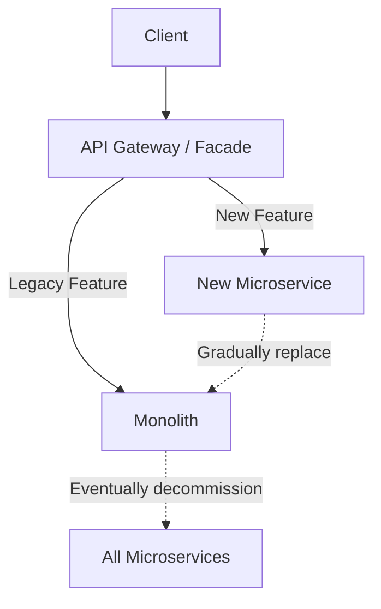

**Three phases:**
1. **Transform** — Put a facade (API gateway) in front of the monolith
2. **Co-exist** — Route new requests to microservices, legacy to monolith
3. **Eliminate** — Once all functionality is migrated, decommission the monolith

```typescript
// strangler-gateway/src/router.ts
import express from 'express';

const router = express.Router();

// Migration map: which endpoints have been strangulated
const MIGRATION_MAP: Record<string, 'monolith' | 'microservice'> = {
  '/api/v1/users': 'microservice',      // Migrated
  '/api/v1/orders': 'microservice',     // Migrated
  '/api/v1/products': 'monolith',       // Still in monolith
  '/api/v1/payments': 'microservice',   // Migrated
  '/api/v1/reports': 'monolith',        // Still in monolith
};

router.all('/*', async (req, res) => {
  const path = req.path;
  const target = MIGRATION_MAP[path] ?? 'monolith';

  if (target === 'microservice') {
    // Route to the appropriate microservice
    const serviceUrl = getServiceUrl(path);
    const response = await fetch(`${serviceUrl}${path}`, {
      method: req.method,
      headers: req.headers as Record<string, string>,
      body: req.body ? JSON.stringify(req.body) : undefined,
    });
    const data = await response.json();
    res.status(response.status).json(data);
  } else {
    // Forward to monolith
    const response = await fetch(`http://monolith:3000${path}`, {
      method: req.method,
      headers: req.headers as Record<string, string>,
      body: req.body ? JSON.stringify(req.body) : undefined,
    });
    const data = await response.json();
    res.status(response.status).json(data);
  }
});

function getServiceUrl(path: string): string {
  if (path.includes('/users')) return 'http://user-service:3001';
  if (path.includes('/orders')) return 'http://order-service:3002';
  if (path.includes('/payments')) return 'http://payment-service:3003';
  return 'http://monolith:3000';
}
```

## Authentication & Authorization

### Architecture Overview

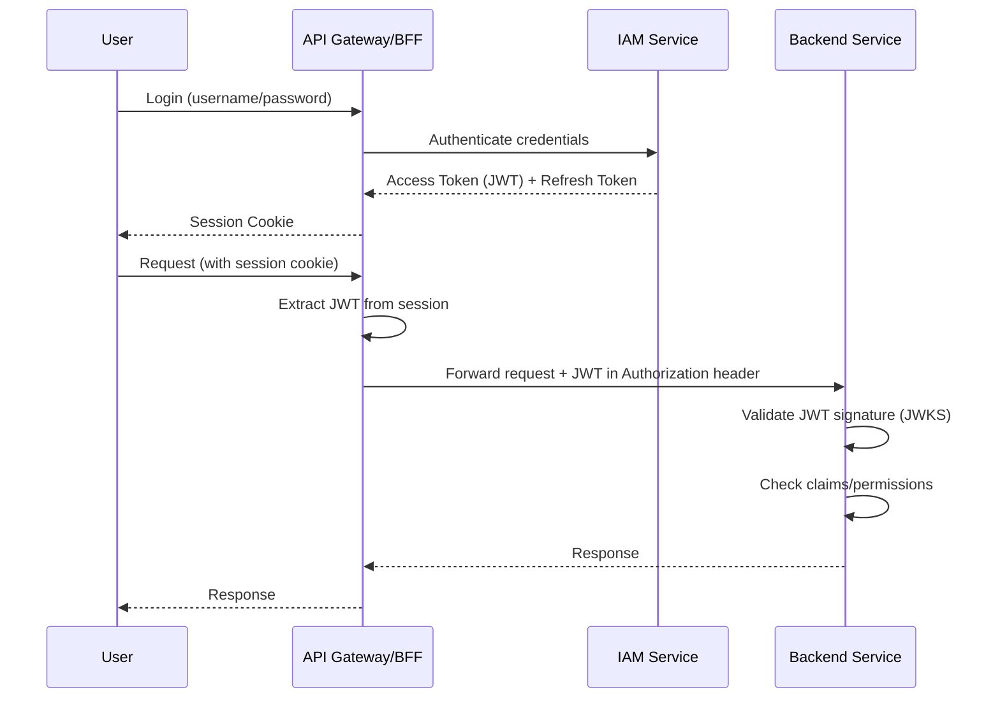

### JWT Propagation Flow

1. **User authenticates** at the API Gateway/BFF with credentials
2. **Gateway delegates** to IAM service (OAuth 2.0 / OIDC)
3. **IAM issues** short-lived Access Token (JWT, ~15 min) + long-lived Refresh Token
4. **Gateway stores** tokens in session, returns session cookie to browser
5. **On each request**, gateway extracts JWT from session and forwards it to backend services via `Authorization: Bearer <token>` header
6. **Backend services** validate JWT locally using the IAM's public key (from JWKS endpoint) — no round-trip to IAM needed

```typescript
// gateway/src/auth-middleware.ts
import jwt from 'jsonwebtoken';
import jwksClient from 'jwks-rsa';

const client = jwksClient({
  jwksUri: 'https://iam-service.example.com/.well-known/jwks.json',
});

function getSigningKey(header: jwt.JwtHeader, callback: jwt.SigningKeyCallback) {
  client.getSigningKey(header.kid, (err, key) => {
    if (err) return callback(err);
    const signingKey = key.getPublicKey();
    callback(null, signingKey);
  });
}

export function authenticateToken(req: any, res: any, next: any) {
  const token = req.headers.authorization?.split(' ')[1];
  if (!token) return res.status(401).json({ error: 'No token provided' });

  jwt.verify(token, getSigningKey, { algorithms: ['RS256'] }, (err, decoded) => {
    if (err) return res.status(403).json({ error: 'Invalid token' });
    req.user = decoded; // Attach user identity to request
    next();
  });
}
```

### Service-to-Service Authentication

| Method | Description | Best For |
|--------|-------------|----------|
| **mTLS** | Mutual TLS — both sides present certificates | Zero-trust, Kubernetes, service mesh |
| **OAuth2 Client Credentials** | Service gets its own JWT from IAM | Services needing scoped access |
| **API Keys** | Shared secret in header | Simple internal auth |
| **JWT Propagation** | Forward user's JWT downstream | When user context is needed |

#### mTLS (Mutual TLS)

Both client and server present certificates during TLS handshake. Only public keys are exchanged — no sensitive tokens on the wire.

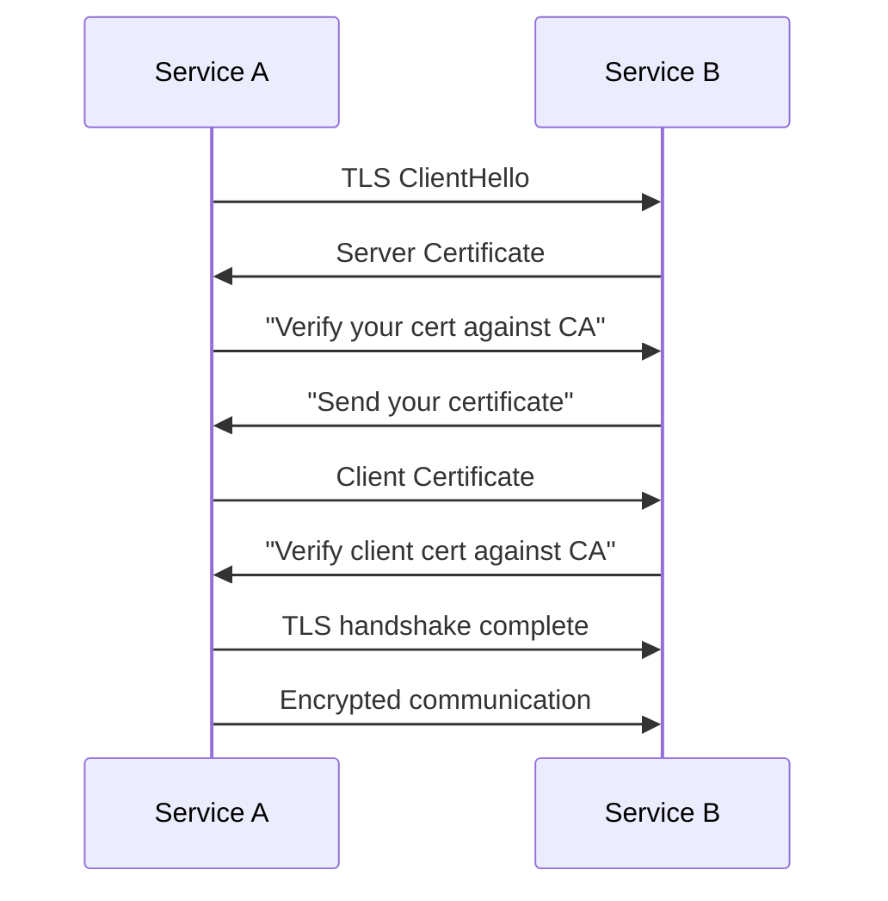

> [!warning] JWT vs mTLS for Service-to-Service
> JWTs send bearer tokens over the wire — if leaked, they can be replayed. mTLS only exchanges public keys and negotiates session keys. For S2S auth, mTLS is more secure. Use JWTs for user identity, mTLS for service identity.

#### OAuth2 Client Credentials Flow (Service-to-Service JWT)

```typescript
// service-a/src/token-client.ts
export class TokenService {
  constructor(
    private iamUrl: string,
    private clientId: string,
    private clientSecret: string
  ) {}

  async getToken(scope: string): Promise<string> {
    const response = await fetch(`${this.iamUrl}/oauth2/token`, {
      method: 'POST',
      headers: { 'Content-Type': 'application/x-www-form-urlencoded' },
      body: new URLSearchParams({
        grant_type: 'client_credentials',
        client_id: this.clientId,
        client_secret: this.clientSecret,
        scope,
      }),
    });

    const data = await response.json();
    return data.access_token;
  }
}

// Usage: calling Service B from Service A
const tokenService = new TokenService(
  'https://iam.example.com',
  'service-a',
  process.env.SERVICE_A_SECRET!
);

async function callServiceB(orderId: string) {
  const token = await tokenService.getToken('service-b:read');
  const response = await fetch('http://service-b/orders/' + orderId, {
    headers: { Authorization: `Bearer ${token}` },
  });
  return response.json();
}
```

### Token Refresh Strategy

- **Access tokens**: short-lived (5-15 min) to limit blast radius if stolen
- **Refresh tokens**: long-lived (days/weeks), stored securely, used to get new access tokens
- **Gateway handles refresh**: BFF automatically refreshes access tokens using refresh token before expiry — transparent to the user
- **Service-to-service**: Services cache tokens and refresh before expiry

## API Gateway

### What It Is

An API gateway is a reverse proxy that serves as the single entry point for all client requests into a microservices architecture. It routes requests to the appropriate backend service and handles cross-cutting concerns centrally.

### Responsibilities

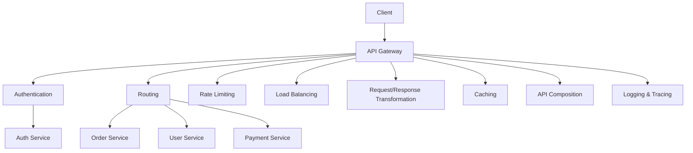

| Responsibility | Description |
|----------------|-------------|
| **Routing** | Path-based or header-based routing to correct service |
| **Load Balancing** | Distribute requests across service instances |
| **Authentication** | Validate JWTs, API keys, OAuth2 tokens |
| **Rate Limiting** | Prevent abuse (per-IP, per-user, per-endpoint) |
| **Request Transformation** | Protocol translation (REST to gRPC), header manipulation |
| **Response Aggregation** | Combine responses from multiple services (API composition) |
| **Caching** | Cache responses for frequently accessed data |
| **TLS Termination** | Decrypt HTTPS at gateway, forward HTTP internally |
| **Observability** | Log requests, collect metrics, propagate trace IDs |

### Gateway Configuration Example (Kong)

```yaml
# kong.yml — declarative configuration
_format_version: "3.0"

services:
  - name: auth-service
    url: http://auth-service:3001
    routes:
      - name: auth-route
        paths: [/api/auth/]
        strip_path: true

  - name: order-service
    url: http://order-service:3002
    routes:
      - name: order-route
        paths: [/api/orders/]
        strip_path: true
    plugins:
      - name: rate-limiting
        config:
          minute: 100
          policy: local

  - name: payment-service
    url: http://payment-service:3003
    routes:
      - name: payment-route
        paths: [/api/payments/]
        strip_path: true
    plugins:
      - name: jwt
        config:
          claims_to_verify: [exp]
      - name: rate-limiting
        config:
          minute: 50
          policy: local
```

### Express.js API Gateway Implementation

```typescript
// api-gateway/src/index.ts
import express from 'express';
import { createProxyMiddleware } from 'http-proxy-middleware';

const app = express();
app.use(express.json());

// Authentication middleware
app.use('/api/', (req, res, next) => {
  const token = req.headers.authorization?.split(' ')[1];
  if (!token) return res.status(401).json({ error: 'Unauthorized' });
  // Validate token (JWT verification)
  req.user = decodeToken(token);
  next();
});

// Rate limiting
const requestCounts = new Map<string, { count: number; resetAt: number }>();
app.use('/api/', (req, res, next) => {
  const ip = req.ip;
  const now = Date.now();
  const record = requestCounts.get(ip) ?? { count: 0, resetAt: now + 60000 };

  if (now > record.resetAt) {
    record.count = 0;
    record.resetAt = now + 60000;
  }

  if (record.count >= 100) {
    return res.status(429).json({ error: 'Rate limit exceeded' });
  }

  record.count++;
  requestCounts.set(ip, record);
  next();
});

// Routing rules
const routes: Record<string, string> = {
  '/api/auth': 'http://auth-service:3001',
  '/api/users': 'http://user-service:3002',
  '/api/orders': 'http://order-service:3003',
  '/api/payments': 'http://payment-service:3004',
  '/api/notifications': 'http://notification-service:3005',
};

for (const [path, target] of Object.entries(routes)) {
  app.use(
    path,
    createProxyMiddleware({
      target,
      changeOrigin: true,
      pathRewrite: { [`^${path}`]: '' },
      onProxyReq: (proxyReq, req) => {
        // Forward user identity to downstream services
        if ((req as any).user) {
          proxyReq.setHeader('X-User-Id', (req as any).user.sub);
          proxyReq.setHeader('X-User-Roles', (req as any).user.roles?.join(','));
        }
        // Propagate trace ID for distributed tracing
        proxyReq.setHeader('X-Trace-Id', req.headers['x-trace-id'] ?? crypto.randomUUID());
      },
    })
  );
}

// API Composition endpoint — aggregate data from multiple services
app.get('/api/dashboard/:userId', async (req, res) => {
  const { userId } = req.params;

  const [orders, notifications] = await Promise.allSettled([
    fetch(`http://order-service:3003/users/${userId}/orders`).then((r) => r.json()),
    fetch(`http://notification-service:3005/users/${userId}/notifications`).then((r) => r.json()),
  ]);

  res.json({
    orders: orders.status === 'fulfilled' ? orders.value : [],
    notifications: notifications.status === 'fulfilled' ? notifications.value : [],
  });
});

app.listen(8080, () => console.log('API Gateway running on port 8080'));
```

### Backend-for-Frontend (BFF) Pattern

The BFF pattern creates a dedicated API gateway per client type (web, mobile, TV, etc.). Each BFF aggregates and transforms data specifically for its frontend.

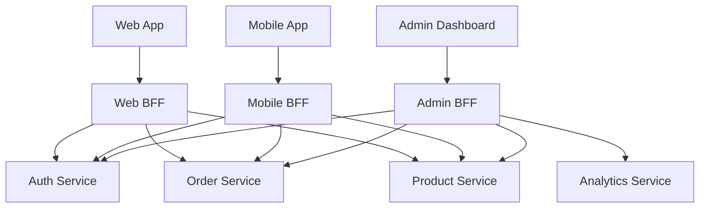

| Client | BFF Behavior |
|--------|-------------|
| **Mobile** | Smaller payloads, aggressive caching, push notification support, fewer round-trips |
| **Web** | Richer data, WebSocket support for real-time, complex UI compositions |
| **Admin** | Elevated access, audit logging, bulk operations |

### API Gateway vs Service Mesh

| Aspect | API Gateway | Service Mesh |
|--------|-------------|--------------|
| **Traffic** | North-south (client to cluster) | East-west (service to service) |
| **Deployment** | Edge of the cluster | Sidecar proxy per service |
| **Responsibilities** | Auth, rate limiting, routing, aggregation | mTLS, circuit breaking, observability, load balancing |
| **Tools** | Kong, AWS API Gateway, NGINX, Apigee | Istio, Linkerd, Envoy, Consul Connect |
| **Scope** | External-facing | Internal-facing |

> [!tip] Gateway + Mesh Together
> Use an API gateway at the edge for external traffic management, and a service mesh for internal service-to-service communication. They complement each other — the gateway handles north-south, the mesh handles east-west.

## Operational Concerns

### Service Discovery

How services find each other in a dynamic environment where instances come and go.

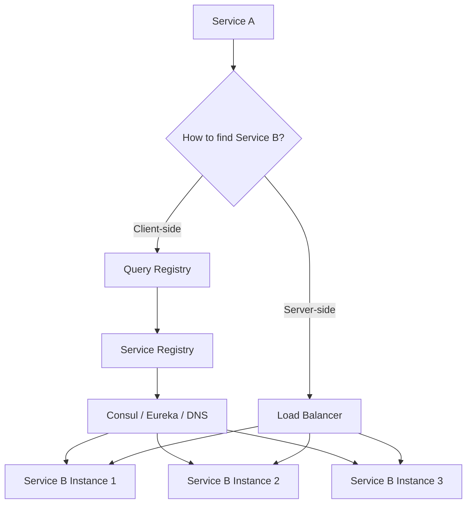

| Approach | How It Works | Tools |
|----------|-------------|-------|
| **DNS-based** | Services register with DNS names | CoreDNS, Route 53 |
| **Client-side discovery** | Client queries registry, picks instance | Eureka, Consul |
| **Server-side discovery** | Load balancer handles routing | Kubernetes Services, NGINX |

### Distributed Tracing

Track a request as it flows through multiple services using a correlation/trace ID.

```typescript
// tracing/src/middleware.ts
import { randomUUID } from 'crypto';

// Express middleware for trace propagation
export function tracingMiddleware(req: any, res: any, next: any) {
  // Use incoming trace ID or generate new one
  const traceId = req.headers['x-trace-id'] as string ?? randomUUID();
  const spanId = randomUUID();

  req.traceId = traceId;
  req.spanId = spanId;

  // Add trace headers to response
  res.setHeader('X-Trace-Id', traceId);

  // Propagate to downstream services
  const originalFetch = global.fetch;
  global.fetch = async (url: string, init?: RequestInit) => {
    const headers = new Headers(init?.headers);
    headers.set('X-Trace-Id', traceId);
    headers.set('X-Parent-Span-Id', spanId);
    return originalFetch(url, { ...init, headers });
  };

  next();
}
```

**Tools:** OpenTelemetry (standard), Jaeger, Zipkin, AWS X-Ray

### OpenTelemetry SDK (Node.js)

The OpenTelemetry SDK auto-instruments popular libraries (Express, HTTP, pg, Redis) and exports traces to any backend (Jaeger, Zipkin, AWS X-Ray, Datadog).

```typescript
// tracing.ts — import BEFORE anything else (instrument first)
import { NodeSDK } from "@opentelemetry/sdk-node";
import { OTLPTraceExporter } from "@opentelemetry/exporter-trace-otlp-http";
import { getNodeAutoInstrumentations } from "@opentelemetry/auto-instrumentations-node";
import { Resource } from "@opentelemetry/resources";
import { SEMRESATTRS_SERVICE_NAME } from "@opentelemetry/semantic-conventions";

const sdk = new NodeSDK({
  resource: new Resource({ [SEMRESATTRS_SERVICE_NAME]: "order-service" }),
  traceExporter: new OTLPTraceExporter({ url: "http://otel-collector:4318/v1/traces" }),
  instrumentations: [getNodeAutoInstrumentations()],
});

sdk.start();
process.on("SIGTERM", () => sdk.shutdown());
```

```typescript
// Manual spans for business logic
import { trace, SpanStatusCode } from "@opentelemetry/api";

const tracer = trace.getTracer("order-service");

async function processPayment(orderId: string, amount: number) {
  return tracer.startActiveSpan("payment.process", async (span) => {
    span.setAttributes({ "order.id": orderId, "payment.amount": amount });
    try {
      const result = await chargeCard(amount);
      span.setStatus({ code: SpanStatusCode.OK });
      return result;
    } catch (err) {
      span.recordException(err as Error);
      span.setStatus({ code: SpanStatusCode.ERROR, message: (err as Error).message });
      throw err;
    } finally {
      span.end();
    }
  });
}
```

OTel context propagation happens automatically via HTTP headers (`traceparent`) when using auto-instrumentation — all downstream service calls carry the same trace ID.

### Centralized Logging

Aggregate logs from all services into a single searchable store.

```typescript
// logging/src/structured-logger.ts
import winston from 'winston';

const logger = winston.createLogger({
  format: winston.format.combine(
    winston.format.timestamp(),
    winston.format.errors({ stack: true }),
    winston.format.json() // Structured JSON for log aggregation
  ),
  defaultMeta: {
    service: 'order-service',
    environment: process.env.NODE_ENV,
  },
  transports: [
    new winston.transports.Console(),
    new winston.transports.File({ filename: 'logs/error.log', level: 'error' }),
  ],
});

// Usage with trace context
function logWithContext(req: any, level: string, message: string, meta?: Record<string, unknown>) {
  logger.log(level, message, {
    traceId: req.traceId,
    spanId: req.spanId,
    userId: req.user?.sub,
    method: req.method,
    path: req.path,
    ...meta,
  });
}
```

**Pipeline:** Services → Fluentd/Logstash → Elasticsearch → Kibana (ELK Stack)

### Health Checks

```typescript
// health/src/health-check.ts
import express from 'express';

const router = express.Router();

// Liveness probe — is the process alive?
router.get('/health/live', (_req, res) => {
  res.json({ status: 'alive', uptime: process.uptime() });
});

// Readiness probe — is the service ready to accept traffic?
router.get('/health/ready', async (_req, res) => {
  const checks = {
    database: await checkDatabase(),
    cache: await checkCache(),
    messageQueue: await checkMessageQueue(),
  };

  const allHealthy = Object.values(checks).every((check) => check.healthy);

  res.status(allHealthy ? 200 : 503).json({
    status: allHealthy ? 'ready' : 'not_ready',
    checks,
  });
});

async function checkDatabase() {
  try {
    await db.query('SELECT 1');
    return { healthy: true };
  } catch (error) {
    return { healthy: false, error: (error as Error).message };
  }
}

async function checkCache() {
  try {
    await redis.ping();
    return { healthy: true };
  } catch (error) {
    return { healthy: false, error: (error as Error).message };
  }
}

async function checkMessageQueue() {
  try {
    await channel.assertQueue('health-check');
    return { healthy: true };
  } catch (error) {
    return { healthy: false, error: (error as Error).message };
  }
}
```

### Deployment Strategies

| Strategy | Description | Risk | Downtime |
|----------|-------------|------|----------|
| **Rolling Update** | Replace instances one by one | Low | None |
| **Blue-Green** | Two identical environments, switch traffic | Low (instant rollback) | None |
| **Canary** | Route small % of traffic to new version | Lowest (gradual) | None |
| **Feature Flags** | Deploy code, toggle features at runtime | Lowest | None |

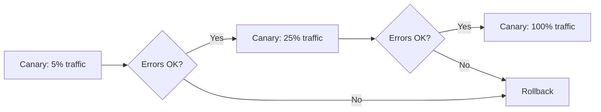

## Real-World Examples

### Netflix

- **700+ microservices** handling streaming, recommendations, billing, content delivery
- Migrated from monolith to microservices after a database corruption outage in 2008
- Pioneered **Chaos Monkey** — intentionally kills services in production to test resilience
- Uses **API Gateway** (Zuul) for routing and **Eureka** for service discovery
- Every service has its own database; communication is primarily async via events

### Amazon

- **1000+ microservices** powering the world's largest e-commerce platform
- Famous "two-pizza teams" — teams small enough to be fed by two pizzas, each owning their services
- Mandated in 2002 that all teams expose data/functionality through service interfaces (the origin of their API-first culture)
- Uses event-driven architecture extensively for order processing, inventory, and notifications

### Uber

- **500+ microservices** managing ride matching, payments, routing, driver management
- Migrated from a single Python monolith to Go and Java microservices as they scaled globally
- Uses **schema-first API design** with strict contracts between services
- Implements the **Saga pattern** for ride lifecycle (request → match → pickup → complete → payment)

## Key Details

> [!warning] Common Pitfalls
> - **Distributed monolith** — services are deployed together, share databases, or have synchronous chains of dependencies
> - **Over-splitting** — too many tiny services create more operational overhead than value
> - **Shared databases** — breaks the core principle of decentralized data management
> - **No observability** — without distributed tracing, centralized logging, and metrics, debugging is impossible
> - **Ignoring network failures** — assume every network call can fail, timeout, or return partial data
> - **Premature microservices** — adopting microservices before you have the operational maturity to manage them

> [!tip] Best Practices
> - Start with a modular monolith; extract services when you have concrete signals
> - Design service boundaries around business capabilities, not technical layers
> - Every service owns its database — never share databases between services
> - Prefer asynchronous communication for cross-service interactions
> - Implement circuit breakers, retries with jitter, and timeouts on every external call
> - Use API gateways for north-south traffic, service mesh for east-west
> - Invest in observability from day one: tracing, logging, metrics
> - Automate everything: CI/CD, testing, infrastructure provisioning
> - Keep services small but not tiny — a service should be owned by one team

## When to Use

- **Large teams** (10+ developers) where coordination overhead is a bottleneck
- **Different scaling requirements** across application components
- **Independent deployment** needs — teams must ship without coordinating
- **Fault isolation** is critical — one component failing shouldn't cascade
- **Technology diversity** — different services need different languages/frameworks
- **Organizations with mature DevOps** — CI/CD, container orchestration, monitoring

## Related Topics

- [[REST APIs]] — synchronous HTTP communication between services
- [[graphql]] — alternative API paradigm, useful for BFF aggregation
- [[WebSockets]] — real-time bidirectional communication
- [[sse]] — server-to-client streaming for live updates
- [[SQL Databases]] — database per service pattern
- [[nosql]] — polyglot persistence across services
- [[External Authentication Providers]] — OAuth 2.0, OIDC, IAM services
- [[compute]] — deployment targets for microservices (containers, serverless)
- [[vpc]] — network isolation and security for microservice communication
- [[infrastructure]] — load balancers, service mesh, and CDN for microservices
- [[cost]] — cost considerations when scaling microservices

## External Links

- [Microservices.io — Patterns by Chris Richardson](https://microservices.io/)
- [Martin Fowler — Microservices](https://martinfowler.com/articles/microservices.html)
- [AWS — Monolithic vs Microservices](https://aws.amazon.com/compare/the-difference-between-monolithic-and-microservices-architecture/)
- [Atlassian — Microservices vs Monolith](https://www.atlassian.com/microservices/microservices-architecture/microservices-vs-monolith)
- [Microservices Patterns (book) — Chris Richardson](https://www.manning.com/books/microservices-patterns)
- [Building Microservices (book) — Sam Newman](https://www.oreilly.com/library/view/building-microservices-2nd/9781492034018/)
- [OpenTelemetry — Distributed Tracing Standard](https://opentelemetry.io/)
- [Kong API Gateway](https://konghq.com/)
- [Envoy Proxy](https://www.envoyproxy.io/)
