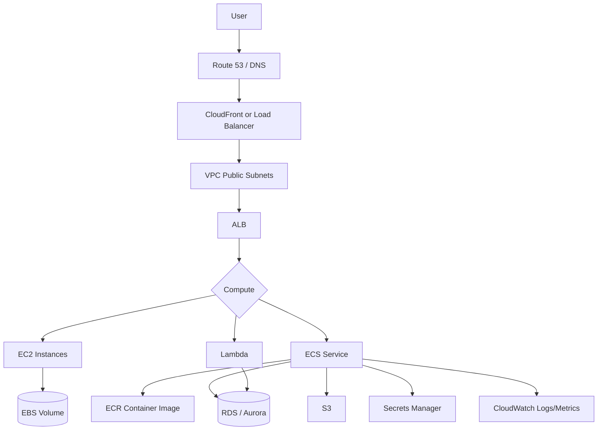
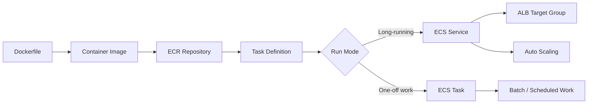
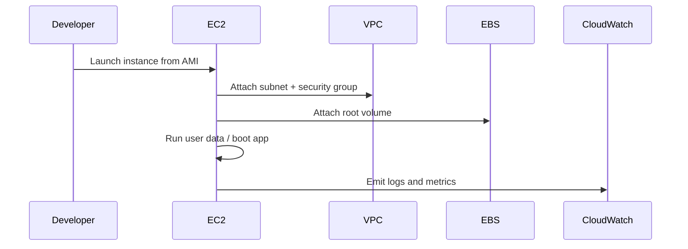
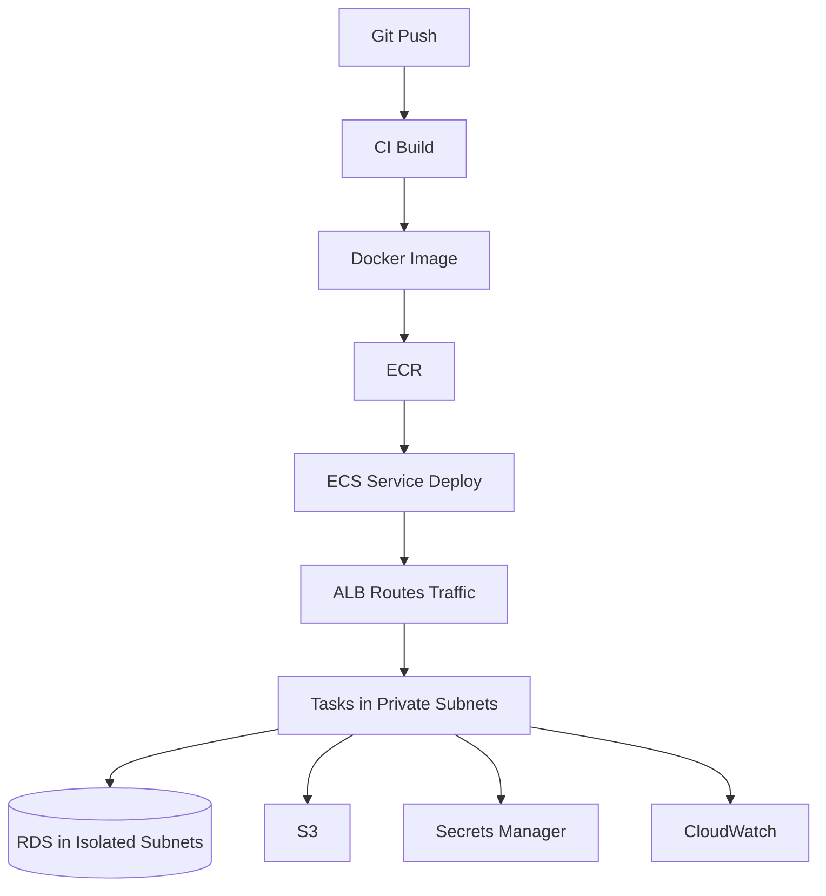

# AWS Basics

## Overview

AWS is a cloud platform built from composable services: networking, compute, storage, databases, identity, observability, and deployment primitives. The practical skill is knowing which managed service owns which responsibility, and how requests move through VPC, load balancing, compute, data, and IAM boundaries.

## Core Mental Model

Start with the network boundary: most production resources live inside a **VPC**. Public subnets expose load balancers or NAT gateways; private subnets run application tasks, instances, and databases. IAM controls who or what can call AWS APIs; security groups control network reachability.

## Core Services

| Service | What It Is | Use It For |
|---------|------------|------------|
| **EC2** | Virtual machines in AWS | Full OS control, legacy apps, custom runtimes, predictable long-running workloads |
| **ECS** | Managed container orchestration | Running Docker services and batch tasks without managing Kubernetes |
| **Fargate** | Serverless compute engine for ECS | Running containers without managing EC2 capacity |
| **RDS** | Managed relational databases | PostgreSQL, MySQL, MariaDB, SQL Server, Oracle, Db2 with backups/patching/HA options |
| **S3** | Object storage | Static assets, uploads, backups, data lake files |
| **ALB / NLB** | Managed load balancers | Routing HTTP traffic or TCP/UDP traffic to services |
| **Route 53** | DNS service | Domains, DNS records, health-check-based routing |
| **CloudWatch** | Logs, metrics, alarms | Observability and operational alerts |
| **Secrets Manager** | Managed secrets storage | Database passwords, API keys, rotation workflows |
| **IAM** | Identity and access management | Least-privilege permissions for users, roles, and services |

## ECS Basics

ECS runs containers using **task definitions**, **tasks**, **services**, and **clusters**.

| ECS Term | Meaning |
|----------|---------|
| **Cluster** | Logical place where ECS runs workloads |
| **Task definition** | Blueprint: image, CPU, memory, ports, env vars, IAM role, logging |
| **Task** | One running copy of a task definition |
| **Service** | Keeps N copies of a task running and replaces failed tasks |
| **Launch type** | Fargate for serverless capacity, EC2 for self-managed instances |
| **ECR** | AWS container registry for Docker images |

Use **ECS service** for APIs and workers that should stay running. Use **one-off tasks** for migrations, scripts, and scheduled jobs. Use **Fargate** when you want simpler operations; use **ECS on EC2** when you need more control over instance types, GPUs, custom agents, or lower cost at high steady utilization.

## EC2 Basics

EC2 is the raw VM primitive. You choose an AMI, instance type, subnet, security group, IAM role, storage, and bootstrap script.

EC2 gives maximum control but also maximum responsibility: patching, hardening, deployment automation, log shipping, process supervision, backups, and autoscaling. Use Auto Scaling Groups for fleets rather than hand-managed instances.

## RDS Basics

RDS is the default AWS choice for relational databases unless you need a specialized database or full self-managed control.

| RDS Feature | Why It Matters |
|-------------|----------------|
| Automated backups | Enables point-in-time restore within retention window |
| Multi-AZ | Provides high availability through synchronous standby/failover |
| Read replicas | Scales read traffic, but replicas can lag |
| Parameter groups | Database engine tuning without editing raw config files |
| Security groups | Restrict database network access to app subnets/security groups |
| RDS Proxy | Helps pool connections for serverless or bursty apps |

> [!warning] RDS Is Managed, Not Magic
> You still own schema design, indexes, query performance, migrations, connection pooling, access control, and backup restore testing.

## Common Deployment Shape

This shape is the AWS equivalent of many Docker-to-managed-container deployments: build an image, push it to a registry, deploy it to a managed container service, route traffic through a load balancer, and connect to managed data/secrets services.

## When to Use

- **EC2** when you need OS-level control, long-running stable capacity, custom networking/agents, or legacy deployment patterns.
- **ECS Fargate** when you want to run Docker services with low operational overhead.
- **ECS on EC2** when you have high steady container utilization or need instance-level control.
- **RDS** when you need a managed relational database with backups, failover options, and familiar SQL engines.
- **S3** for object files, static assets, backups, and large blobs that do not belong in a database.
- **Secrets Manager** for credentials that should be versioned, access-controlled, and rotated.

## Related Topics

- [[Cloud Compute Options]] — VM, container, and serverless compute tradeoffs
- [[Cloud Networking VPC]] — VPC, subnets, gateways, route tables, security groups
- [[Cloud Infrastructure Components]] — load balancers, CDN, DNS, object storage, secrets
- [[Database Architecture]] — managed databases, replicas, backups, and pooling
- [[Cloud Cost Optimization]] — pricing models, right-sizing, and cost traps

## External Links

- [Amazon ECS Developer Guide](https://docs.aws.amazon.com/AmazonECS/latest/developerguide/Welcome.html)
- [Amazon EC2 User Guide](https://docs.aws.amazon.com/AWSEC2/latest/UserGuide/concepts.html)
- [Amazon RDS User Guide](https://docs.aws.amazon.com/AmazonRDS/latest/UserGuide/Welcome.html)
- [AWS Fargate for ECS](https://docs.aws.amazon.com/AmazonECS/latest/developerguide/AWS_Fargate.html)
- [Amazon S3 User Guide](https://docs.aws.amazon.com/AmazonS3/latest/userguide/Welcome.html)
- [AWS Secrets Manager User Guide](https://docs.aws.amazon.com/secretsmanager/latest/userguide/intro.html)
