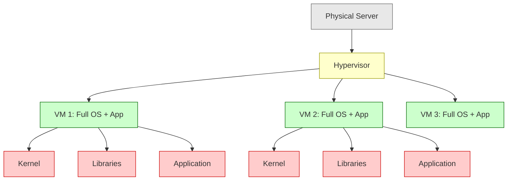
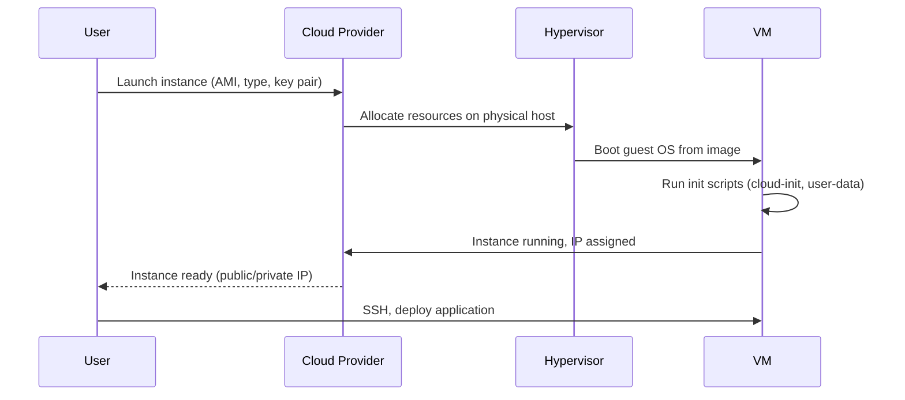
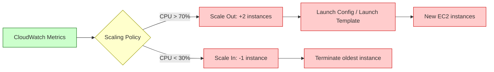
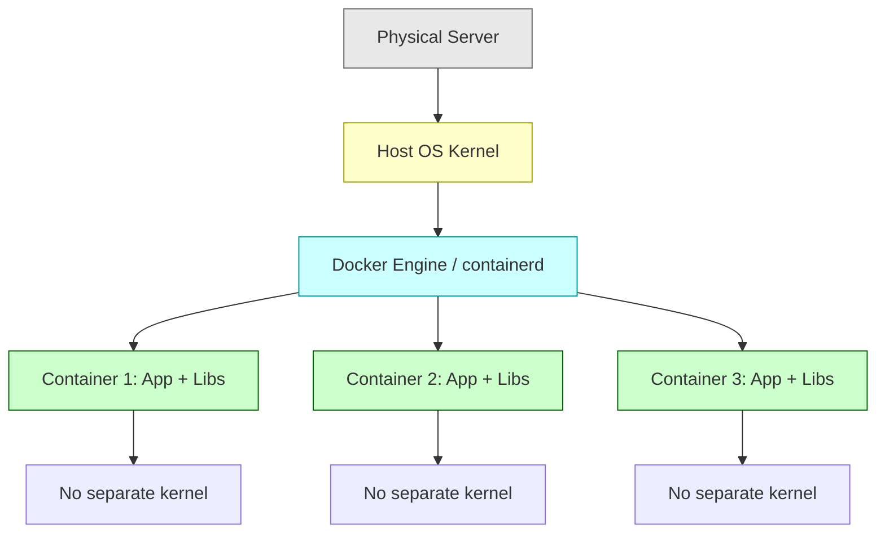
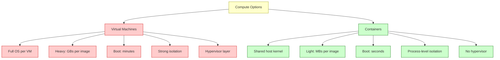
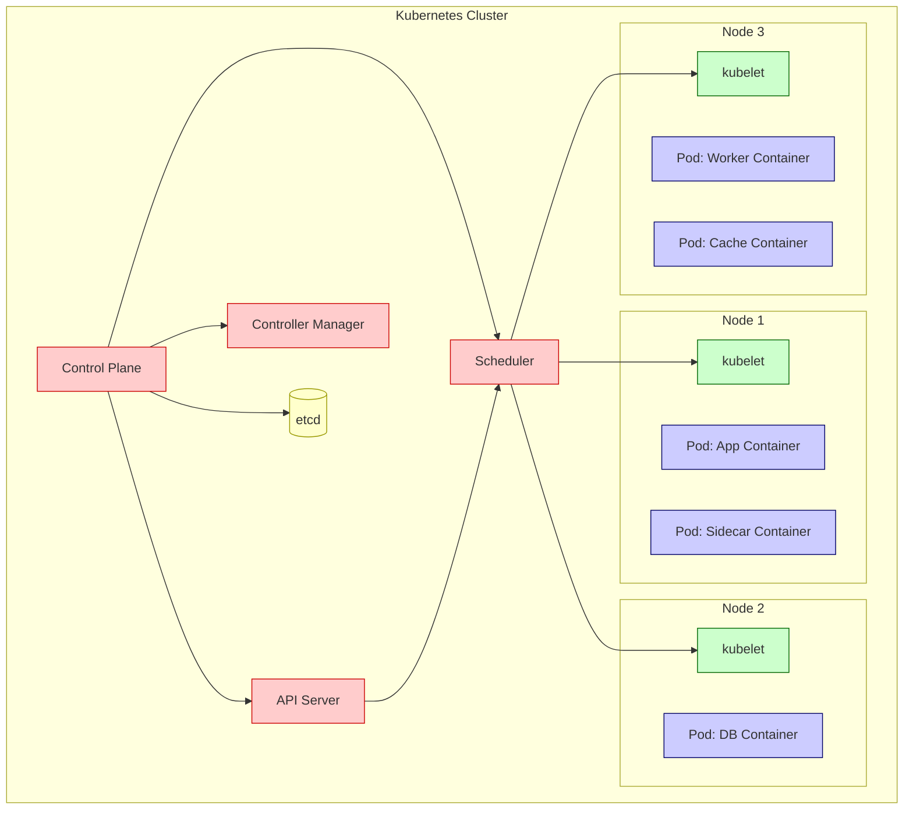
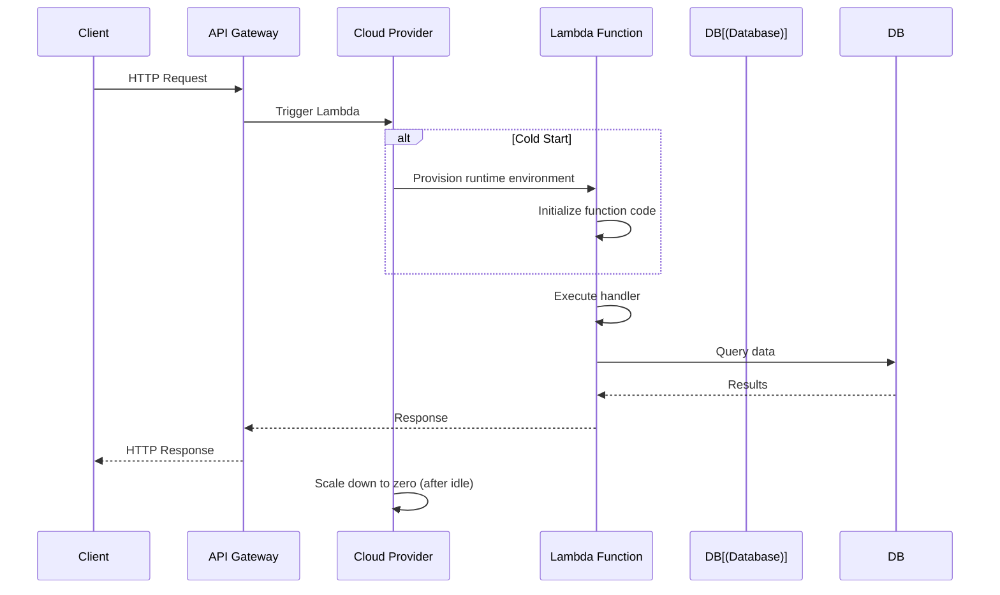
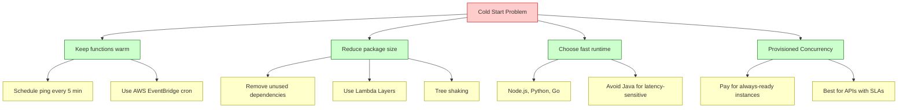
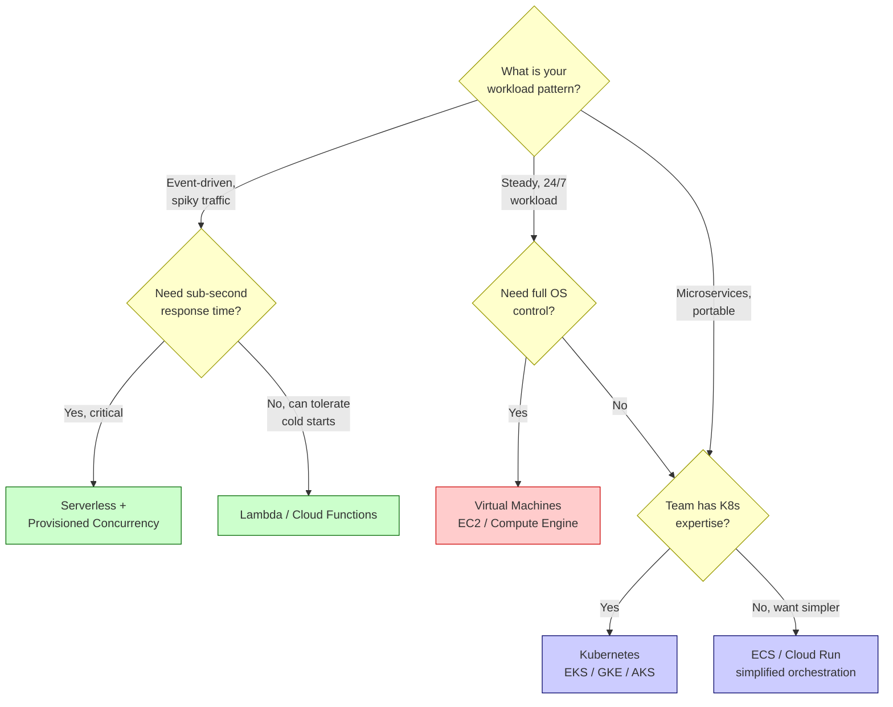

# Cloud Compute Options

## Overview

Cloud providers offer three primary compute abstractions: Virtual Machines (VMs), Containers, and Serverless functions. Each represents a different trade-off between control, portability, operational overhead, and cost. Choosing the right compute model is one of the most fundamental architecture decisions in cloud system design.

## Virtual Machines (EC2, Compute Engine, Azure VMs)

### What They Are

Virtual Machines are virtualized servers that run a full guest operating system on shared physical hardware. A hypervisor (like Xen, KVM, or Hyper-V) sits between the physical hardware and the VMs, allocating CPU, memory, and disk resources.



### Key Characteristics

| Aspect | Details |
|--------|---------|
| **Isolation** | Strong — each VM has its own kernel, OS, and resources |
| **Boot time** | 30 seconds to several minutes |
| **Overhead** | Each VM runs a full OS — memory and CPU overhead |
| **Control** | Full root access, install anything, kernel-level tuning |
| **Image management** | AMIs (AWS), machine images — bake dependencies into images |
| **Patching** | You manage OS updates, security patches, kernel upgrades |

### Provisioning and Lifecycle



### Scaling

**Manual scaling**: Launch/terminate instances by hand or via scripts.

**Auto Scaling Groups (ASG)**: Define min/max/desired capacity, scaling policies based on CPU, memory, or custom metrics.



### Cost Model

| Pricing Model | Description | Savings | Best For |
|--------------|-------------|---------|----------|
| **On-Demand** | Pay per second/hour, no commitment | 0% | Unpredictable workloads, testing |
| **Reserved Instances** | 1-3 year commitment | 40-72% | Predictable, steady-state workloads |
| **Spot Instances** | Bid on unused capacity | 60-90% | Fault-tolerant, batch processing |
| **Savings Plans** | Commit to $/hour across services | 30-66% | Flexible commitment across instance types |

**Example cost comparison** (AWS, us-east-1, monthly):

| Instance | On-Demand | 1-Year Reserved (All Upfront) | Spot (avg) |
|----------|-----------|-------------------------------|------------|
| t3.medium | ~$30 | ~$18 | ~$9 |
| m5.large | ~$70 | ~$42 | ~$21 |
| c5.xlarge | ~$125 | ~$75 | ~$38 |

### When to Use VMs

- **Long-running processes** — web servers, background workers that run 24/7
- **Full OS control needed** — custom kernel modules, specific OS configurations
- **Predictable workloads** — steady traffic that doesn't spike dramatically
- **Legacy applications** — apps that require specific OS versions or libraries
- **Compliance requirements** — need to control every layer of the stack
- **Database servers** — databases benefit from consistent, dedicated resources

> [!warning] VM Management Overhead
> Every VM you run is a server you must patch, monitor, secure, and maintain. At scale, this operational burden becomes significant — this is what drives teams toward containers and serverless.

## Containers (Docker + Kubernetes/ECS)

### What They Are

Containers package an application with its dependencies into a lightweight, portable unit that shares the host OS kernel. Unlike VMs, containers do not run a separate kernel — they use OS-level virtualization (Linux namespaces and cgroups).



### VM vs Container Comparison



### Orchestration: What Kubernetes/ECS Do

Running one container is easy. Running hundreds across multiple servers requires orchestration:

| Capability | What It Does |
|-----------|-------------|
| **Scheduling** | Place containers on nodes with available resources |
| **Scaling** | Add/remove container replicas based on load |
| **Self-healing** | Restart failed containers, replace unhealthy nodes |
| **Service discovery** | DNS-based routing between services |
| **Load balancing** | Distribute traffic across container replicas |
| **Rolling updates** | Deploy new versions with zero downtime |
| **Secrets management** | Securely inject credentials into containers |
| **Storage orchestration** | Mount persistent volumes to containers |



### Cost Model

Containers run on underlying infrastructure — you pay for the nodes (VMs) that host them:

| Component | Cost Driver |
|-----------|------------|
| **Worker nodes** | VM cost (EC2 instances) — the primary cost |
| **Control plane** | Managed K8s (EKS/GKE/AKS): ~$73/month for control plane |
| **Load balancers** | One per service exposed externally |
| **Storage** | Persistent volumes (EBS, persistent disks) |
| **Networking** | Data transfer between nodes, to internet |

**Efficiency gain**: Containers pack more workloads onto fewer VMs than running each workload on its own VM. Typical consolidation ratio: 5-10 containers per VM.

### When to Use Containers

- **Microservices** — each service in its own container with isolated dependencies
- **Consistent dev/prod environments** — "works on my machine" problem solved
- **Portability** — run the same container on AWS, GCP, Azure, or on-premises
- **CI/CD pipelines** — build once, run anywhere
- **Resource efficiency** — pack multiple workloads onto shared infrastructure
- **Fast scaling** — containers start in seconds vs minutes for VMs

## Serverless (Lambda, Cloud Functions, Fargate)

### What They Are

Serverless computing lets you run code without provisioning or managing servers. The cloud provider automatically allocates compute resources, scales from zero to thousands of concurrent executions, and charges only for actual execution time.



### Cold Starts

A **cold start** occurs when Lambda must provision a new execution environment before running your code. This adds latency to the first request (or first request after idle).

| Factor | Impact on Cold Start |
|--------|---------------------|
| **Runtime** | Python/Node.js: 100-500ms. Java/.NET: 1-5 seconds |
| **Memory** | More memory = more CPU = faster initialization |
| **Package size** | Larger deployment packages take longer to load |
| **VPC attachment** | Adds 1-10 seconds for ENI setup (improved in 2019) |
| **Provisioned Concurrency** | Eliminates cold starts entirely (at extra cost) |

**Mitigation strategies**:



### Limits (AWS Lambda)

| Limit | Value | Workaround |
|-------|-------|-----------|
| **Execution timeout** | 15 minutes max | Break into steps with Step Functions |
| **Memory** | 128 MB - 10 GB | Scale up; CPU scales proportionally |
| **Deployment package** | 250 MB unzipped | Use Lambda Layers, ECR images (10 GB) |
| **/tmp disk** | 10 GB (configurable up to 10 GB) | Use EFS for persistent storage |
| **Concurrent executions** | 1,000 default (soft limit) | Request increase, use reserved concurrency |
| **Payload (sync)** | 6 MB request, 6 MB response | Use S3 for large payloads, pass references |
| **Payload (async)** | 256 KB | Same — use S3/SQS for larger data |

### Cost Model

**Lambda pricing** (AWS, us-east-1):

| Component | Price |
|-----------|-------|
| **Requests** | $0.20 per 1M requests |
| **Duration** | $0.0000166667 per GB-second (first 400,000 GB-s free) |
| **Provisioned Concurrency** | $0.015 per GB-hour + $0.0000041667 per GB-second |

**Example calculation**: An API that processes 1M requests/month, each taking 200ms with 512 MB memory:

```
Requests:    1,000,000 × $0.20/1M = $0.20
Duration:    1,000,000 × 0.2s × 0.5GB = 100,000 GB-s
             100,000 × $0.0000166667 = $1.67
Total:       ~$1.87/month
```

Same workload on a t3.small VM running 24/7: ~$15/month. **Serverless is cheaper for variable/spiky workloads.**

But if that API processes 100M requests/month with 500ms execution:

```
Requests:    100,000,000 × $0.20/1M = $20.00
Duration:    100,000,000 × 0.5s × 0.5GB = 25,000,000 GB-s
             25,000,000 × $0.0000166667 = $416.67
Total:       ~$436.67/month
```

A t3.medium VM at ~$30/month would be **14x cheaper** for this steady, high-volume workload.

### When to Use Serverless

- **Event-driven workloads** — S3 uploads, DynamoDB streams, SQS messages
- **APIs with variable traffic** — spiky usage patterns, unpredictable load
- **Cron jobs / scheduled tasks** — data processing, cleanup, reports
- **Webhooks** — GitHub webhooks, Stripe events, Slack bots
- **Async processing** — image resizing, video transcoding, email sending
- **Prototyping** — zero infrastructure setup, pay only for what you use

> [!warning] Serverless Cost Traps
> - **High-frequency invocations** — millions of short calls add up fast
> - **Long execution times** — serverless is priced per ms; long-running tasks are expensive
> - **Data transfer** — egress costs apply the same as VMs
> - **Over-provisioned memory** — allocating more memory than needed wastes money
> - **Cold start retries** — client-side retries on cold starts multiply costs

## Comparison: Decision Framework



### Operational Overhead Comparison

| Aspect | VMs | Containers | Serverless |
|--------|-----|-----------|------------|
| **Provisioning** | Manual/automated instance launch | Build images, deploy to cluster | Write code, deploy |
| **Scaling** | Configure ASG, policies | Configure HPA, cluster autoscaler | Automatic, built-in |
| **Patching** | OS patches, security updates | Base image updates, rebuild | Provider manages |
| **Monitoring** | Install agents, configure | Sidecar agents, cluster monitoring | Built-in (CloudWatch, etc.) |
| **Networking** | VPC, security groups, NAT | Service mesh, network policies | VPC config (if needed) |
| **High availability** | Multi-AZ ASG, health checks | Multi-node, pod disruption budgets | Provider manages |
| **Cost management** | Right-size, reserved instances | Right-size nodes, cluster efficiency | Monitor invocations, duration |

### Cost Comparison: Same Workload Across Models

**Scenario**: Web API handling 10M requests/month, average 300ms response, 256 MB memory.

| Model | Monthly Cost | Operational Effort |
|-------|-------------|-------------------|
| **Lambda** | ~$12 | Minimal — no servers to manage |
| **Fargate** | ~$45 | Low — manage tasks, not servers |
| **ECS on EC2 (t3.small)** | ~$20 | Medium — manage EC2 fleet |
| **EKS on EC2** | ~$95 ($73 control plane + $22 nodes) | High — manage K8s cluster |
| **EC2 Auto Scaling** | ~$25 | Medium — manage ASG, launch templates |

> [!tip] The Rule of Thumb
> - **< 1M requests/month** → Serverless (cheapest, simplest)
> - **1-50M requests/month** → Evaluate based on execution time and pattern
> - **> 50M requests/month with steady traffic** → Containers or VMs (cheaper at scale)
> - **Need full OS control** → VMs (no alternative)

## Fargate: The Middle Ground

AWS Fargate is serverless for containers — you define container specs and pay per vCPU/memory-hour, without managing the underlying EC2 instances.

| Feature | ECS on EC2 | ECS on Fargate | Lambda |
|---------|-----------|---------------|--------|
| **Unit of deployment** | Task definition | Task definition | Function |
| **Infrastructure** | You manage EC2 | Provider manages | Provider manages |
| **Minimum billing** | Per EC2 instance (24/7) | Per task (per second) | Per invocation (per ms) |
| **Max duration** | Unlimited | Unlimited | 15 minutes |
| **Best for** | Long-running services, steady load | Containers without server management | Event-driven, short-lived functions |

## Key Details

> [!warning] Vendor Lock-In
> - **Serverless**: Highest lock-in — Lambda triggers, API Gateway config, IAM roles are AWS-specific
> - **Containers**: Moderate lock-in — Docker images are portable, but K8s configs and managed services (EKS vs GKE) differ
> - **VMs**: Lowest lock-in — standard Linux/Windows VMs are portable across clouds

> [!tip] Hybrid Approach
> Most production systems use a mix:
> - Serverless for event-driven tasks (image processing, webhooks)
> - Containers for core application services (APIs, workers)
> - VMs for databases, legacy apps, or specialized workloads

> [!info] Serverless ≠ No Servers
> "Serverless" means you don't manage servers — they still exist. The cloud provider abstracts them away and handles provisioning, scaling, and maintenance.

## When to Use

- **System design interviews** — choosing compute for different architecture components
- **Startup architecture** — minimizing ops overhead while keeping costs low
- **Migration planning** — moving from on-premises VMs to cloud-native patterns
- **Cost optimization** — evaluating whether serverless, containers, or VMs are cheaper for your workload

## Related Topics

- [[Microservices Architecture]] — containers are the standard deployment unit for microservices
- [[SQL vs NoSQL Databases]] — database compute choices interact with application compute
- [[Cloud Networking VPC]] — all compute options run within VPCs
- [[Cloud Infrastructure Components]] — load balancers, CDN, and DNS work with all compute types

## External Links

- [AWS Compute Options Comparison](https://aws.amazon.com/products/compute/)
- [Serverless Land](https://serverlessland.com/)
- [Kubernetes Documentation](https://kubernetes.io/docs/)
- [AWS Lambda Limits](https://docs.aws.amazon.com/lambda/latest/dg/gettingstarted-limits.html)
- [Fargate vs Lambda](https://aws.amazon.com/blogs/containers/choosing-between-aws-lambda-and-aws-fargate/)
- [The Serverless Handbook](https://serverlesshandbook.dev/)
- [Google Cloud Run](https://cloud.google.com/run)
- [Azure Container Instances](https://azure.microsoft.com/en-us/products/container-instances/)
