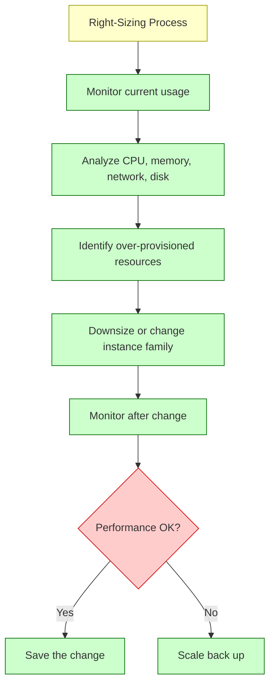
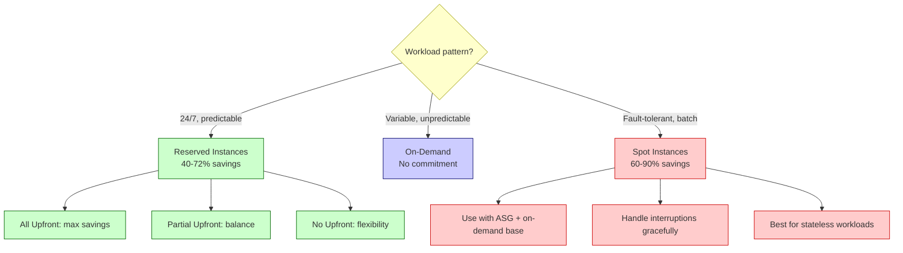
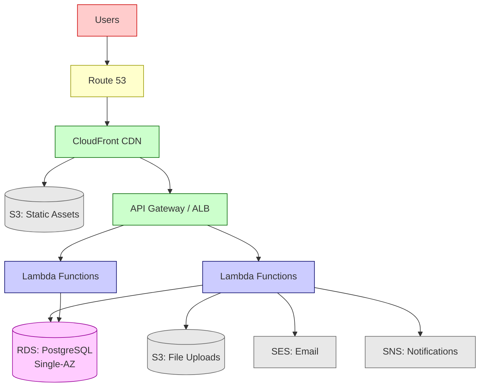
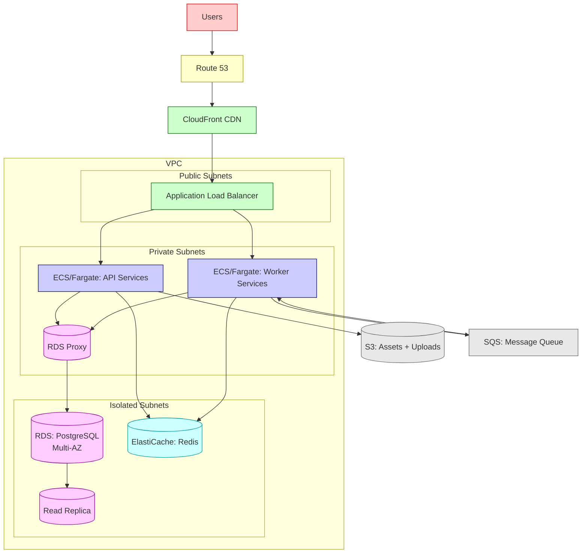
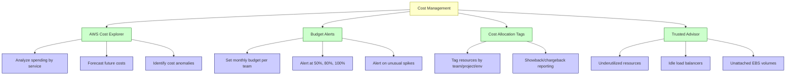

# Cloud Cost Optimization and Architecture Patterns

## Overview

Cloud cost optimization is not about spending the least — it's about spending efficiently. The goal is to maximize value per dollar while maintaining performance, reliability, and security. This note covers cost optimization strategies, common cost traps, and real-world architecture patterns at different company stages.

## Cost Optimization Strategies

### Right-Sizing Instances

Choosing the right instance type and size for your workload is the single most impactful cost optimization.



**Common right-sizing mistakes**:

| Mistake | Impact | Fix |
|---------|--------|-----|
| **Choosing by vCPU only** | Wasting money on unnecessary CPU | Check actual CPU utilization (CloudWatch) |
| **Ignoring memory** | OOM errors after downsizing | Monitor memory usage, not just CPU |
| **Not matching workload type** | Paying for compute-optimized when memory-bound | Use C-series for CPU, R-series for memory, M-series for balanced |
| **Set-and-forget** | Workloads change, instances don't | Review quarterly, use AWS Compute Optimizer |

### Reserved Instances vs On-Demand vs Spot



**Savings comparison** (m5.large, Linux, us-east-1, 1 year):

| Pricing | Hourly | Monthly | Annual | Savings |
|---------|--------|---------|--------|---------|
| On-Demand | $0.096 | $70 | $840 | — |
| Reserved (No Upfront) | $0.062 | $45 | $540 | 36% |
| Reserved (All Upfront) | $0.040 | $29 | $350 | 58% |
| Spot (avg) | $0.029 | $21 | $252 | 70% |

### Serverless Cost Traps

Serverless seems cheap until it isn't. Here are the common traps:

| Trap | Scenario | Cost Impact | Fix |
|------|----------|------------|-----|
| **High-frequency invocations** | Lambda called 100M times/month | $20+ in requests alone | Batch calls, use SQS, reduce polling frequency |
| **Long execution times** | 5-minute Lambda processing data | $5 per execution | Break into steps, use Step Functions, use Fargate |
| **Over-provisioned memory** | 3 GB Lambda that only needs 256 MB | 12x cost for same duration | Profile memory usage, use AWS Lambda Power Tuning |
| **Cold start retries** | Client retries on timeout, each retry costs | 2-5x cost multiplier | Increase timeout, use provisioned concurrency |
| **Unbounded concurrency** | S3 event triggers Lambda for 1M files | 1M concurrent executions | Use SQS as buffer, set reserved concurrency limits |
| **Data transfer in/out** | Lambda processes 100 GB from S3 | $9/GB egress = $900 | Use VPC endpoints, process in same region |

**Serverless cost calculator example**:

```
Scenario: Image processing pipeline
- 1M images/month uploaded to S3
- Each triggers a Lambda (256 MB, 3 seconds avg)
- Lambda resizes image and uploads back to S3

Cost breakdown:
- Lambda requests:  1,000,000 × $0.20/1M = $0.20
- Lambda duration:  1,000,000 × 3s × 0.25GB = 750,000 GB-s
                    750,000 × $0.0000166667 = $12.50
- S3 PUT requests:  1,000,000 × $0.005/1K = $5.00
- S3 storage:       ~50 GB × $0.023 = $1.15
- Data transfer:    ~50 GB out × $0.09/GB = $4.50
Total:              ~$23.35/month
```

### Data Transfer Costs (Egress Fees)

Data transfer is one of the most underestimated cloud costs.

```mermaid
graph TD
    A[Data Transfer Types] --> B[Ingress (data in)]
    A --> C[Egress (data out)]
    A --> D[Cross-AZ]
    A --> E[Cross-region]
    
    B --> B1[Usually FREE]
    
    C --> C1[To internet: $0.09/GB (first 10 TB)]
    C --> C2[To CloudFront: $0.085/GB]
    C --> C3[First 100 GB/month FREE]
    
    D --> D1[$0.01/GB both directions]
    D --> D2[Accumulates fast with multi-AZ]
    
    E --> E1[$0.02-$0.20/GB depending on region pair]
    E --> E2[Cross-region replication adds up]
    
    classDef main fill:#ffffcc,stroke:#999900
    classDef free fill:#ccffcc,stroke:#006600
    classDef paid fill:#ffcccc,stroke:#cc0000
    
    class A main
    class B,B1 free
    class C,C1,C2,C3,D,D1,D2,E,E1,E2 paid
```

**Data transfer optimization**:

| Strategy | Savings | How |
|----------|---------|-----|
| **Use CloudFront** | ~50% on egress | CloudFront egress is cheaper than direct S3 egress |
| **VPC Endpoints** | $0.045/GB saved | Avoid NAT Gateway data processing for S3/DynamoDB |
| **Keep traffic in-region** | $0.02-$0.20/GB saved | Avoid cross-region data transfer |
| **Compress data** | 50-90% less data | Gzip, Brotli for text; optimize image formats |
| **Use same AZ** | $0.01/GB saved | Co-locate related resources when possible |

## Architecture Patterns by Company Stage

### Stage 1: Simple Startup (0-10 engineers)

**Goals**: Move fast, minimize ops overhead, keep costs low.



| Component | Choice | Why |
|-----------|--------|-----|
| **Frontend** | S3 + CloudFront | Cheap, fast, zero ops |
| **Backend** | Lambda + API Gateway | No servers to manage, auto-scaling |
| **Database** | RDS PostgreSQL (single-AZ) | Managed, easy to set up |
| **File storage** | S3 | Unlimited, durable, cheap |
| **Email** | SES | $0.10 per 1,000 emails |
| **DNS** | Route 53 | Managed, integrates with everything |

**Monthly cost estimate**: $50-$200/month for early-stage traffic.

> [!tip] Startup Rule
> At this stage, developer time is more valuable than infrastructure cost. Choose managed services that let you ship features, not manage servers.

### Stage 2: Growing Company (10-50 engineers)

**Goals**: Improve reliability, support more traffic, enable team autonomy.



| Component | Choice | Why |
|-----------|--------|-----|
| **Frontend** | S3 + CloudFront (unchanged) | Still optimal |
| **Backend** | ECS/Fargate + ALB | More control than Lambda, less than K8s |
| **Database** | RDS PostgreSQL (Multi-AZ) | High availability, read replicas |
| **Cache** | ElastiCache Redis | Reduce database load, session storage |
| **Connection pooling** | RDS Proxy | Handle Fargate connection scaling |
| **Message queue** | SQS | Decouple services, async processing |
| **Monitoring** | CloudWatch + X-Ray | Observability across services |

**Monthly cost estimate**: $500-$3,000/month depending on traffic.

### Stage 3: Enterprise (50+ engineers, multi-region)

**Goals**: Global availability, compliance, cost efficiency at scale.

```mermaid
graph TD
    subgraph Region: us-east-1 (Primary)
        subgraph VPC Primary
            ALB1[ALB]
            EKS1[EKS: Services]
            RDS1[(Aurora Global DB<br/>Writer)]
            Redis1[Redis Cluster]
        end
    end
    
    subgraph Region: eu-west-1 (Secondary)
        subgraph VPC Secondary
            ALB2[ALB]
            EKS2[EKS: Services]
            RDS2[(Aurora Global DB<br/>Reader)]
            Redis2[Redis Cluster]
        end
    end
    
    UserUS[US Users] --> Route53[Route 53<br/>Latency Routing]
    UserEU[EU Users] --> Route53
    
    Route53 -->|US traffic| ALB1
    Route53 -->|EU traffic| ALB2
    
    ALB1 --> EKS1
    ALB2 --> EKS2
    
    EKS1 --> RDS1
    EKS2 --> RDS2
    
    RDS1 -.->|Async Global Replication| RDS2
    
    EKS1 --> Redis1
    EKS2 --> Redis2
    
    EKS1 --> SM[Service Mesh<br/>Istio/Linkerd]
    EKS2 --> SM
    
    classDef region fill:#ffffcc,stroke:#999900
    classDef compute fill:#ccccff,stroke:#000066
    classDef db fill:#ffccff,stroke:#990099
    classDef cache fill:#ccffff,stroke:#009999
    classDef user fill:#ffcccc,stroke:#cc0000
    classDef dns fill:#e8e8e8,stroke:#666666
    classDef mesh fill:#ccffcc,stroke:#006600
    
    class Region,Region region
    class EKS1,EKS2,ALB1,ALB2 compute
    class RDS1,RDS2 db
    class Redis1,Redis2 cache
    class UserUS,UserEU user
    class Route53 dns
    class SM mesh
```

| Component | Choice | Why |
|-----------|--------|-----|
| **Orchestration** | EKS (Kubernetes) | Standard, portable, large ecosystem |
| **Service mesh** | Istio/Linkerd | mTLS, traffic management, observability |
| **Database** | Aurora Global Database | Cross-region replication, fast failover |
| **Cache** | Redis Cluster (multi-AZ) | High availability, large datasets |
| **DNS routing** | Route 53 latency-based | Route users to nearest region |
| **CDN** | CloudFront | Global edge caching |
| **Secrets** | Secrets Manager + IAM Roles | Automated rotation, least privilege |
| **CI/CD** | GitLab CI / GitHub Actions | Automated testing and deployment |

**Monthly cost estimate**: $10,000-$100,000+/month depending on scale.

## Cost Comparison: Same Application, Different Architectures

**Scenario**: E-commerce API handling 50M requests/month, average 200ms response.

| Architecture | Monthly Compute | Monthly Database | Monthly Network | Total | Ops Effort |
|-------------|----------------|-----------------|----------------|-------|-----------|
| **All Serverless** | $150 (Lambda) | $100 (RDS Serverless) | $50 | $300 | Low |
| **Containers (Fargate)** | $400 (Fargate) | $175 (RDS Multi-AZ) | $75 | $650 | Medium |
| **EC2 + RDS** | $200 (EC2 ASG) | $350 (RDS Multi-AZ + replica) | $60 | $610 | High |
| **EC2 + self-hosted DB** | $200 (EC2 ASG) | $95 (EC2 DB) | $60 | $355 | Very High |

> [!tip] Total Cost of Ownership
> The cheapest infrastructure on paper may not be cheapest in practice. Factor in:
> - Engineering time spent on infrastructure management
> - Incident response and on-call burden
> - Time to onboard new engineers
> - Risk of outages from misconfiguration

## Cost Monitoring and Alerts



## Key Details

> [!warning] Cost Optimization Anti-Patterns
> - **Premature optimization** — don't optimize costs before you have product-market fit
> - **Optimizing the wrong thing** — compute is often 20% of the bill; data transfer and databases are the rest
> - **Turning off monitoring to save money** — you can't optimize what you don't measure
> - **One-time optimization** — costs drift; review monthly, not annually
> - **Sacrificing reliability for cost** — an outage costs more than any optimization saves

> [!tip] Cost Optimization Checklist
> - [ ] Enable AWS Cost Explorer and set up budgets
> - [ ] Tag all resources by team, project, and environment
> - [ ] Review unused resources monthly (idle EC2, unattached EBS, old snapshots)
> - [ ] Right-size instances based on actual utilization
> - [ ] Purchase Reserved Instances for steady-state workloads
> - [ ] Use S3 lifecycle policies to transition old data to cheaper storage
> - [ ] Use CloudFront to reduce S3 egress costs
> - [ ] Use VPC endpoints to avoid NAT Gateway charges
> - [ ] Set up auto-scaling to match capacity with demand
> - [ ] Review database instance sizes and storage monthly

## When to Use

- **System design interviews** — justifying architecture choices with cost considerations
- **Startup planning** — choosing cost-effective infrastructure for early-stage products
- **Scale-up planning** — transitioning from serverless to containers as traffic grows
- **Enterprise optimization** — reducing cloud spend without sacrificing reliability

## Related Topics

- [[Cloud Compute Options]] — compute cost models and pricing strategies
- [[Cloud Networking VPC]] — NAT Gateway and cross-AZ data transfer costs
- [[Cloud Infrastructure Components]] — CDN caching reduces origin costs
- [[Database Architecture]] — managed vs self-hosted cost trade-offs
- [[Microservices Architecture]] — infrastructure cost increases with service count

## External Links

- [AWS Well-Architected Framework — Cost Optimization Pillar](https://docs.aws.amazon.com/wellarchitected/latest/cost-optimization-pillar/welcome.html)
- [AWS Cost Explorer](https://aws.amazon.com/aws-cost-management/aws-cost-explorer/)
- [AWS Pricing Calculator](https://calculator.aws/)
- [Serverless Cost Calculator](https://serverlesscalc.com/)
- [Cloud Cost Optimization — FinOps Foundation](https://www.finops.org/)
- [AWS Trusted Advisor](https://aws.amazon.com/premiumsupport/technology/trusted-advisor/)
- [Kubernetes Cost Optimization](https://www.cncf.io/blog/2021/09/28/kubernetes-cost-optimization/)
