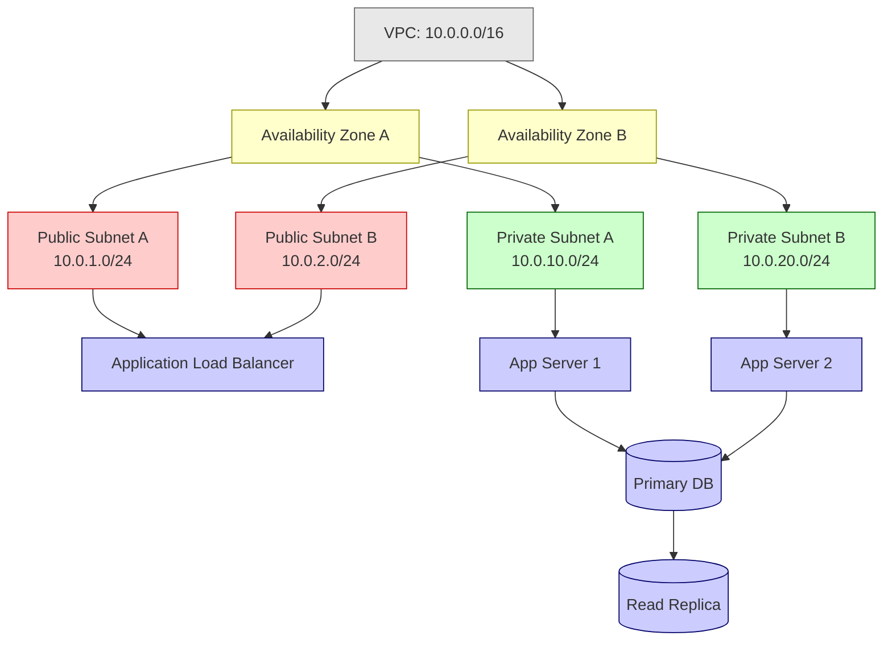
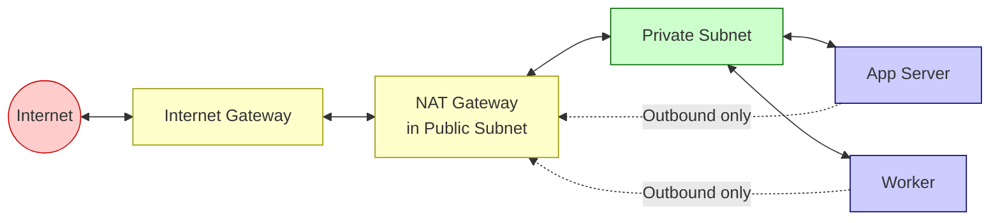
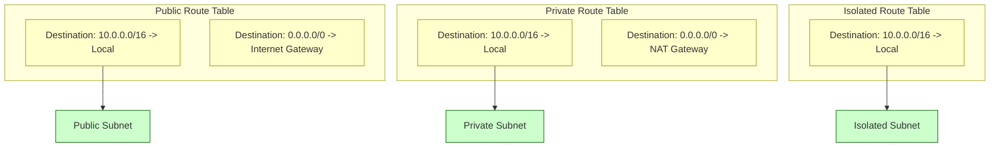
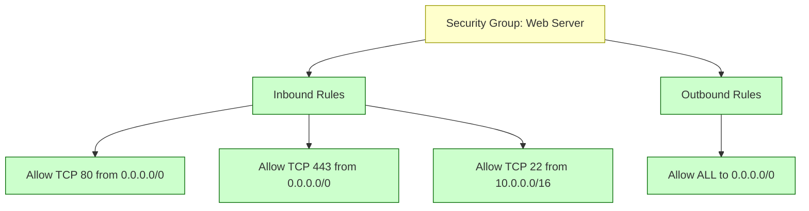
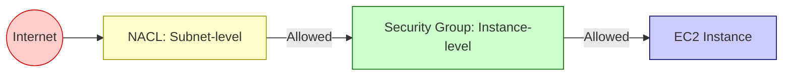
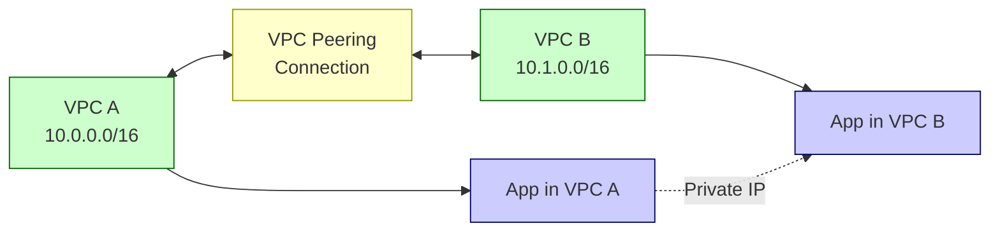
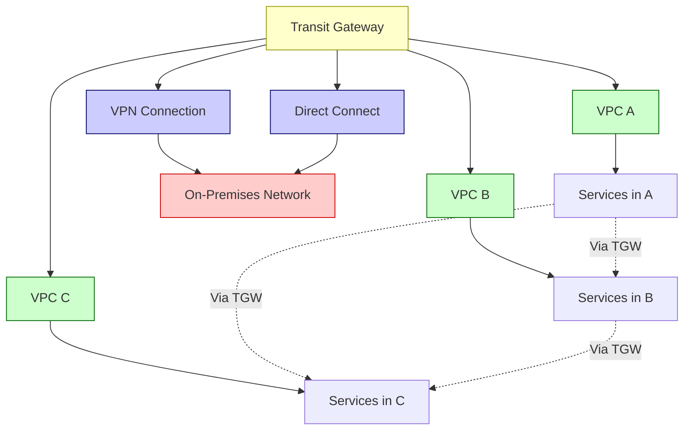
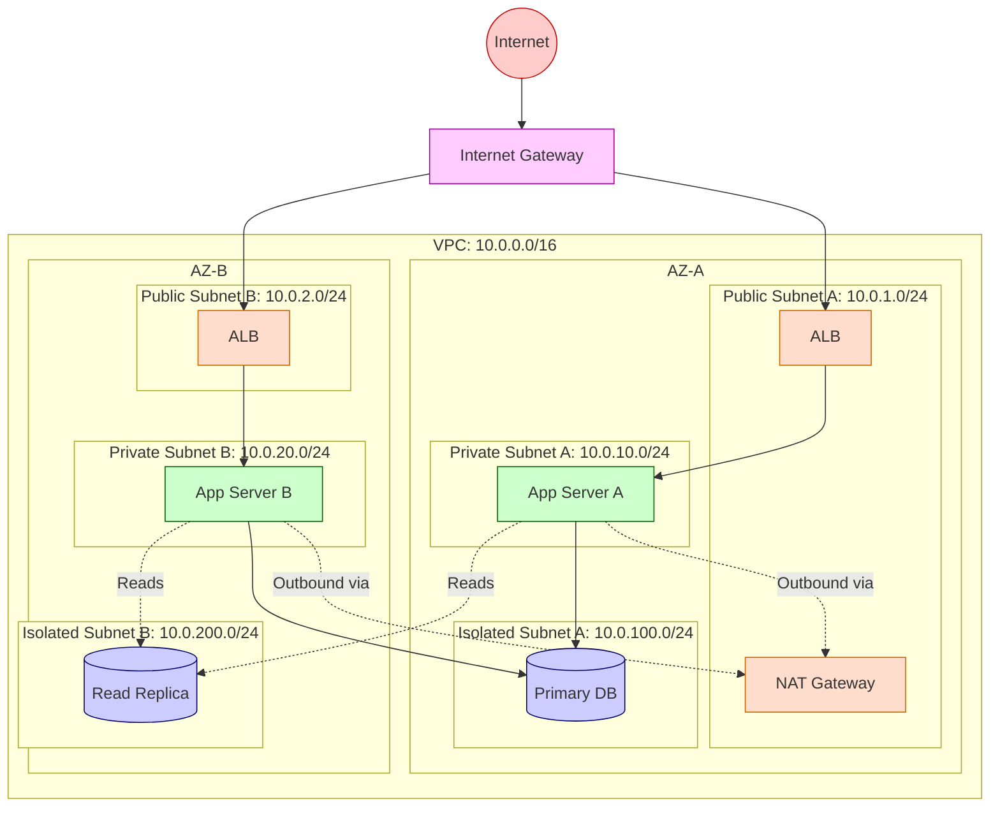
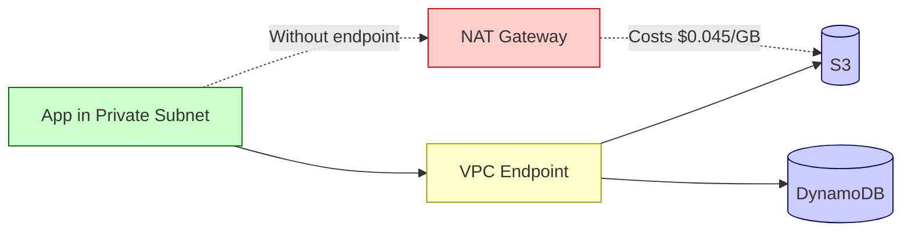

# Cloud Networking VPC

## Overview

A Virtual Private Cloud (VPC) is an isolated virtual network within a cloud provider's infrastructure. It gives you complete control over your networking environment — IP address ranges, subnets, route tables, gateways, and security policies. Think of it as your own private data center network, but hosted in the cloud.

## VPC Fundamentals

### What Is a VPC

A VPC is a logically isolated section of the cloud where you launch resources. Each VPC has:

- **One CIDR block** — the IP address range (e.g., `10.0.0.0/16` = 65,536 addresses)
- **Region-scoped** — a VPC exists in one region, but spans all Availability Zones in that region
- **Account-scoped isolation** — VPCs in the same account are isolated by default
- **Default VPC** — each region comes with a default VPC (172.31.0.0/16) for quick starts

### CIDR Blocks and IP Ranges

CIDR (Classless Inter-Domain Routing) notation defines IP ranges:

| CIDR | Total IPs | Usable IPs | Use Case |
|------|-----------|-----------|----------|
| /16 | 65,536 | 65,531 | Large VPC, many subnets |
| /20 | 4,096 | 4,091 | Medium VPC |
| /24 | 256 | 251 | Single subnet |
| /28 | 16 | 11 | Smallest subnet |

> [!warning] CIDR Planning
> Choose your VPC CIDR carefully — you cannot change it after creation. Avoid overlapping with your on-premises network if you plan VPC peering or VPN connections. Use RFC 1918 private ranges: `10.0.0.0/8`, `172.16.0.0/12`, `192.168.0.0/16`.

## Subnets

### Public vs Private Subnets

Subnets divide your VPC's IP range into smaller segments, each placed in a specific Availability Zone.



| Subnet Type | Route to Internet | Resources | Why |
|------------|------------------|-----------|-----|
| **Public** | Via Internet Gateway (IGW) | Load balancers, NAT gateways, bastion hosts | Must be reachable from the internet |
| **Private** | No direct internet route | Application servers, workers | Should not be directly accessible from the internet |
| **Isolated** | No routes out at all | Databases, internal services | Maximum security — no internet access needed |

### Why Separate Public and Private?

**Security isolation**: If an attacker compromises a public-facing load balancer, they cannot directly reach your application servers or databases in private subnets.

**Defense in depth**: Multiple layers of security — security groups, network ACLs, and subnet boundaries all work together.

## Internet Gateway (IGW)

An Internet Gateway is a horizontally scaled, redundant VPC component that allows communication between your VPC and the internet.

```mermaid
graph LR
    Internet((Internet)) <--> IGW[Internet Gateway]
    IGW <--> RT[Route Table<br/>0.0.0.0/0 -> IGW]
    RT <--> PubSub[Public Subnet]
    PubSub <--> ALB[Load Balancer]
    PubSub <--> Bastion[Bastion Host]
    
    classDef internet fill:#ffcccc,stroke:#cc0000
    classDef gateway fill:#ffffcc,stroke:#999900
    classDef subnet fill:#ccffcc,stroke:#006600
    classDef resource fill:#ccccff,stroke:#000066
    
    class Internet internet
    class IGW gateway
    class RT, PubSub subnet
    class ALB, Bastion resource
```

**Key properties**:
- One IGW per VPC
- Automatically highly available and redundant
- Does NOT provide NAT — resources in public subnets get public IPs and are directly reachable

## NAT Gateway

A NAT (Network Address Translation) Gateway allows instances in **private subnets** to initiate outbound connections to the internet (for software updates, external APIs) while **preventing inbound connections** from the internet.



**Key properties**:
- NAT Gateway must be placed in a **public subnet** (it needs internet access itself)
- One NAT Gateway per AZ for high availability (they are AZ-scoped)
- AWS manages scaling — up to 45 Gbps bandwidth
- Cost: ~$32/month + $0.045/GB processed
- **Alternative**: NAT Instance (self-managed EC2) — cheaper but requires manual management

> [!tip] NAT Gateway Cost Optimization
> NAT Gateway data processing charges add up. If multiple private subnets in the same AZ need internet access, route them through a single NAT Gateway. For cross-AZ traffic, consider VPC endpoints for AWS services (avoid NAT entirely for S3, DynamoDB).

## Route Tables

Route tables define where network traffic is directed. Each subnet must be associated with exactly one route table.



| Route Table | Routes | Associated With |
|------------|--------|----------------|
| **Public** | Local (VPC traffic) + 0.0.0.0/0 → IGW | Public subnets |
| **Private** | Local (VPC traffic) + 0.0.0.0/0 → NAT Gateway | Private subnets |
| **Isolated** | Local (VPC traffic) only | Database subnets |

**Important**: The `10.0.0.0/16 -> Local` route is automatic and cannot be removed — it ensures all resources within the VPC can communicate with each other.

## Security Groups

Security groups act as **stateful virtual firewalls** at the instance level (ENI level).



**Key properties**:

| Property | Detail |
|----------|--------|
| **Stateful** | If inbound traffic is allowed, the return traffic is automatically allowed (no need for outbound rule) |
| **Allow rules only** | You can only create allow rules; everything else is implicitly denied |
| **Default** | Deny all inbound, allow all outbound |
| **Instance-level** | Applied to the network interface, not the subnet |
| **Multiple SGs** | An instance can have multiple security groups; rules are evaluated as a union |
| **Reference by ID** | Rules can reference other security group IDs (e.g., "allow traffic from the ALB security group") |

> [!tip] Security Group Best Practice
> Reference security group IDs instead of IP addresses in rules. This makes rules dynamic — if the ALB's IP changes, the rule still works. Example: "Allow port 8080 from sg-0abc123 (ALB SG)" instead of "Allow port 8080 from 10.0.1.0/24."

## Network ACLs (NACLs)

Network ACLs are **stateless firewalls** at the subnet level — a second layer of defense.

| Property | Security Groups | Network ACLs |
|----------|----------------|-------------|
| **Level** | Instance (ENI) | Subnet |
| **State** | Stateful | Stateless |
| **Rules** | Allow only | Allow and Deny |
| **Evaluation** | All rules evaluated | Rules evaluated in number order |
| **Default** | Deny all inbound, allow all outbound | Allow all inbound and outbound |
| **Use case** | Primary access control | Additional subnet-level filtering |



> [!warning] Stateless Means...
> With NACLs, you must explicitly allow both inbound AND outbound traffic. If you allow inbound port 80, you must also allow outbound ephemeral ports (1024-65535) for the response. Security groups handle this automatically.

## VPC Peering and Transit Gateway

### VPC Peering

A direct network connection between two VPCs. Traffic stays on the AWS backbone (never goes over the public internet).



**Limitations**:
- CIDR blocks must NOT overlap
- Not transitive (A peered with B, B peered with C does NOT mean A can reach C)
- No support for edge-to-edge routing through a peering connection

### Transit Gateway

A hub-and-spoke model for connecting multiple VPCs and on-premises networks. Solves the transitivity problem of VPC peering.



**When to use Transit Gateway**:
- 5+ VPCs to connect (peering becomes unmanageable: n*(n-1)/2 connections)
- Need transitive routing
- Connecting to on-premises via VPN or Direct Connect
- Centralized network management

## Three-Tier Architecture: Complete Diagram



**Traffic flow**:

1. User → Internet → IGW → ALB (public subnet)
2. ALB → App Server (private subnet, port 8080)
3. App Server → Database (isolated subnet, port 5432)
4. App Server → NAT Gateway → Internet (for external API calls, package updates)

**Security group chain**:
- ALB SG: Allow 443 from 0.0.0.0/0
- App SG: Allow 8080 from ALB SG only
- DB SG: Allow 5432 from App SG only

## VPC Endpoints

VPC Endpoints allow private connectivity to AWS services **without going through the internet or NAT Gateway** — saving on NAT data processing costs and improving security.

| Type | How It Works | Services |
|------|-------------|----------|
| **Gateway Endpoint** | Route table entry, free | S3, DynamoDB |
| **Interface Endpoint** | ENI in your subnet, powered by PrivateLink | 100+ services (SQS, SNS, Secrets Manager, etc.) |



> [!tip] Always Use VPC Endpoints
> For S3 and DynamoDB access from private subnets, use Gateway Endpoints (free). This eliminates NAT Gateway data processing charges ($0.045/GB) and keeps traffic on the AWS backbone.

## Key Details

> [!warning] Common Pitfalls
> - **NAT Gateway in private subnet** — NAT GW must be in a public subnet with a route to IGW, or it cannot reach the internet
> - **Missing route table association** — a subnet without an explicit route table association uses the main route table, which may not have the routes you expect
> - **Security group referencing deleted SG** — if you delete a referenced security group, the rule becomes invalid
> - **Overlapping CIDRs** — VPC peering fails if CIDR blocks overlap; plan your IP ranges carefully
> - **Cross-AZ data transfer** — traffic between AZs costs $0.01/GB; keep related resources in the same AZ when possible

> [!tip] VPC Design Best Practices
> - Use `/16` for VPC CIDR to allow plenty of subnets
> - Reserve IP ranges for future growth
> - One NAT Gateway per AZ for high availability
> - Use security group references, not IP addresses
> - Tag all networking resources for cost tracking and management
> - Use VPC Flow Logs for network traffic analysis and troubleshooting

## When to Use

- **System design interviews** — designing network architecture for scalable applications
- **Cloud migration** — planning VPC structure before migrating on-premises workloads
- **Multi-account setups** — designing network topology across development, staging, production
- **Compliance requirements** — isolating sensitive workloads in private/isolated subnets

## Related Topics

- [[Cloud Compute Options]] — all compute resources run within VPCs
- [[Cloud Infrastructure Components]] — load balancers and DNS interact with VPC networking
- [[Microservices Architecture]] — service mesh and inter-service communication depend on VPC configuration
- [[Cloud Cost Optimization]] — NAT Gateway and cross-AZ data transfer are significant cost drivers

## External Links

- [AWS VPC Documentation](https://docs.aws.amazon.com/vpc/latest/userguide/what-is-amazon-vpc.html)
- [VPC Design Patterns](https://docs.aws.amazon.com/vpc/latest/userguide/vpc-best-practices.html)
- [Transit Gateway Documentation](https://docs.aws.amazon.com/vpc/latest/tgw/what-is-transit-gateway.html)
- [VPC Endpoints](https://docs.aws.amazon.com/vpc/latest/privatelink/vpc-endpoints.html)
- [VPC Flow Logs](https://docs.aws.amazon.com/vpc/latest/userguide/flow-logs.html)
- [AWS Networking Best Practices](https://aws.amazon.com/architecture/networking-content-delivery/)
- [RFC 1918 - Private Address Space](https://datatracker.ietf.org/doc/html/rfc1918)
