# Cloud Infrastructure Components

## Overview

Beyond compute and networking, cloud infrastructure includes load balancers, CDNs, DNS, object storage, and secrets management. These components form the supporting infrastructure that makes applications scalable, performant, secure, and reliable.

## Load Balancers

### What They Do

Load balancers distribute incoming traffic across multiple targets (instances, containers, IP addresses) to ensure high availability, fault tolerance, and efficient resource utilization.

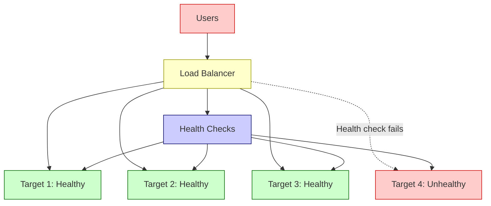

### Application Load Balancer (ALB) — Layer 7

Operates at the **application layer** (HTTP/HTTPS). Makes routing decisions based on content.

**Features**:
- **Path-based routing**: `/api/*` → API servers, `/static/*` → S3
- **Host-based routing**: `api.example.com` → API, `www.example.com` → web app
- **WebSocket support**: Real-time bidirectional communication
- **HTTP/2 and gRPC**: Modern protocol support
- **SSL/TLS termination**: Decrypt HTTPS at the load balancer

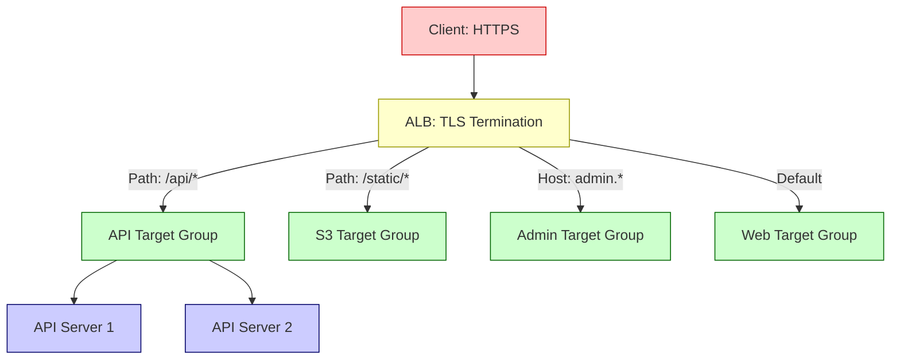

**When to use ALB**: HTTP/HTTPS traffic, need content-based routing, microservices with different paths.

### Network Load Balancer (NLB) — Layer 4

Operates at the **transport layer** (TCP/UDP). Makes routing decisions based on IP protocol data.

**Features**:
- **Ultra-low latency**: Microsecond-level processing
- **Static IPs**: One elastic IP per AZ (useful for whitelisting)
- **Preserves source IP**: Backend sees the actual client IP
- **Handles millions of requests per second**: Extreme throughput
- **TCP, UDP, TLS**: Protocol support

| Feature | ALB (L7) | NLB (L4) |
|---------|----------|----------|
| **Layer** | Application (HTTP/HTTPS) | Transport (TCP/UDP) |
| **Routing** | Path, host, headers, methods | IP address, port |
| **Latency** | Milliseconds | Microseconds |
| **Throughput** | Millions of RPS | Tens of millions of RPS |
| **Source IP** | Via X-Forwarded-For header | Preserved natively |
| **Static IP** | No (DNS name only) | Yes (elastic IP per AZ) |
| **WebSocket** | Yes | Yes (TCP passthrough) |
| **SSL termination** | Yes | Yes (TLS listener) |
| **Cost** | ~$22/month + LCU charges | ~$22/month + NLCU charges |

**When to use NLB**: TCP/UDP traffic, extreme performance needs, gaming, IoT, financial trading, or when you need static IPs.

### Health Checks

Load balancers continuously check target health:

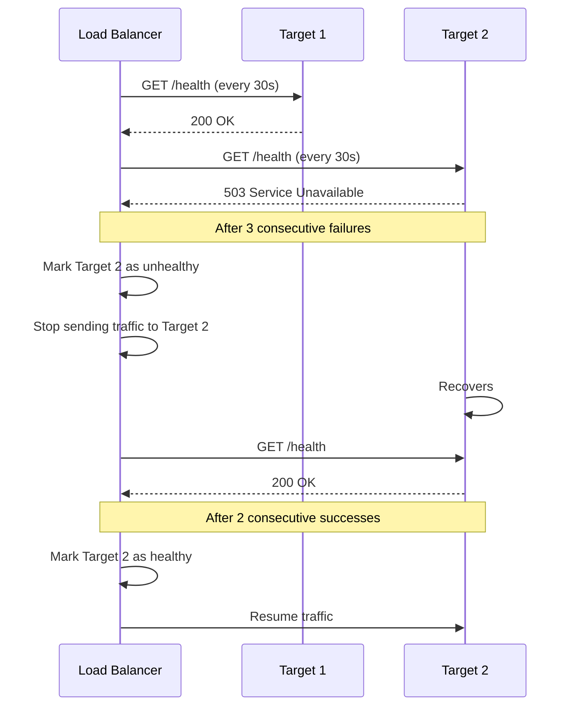

## CDN (Content Delivery Network)

### What It Is

A CDN caches your content at **edge locations** — data centers distributed globally, closer to your users. When a user requests content, it's served from the nearest edge location instead of your origin server.

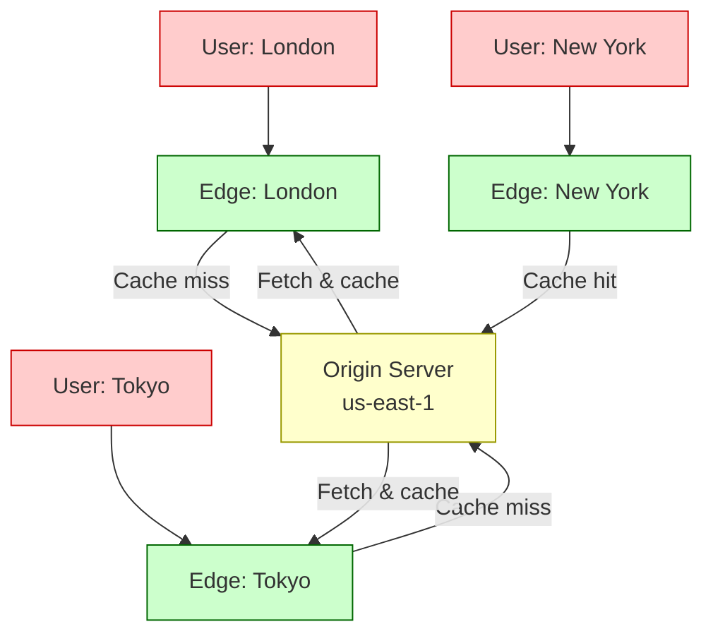

### What to Cache

| Content Type | Cache Strategy | TTL |
|-------------|---------------|-----|
| **Static assets** (CSS, JS, images) | Cache aggressively | 1 year + cache busting |
| **API responses** | Cache with validation | Minutes to hours |
| **HTML pages** | Cache or bypass | Depends on dynamic content |
| **Video/audio** | Cache aggressively (large files) | 1 year |
| **Personalized content** | Don't cache | N/A |
| **Authentication pages** | Never cache | N/A |

### Benefits

| Benefit | Description |
|---------|-------------|
| **Lower latency** | Content served from nearby edge location (10-50ms vs 200-500ms) |
| **Reduced origin load** | Cache hits never reach your origin server |
| **DDoS protection** | CDN absorbs traffic spikes and attacks |
| **Bandwidth savings** | Less data transfer from origin = lower costs |
| **Global reach** | Serve users worldwide without deploying in every region |

### Cache Invalidation

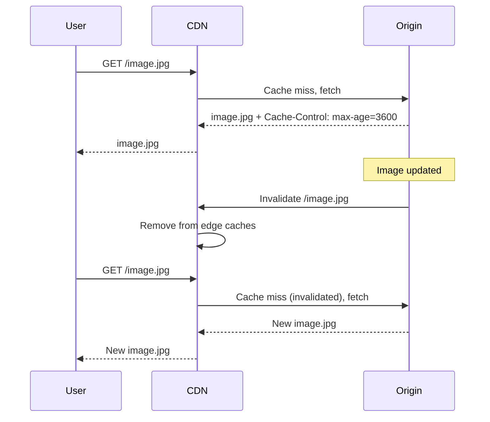

> [!tip] Cache Busting
> Instead of invalidating caches, use cache busting: append a version hash to filenames (`style.a1b2c3.css`). When the file changes, the URL changes, and the CDN fetches the new version automatically. This is faster and cheaper than cache invalidation.

## DNS (Route 53)

### What It Does

DNS translates human-readable domain names (`example.com`) into IP addresses (`93.184.216.34`). Route 53 is AWS's managed DNS service.

### Routing Policies

| Policy | Behavior | Use Case |
|--------|----------|----------|
| **Simple** | One record, one value | Single resource |
| **Weighted** | Distribute traffic by weight (e.g., 80/20) | A/B testing, gradual migration |
| **Latency-based** | Route to lowest-latency endpoint | Global applications |
| **Geolocation** | Route based on user's geographic location | Content localization, compliance |
| **Geoproximity** | Route based on user location + bias | Traffic shifting between regions |
| **Failover** | Active-passive: primary + secondary | Disaster recovery |
| **Multi-value** | Return multiple IPs, client picks one | Simple load balancing |

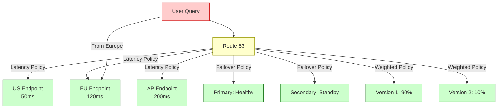

### Health Checks

Route 53 can monitor endpoint health and automatically route traffic away from unhealthy endpoints:

- **HTTP/HTTPS/TCP health checks** every 10 or 30 seconds
- **Integration with CloudWatch alarms**
- **Automatic DNS failover** when health check fails

## Object Storage (S3)

### What It Is

Amazon S3 (Simple Storage Service) provides unlimited, highly durable object storage. Data is stored as objects (files) within buckets, with each object having a key (name), data, and metadata.

### Durability and Availability

- **Durability**: 99.999999999% (11 nines) — designed to sustain concurrent loss of data in two facilities
- **Availability**: 99.99% (Standard) — four nines uptime SLA

### Storage Classes

| Class | Access Pattern | Retrieval Time | Cost (per GB/month) | Best For |
|-------|---------------|----------------|-------------------|----------|
| **S3 Standard** | Frequent access | Milliseconds | $0.023 | Active data, websites, mobile apps |
| **S3 Intelligent-Tiering** | Unknown/changing | Milliseconds | $0.023 (auto-moves) | Data with unknown access patterns |
| **S3 Standard-IA** | Infrequent access | Milliseconds | $0.0125 + retrieval fee | Backups, disaster recovery |
| **S3 One Zone-IA** | Infrequent, single AZ | Milliseconds | $0.01 + retrieval fee | Reproducible data, secondary backups |
| **S3 Glacier Instant** | Archive, instant access | Milliseconds | $0.004 | Long-term data needing instant retrieval |
| **S3 Glacier Flexible** | Archive | 3-5 hours | $0.0036 | Compliance archives, backups |
| **S3 Glacier Deep Archive** | Rare archive | 12-48 hours | $0.00099 | Regulatory archives (7+ years) |

### Use Cases

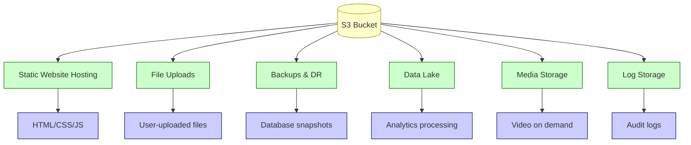

### S3 as Static Website Host

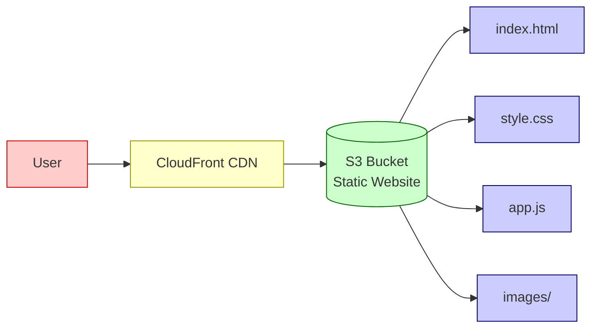

> [!tip] S3 + CloudFront Pattern
> Always put CloudFront in front of S3 for static websites. Benefits: HTTPS (S3 alone doesn't support custom SSL), caching at edge, DDoS protection, and lower S3 request costs.

## Secrets Management

### Why Not Environment Variables or .env Files

| Approach | Problem |
|----------|---------|
| **Hardcoded in code** | Leaked in version control, impossible to rotate |
| **.env files** | Can be committed accidentally, no rotation, no audit trail |
| **Environment variables** | Visible in process listings, logs, error messages |
| **Config files on disk** | Must be managed separately, no encryption at rest by default |

### AWS Secrets Manager vs SSM Parameter Store

| Feature | Secrets Manager | SSM Parameter Store |
|---------|----------------|--------------------|
| **Purpose** | Secrets (passwords, API keys, certificates) | Configuration parameters |
| **Automatic rotation** | Built-in (Lambda-based rotation) | Manual or custom Lambda |
| **Encryption** | KMS encryption | KMS encryption (SecureString) |
| **Cross-account access** | Supported | Supported |
| **Cost** | $0.40/secret/month + $0.05/10K API calls | Free (Standard), $0.05/parameter/month (Advanced) |
| **Secret size limit** | 65 KB | 8 KB (Standard), 8 KB (Advanced) |
| **Versioning** | Automatic versioning with staging labels | Versioning available |
| **Audit trail** | CloudTrail integration | CloudTrail integration |

### When to Use Each

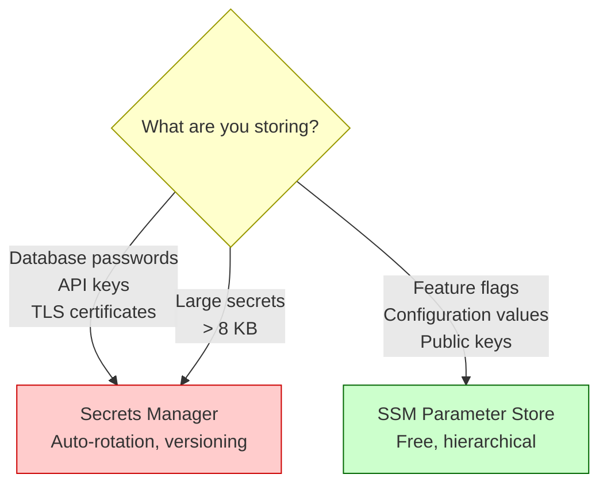

### Best Practices

```mermaid
graph TD
    A[Secrets Management] --> B[Never commit secrets]
    A --> C[Use IAM for access control]
    A --> D[Rotate regularly]
    A --> E[Audit access]
    A --> F[Use least privilege]
    
    B --> B1[Use .gitignore, pre-commit hooks]
    B --> B2[Scan repos with git-secrets, trufflehog]
    
    C --> C1[IAM policies, not shared credentials]
    C --> C2[Role-based access per service]
    
    D --> D1[Automated rotation (Secrets Manager)]
    D --> D2[90-day rotation policy]
    
    E --> E1[CloudTrail logging]
    E --> E2[Alert on unusual access patterns]
    
    F --> F1[Each service gets only its secrets]
    F --> F2[No admin-level secret access]
    
    classDef main fill:#ffffcc,stroke:#999900
    classDef practice fill:#ccffcc,stroke:#006600
    classDef detail fill:#ccccff,stroke:#000066
    
    class A main
    class B,C,D,E,F practice
    class B1,B2,C1,C2,D1,D2,E1,E2,F1,F2 detail
```

### Example: Retrieving Secrets in Application

```typescript
// Using AWS SDK v3 to retrieve a secret
import { SecretsManagerClient, GetSecretValueCommand } from "@aws-sdk/client-secrets-manager";

const client = new SecretsManagerClient({ region: "us-east-1" });

async function getDatabaseCredentials(): Promise<{
  username: string;
  password: string;
  host: string;
  port: number;
}> {
  const command = new GetSecretValueCommand({
    SecretId: "prod/database/credentials",
  });

  const response = await client.send(command);
  const secret = JSON.parse(response.SecretString!);

  return {
    username: secret.username,
    password: secret.password,
    host: secret.host,
    port: secret.port,
  };
}

// Cache the secret — don't fetch on every request
let cachedCredentials: ReturnType<typeof getDatabaseCredentials> | null = null;
const CACHE_TTL = 3600; // 1 hour
let cacheExpiry = 0;

async function getCachedCredentials() {
  if (!cachedCredentials || Date.now() > cacheExpiry) {
    cachedCredentials = await getDatabaseCredentials();
    cacheExpiry = Date.now() + CACHE_TTL * 1000;
  }
  return cachedCredentials;
}
```

> [!warning] Secret Rotation Gotcha
> When rotating database passwords, there's a window where the old password is invalid but the application hasn't picked up the new one. Use dual-password support (PostgreSQL 14+) or implement graceful reconnection with secret refresh.

## GCP Supporting Services

### Pub/Sub

Pub/Sub is Google Cloud's managed messaging service for asynchronous event delivery. Publishers write messages to topics; subscriptions deliver those messages to consumers using pull or push delivery. It is commonly paired with Cloud Run services for event-driven HTTP workers and with Cloud Run jobs for batch follow-up work.

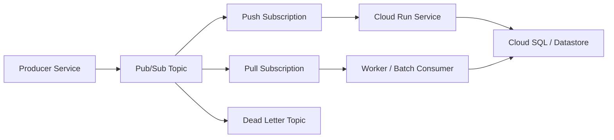

| Concern | Practical Guidance |
|---------|--------------------|
| Duplicate delivery | Make handlers idempotent with message IDs or business keys |
| Failed processing | Configure retries and dead-letter topics |
| Slow consumers | Monitor subscription backlog and oldest unacked message age |
| Ordering | Use ordering keys only where strict per-key order is required |
| Push to Cloud Run | Authenticate requests and return non-2xx only for retryable failures |

### Datastore / Firestore in Datastore Mode

Datastore is a managed NoSQL document database now surfaced through Firestore in Datastore mode. It is useful for hierarchical entities, flexible schemas, automatic scaling, and application data that does not need SQL joins.

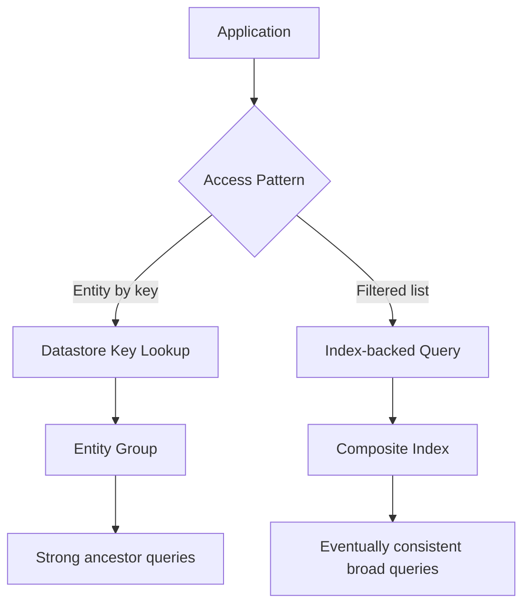

| Use Datastore When | Prefer Cloud SQL When |
|--------------------|-----------------------|
| Data is document-like or sparse | You need joins and relational constraints |
| Scale and low ops matter | You need complex ad hoc SQL queries |
| Entity groups model the consistency boundary | Multi-row transactions are common |
| Query patterns are known and indexable | Reporting queries change frequently |

### Secret Manager

Secret Manager stores API keys, database passwords, certificates, and other sensitive values with IAM access control and versioning. In GCP deployments, prefer service-account access to Secret Manager over baking secrets into Docker images or committing `.env` files.

| Pattern | Use |
|---------|-----|
| Runtime fetch | App reads the secret at startup and caches it with refresh behavior |
| Environment injection | Platform injects values for simple apps; redeploy/restart may be needed for updates |
| Version pinning | Roll out a specific secret version safely |
| Rotation | Add new version, update clients, then disable/destroy old version |

## How Components Work Together

### Request Flow Through Infrastructure

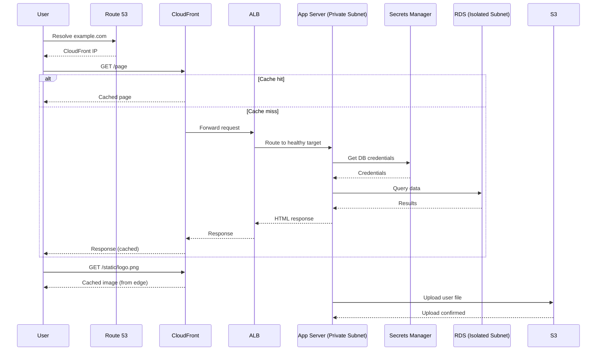

## Key Details

> [!warning] Common Pitfalls
> - **ALB without health checks** — traffic sent to unhealthy instances causes errors
> - **CDN without cache headers** — origin server gets hit on every request
> - **S3 bucket public by accident** — always block public access unless intentionally hosting a public website
> - **Secrets in Lambda environment variables** — use Secrets Manager or SSM Parameter Store instead
> - **Single AZ deployment** — always deploy across multiple AZs for high availability
> - **Missing DNS TTL consideration** — high TTL means slow failover; use low TTL (60s) for critical services

> [!tip] Infrastructure Best Practices
> - Use Infrastructure as Code (Terraform, CloudFormation) for all resources
> - Tag everything for cost allocation and management
> - Enable access logging on load balancers, CloudFront, and S3
> - Use WAF (Web Application Firewall) in front of ALB/CloudFront
> - Implement least-privilege IAM policies for every component
> - Test failover scenarios regularly — don't assume DR works until you've tested it

## Troubleshooting Guide

Common production failures and how to diagnose them.

### Load Balancer — 502/503/504 Errors

| Error | Meaning | Common Cause | Fix |
|---|---|---|---|
| **502 Bad Gateway** | Target sent invalid response | App crashed or returned non-HTTP | Check target health checks; look at app logs |
| **503 Service Unavailable** | No healthy targets | All instances unhealthy or draining | Check health check path (`/health`); verify security group allows ALB → app port |
| **504 Gateway Timeout** | Target didn't respond in time | App too slow, blocking I/O, DB query | Increase ALB idle timeout; check slow query logs |

```bash
# Check ECS service events for failed task launches
aws ecs describe-services --cluster prod --services api-service \
  --query 'services[0].events[:10]'

# Check ALB target health
aws elbv2 describe-target-health --target-group-arn <arn>
```

### CDN Cache Misses / Stale Content

```bash
# Check CloudFront cache hit rate in CloudWatch
aws cloudwatch get-metric-statistics \
  --namespace AWS/CloudFront \
  --metric-name CacheHitRate \
  --dimensions Name=DistributionId,Value=<id> \
  --period 3600 --statistics Average \
  --start-time 2024-01-01T00:00:00Z --end-time 2024-01-02T00:00:00Z
```

**Common causes:**
- Missing `Cache-Control` headers on origin responses → CDN defaults to no-cache
- Query strings vary (CloudFront may use them to distinguish cache keys — configure whitelist)
- `Authorization` header present → CDN bypasses cache by default

### Secrets Manager — Access Denied

```bash
# Check the resource policy on the secret
aws secretsmanager get-resource-policy --secret-id /prod/db-password

# Check if ECS task role has the right IAM permissions
aws iam simulate-principal-policy \
  --policy-source-arn <task-role-arn> \
  --action-names secretsmanager:GetSecretValue \
  --resource-arns <secret-arn>
```

Ensure the ECS task role (not the ECS execution role) has `secretsmanager:GetSecretValue` permission on the specific secret ARN or `*` in the secret's path.

## When to Use

- **System design interviews** — selecting the right infrastructure components for architecture
- **Production deployment** — building resilient, scalable infrastructure
- **Performance optimization** — using CDN and caching to reduce latency
- **Security hardening** — proper secrets management and network isolation

## Related Topics

- [[vpc]] — load balancers and DNS operate within VPC networking
- [[compute]] — infrastructure components route traffic to compute resources
- [[aws]] — ECS, EC2, RDS, S3, Secrets Manager, and common AWS deployment shape
- [[microservices]] — load balancers and API gateways are essential for microservices
- [[cost]] — CDN caching, right-sizing, and storage class selection reduce costs

## External Links

- [AWS Elastic Load Balancing](https://aws.amazon.com/elasticloadbalancing/)
- [Amazon CloudFront](https://aws.amazon.com/cloudfront/)
- [Amazon Route 53](https://aws.amazon.com/route53/)
- [Amazon S3](https://aws.amazon.com/s3/)
- [AWS Secrets Manager](https://aws.amazon.com/secrets-manager/)
- [Google Cloud Pub/Sub Overview](https://cloud.google.com/pubsub/docs/overview)
- [Google Cloud Datastore Overview](https://cloud.google.com/datastore/docs/concepts/overview)
- [Google Secret Manager Overview](https://cloud.google.com/secret-manager/docs/overview)
- [AWS Systems Manager Parameter Store](https://docs.aws.amazon.com/systems-manager/latest/userguide/systems-manager-parameter-store.html)
- [AWS Well-Architected Framework](https://aws.amazon.com/architecture/well-architected/)
