# Database Architecture

## Overview

Production database architecture goes far beyond installing a database on a server. It involves decisions about managed vs self-hosted deployment, high availability through multi-AZ setups, read scaling with replicas, connection pooling for serverless workloads, and backup strategies for disaster recovery.

## Managed vs Self-Hosted Databases

### Managed Databases (RDS, Aurora, Cloud SQL)

The cloud provider handles the operational burden:

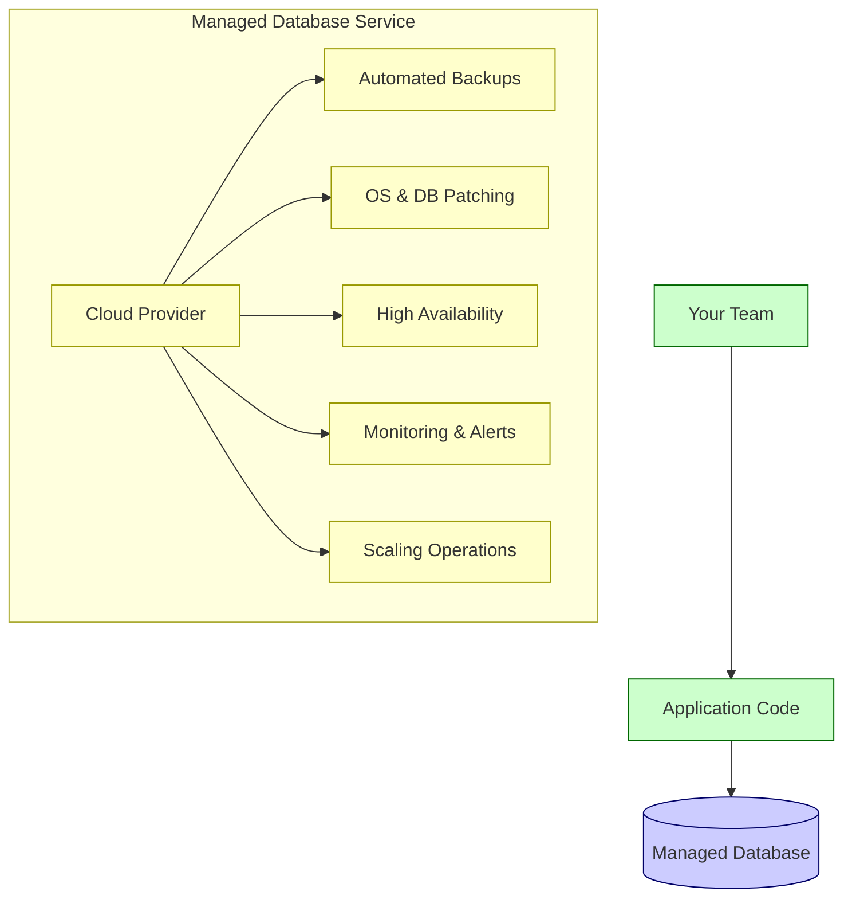

| Feature | Managed (RDS, Aurora) | Self-Hosted |
|---------|----------------------|-------------|
| **Setup** | Click to create, minutes | Install, configure, tune — hours to days |
| **Backups** | Automated, point-in-time recovery | Manual scripts, cron jobs |
| **Patching** | Automatic or scheduled window | Manual OS and DB updates |
| **High availability** | One-click multi-AZ | Manual replication setup |
| **Scaling** | Vertical: click to resize. Horizontal: read replicas | Manual — provision new server, configure replication |
| **Monitoring** | Built-in metrics, CloudWatch integration | Install and configure monitoring stack |
| **Access** | Limited — no SSH, no superuser (some engines) | Full root access |
| **Customization** | Limited to supported parameters | Full control — custom extensions, kernel tuning |
| **Cost** | Higher per-hour rate | Lower raw compute cost, but add operational cost |
| **Vendor lock-in** | Higher — migration requires effort | Lower — standard database software |

### Cost Comparison Example

**PostgreSQL, db.r6g.large (2 vCPU, 16 GB RAM), us-east-1:**

| Deployment | Monthly Cost | What's Included |
|-----------|-------------|-----------------|
| **RDS (On-Demand)** | ~$175 | DB engine, automated backups, multi-AZ option (+50%) |
| **EC2 + self-managed** | ~$95 | Raw compute only — you manage everything |
| **RDS (1-year Reserved)** | ~$105 | Same as on-demand, with commitment |

**Hidden costs of self-hosted**:
- DBA time: 5-10 hours/week for maintenance at $100-200/hour = $2,000-$8,000/month
- Backup infrastructure and testing
- Monitoring and alerting setup
- Incident response at 3 AM when replication breaks

> [!tip] When to Self-Host
> Self-host when you need: custom database extensions not supported by managed services, specific OS-level tuning, cost savings at very large scale (100+ instances), or compliance requirements that mandate full control.

> [!tip] When to Use Managed
> Use managed for: most production workloads, teams without dedicated DBAs, startups prioritizing speed, and when the operational savings outweigh the premium cost.

### GCP Cloud SQL

Cloud SQL is Google Cloud's managed relational database service for MySQL, PostgreSQL, and SQL Server. It maps closely to RDS conceptually: Google manages backups, patching, maintenance windows, high availability options, monitoring integration, and instance scaling while your application manages schema, queries, indexes, and connection behavior.

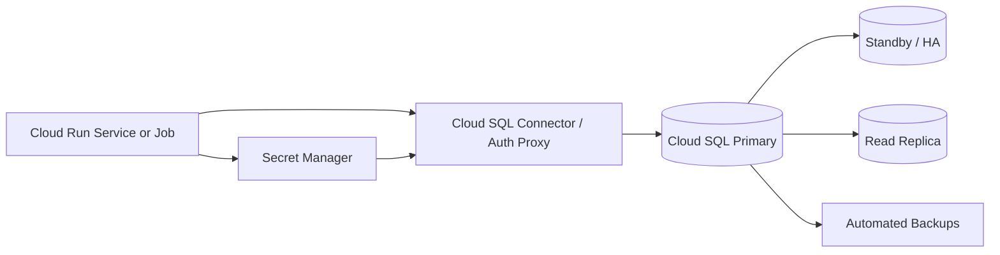

| Concern | Practical Cloud SQL Choice |
|---------|----------------------------|
| Cloud Run connection spikes | Use connector/proxy plus connection pooling in the app or a pooler where appropriate |
| Private database access | Prefer private IP or controlled connector path instead of public allowlists |
| Availability | Use HA/regional configuration for production |
| Read scaling | Add read replicas only when the app tolerates replication lag |
| Schema changes | Run migrations from Cloud Run jobs or CI, not during every service startup |

> [!warning] Serverless Connections
> Cloud Run can scale many container instances quickly. If every instance opens a large database pool, Cloud SQL can run out of connections. Keep pools small, set maximum Cloud Run instances when needed, and monitor connection count.

## Primary/Replica Architecture

### Read Replicas

Read replicas are copies of the primary database that handle read-only queries, offloading read traffic from the primary.

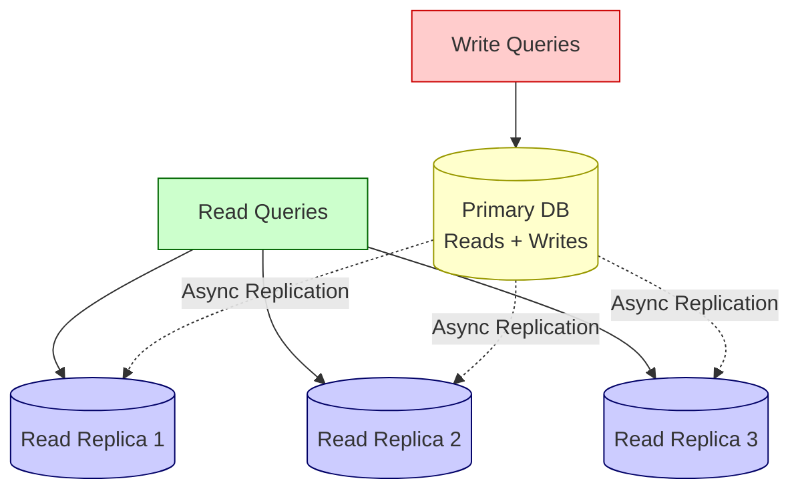

**How replication works**:

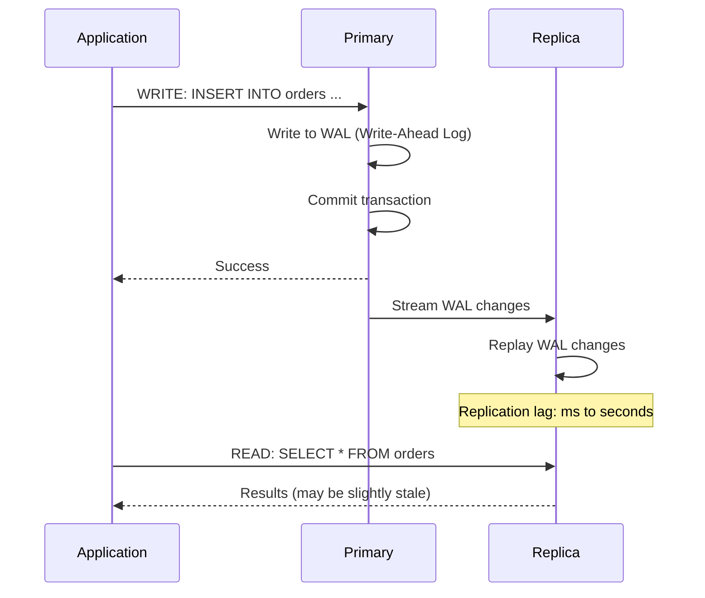

### Replication Lag

Replication is **asynchronous** — there's always some delay between writes on the primary and their appearance on replicas.

| Cause of Lag | Impact | Mitigation |
|-------------|--------|-----------|
| **Heavy write load** | Replica falls behind | Scale up replica, reduce write volume |
| **Long-running queries on replica** | Replication pauses | Kill long queries, use dedicated analytics replica |
| **Network latency** | Cross-region lag (100ms+) | Accept lag, route reads to local replica |
| **Large transactions** | Single transaction blocks replication | Break into smaller transactions |
| **Schema changes** | DDL operations can cause significant lag | Schedule during low-traffic windows |

> [!warning] Read-Your-Writes Consistency
> If a user writes data and immediately reads it, they might hit a replica that hasn't received the write yet. Solution: route reads to the primary for a short window after a write, or use session-based routing.

### Multi-AZ Deployment (High Availability)

Multi-AZ creates a synchronous standby replica in a different Availability Zone. If the primary fails, automatic failover promotes the standby.

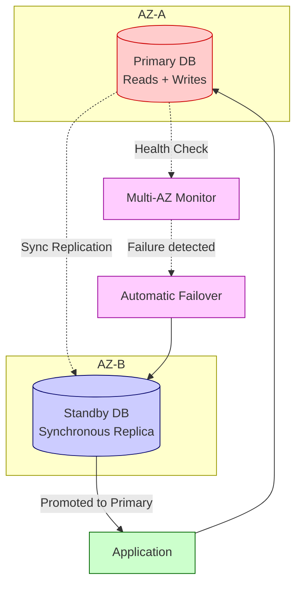

| Feature | Multi-AZ | Read Replicas |
|---------|----------|--------------|
| **Purpose** | High availability (failover) | Read scaling |
| **Replication** | Synchronous | Asynchronous |
| **Readable** | No (standby is not accessible) | Yes |
| **Automatic failover** | Yes (60-120 seconds) | Manual promotion |
| **Cost** | ~2x primary cost | Additional cost per replica |
| **Cross-region** | No (same region, different AZ) | Yes (cross-region replicas supported) |

**Combining both**: Production systems often use Multi-AZ for HA plus read replicas for read scaling.

## Connection Pooling

### The Problem

Each database connection consumes memory and CPU on the database server. Serverless functions (Lambda) are especially problematic because each invocation may open a new connection.

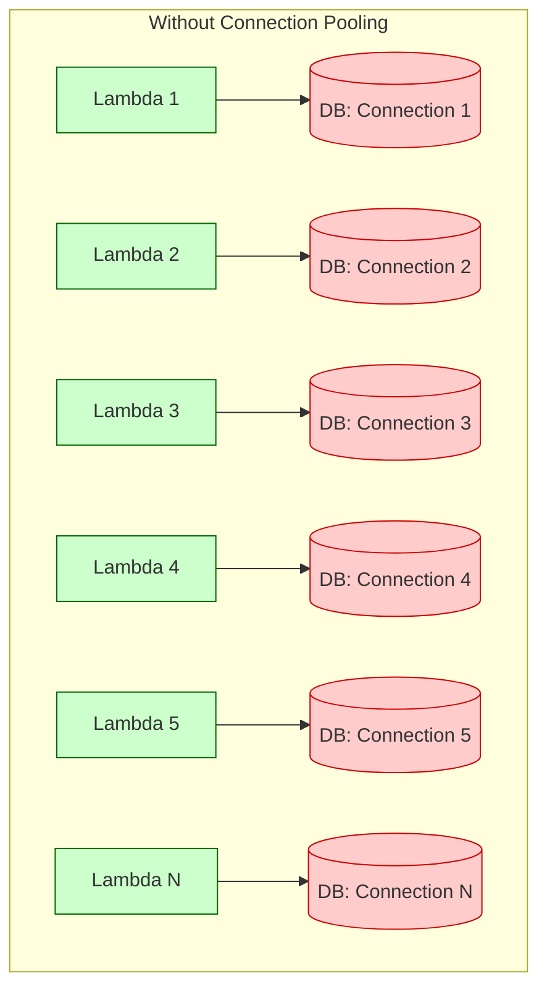

**Result**: 1,000 concurrent Lambda invocations = 1,000 database connections. PostgreSQL default max_connections = 100. **Database crashes.**

### The Solution: Connection Pooling

A connection pool maintains a pool of reusable database connections. Multiple clients share a smaller number of connections to the database.

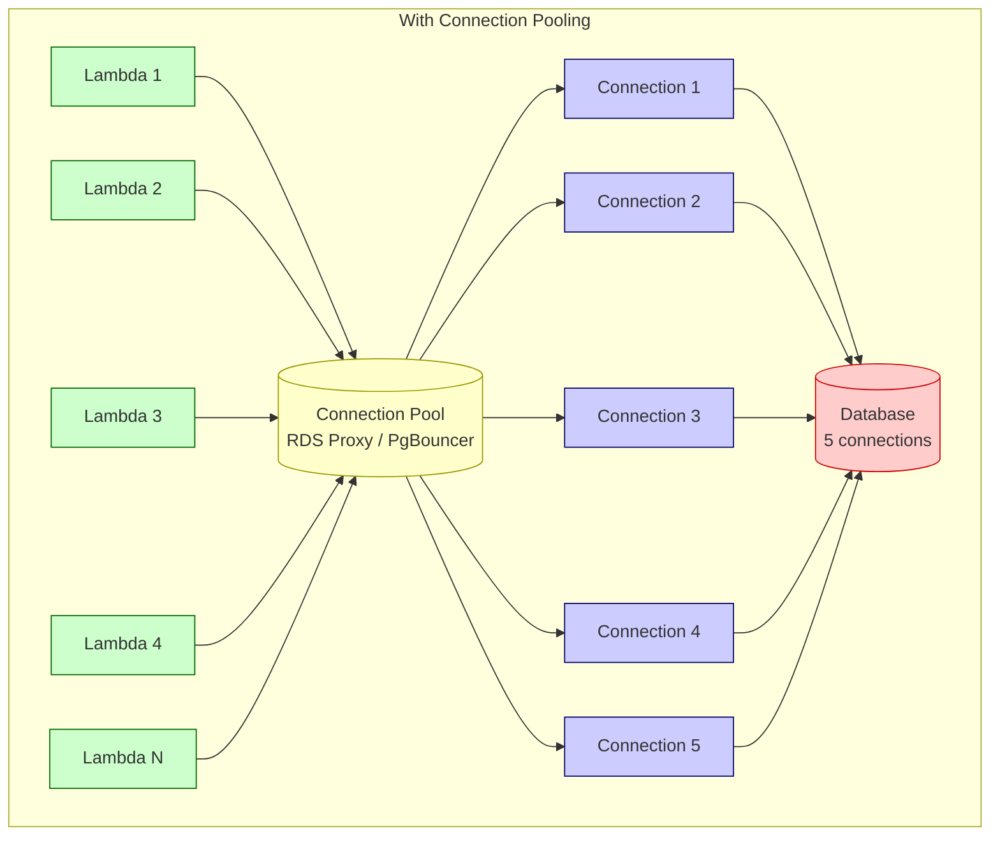

### PgBouncer vs RDS Proxy

| Feature | PgBouncer | RDS Proxy |
|---------|-----------|-----------|
| **Type** | Open-source, self-managed | AWS managed service |
| **Database support** | PostgreSQL only | PostgreSQL, MySQL, Aurora |
| **Pooling modes** | Transaction, Session, Statement | Transaction only |
| **Setup** | Deploy on EC2 or container | Enable on RDS instance |
| **Cost** | EC2 cost only | ~$0.0153 per vCPU-hour |
| **IAM auth** | No | Yes |
| **Automatic scaling** | Manual | Automatic |
| **Failover handling** | Manual reconfiguration | Automatic |

### Pooling Modes

```mermaid
graph TD
    A[Pooling Modes] --> B[Session Pooling]
    A --> C[Transaction Pooling]
    A --> D[Statement Pooling]
    
    B --> B1[One connection per client session]
    B --> B2[Connection held for entire session]
    B --> B3[Safe for all use cases]
    B --> B4[More connections needed]
    
    C --> C1[Connection per transaction]
    C --> C2[Released after COMMIT/ROLLBACK]
    C --> C3[Most efficient for serverless]
    C --> C4[Cannot use session-level features]
    
    D --> D1[Connection per SQL statement]
    D --> D2[Maximum efficiency]
    D --> D3[Breaks multi-statement transactions]
    D --> D4[Rarely used in practice]
    
    classDef main fill:#ffffcc,stroke:#999900
    classDef mode fill:#ccffcc,stroke:#006600
    classDef detail fill:#ccccff,stroke:#000066
    
    class A main
    class B,C,D mode
    class B1,B2,B3,B4,C1,C2,C3,C4,D1,D2,D3,D4 detail
```

> [!warning] Transaction Pooling Limitations
> With transaction pooling, you cannot use PostgreSQL session-level features like `SET` commands, prepared statements, or advisory locks across transactions. Each transaction may run on a different connection.

## Backups and Recovery

### Backup Types

| Type | Description | Recovery |
|------|-------------|----------|
| **Automated backups** | Daily full backup + continuous transaction logs | Point-in-time recovery within retention period |
| **Manual snapshots** | User-initiated full backup | Restore to a new instance |
| **Cross-region snapshots** | Copy of snapshot in another region | Disaster recovery |
| **Export to S3** | Export snapshot data to S3 | Long-term archival, analytics |

### Point-in-Time Recovery (PITR)

```mermaid
timeline
    title Point-in-Time Recovery Timeline
    
    section Backup Window
        Full Backup : Daily automated backup
                     at 03:00 UTC
    section Continuous
        WAL Archiving : Transaction logs
                       archived continuously
        Recovery : Can restore to ANY
                  second between
                  oldest backup and now
```

**How PITR works**:

1. Start from the most recent full backup
2. Replay transaction logs (WAL) up to the desired timestamp
3. Result: database state at that exact moment

> [!tip] Backup Best Practices
> - Set retention period to at least 7 days (35 days for production)
> - Test restore procedures regularly — backups you haven't tested are not backups
> - Use cross-region snapshots for disaster recovery
> - Monitor backup completion — failed backups are silent failures
> - Document your recovery runbook — what to do when you need to restore

### Recovery Time Objective (RTO) and Recovery Point Objective (RPO)

| Metric | Definition | Multi-AZ | Read Replica | Backups |
|--------|-----------|----------|-------------|---------|
| **RTO** | How long to recover | 60-120 seconds | Minutes (manual promotion) | Hours (restore from backup) |
| **RPO** | How much data loss | Zero (sync replication) | Seconds (async lag) | Up to last backup |

## Database Architecture Patterns

### Single-Instance (Development/Testing)

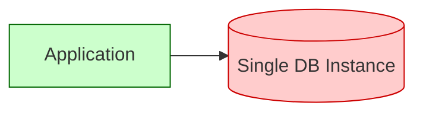

### Production: Multi-AZ + Read Replicas

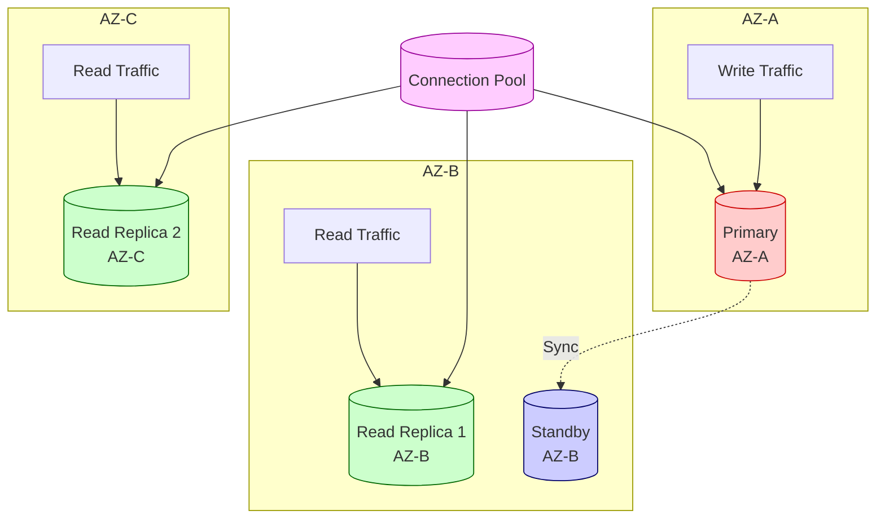

### Global: Multi-Region with Cross-Region Replicas

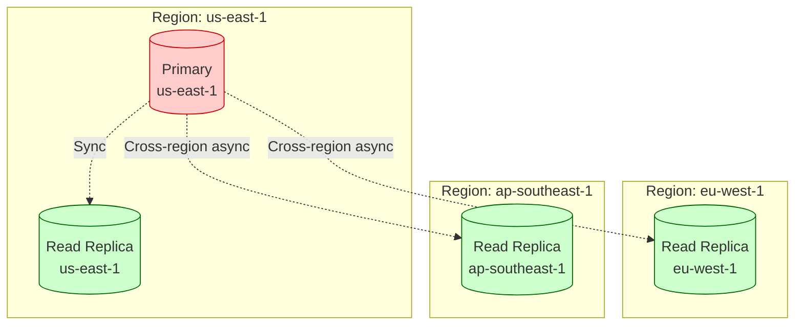

> [!warning] Cross-Region Replication Lag
> Cross-region replicas have higher latency (50-200ms) due to physical distance. Replication lag can be several seconds. Only use for read scaling in distant regions, not for failover.

## Key Details

> [!warning] Common Pitfalls
> - **No connection pooling with serverless** — Lambda functions will exhaust database connections
> - **Read replicas for HA** — read replicas are NOT a high availability solution; use Multi-AZ
> - **Ignoring replication lag** — applications assuming read-after-write consistency will break
> - **Untested backups** — the only backup that matters is the one you've successfully restored
> - **Single-AZ in production** — AZ outages happen; always use Multi-AZ for production databases
> - **Oversized instances** — start smaller and monitor; you can always scale up

> [!tip] Database Architecture Best Practices
> - Use managed databases unless you have a specific reason not to
> - Enable Multi-AZ for all production databases
> - Add read replicas when read traffic exceeds 60-70% of total traffic
> - Always use connection pooling, especially with serverless
> - Set backup retention to at least 7 days, test restores quarterly
> - Monitor replication lag and set alerts
> - Use parameter groups to tune database settings for your workload
> - Encrypt databases at rest and in transit

## Connection Pool Exhaustion — Troubleshooting

Connection pool exhaustion is one of the most common production database incidents. Symptoms: `too many connections` errors, slow queries that time out waiting for a connection, cascading service failures.

### Diagnosis

```sql
-- PostgreSQL: see current connections by state and client
SELECT client_addr, state, COUNT(*) as count, wait_event_type, wait_event
FROM pg_stat_activity
GROUP BY client_addr, state, wait_event_type, wait_event
ORDER BY count DESC;

-- See max allowed connections
SHOW max_connections;

-- Current active vs idle
SELECT state, count(*) FROM pg_stat_activity GROUP BY state;
```

### Common Causes and Fixes

| Symptom | Likely Cause | Fix |
|---|---|---|
| Many `idle` connections | App not returning connections to pool | Verify `pool.release()` or use `async using` |
| Many `idle in transaction` | Long transactions left open | Set `statement_timeout` / `idle_in_transaction_session_timeout` |
| Spike on deploy/startup | All instances connect simultaneously | Add connection delay jitter at app startup |
| Steady climb over time | Connection leak (acquired, never released) | Add connection pool logging; monitor `pool.waitingCount` |
| Lambda exhausting connections | No pooler between Lambda and DB | Add RDS Proxy or PgBouncer in front of RDS |

### PostgreSQL Limits to Set

```sql
-- Set in RDS parameter group or postgresql.conf
-- Limit connections per role (prevent one service from taking all slots)
ALTER ROLE app_user CONNECTION LIMIT 50;

-- Kill idle-in-transaction sessions after 30s
ALTER DATABASE mydb SET idle_in_transaction_session_timeout = '30s';

-- Kill queries running longer than 60s
ALTER DATABASE mydb SET statement_timeout = '60s';
```

### Topology: Read Replica + PgBouncer

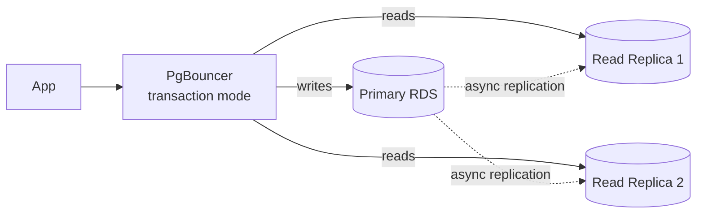

Route read-heavy queries to replicas using PgBouncer or application-level routing. Keep write connection count low to avoid primary bottleneck.

## When to Use

- **System design interviews** — designing database architecture for scalable applications
- **Production planning** — setting up databases for reliability and performance
- **Serverless applications** — connection pooling is essential for Lambda + RDS
- **Disaster recovery planning** — understanding RTO/RPO and backup strategies

## Related Topics

- [[SQL vs NoSQL Databases]] — database engine selection
- [[compute]] — database compute sizing and deployment
- [[aws]] — RDS, EC2, ECS, and common AWS deployment primitives
- [[vpc]] — databases run in isolated subnets
- [[infrastructure]] — secrets management for database credentials
- [[cost]] — database cost optimization strategies

## External Links

- [AWS RDS Documentation](https://docs.aws.amazon.com/AmazonRDS/latest/UserGuide/)
- [Google Cloud SQL Overview](https://cloud.google.com/sql/docs/introduction)
- [Amazon Aurora Documentation](https://docs.aws.amazon.com/AmazonRDS/latest/AuroraUserGuide/)
- [RDS Proxy Documentation](https://docs.aws.amazon.com/AmazonRDS/latest/UserGuide/rds-proxy.html)
- [PgBouncer Documentation](https://www.pgbouncer.org/)
- [PostgreSQL Replication](https://www.postgresql.org/docs/current/runtime-config-replication.html)
- [Database Reliability Engineering (book)](https://www.oreilly.com/library/view/database-reliability-engineering/9781491925942/)
- [Designing Data-Intensive Applications (book)](https://dataintensive.net/)
