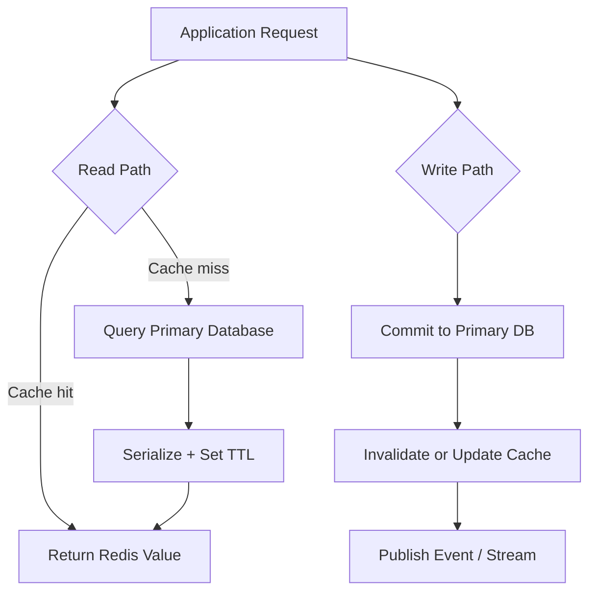

# Redis

## Overview

Redis (**RE**mote **DI**ctionary **S**erver) is an open-source, in-memory data structure store written in C. It functions as a database, cache, message broker, and streaming engine. Because it keeps the entire working dataset in RAM and uses a single-threaded event loop for command execution, Redis delivers sub-millisecond latency for millions of operations per second.

## How It Works

Redis follows a **client-server** model over TCP (default port 6379). At its core is a **single-threaded event loop** that uses I/O multiplexing (`epoll`/`kqueue`) to handle thousands of concurrent connections. Commands are read from clients, parsed, and executed sequentially against in-memory data structures. This design eliminates locks and context-switching overhead for commands, making simple operations extremely fast.

**Data structures** are the heart of Redis. Unlike simple key-value stores that only store strings, Redis values can be strings, hashes, lists, sets, sorted sets, streams, bitmaps, geospatial indexes, and more. Each type has specialized commands (e.g., `ZADD` for sorted sets, `HGETALL` for hashes) optimized for specific access patterns.

**Persistence** is optional but robust:
- **RDB** (Redis Database) takes point-in-time snapshots by forking a child process and using copy-on-write semantics to dump memory to disk without blocking the main loop.
- **AOF** (Append-Only File) logs every write command. On restart, Redis replays the log to reconstruct state. AOF can be rewritten in the background to compact the log.

**Replication** is asynchronous master-replica. A replica connects to a master and receives a stream of commands. If the network drops, Redis attempts a **partial resynchronization** using a replication ID and offset rather than a full dump. Replicas can also cascade to other replicas.

```mermaid
graph LR
    A[Client] -->|TCP/RESP| B[Event Loop]
    B --> C[Command Parser]
    C --> D[In-Memory Store]
    D --> E[Strings/Lists/Sets/Hashes]
    D -->|fork() + COW| F[RDB Snapshot]
    D -->|Append| G[AOF Log]
    D -->|Command Stream| H[Replica]
```

### Production Data Flow

Redis is usually not the system of record. Treat it as a low-latency coordination layer in front of durable storage unless you have explicitly designed persistence, backups, failover, and recovery objectives around Redis itself.



| Pattern | Use When | Main Risk |
|---------|----------|-----------|
| Cache-aside | App can tolerate misses and repopulate data | Stale data after writes |
| Write-through | Reads must see recently written cached values | Higher write latency |
| Pub/Sub | Fire-and-forget fanout to online subscribers | Messages vanish when subscribers are offline |
| Streams | Durable event log, consumer groups, replay | More operational state to trim and monitor |
| Distributed lock | Short critical sections with expiry | Clock, timeout, and ownership mistakes |

## Code

```python
import redis
from datetime import timedelta

r = redis.Redis(host='localhost', port=6379, db=0)

# String
r.set("user:1:name", "Alice")
print(r.get("user:1:name"))         # b'Alice'

# Hash
r.hset("user:1:profile", mapping={
    "age": "30",
    "city": "NYC"
})
print(r.hgetall("user:1:profile"))  # {b'age': b'30', b'city': b'NYC'}

# List
r.rpush("queue:jobs", "email", "backup", "report")
print(r.lrange("queue:jobs", 0, -1))  # [b'email', b'backup', b'report']

# Set
r.sadd("tags:post:1", "python", "redis", "cs")
print(r.smembers("tags:post:1"))    # {b'cs', b'python', b'redis'}

# Sorted Set (leaderboard)
r.zadd("leaderboard", {"alice": 100, "bob": 85})
print(r.zrevrange("leaderboard", 0, -1, withscores=True))
# [(b'alice', 100.0), (b'bob', 85.0)]

# Key Expiry
r.setex("temp:token", timedelta(seconds=10), value="abc123")
print(r.ttl("temp:token"))          # 10
```

<!-- Output: -->
<!-- b'Alice' -->
<!-- {b'age': b'30', b'city': b'NYC'} -->
<!-- [b'email', b'backup', b'report'] -->
<!-- {b'cs', b'python', b'redis'} -->
<!-- [(b'alice', 100.0), (b'bob', 85.0)] -->
<!-- 10 -->

```python
import redis

r = redis.Redis()

# Pipeline: batch commands to reduce round-trips
with r.pipeline() as pipe:
    pipe.set("counter", 0)
    pipe.incr("counter")
    pipe.incr("counter")
    results = pipe.execute()
print(results)  # [True, 1, 2]

# Transaction with optimistic locking (WATCH/MULTI/EXEC)
with r.pipeline() as pipe:
    while True:
        try:
            pipe.watch("inventory:hat")
            current = int(r.get("inventory:hat") or 0)
            if current > 0:
                pipe.multi()
                pipe.decr("inventory:hat")
                pipe.incr("sales:hat")
                pipe.execute()
                print("Purchase successful")
                break
            else:
                pipe.unwatch()
                print("Out of stock")
                break
        except redis.WatchError:
            # Retry if inventory changed during check
            continue
```

<!-- Output: -->
<!-- [True, 1, 2] -->
<!-- Purchase successful -->

## Key Details

- **Single-threaded execution**: Commands run sequentially in the main thread. This eliminates race conditions for single commands but means one slow command (e.g., `KEYS *` on a huge DB, or a heavy `SORT`) blocks the entire server. Use `SCAN` instead of `KEYS`.

- **Fork latency**: RDB snapshots and AOF rewrites use `fork()`. On large memory footprints (tens of GB), fork latency can cause momentary stalls. Modern kernels with huge pages can make this worse.

- **AOF fsync tradeoffs**:
  - `appendfsync always`: safest, but very slow.
  - `appendfsync everysec` (default): excellent balance; at most 1 second of data lost.
  - `appendfsync no`: fastest, but OS-controlled flush (risk of 30s of loss).

- **Memory is the hard limit**: Standard Redis requires the entire dataset to fit in RAM. Plan for `maxmemory` and configure an eviction policy (`allkeys-lru`, `volatile-lru`, `noeviction`, etc.).

- **Async replication**: By default, replicas acknowledge writes asynchronously. A master crash before replication can mean data loss. The `WAIT` command can enforce synchronous replication to N replicas, but it does not make Redis a CP system.

- **Lua scripts are atomic**: A running Lua script blocks all other clients. Keep scripts fast and avoid long-running logic.

- **Big keys**: Operations over large hashes, lists, or sorted sets can cause latency spikes. Redis can track "biggest keys" via `--bigkeys` in `redis-cli`.

> [!warning] Blocking Commands
> One slow command like `KEYS *` on a huge database can freeze the entire server. Always prefer `SCAN` for iteration.

> [!tip] Memory Planning
> Set `maxmemory` and choose an eviction policy early. `allkeys-lru` is a safe default for caches.

> [!info] Persistence Choice
> Use RDB for disaster recovery (compact, fast restarts) and AOF for durability (minimal data loss). Running both provides the best of both worlds.

## Eviction Policies

| Policy | What Gets Evicted | Use When |
|--------|------------------|----------|
| `noeviction` | Nothing — writes fail when full | You need a durable store, not a cache |
| `allkeys-lru` | Least recently used from all keys | Pure cache (evict cold entries automatically) |
| `volatile-lru` | LRU from keys with TTL only | Mix of persistent + cached keys |
| `allkeys-lfu` | Least frequently used from all keys | Skewed access patterns (some keys always hot) |
| `volatile-ttl` | Keys with shortest remaining TTL | Want near-expired keys cleaned up first |
| `allkeys-random` | Random from all keys | Uniform access pattern, fastest eviction |

**Default:** `noeviction` — **change this for caches** to `allkeys-lru` or `allkeys-lfu`.

## Redis Cluster

Redis Cluster shards data across multiple primary nodes using consistent hashing (16384 hash slots). Use when a single Redis instance is memory- or throughput-constrained.

### Docker Compose (3-primary / 3-replica cluster)

```yaml
# docker-compose.yml
services:
  redis-1: &redis-node
    image: redis:7-alpine
    command: redis-server --cluster-enabled yes --cluster-config-file nodes.conf
      --cluster-node-timeout 5000 --appendonly yes --port 6379
    ports: ["6379:6379"]
  redis-2:
    <<: *redis-node
    ports: ["6380:6379"]
  redis-3:
    <<: *redis-node
    ports: ["6381:6379"]
  redis-4:
    <<: *redis-node
    ports: ["6382:6379"]
  redis-5:
    <<: *redis-node
    ports: ["6383:6379"]
  redis-6:
    <<: *redis-node
    ports: ["6384:6379"]

  cluster-init:
    image: redis:7-alpine
    depends_on: [redis-1, redis-2, redis-3, redis-4, redis-5, redis-6]
    command: >
      redis-cli --cluster create
        redis-1:6379 redis-2:6379 redis-3:6379
        redis-4:6379 redis-5:6379 redis-6:6379
        --cluster-replicas 1 --cluster-yes
```

### TypeScript Client (ioredis Cluster)

```typescript
import { Cluster } from "ioredis";

const cluster = new Cluster([
  { host: "redis-1", port: 6379 },
  { host: "redis-2", port: 6379 },
  { host: "redis-3", port: 6379 },
]);

await cluster.set("user:123", JSON.stringify({ name: "Alice" }));
const user = await cluster.get("user:123");
```

**Cluster limitations:**
- Multi-key commands (`MGET`, `DEL`, pipelines) only work if all keys hash to the same slot
- Use hash tags `{user:123}:profile` and `{user:123}:orders` to force co-location
- No cross-slot transactions

## Operational Checklist

- Track `used_memory`, eviction count, connected clients, replication lag, rejected connections, slowlog entries, and command latency percentiles.
- Pick TTLs based on business freshness, not arbitrary round numbers; add jitter to avoid synchronized expirations.
- Separate cache, queue, stream, and lock workloads when one noisy pattern can affect the others.
- Test failover under load. Async replication means a promoted replica can miss acknowledged writes unless the app waits for replicas explicitly.
- Keep key names predictable (`domain:id:field`) and document high-cardinality or large-value keys.

## Redis Streams

Streams are a durable, ordered log structure — like Kafka but simpler. Unlike Pub/Sub (fire-and-forget), Streams persist messages and support consumer groups for reliable at-least-once processing.

```typescript
import { createClient } from "redis";
const redis = createClient();

// Producer: append events to stream
await redis.xAdd("orders", "*", {  // "*" = auto-generate ID
  orderId: "ord-123",
  userId: "user-456",
  total: "99.99",
  event: "order.created",
});

// Consumer (single): read from stream
const messages = await redis.xRead(
  [{ key: "orders", id: "0" }], // "0" = from start; "$" = new only
  { COUNT: 10, BLOCK: 5000 }    // block 5s for new messages
);

// Consumer group: multiple workers share the stream
await redis.xGroupCreate("orders", "processors", "0", { MKSTREAM: true });

// Worker reads unacknowledged messages for its consumer
const msgs = await redis.xReadGroup("processors", "worker-1", [{ key: "orders", id: ">" }], { COUNT: 10 });
for (const { id, message } of msgs?.[0]?.messages ?? []) {
  await processOrder(message);
  await redis.xAck("orders", "processors", id); // ack after successful processing
}

// Trim old messages (keep last 10k)
await redis.xTrimApprox("orders", "MAXLEN", 10_000);
```

**Streams vs Pub/Sub:**
| | Streams | Pub/Sub |
|---|---|---|
| Persistence | Yes (until trimmed) | No |
| Consumer groups | Yes (competing consumers) | No (broadcast only) |
| Replay | Yes (from any ID) | No |
| At-least-once | Yes (ACK required) | No |
| Use when | Task queues, event sourcing, audit log | Live notifications, cache invalidation |

## Advanced Data Structures

```typescript
// HyperLogLog — approximate unique count with O(1) memory (< 1KB regardless of cardinality)
await redis.pfAdd("unique:visitors:2024-01-15", "user-1", "user-2", "user-3");
await redis.pfAdd("unique:visitors:2024-01-15", "user-1"); // duplicates ignored
const count = await redis.pfCount("unique:visitors:2024-01-15"); // ~3 (±0.81% error)
// Merge multiple days: pfMerge("unique:visitors:week", "unique:visitors:2024-01-15", ...)

// Sorted Set — leaderboard with O(log N) operations
await redis.zAdd("leaderboard", [
  { score: 9850, value: "alice" },
  { score: 9200, value: "bob" },
  { score: 7100, value: "carol" },
]);
const top3 = await redis.zRangeWithScores("leaderboard", 0, 2, { REV: true });
// [{ value: 'alice', score: 9850 }, ...]

// Geo — distance queries on geographic coordinates
await redis.geoAdd("shops", [
  { longitude: -73.9857, latitude: 40.7484, member: "midtown-store" },
  { longitude: -74.0060, latitude: 40.7128, member: "downtown-store" },
]);
const nearby = await redis.geoSearch("shops",
  { longitude: -73.99, latitude: 40.73 },
  { radius: 5, unit: "km" },
  { SORT: "ASC", COUNT: 5 }
);
```

## When to Use

- **Caching**: Session stores, full-page caches, query result caches where low latency matters.
- **Real-time ranking/leaderboards**: Sorted sets make `ZADD`/`ZREVRANGE` trivial for live scoring.
- **Rate limiting**: `INCR` + `EXPIRE` enables simple sliding-window counters.
- **Task queues**: Lists with `LPUSH`/`BRPOP` provide lightweight, reliable queues.
- **Pub/Sub messaging**: Low-latency broadcast between services (note: Redis Streams are generally preferred for durable messaging).
- **Counting**: Atomic increments (`INCR`, `HINCRBY`) are faster and simpler than RDBMS row locks.

## Related Topics

- [[Memcached]] — simpler in-memory cache without persistence, data structures, or replication
- [[Hash Tables]] — core underlying mechanism for Redis key lookups
- [[Event Loop]] — Redis networking model using epoll/kqueue and single-threaded execution
- [[CAP Theorem]] — Redis is typically AP; trades strong consistency for availability and partition tolerance
- [[nosql]] — Redis as a non-relational data store
- [[Distributed Caching]] — broader architectural pattern Redis implements

## External Links

- [Redis - Wikipedia](https://en.wikipedia.org/wiki/Redis)
- [Redis Persistence | Redis Docs](https://redis.io/docs/latest/operate/oss_and_stack/management/persistence/)
- [Redis Replication | Redis Docs](https://redis.io/docs/latest/operate/oss_and_stack/management/replication/)
- [Redis Data Types | Redis Docs](https://redis.io/docs/latest/develop/data-types/)
- [How to Use Redis With Python – Real Python](https://realpython.com/python-redis/)
- [Redis Commands Reference | Redis Docs](https://redis.io/docs/latest/commands/)
