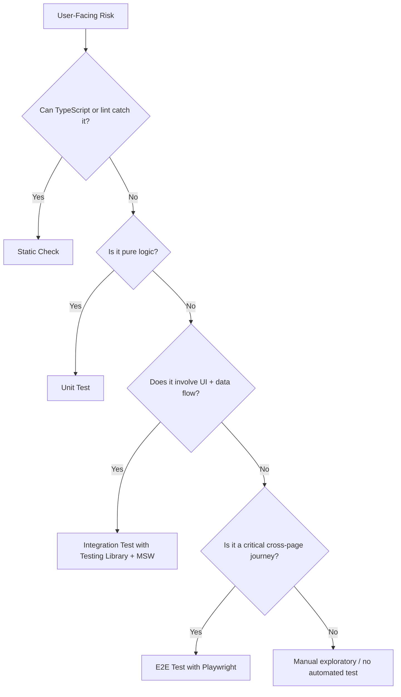
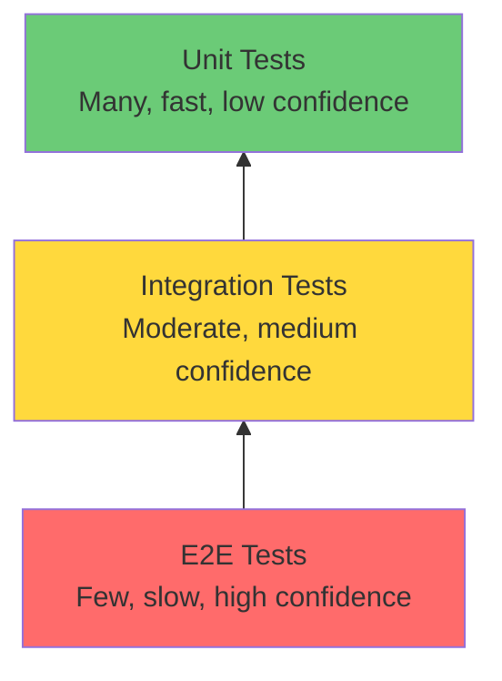
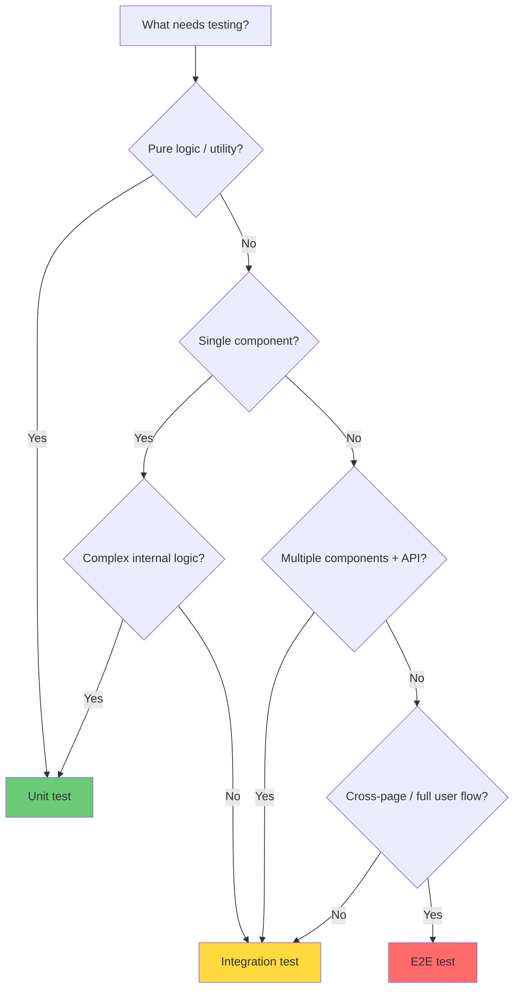
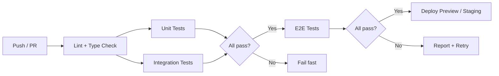

# Frontend Testing

## Overview

Frontend testing ensures UI components and user flows work correctly across three levels: unit (isolated components), integration (component interactions with mocked APIs), and end-to-end (full browser with real network). Each level trades cost for confidence — the testing pyramid guides how many of each type to write.

## Test Strategy Map



Use the cheapest test that gives useful confidence. A form validation helper belongs in a unit test; a component that loads and mutates API data belongs in an integration test; checkout, signup, login, and billing flows deserve a small number of E2E tests.

## The Testing Pyramid



| Level | Speed | Cost | Confidence | What it catches |
|-------|-------|------|------------|-----------------|
| **Unit** | < 1s per test | Low (CPU only) | Low — tests in isolation | Logic bugs, edge cases, pure function correctness |
| **Integration** | 1-5s per test | Medium (JSDOM + MSW) | Medium — tests component wiring | Component interaction, data flow, API integration |
| **E2E** | 10-60s per test | High (real browser + network) | High — tests real user experience | Cross-page flows, browser quirks, full-stack bugs |

> [!tip] The Testing Trophy (Kent C. Dodds)
> Modern frontend testing flips the pyramid: most tests should be integration tests (Testing Library + MSW), fewer unit tests for complex logic, and a small set of E2E tests for critical user paths. Static type checking (TypeScript) replaces many unit tests.

### What Good Frontend Tests Assert

| Assert | Why |
|--------|-----|
| Accessible roles, labels, and visible text | Matches how users and assistive tech find UI |
| State transitions after real interactions | Catches wiring bugs without inspecting internals |
| Network success, loading, empty, and error states | Covers the states users actually experience |
| URL/navigation outcomes | Verifies routing and cross-page behavior |
| Analytics or side effects at boundaries | Keeps business-critical integration points visible |

## Unit Testing

### How It Works

Unit tests verify individual components or functions in isolation. For frontend, this means testing a single component with mocked props and no external dependencies.

**Tool stack:**
- **Test runner:** Vitest (recommended for Vite projects) or Jest
- **Rendering:** `@testing-library/react` (or framework equivalent)
- **Matchers:** `@testing-library/jest-dom`
- **Environment:** JSDOM (simulated DOM in Node.js)

```typescript
// vitest.config.ts
import { defineConfig } from 'vitest/config';
import react from '@vitejs/plugin-react';

export default defineConfig({
  plugins: [react()],
  test: {
    environment: 'jsdom',
    setupFiles: ['./src/test/setup.ts'],
    globals: true,
  },
});
```

```typescript
// src/test/setup.ts
import '@testing-library/jest-dom';
```

### What to Test

```typescript
import { render, screen } from '@testing-library/react';
import { userEvent } from '@testing-library/user-event';
import { SubmitButton } from './SubmitButton';

test('disables button while loading', async () => {
  const user = userEvent.setup();
  render(<SubmitButton onSubmit={() => new Promise(() => {})} />);

  const button = screen.getByRole('button', { name: /submit/i });
  await user.click(button);

  expect(button).toBeDisabled();
  expect(button).toHaveTextContent(/loading/i);
});
```

**Test:**
- User-visible behavior (rendered output, interactions)
- Props-driven rendering (different props → different output)
- State transitions (loading → success → error)
- Accessibility (roles, labels, ARIA attributes)
- Complex business logic in custom hooks or utility functions

### What NOT to Test

> [!warning] Anti-pattern: Testing Implementation Details
> Testing Library's guiding principle: "The more your tests resemble the way your software is used, the more confidence they can give you."

**Avoid testing:**
- Internal component state (`useState` values)
- Internal methods or lifecycle hooks
- Child component internals (test those in their own files)
- CSS class names or DOM structure (use `getByRole` instead)
- Third-party library behavior (trust their tests)

```typescript
// BAD: Testing implementation details
expect(component.state('isOpen')).toBe(true);
expect(wrapper.find('.btn-primary')).toHaveLength(1);
expect(wrapper.instance().handleClick).toHaveBeenCalled();

// GOOD: Testing user-visible behavior
expect(screen.getByRole('dialog')).toBeVisible();
expect(screen.getByRole('button', { name: /submit/i })).toBeEnabled();
```

## Integration Testing

### How It Works

Integration tests verify that multiple components work together, including API communication. They render a feature subtree (not the full app) and mock network requests.

**Key tool: Mock Service Worker (MSW)** — intercepts HTTP requests at the network layer, works in both Node.js (tests) and browser (development).

### MSW Setup

```typescript
// src/mocks/handlers.ts
import { http, HttpResponse } from 'msw';

export const handlers = [
  http.get('/api/users', () => {
    return HttpResponse.json([
      { id: 1, name: 'Alice' },
      { id: 2, name: 'Bob' },
    ]);
  }),

  http.post('/api/users', async ({ request }) => {
    const body = await request.json();
    return HttpResponse.json({ id: 3, ...body }, { status: 201 });
  }),

  // Simulate error scenarios
  http.get('/api/users/:id', () => {
    return HttpResponse.json(
      { error: 'User not found' },
      { status: 404 }
    );
  }),
];
```

```typescript
// src/mocks/server.ts
import { setupServer } from 'msw/node';
import { handlers } from './handlers';

export const server = setupServer(...handlers);
```

```typescript
// src/test/setup.ts
import '@testing-library/jest-dom';
import { beforeAll, afterEach, afterAll } from 'vitest';
import { server } from '../mocks/server';

beforeAll(() => server.listen());
afterEach(() => server.resetHandlers()); // Reset handlers between tests
afterAll(() => server.close());
```

### Integration Test Example

```typescript
import { render, screen, waitFor } from '@testing-library/react';
import { userEvent } from '@testing-library/user-event';
import { http, HttpResponse } from 'msw';
import { server } from '../mocks/server';
import { UserList } from './UserList';

test('loads and displays users, then adds a new one', async () => {
  const user = userEvent.setup();
  render(<UserList />);

  // Initial load
  await waitFor(() => {
    expect(screen.getByText('Alice')).toBeInTheDocument();
    expect(screen.getByText('Bob')).toBeInTheDocument();
  });

  // Add new user
  await user.click(screen.getByRole('button', { name: /add user/i }));
  await user.type(screen.getByRole('textbox', { name: /name/i }), 'Charlie');
  await user.click(screen.getByRole('button', { name: /save/i }));

  // Verify new user appears
  await waitFor(() => {
    expect(screen.getByText('Charlie')).toBeInTheDocument();
  });
});

test('shows error when API fails', async () => {
  // Override handler for this test only
  server.use(
    http.get('/api/users', () => HttpResponse.error())
  );

  render(<UserList />);

  await waitFor(() => {
    expect(screen.getByText(/failed to load users/i)).toBeInTheDocument();
  });
});
```

### When to Use Integration Tests

- Testing a feature page with multiple components
- Verifying data flows from API → state → UI
- Testing form submission with validation + API call
- Testing navigation within a feature (tabs, modals, drawers)
- Testing error boundaries and loading states

## E2E Testing with Playwright

### How It Works

E2E tests run in a real browser, make real network requests (or mock them), and verify complete user flows across pages. Playwright provides auto-waiting, built-in locators, and cross-browser support.

```typescript
// tests/e2e/checkout.spec.ts
import { test, expect } from '@playwright/test';

test('complete purchase flow', async ({ page }) => {
  // Navigate and add items to cart
  await page.goto('/');
  await page.getByRole('link', { name: 'Products' }).click();
  await page.getByRole('button', { name: 'Add to cart' }).first().click();

  // Go to checkout
  await page.getByRole('link', { name: 'Cart' }).click();
  await expect(page.getByText('1 item')).toBeVisible();

  await page.getByRole('button', { name: 'Checkout' }).click();

  // Fill shipping form
  await page.getByLabel('Full name').fill('John Doe');
  await page.getByLabel('Email').fill('john@example.com');
  await page.getByLabel('Address').fill('123 Main St');

  // Complete payment
  await page.getByRole('button', { name: 'Place order' }).click();

  // Verify confirmation
  await expect(page.getByText('Order confirmed')).toBeVisible();
  await expect(page.getByText(/order #/i)).toBeVisible();
});
```

### Playwright Advantages

- **Auto-waiting:** Automatically waits for elements to be actionable before interacting
- **Web-first assertions:** `await expect(locator).toBeVisible()` retries until condition is met
- **Browser contexts:** Each test gets an isolated browser context (like incognito)
- **Network interception:** Built-in `page.route()` for mocking without MSW
- **Trace viewer:** Full trace with DOM snapshots, network requests, and console logs

## When to Use Each Type: Decision Guide



### Cost vs Confidence Tradeoff

| Metric | Unit | Integration | E2E |
|--------|------|-------------|-----|
| **Execution time** | < 1ms | 10-100ms | 1-10s |
| **CI compute cost** | ~$0.001/test | ~$0.01/test | ~$0.10/test |
| **Flakiness rate** | < 0.1% | 1-2% | 5-15% |
| **Maintenance cost** | Low | Medium | High |
| **Bug detection scope** | Narrow | Medium | Wide |
| **Developer feedback** | Instant | Fast | Slow |

### Recommended Ratios

| Team Size | Unit | Integration | E2E |
|-----------|------|-------------|-----|
| Small (1-5) | 10% | 70% | 20% |
| Medium (5-20) | 15% | 65% | 20% |
| Large (20+) | 20% | 60% | 20% |

> [!tip] Rule of Thumb
> Write integration tests for every user-facing feature. Write unit tests only for complex logic (algorithms, formatters, validators). Write E2E tests for critical user journeys (signup, checkout, core workflows).

## CI/CD Pipeline for Frontend Testing

### Recommended Pipeline Structure



### GitHub Actions Example

```yaml
# .github/workflows/ci.yml
name: CI

on:
  push:
    branches: [main]
  pull_request:
    branches: [main]

jobs:
  # Stage 1: Fast checks — fail fast
  lint-and-types:
    runs-on: ubuntu-latest
    steps:
      - uses: actions/checkout@v5
      - uses: actions/setup-node@v5
        with:
          node-version: lts/*
          cache: npm
      - run: npm ci
      - run: npm run lint
      - run: npx tsc --noEmit

  # Stage 2: Unit tests — parallel with integration
  unit-tests:
    runs-on: ubuntu-latest
    needs: lint-and-types
    steps:
      - uses: actions/checkout@v5
      - uses: actions/setup-node@v5
        with:
          node-version: lts/*
          cache: npm
      - run: npm ci
      - run: npx vitest run --coverage
      - uses: actions/upload-artifact@v4
        if: always()
        with:
          name: unit-test-results
          path: coverage/
          retention-days: 7

  # Stage 2: Integration tests — parallel with unit
  integration-tests:
    runs-on: ubuntu-latest
    needs: lint-and-types
    steps:
      - uses: actions/checkout@v5
      - uses: actions/setup-node@v5
        with:
          node-version: lts/*
          cache: npm
      - run: npm ci
      - run: npx vitest run --project=integration

  # Stage 3: E2E tests — only if unit + integration pass
  e2e-tests:
    runs-on: ubuntu-latest
    needs: [unit-tests, integration-tests]
    timeout-minutes: 30
    strategy:
      fail-fast: false
      matrix:
        shardIndex: [1, 2, 3]
        shardTotal: [3]
    steps:
      - uses: actions/checkout@v5
      - uses: actions/setup-node@v5
        with:
          node-version: lts/*
          cache: npm
      - run: npm ci
      - run: npx playwright install chromium --with-deps
      - run: npx playwright test --shard=${{ matrix.shardIndex }}/${{ matrix.shardTotal }}
        env:
          CI: true
      - name: Upload blob report
        if: ${{ !cancelled() }}
        uses: actions/upload-artifact@v4
        with:
          name: blob-report-${{ matrix.shardIndex }}
          path: blob-report
          retention-days: 1

  # Stage 4: Merge E2E reports
  merge-e2e-reports:
    if: ${{ !cancelled() }}
    needs: [e2e-tests]
    runs-on: ubuntu-latest
    steps:
      - uses: actions/checkout@v5
      - uses: actions/setup-node@v5
        with:
          node-version: lts/*
          cache: npm
      - run: npm ci
      - uses: actions/download-artifact@v5
        with:
          path: all-blob-reports
          pattern: blob-report-*
          merge-multiple: true
      - run: npx playwright merge-reports --reporter html ./all-blob-reports
      - uses: actions/upload-artifact@v4
        with:
          name: e2e-html-report
          path: playwright-report/
          retention-days: 14
```

### CI/CD Best Practices

**When to run which tests:**

| Trigger | Run |
|---------|-----|
| `pre-commit` hook | Lint, type check, affected unit tests |
| Every PR | Lint, type check, all unit + integration tests |
| PR to main | All of the above + E2E tests (sharded) |
| Merge to main | Full suite + E2E on all browsers |
| Nightly | Full suite + visual regression + accessibility |

**Flaky test handling:**
- Configure retries in Playwright config: `retries: process.env.CI ? 2 : 0`
- Use `test.describe.configure({ mode: 'parallel' })` for independent tests
- Quarantine flaky tests with `test.skip()` or `test.fail()` annotations
- Track flaky tests in a dashboard; fix root causes, don't just retry

**Parallelization:**
- Unit/integration: Vitest runs files in parallel by default
- E2E: Use `--shard=x/y` to distribute across CI machines
- Use `fullyParallel: true` in Playwright config for test-level sharding

**Artifacts to collect:**
- Coverage reports (unit/integration)
- Playwright HTML report (merged from shards)
- Trace files for failed tests (`trace: 'on-first-retry'`)
- Screenshots on failure (`screenshot: 'only-on-failure'`)

## Key Details

> [!warning] Common Mistake: Testing Implementation Details
> If your test breaks when you refactor component internals but the user experience is unchanged, you're testing implementation details. Use `getByRole`, `getByLabelText`, `getByText` — queries that mirror how users find elements.

> [!warning] Common Mistake: Overusing E2E Tests
> E2E tests are slow, flaky, and expensive. If you can test it with an integration test, don't use E2E. Reserve E2E for critical user journeys that span multiple pages.

> [!tip] MSW for Both Testing and Development
> Use the same MSW handlers for tests and local development. This ensures your mocks are consistent and you catch integration issues early.

> [!tip] Playwright Auto-Waiting Eliminates Most Flakiness
> Playwright automatically waits for elements to be visible, enabled, and stable before interacting. Avoid manual `waitForTimeout()` — use web-first assertions like `await expect(locator).toBeVisible()` instead.

## When to Use

- **Unit tests:** Pure functions, complex hooks, formatters, validators, utility functions
- **Integration tests:** Every feature page, form flows, API-driven components, error handling
- **E2E tests:** Signup/login, checkout, critical user journeys, cross-browser compatibility
- **CI/CD:** Run fast checks on every commit, full suite on PR, sharded E2E on merge to main

## Related Topics

- [[Playwright Patterns]] — Page Object Model, fixtures, authentication, CI config
- [[React Interview]] — React component testing with Testing Library
- [[JavaScript]] — language fundamentals for testing
- [[Web Development]] — frontend architecture and component patterns

## External Links

- [Testing Library — Guiding Principles](https://testing-library.com/docs/guiding-principles)
- [Testing Library — What to Avoid](https://testing-library.com/docs/)
- [Vitest — Component Testing](https://vitest.dev/guide/browser/)
- [Mock Service Worker — Quick Start](https://mswjs.io/docs/quick-start)
- [MSW Best Practices](https://mswjs.io/docs/best-practices/)
- [Playwright — Best Practices](https://playwright.dev/docs/best-practices)
- [Playwright — Setting up CI](https://playwright.dev/docs/ci-intro)
- [Playwright — Sharding](https://playwright.dev/docs/test-sharding)
- [Kent C. Dodds — Static vs Unit vs Integration vs E2E](https://kentcdodds.com/blog/static-vs-unit-vs-integration-vs-e2e-testing-for-frontend-apps)
- [GitHub Actions CI/CD Best Practices](https://github.com/github/awesome-copilot/blob/main/instructions/github-actions-ci-cd-best-practices.instructions.md)
