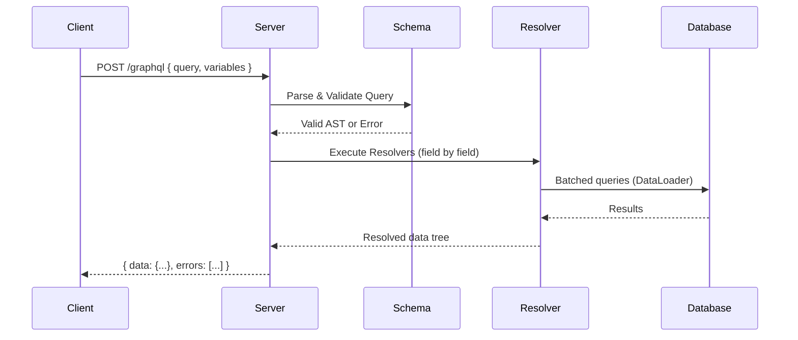
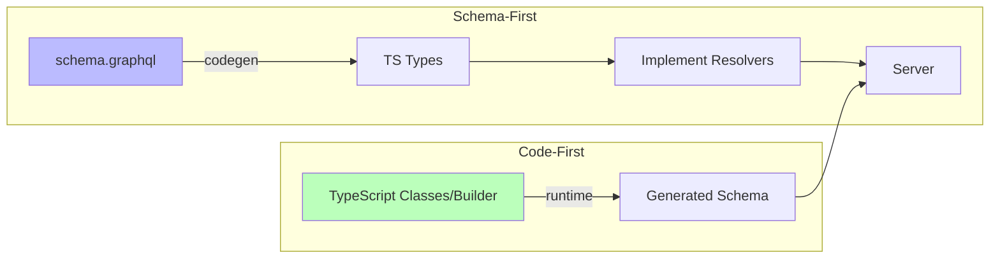
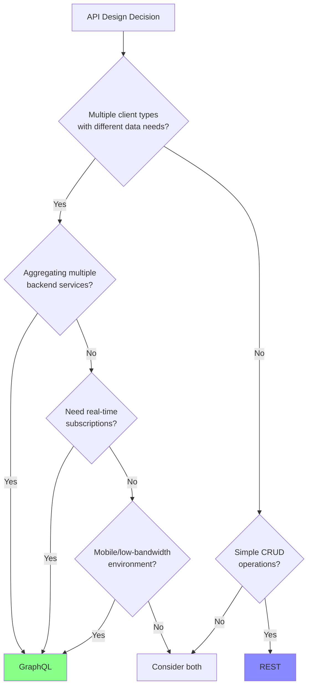

# GraphQL

## Overview

GraphQL is a **query language for APIs** and a runtime for executing those queries with your existing data. Developed by Facebook (Meta) in 2012 and open-sourced in 2015, it provides a more efficient, powerful, and flexible alternative to REST. Instead of multiple endpoints returning fixed data structures, GraphQL exposes a **single endpoint** (`/graphql`) with a **strongly-typed schema**. Clients specify exactly what fields they need, and the server returns precisely that — no more, no less.

## How It Works

GraphQL operates through three operation types:

| Operation | Purpose | HTTP Method Convention |
|-----------|---------|----------------------|
| **Query** | Read data (like GET) | GET or POST |
| **Mutation** | Create/update/delete data (like POST/PUT/DELETE) | POST |
| **Subscription** | Real-time data via WebSockets | WebSocket |

The request lifecycle flows through parsing, validation, resolver execution, and response assembly:



### Resolver Execution

Resolvers are functions that fetch data for each field. Every resolver receives four arguments:

```typescript
function resolver(parent, args, context, info) {
  // parent — result of the previous field's resolver
  // args   — arguments passed to this field in the query
  // context — shared across all resolvers (DB, auth, loaders)
  // info   — schema/execution info (advanced use cases)
}
```

Execution flow example:

```
Query: { human(id: "1") { name starships { name } } }

1. resolveHuman(obj, {id: "1"}, ctx, info) → returns Human object
2. resolveName(humanObj, {}, ctx, info) → returns humanObj.name (trivial, often omitted)
3. resolveStarships(humanObj, {}, ctx, info) → returns Promise<Starship[]>
4. For each starship, resolveName(starshipObj, {}, ctx, info) → returns starshipObj.name
```

### Schema-First vs Code-First



## Code

### Schema Definition (SDL)

```graphql
# schema.graphql
type User {
  id: ID!
  email: String!
  name: String
  posts: [Post!]!
}

type Post {
  id: ID!
  title: String!
  author: User!
}

type Query {
  user(id: ID!): User
  users: [User!]!
}

type Mutation {
  createPost(title: String!, authorId: ID!): Post!
}
```

### Queries and Mutations

```graphql
# Basic query with nested fields
query GetUser {
  user(id: "123") {
    id
    name
    email
    posts {
      title
      createdAt
    }
  }
}
```

```graphql
# With variables, fragments, and directives
query GetUser($id: ID!, $withPosts: Boolean!) {
  user(id: $id) {
    ...UserFields
    posts @include(if: $withPosts) {
      title
    }
  }
}

fragment UserFields on User {
  id
  name
  email
}
```

Variables passed as separate JSON:
```json
{ "id": "123", "withPosts": true }
```

```graphql
# Mutation
mutation CreatePost($input: CreatePostInput!) {
  createPost(input: $input) {
    id
    title
    author {
      name
    }
  }
}
```

Variables:
```json
{
  "input": {
    "title": "Hello GraphQL",
    "authorId": "123"
  }
}
```

```graphql
# Subscription (real-time via WebSocket)
subscription OnNewPost {
  postCreated {
    id
    title
    author { name }
  }
}
```

### TypeScript Resolver Example (Schema-First)

```typescript
// src/resolvers.ts
import { Resolvers } from "./generated/types";

export const resolvers: Resolvers = {
  Query: {
    user: async (_parent, { id }, ctx) => {
      return ctx.db.users.findById(id);
    },
    users: async (_parent, _args, ctx) => {
      return ctx.db.users.findAll();
    },
  },
  Mutation: {
    createUser: async (_parent, { input }, ctx) => {
      const user = await ctx.db.users.create(input);
      return user;
    },
  },
  User: {
    posts: async (parent, _args, ctx) => {
      return ctx.loaders.postsByUser.load(parent.id);
    },
  },
};
```

### Code-First Example (Pothos)

```typescript
import SchemaBuilder from "@pothos/core";

const builder = new SchemaBuilder<{
  Context: { db: Database; userId?: string };
}>({});

const User = builder.objectRef<UserModel>("User").implement({
  fields: (t) => ({
    id: t.exposeID("id"),
    name: t.exposeString("name"),
    email: t.exposeString("email"),
    posts: t.field({
      type: [Post],
      resolve: (user, _args, ctx) => ctx.loaders.postsByUser.load(user.id),
    }),
  }),
});

builder.queryType({
  fields: (t) => ({
    user: t.field({
      type: User,
      nullable: true,
      args: { id: t.arg.id({ required: true }) },
      resolve: (_, { id }, ctx) => ctx.db.users.findById(id),
    }),
  }),
});

builder.mutationType({
  fields: (t) => ({
    createPost: t.field({
      type: Post,
      args: {
        title: t.arg.string({ required: true }),
        authorId: t.arg.id({ required: true }),
      },
      resolve: async (_, { title, authorId }, ctx) => {
        return ctx.db.posts.create({ title, authorId });
      },
    }),
  }),
});

export const schema = builder.toSchema();
```

### TypeGraphQL Example (Decorator-Based)

```typescript
import { ObjectType, Field, ID, Resolver, Query, Mutation, Arg } from "type-graphql";

@ObjectType()
class Task {
  @Field(() => ID)
  id: number;

  @Field()
  title: string;

  @Field()
  completed: boolean;
}

@Resolver(Task)
class TaskResolver {
  private tasks: Task[] = [];

  @Query(() => [Task])
  async fetchTasks(): Promise<Task[]> {
    return this.tasks;
  }

  @Query(() => Task, { nullable: true })
  async getTask(@Arg("id") id: number): Promise<Task | undefined> {
    return this.tasks.find(t => t.id === id);
  }

  @Mutation(() => Task)
  async markAsCompleted(@Arg("taskId") taskId: number): Promise<Task> {
    const task = this.tasks.find(t => t.id === taskId);
    if (!task) throw new Error(`Task ${taskId} not found`);
    if (task.completed) throw new Error(`Task ${taskId} already completed`);
    task.completed = true;
    return task;
  }
}
```

### GraphQL Code Generator Setup

```bash
npm install -D @graphql-codegen/cli @graphql-codegen/client-preset
```

Client config (`codegen.ts`):

```typescript
import { CodegenConfig } from "@graphql-codegen/cli";

const config: CodegenConfig = {
  schema: "http://localhost:4000/graphql",
  documents: "src/**/*.graphql",
  generates: {
    "src/generated/graphql.ts": {
      plugins: [
        "typescript",
        "typescript-operations",
        "typed-document-node",
      ],
    },
  },
  config: {
    avoidOptionals: true,
    enumsAsTypes: true,
  },
};

export default config;
```

Client preset for React/Apollo:

```typescript
// codegen.ts
const config: CodegenConfig = {
  schema: "http://localhost:4000/graphql",
  documents: "src/**/*.{ts,tsx}",
  generates: {
    "src/gql/": {
      preset: "client",
      presetConfig: {
        gqlTagName: "gql",
      },
    },
  },
};
```

Fully typed query usage:

```typescript
import { useQuery } from "@apollo/client/react";
import { graphql } from "./gql/gql";

const GetHeroDocument = graphql(`
  query GetHero($episode: Episode) {
    hero(episode: $episode) {
      name
      appearsIn
    }
  }
`);

function HeroComponent() {
  const { data } = useQuery(GetHeroDocument, {
    variables: { episode: "JEDI" },
  });
  // data.hero.name — fully typed!
}
```

## Key Details

### Popular TypeScript GraphQL Libraries

| Library | Approach | Best For |
|---------|----------|----------|
| **Pothos** | Code-first | Modern TypeScript projects (recommended default) |
| **TypeGraphQL** | Code-first (decorators) | Developers who like class-based OOP |
| **Apollo Server + graphql-tools** | Schema-first | Teams with separate frontend/backend |
| **GraphQL Yoga** | Server (works with both) | Edge-compatible, lightweight server |
| **Nexus** | Code-first | Prisma ecosystem |

### DataLoader — Solving the N+1 Problem

The **N+1 problem** is the #1 performance issue in GraphQL. A query like:

```graphql
query {
  users {
    posts {
      title
    }
  }
}
```

Naively executes 1 query for users + N queries for each user's posts = N+1 database queries.

```mermaid
flowchart TD
    A[Query: users { posts { title } }] --> B[Fetch all users: 1 query]
    B --> C{Without DataLoader}
    C -->|N users| D[N separate queries for posts]
    D --> E[Total: N+1 queries]

    B --> F{With DataLoader}
    F -->|Collect all user IDs| G[Single batched query]
    G --> H[Total: 2 queries]

    style E fill:#f88
    style H fill:#8f8
```

DataLoader batches and caches requests within a single request cycle:

```typescript
import DataLoader from "dataloader";

// In context creation (per-request!)
const context = {
  loaders: {
    postsByUser: new DataLoader<string, Post[]>(async (userIds) => {
      const posts = await db.posts.findByUserIds(userIds);
      // Return results in same order as input IDs
      return userIds.map(id =>
        posts.filter(p => p.authorId === id)
      );
    }),
    userById: new DataLoader<string, User>(async (ids) => {
      const users = await db.users.findByIds(ids);
      return ids.map(id => users.find(u => u.id === id));
    }),
  },
};

// In resolver
const User = {
  posts: (parent, _args, ctx) => ctx.loaders.postsByUser.load(parent.id),
};
```

> [!warning] Per-Request Loaders
> Always create a new DataLoader instance per request. Sharing loaders across requests leaks cached data between users.

### Pagination

#### Cursor-Based (Recommended)

The Relay Connection pattern is the GraphQL standard:

```graphql
query GetUsers($first: Int, $after: String) {
  users(first: $first, after: $after) {
    edges {
      node {
        id
        name
        email
      }
      cursor
    }
    pageInfo {
      hasNextPage
      hasPreviousPage
      startCursor
      endCursor
    }
    totalCount
  }
}
```

Implementation:

```typescript
@Query(() => UserConnection)
async users(
  @Arg("first", () => Int) first: number,
  @Arg("after", () => String, { nullable: true }) after?: string,
): Promise<UserConnection> {
  const cursor = after ? decodeCursor(after) : null;
  const users = await db.users.findMany({
    take: first + 1, // fetch one extra to check hasNextPage
    skip: cursor ? 1 : 0,
    cursor: cursor ? { id: cursor } : undefined,
    orderBy: { id: "asc" },
  });

  const hasNextPage = users.length > first;
  if (hasNextPage) users.pop(); // remove the extra

  const edges = users.map(u => ({
    node: u,
    cursor: encodeCursor(u.id),
  }));

  return {
    edges,
    pageInfo: {
      hasNextPage,
      hasPreviousPage: !!cursor,
      startCursor: edges[0]?.cursor ?? null,
      endCursor: edges[edges.length - 1]?.cursor ?? null,
    },
    totalCount: await db.users.count(),
  };
}
```

> [!tip] Cursor-Based Pagination
> Use cursor-based pagination for large or dynamic datasets. Offset-based pagination breaks when data changes between requests.

#### Offset-Based (Simple but Limited)

```graphql
query GetUsers($skip: Int, $take: Int) {
  users(skip: $skip, take: $take) {
    id
    name
  }
}
```

Good for small, static datasets. Bad for large or frequently changing data (items shift between pages).

### Error Handling

GraphQL always returns HTTP 200 for successful execution, even with errors. Errors appear in the `errors` array:

```json
{
  "data": { "user": null },
  "errors": [
    {
      "message": "User not found",
      "path": ["user"],
      "extensions": { "code": "NOT_FOUND" }
    }
  ]
}
```

Best practices:

1. **Use non-null (`!`) thoughtfully** — a null in a non-null field bubbles nulls up to the nearest nullable parent, potentially wiping out entire sections of data
2. **Use error codes in extensions** — `extensions.code: "NOT_FOUND"`, `"UNAUTHENTICATED"`, `"FORBIDDEN"`, `"BAD_USER_INPUT"`
3. **Payload pattern for mutations** — return a union type with success/error variants:

```graphql
type CreatePostPayload {
  post: Post
  errors: [Error!]
}

union CreatePostResult = CreatePostPayload | UnauthorizedError

type Error {
  field: String
  message: String
  code: String
}
```

4. **Separate network errors from GraphQL errors** — network errors (HTTP 5xx, timeouts) are retryable; GraphQL errors are only retryable if `extensions.code` indicates transient failure

> [!warning] HTTP Status Codes
> Never return HTTP 400 for GraphQL execution errors. GraphQL errors should return HTTP 200 with errors in the body. Only use 400 for syntax/validation errors.

### Authentication

GraphQL doesn't prescribe an auth model. Common pattern:

```typescript
const yoga = createYoga({
  schema,
  context: ({ request }) => {
    const token = request.headers.get("authorization")?.replace("Bearer ", "");
    const userId = token ? verifyToken(token).sub : undefined;
    return { userId, db, loaders: createLoaders(db) };
  },
});
```

In resolvers:

```typescript
resolve: async (_, args, ctx) => {
  if (!ctx.userId) throw new GraphQLError("Unauthenticated", {
    extensions: { code: "UNAUTHENTICATED" },
  });
  // ...
}
```

For declarative permissions, use **GraphQL Shield**:

```typescript
import { rule, shield, and, or } from "graphql-shield";

const isAuthenticated = rule()((_parent, _args, ctx) => {
  return ctx.userId !== undefined;
});

const isAdmin = rule()((_parent, _args, ctx) => {
  return ctx.user?.role === "admin";
});

const permissions = shield({
  Query: {
    users: and(isAuthenticated, isAdmin),
    user: isAuthenticated,
  },
  Mutation: {
    deleteUser: and(isAuthenticated, isAdmin),
  },
});
```

### Query Complexity & Rate Limiting

Without limits, a single GraphQL query can fetch arbitrary amounts of data:

```typescript
import depthLimit from "graphql-depth-limit";
import { createYoga } from "graphql-yoga";

const yoga = createYoga({
  schema,
  validationRules: [depthLimit(10)],
});
```

Also consider `graphql-query-complexity` for scoring queries by field cost.

### Caching

GraphQL's single endpoint complicates HTTP caching. Options:

- **Client-side** — Apollo Client, urql cache normalized data by ID
- **Response caching** — Apollo Server/GraphQL Yoga response cache plugins
- **Persisted queries** — register queries server-side, reference by hash, enables CDN caching

### Comparison: GraphQL vs REST

| Aspect | REST | GraphQL |
|--------|------|---------|
| Endpoints | Multiple (`/users`, `/posts`, etc.) | Single (`/graphql`) |
| Data fetching | Fixed per endpoint | Client-specified fields |
| Over-fetching | Common | Eliminated |
| Under-fetching | Common (multiple round-trips) | Eliminated (nested queries) |
| Versioning | `/v1/`, `/v2/` needed | Add fields, deprecate old ones |
| Caching | HTTP-level (CDN, browser) | Client-side or persisted queries |
| Error handling | HTTP status codes | `errors` array + HTTP 200 |
| Learning curve | Low | Moderate to high |
| N+1 problem | Not applicable | Must solve with DataLoader |
| Real-time | Polling or SSE | Native subscriptions |
| Introspection | No (needs OpenAPI/Swagger) | Built-in (`__schema`, `__type`) |
| Type safety | OpenAPI + codegen (external) | Built-in schema + codegen |

### Common Pitfalls

1. **N+1 queries** — Forgetting DataLoader on relational resolvers. This is the #1 cause of slow GraphQL APIs.
2. **Overusing non-null (`!`)** — A resolver error on a non-null field bubbles nulls up, potentially nullifying entire response sections.
3. **Deep nested queries** — Without depth limits, clients can craft queries that traverse 20+ levels deep.
4. **Sharing DataLoader across requests** — Causes data leakage between users. Always create per-request loaders.
5. **No query complexity limits** — A single query can request millions of records through nested lists.
6. **Returning HTTP 400 for GraphQL errors** — GraphQL execution errors should return HTTP 200 with errors in the body. Only use 400 for syntax/validation errors.
7. **Schema changes without deprecation** — GraphQL allows adding fields freely, but removing fields breaks clients. Always deprecate first.

### Best Practices

1. **Name every operation** — Helps with debugging, logging, and tracing
2. **Use variables, not hardcoded arguments** — Enables query reuse and caching
3. **Design schemas around use cases, not database tables** — Think in graphs, not resources
4. **Use `@deprecated` directive** before removing fields
5. **Implement cursor-based pagination** for large/dynamic datasets
6. **Use fragments** to share field selections across queries
7. **Keep resolvers thin** — Delegate business logic to service layers
8. **Use TypeScript on both client and server** — Codegen ensures type safety end-to-end
9. **Monitor query performance** — Track slow resolvers and complex queries
10. **Consider persisted queries** in production for caching and security

> [!tip] The "GraphQL Tax"
> GraphQL adds operational complexity: schema management, N+1 prevention, query complexity limits, caching redesign, and two build pipelines. Only pay this tax when you get real value in return.

## When to Use

- **Multiple client types** (web, mobile, IoT, partners) with different data needs
- **Complex, nested data relationships** — fetch related data in one request
- **Rapid frontend iteration** — add fields without versioning the API
- **Aggregating multiple backend services** — GraphQL acts as a unified gateway
- **Mobile/low-bandwidth environments** — minimize payload size
- **Real-time features** — subscriptions via WebSockets
- **Third-party developer APIs** — let consumers choose exactly what they need (GitHub, Shopify, Spotify)
- **Choose REST instead** for simple CRUD APIs, when HTTP caching is critical, or when the team lacks GraphQL experience

### Decision Flow



### Real-World Scenarios

**E-Commerce Dashboard:** Needs user info, recent orders, order items, product details, and inventory status. REST requires 5+ API calls; GraphQL fetches everything in 1 query.

**Mobile App with Limited Bandwidth:** Mobile clients need different fields than web clients. GraphQL lets each client request only what it renders, reducing payload by 60-80%.

**Microservices Aggregation:** Backend has separate services for Users, Orders, Products, and Reviews. GraphQL acts as a **BFF (Backend for Frontend)**, composing a unified schema that clients query as one graph.

## Related Topics

- [[External Authentication Providers]] — Firebase, Google, GitHub OAuth integration with GraphQL
- [[REST APIs]] — Alternative API style; compare trade-offs
- [[API Design]] — Schema design principles apply to both
- [[Type Systems]] — GraphQL's type system is central to its value
- [[WebSockets]] — Used for GraphQL subscriptions
- [[Caching Strategies]] — GraphQL requires different caching than REST
- [[Authentication Patterns]] — JWT + context pattern for GraphQL auth
- [[Microservices]] — GraphQL as API gateway/BFF pattern
- [[N+1 Problem]] — Solved by DataLoader in GraphQL
- [[Code Generation]] — graphql-codegen for type-safe clients
- [[React Interview]] — React + GraphQL data fetching patterns (Apollo, urql)

## External Links

- [GraphQL Official Specification](https://spec.graphql.org/)
- [GraphQL Learn](https://graphql.org/learn/)
- [Apollo Server Documentation](https://www.apollographql.com/docs/apollo-server/)
- [GraphQL Yoga Documentation](https://the-guild.dev/graphql/yoga-server)
- [Pothos — Code-First TypeScript GraphQL](https://pothos-graphql.dev/)
- [TypeGraphQL](https://typegraphql.com/)
- [GraphQL Code Generator](https://the-guild.dev/graphql/codegen)
- [DataLoader — Facebook's Batching Library](https://github.com/graphql/dataloader)
- [GraphQL Shield — Permission Layer](https://graphql-shield.vercel.app/)


- [[Microservices Architecture]] — API gateway aggregation and BFF pattern using GraphQL federation