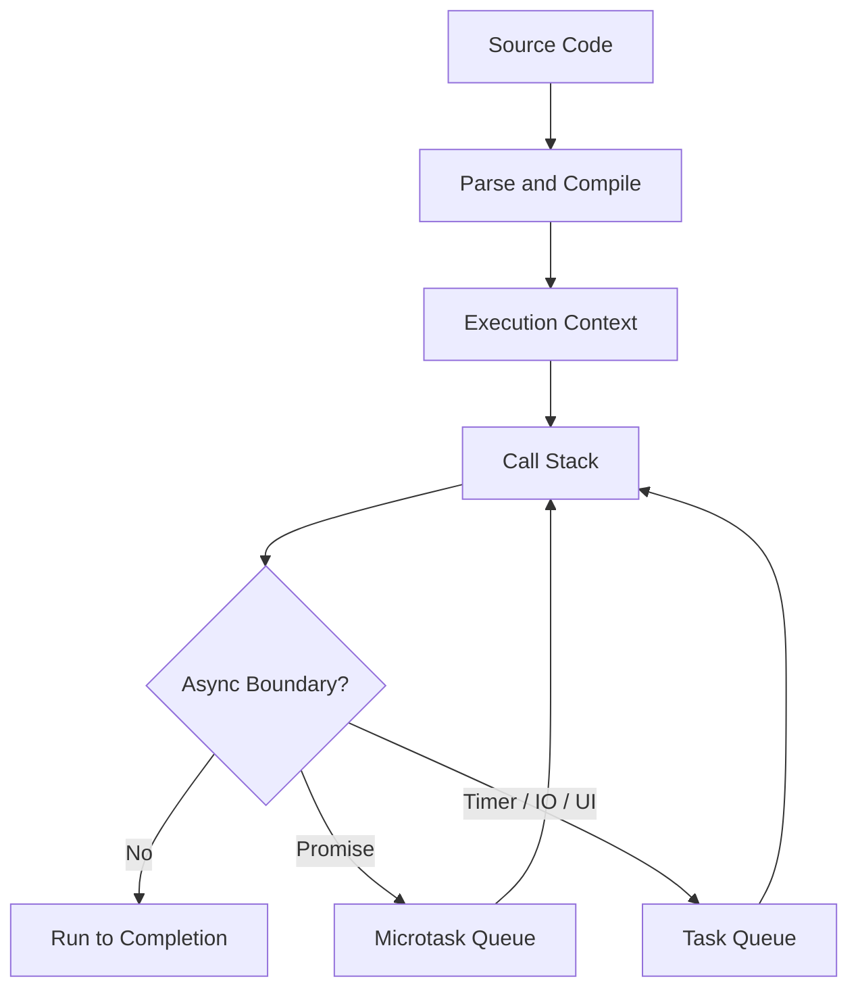
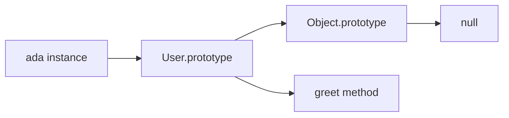

# JavaScript (Interview Prep)

## Overview

JavaScript is a high-level, dynamically typed, prototype-based language used across browsers, servers, CLIs, and edge runtimes. Interview focus: execution model, closures, `this`, prototypes, async behavior, equality, modules, and practical debugging.

## Mental Model

JavaScript runs one call stack per agent and uses queues to resume async work later. The engine executes synchronous code to completion, drains microtasks such as promise callbacks, then lets the host process the next task such as a timer, network callback, or UI event.



| Interview Question | Strong Practical Answer |
|--------------------|--------------------------|
| Is JavaScript single-threaded? | Your JS call stack is single-threaded per agent, but the host can perform IO, timers, workers, and rendering around it. |
| What runs first: `setTimeout` or `Promise.then`? | Promise callbacks are microtasks, so they run before timer tasks after the current stack clears. |
| Why do closures matter? | They preserve access to outer variables after the outer function returns. |
| What is `this`? | A runtime binding determined mostly by call site, except arrow functions capture lexical `this`. |
| What is prototypal inheritance? | Objects delegate property lookup to a prototype chain instead of copying class members into each object. |

## How It Works

JavaScript evaluates code inside execution contexts. Each context has a lexical environment for variables, a `this` binding, and a link to outer environments. Function calls push new contexts onto the call stack; returning pops them.

### Execution Context and Scope

`let` and `const` are block-scoped. `var` is function-scoped and hoisted, which makes it a common source of interview traps.

```javascript
function scopeDemo() {
  if (true) {
    var functionScoped = "var";
    let blockScoped = "let";
  }

  console.log(functionScoped);
  console.log(typeof blockScoped);
}

scopeDemo();
```

<!-- Output: -->
<!-- var -->
<!-- undefined -->

> [!warning] Gotcha
> `typeof missingIdentifier` is `"undefined"`, but accessing a `let` or `const` binding before initialization throws because it is in the temporal dead zone.

### Closures

A closure is a function plus references to variables from its outer lexical environment.

```javascript
function createCounter() {
  let count = 0;

  return function increment() {
    count += 1;
    return count;
  };
}

const next = createCounter();
console.log(next());
console.log(next());
```

<!-- Output: -->
<!-- 1 -->
<!-- 2 -->

Closures are used for callbacks, memoization, module privacy, function factories, and React hook behavior.

### `this` Binding

Regular functions receive `this` from how they are called. Arrow functions do not bind their own `this`; they close over the surrounding one.

```javascript
const user = {
  name: "Ada",
  regular() {
    return this.name;
  },
  arrow: () => this?.name,
};

const detached = user.regular;

console.log(user.regular());
console.log(detached.call({ name: "Grace" }));
console.log(user.arrow());
```

<!-- Output: -->
<!-- Ada -->
<!-- Grace -->
<!-- undefined -->

| Call Form | `this` Value |
|-----------|--------------|
| `obj.method()` | `obj` |
| `fn()` in strict mode | `undefined` |
| `fn.call(value)` | `value` |
| `new Fn()` | newly created object |
| Arrow function | lexical `this` from surrounding scope |

### Prototypes and Classes

Classes are syntax over prototype-based delegation. Methods live on `Constructor.prototype`; instances link to that prototype.

```javascript
class User {
  constructor(name) {
    this.name = name;
  }

  greet() {
    return `Hi ${this.name}`;
  }
}

const ada = new User("Ada");

console.log(ada.greet());
console.log(Object.getPrototypeOf(ada) === User.prototype);
```

<!-- Output: -->
<!-- Hi Ada -->
<!-- true -->



### Async JavaScript

Promises model eventual completion. `async` functions return promises, and `await` pauses that async function while the current call stack continues.

```javascript
console.log("sync start");

setTimeout(() => console.log("timer"), 0);

Promise.resolve()
  .then(() => console.log("promise 1"))
  .then(() => console.log("promise 2"));

console.log("sync end");
```

<!-- Output: -->
<!-- sync start -->
<!-- sync end -->
<!-- promise 1 -->
<!-- promise 2 -->
<!-- timer -->

> [!tip] Pro Tip
> In UI code, long synchronous work blocks rendering and input. Break CPU-heavy work into chunks, move it to a Worker, or push it behind server-side processing.

## Core Concepts

### Values and Types

JavaScript has primitives (`string`, `number`, `bigint`, `boolean`, `undefined`, `symbol`, `null`) and objects. `typeof null` returns `"object"` for historical reasons.

| Value | `typeof` Result |
|-------|-----------------|
| `"x"` | `"string"` |
| `42` | `"number"` |
| `42n` | `"bigint"` |
| `true` | `"boolean"` |
| `undefined` | `"undefined"` |
| `Symbol("id")` | `"symbol"` |
| `null` | `"object"` |
| `[]` | `"object"` |
| `function () {}` | `"function"` |

### Equality and Coercion

Prefer `===` and `!==` unless you intentionally want JavaScript's abstract equality coercion.

| Expression | Result | Why |
|------------|--------|-----|
| `0 == false` | `true` | boolean coerces to number |
| `0 === false` | `false` | different types |
| `null == undefined` | `true` | special abstract equality rule |
| `Number.isNaN(NaN)` | `true` | reliable NaN check |
| `NaN === NaN` | `false` | NaN is not equal to itself |

### Arrays and Objects

Arrays are objects optimized for indexed collections. Object keys are strings or symbols; `Map` can use arbitrary key values and is usually better for dictionary-style dynamic keys.

```javascript
const map = new Map();
const key = { id: 1 };

map.set(key, "cached");

console.log(map.get(key));
console.log({ [key]: "cached" });
```

<!-- Output: -->
<!-- cached -->
<!-- { '[object Object]': 'cached' } -->

### Modules

ES modules are statically analyzable and use live bindings.

```javascript
// counter.js
export let count = 0;
export function increment() {
  count += 1;
}
```

```javascript
// app.js
import { count, increment } from "./counter.js";

console.log(count);
increment();
console.log(count);
```

<!-- Output: -->
<!-- 0 -->
<!-- 1 -->

## Code Examples

### Debounce

```javascript
function debounce(fn, delayMs) {
  let timerId;

  return (...args) => {
    clearTimeout(timerId);
    timerId = setTimeout(() => fn(...args), delayMs);
  };
}

const search = debounce((query) => console.log(`Searching: ${query}`), 100);

search("r");
search("re");
search("red");
```

<!-- Output: -->
<!-- After roughly 100ms: Searching: red -->

### Promise Error Handling

```javascript
async function loadUser(fetchUser) {
  try {
    const user = await fetchUser();
    return user.name;
  } catch (error) {
    return `fallback: ${error.message}`;
  }
}

loadUser(() => Promise.reject(new Error("offline")))
  .then(console.log);
```

<!-- Output: -->
<!-- fallback: offline -->

### Object Copying

```javascript
const original = {
  user: { name: "Ada" },
  roles: ["admin"],
};

const shallow = { ...original };
shallow.user.name = "Grace";

console.log(original.user.name);
console.log(shallow.roles === original.roles);
```

<!-- Output: -->
<!-- Grace -->
<!-- true -->

> [!warning] Gotcha
> Spread syntax makes a shallow copy. Nested objects and arrays still share references unless you clone those nested values too.

## Key Details

- JavaScript variables hold values or references to objects; object mutation through one reference is visible through other references to the same object.
- Promise callbacks run in the microtask queue, which is drained before the browser or runtime moves to the next task.
- `Object.freeze()` is shallow; nested objects remain mutable unless they are also frozen.
- `for...of` iterates values from an iterable; `for...in` iterates enumerable property names and is rarely the right loop for arrays.
- `try/catch` catches synchronous throws and awaited promise rejections inside the `try`; it does not catch errors thrown later in detached callbacks.

> [!info] Interview Framing
> Good JavaScript answers usually explain both the language rule and the production consequence: stale closures cause wrong UI state, shallow copies cause accidental mutation, and long synchronous loops cause jank.

## Key Interview Questions

### Q1: Explain `var`, `let`, and `const`.

**Answer:** `var` is function-scoped and hoisted with `undefined`. `let` and `const` are block-scoped, hoisted but unavailable before initialization due to the temporal dead zone. `const` prevents reassignment of the binding, not mutation of the referenced object.

### Q2: What is a closure?

**Answer:** A closure is a function that retains access to variables from its outer lexical scope even after that outer function has returned. Use cases include callbacks, private state, memoization, and function factories.

### Q3: What is the event loop?

**Answer:** The event loop coordinates execution between the call stack and host queues. Synchronous code runs first, promise microtasks run after the stack clears, and tasks such as timers and UI events run after microtasks.

### Q4: What is the difference between microtasks and macrotasks?

**Answer:** Microtasks include promise reactions and `queueMicrotask`; they run before the next task. Tasks include timers, IO callbacks, and UI events. A long or recursively scheduled microtask chain can starve rendering and timers.

### Q5: How does `this` work?

**Answer:** `this` is determined by call site for regular functions: method call, plain call, explicit `call/apply/bind`, or constructor call. Arrow functions capture `this` lexically and cannot be rebound.

### Q6: What is prototypal inheritance?

**Answer:** Objects have an internal prototype link. When a property is not found on the object, JavaScript looks up the prototype chain until it finds the property or reaches `null`.

### Q7: What is the difference between `==` and `===`?

**Answer:** `===` compares without type coercion. `==` performs abstract equality conversion, which creates surprising cases like `0 == false`. Use `===` by default.

### Q8: What are promises?

**Answer:** A promise represents the eventual result of an async operation. It starts pending and settles as fulfilled or rejected. `.then`, `.catch`, and `await` schedule continuation work once the promise settles.

### Q9: What is the difference between `Promise.all` and `Promise.allSettled`?

**Answer:** `Promise.all` rejects as soon as one input rejects. `Promise.allSettled` waits for every input and returns each result's status, which is useful for best-effort batch work.

### Q10: What is hoisting?

**Answer:** Hoisting is the language behavior where declarations are processed before code executes. Function declarations are callable before their declaration line; `var` exists as `undefined`; `let` and `const` exist but are inaccessible until initialized.

### Q11: What is the difference between shallow and deep copy?

**Answer:** A shallow copy copies top-level properties but keeps nested object references. A deep copy recursively copies nested values, but it can lose prototypes, functions, symbols, and special objects depending on the method.

### Q12: What is optional chaining?

**Answer:** `obj?.prop` safely returns `undefined` when the left side is `null` or `undefined`. It does not handle other falsy values like `0`, `false`, or `""`.

### Q13: What is nullish coalescing?

**Answer:** `value ?? fallback` uses the fallback only when `value` is `null` or `undefined`. It preserves valid falsy values such as `0` and `""`.

### Q14: What is a generator?

**Answer:** A generator function can pause and resume execution with `yield`. It returns an iterator and is useful for lazy sequences and custom iteration protocols.

### Q15: How do ES modules differ from CommonJS?

**Answer:** ES modules use static `import`/`export`, live bindings, and async loading semantics. CommonJS uses runtime `require`, exports object mutation, and is historically Node-centered.

### Q16: What is `Object.create(null)` used for?

**Answer:** It creates an object with no prototype, avoiding inherited keys like `toString`. For general dynamic key/value dictionaries, `Map` is often clearer.

### Q17: What is the difference between `Map` and object?

**Answer:** `Map` preserves insertion order, supports any key type, has a reliable `size`, and avoids prototype-key issues. Objects are better for fixed records with known property names.

### Q18: What is debouncing vs throttling?

**Answer:** Debouncing delays work until activity stops. Throttling limits work to at most once per interval. Use debounce for search input; throttle for scroll or resize updates.

### Q19: What does "pass by reference" mean in JavaScript?

**Answer:** JavaScript passes arguments by value. For objects, the value is a reference to the object, so functions can mutate the object but cannot reassign the caller's variable binding.

### Q20: How do you handle cancellation?

**Answer:** Promises do not provide universal cancellation. Use `AbortController` for APIs that support it, ignore stale results with request IDs, or use a library that models cancellation at the operation layer.

## When to Use

- Preparing for frontend, full-stack, Node.js, React, or Next.js interviews.
- Reviewing language behavior that affects bugs in production applications.
- Debugging async ordering, closure state, `this`, or mutation issues.
- Building a foundation before [[ts-interview|TS Interview]], [[React Interview]], and [[Next.js Interview Questions]].

## Related Topics

- [[ts-interview|TS Interview]] - TypeScript adds static analysis on top of JavaScript.
- [[React Interview]] - React relies heavily on closures, modules, async rendering, and immutable updates.
- [[Next.js Interview Questions]] - Next.js uses JavaScript runtime behavior across server, client, and edge environments.
- [[Frontend Testing]] - Tests often expose async, module, and DOM timing issues.
- [[WebSockets]] - Real-time browser APIs use JavaScript event and callback patterns.
- [[Server-Sent Events]] - Browser streaming API built on JavaScript event handlers.

## External Links

- [MDN JavaScript Guide](https://developer.mozilla.org/en-US/docs/Web/JavaScript/Guide)
- [MDN Promise Reference](https://developer.mozilla.org/en-US/docs/Web/JavaScript/Reference/Global_Objects/Promise)
- [MDN Event Loop](https://developer.mozilla.org/en-US/docs/Web/JavaScript/Event_loop)
- [ECMAScript Language Specification](https://tc39.es/ecma262/)
