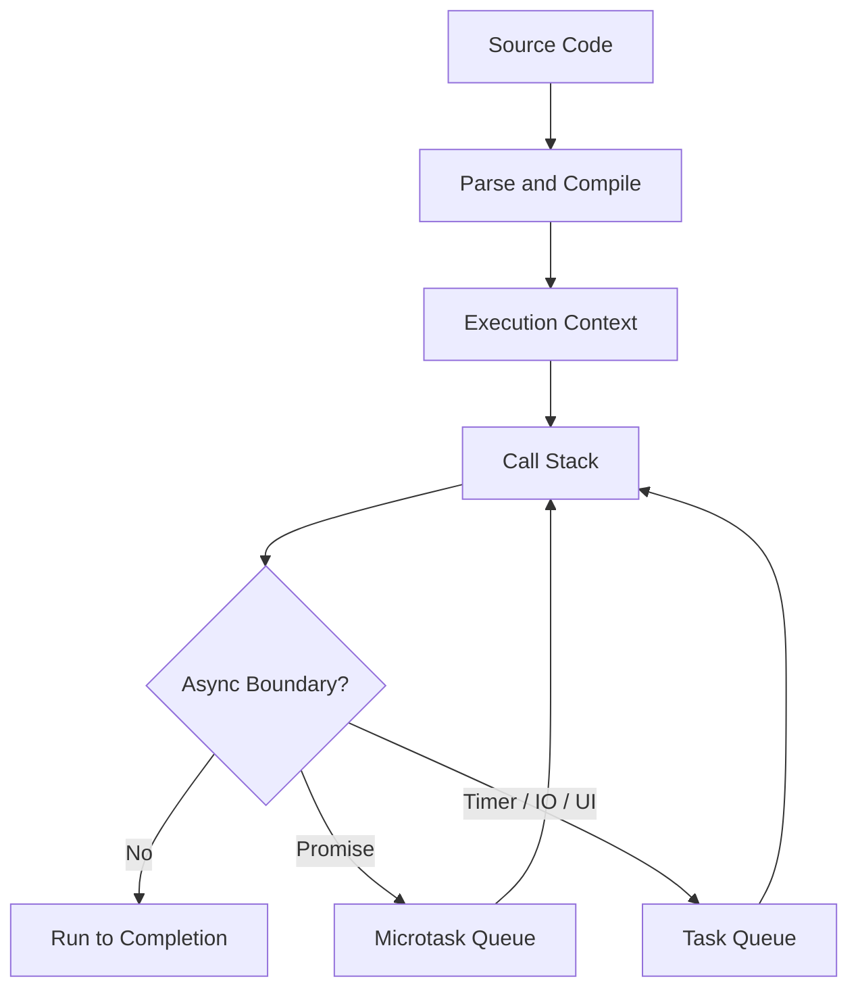
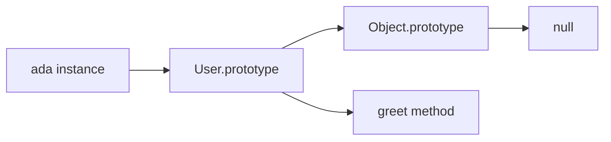
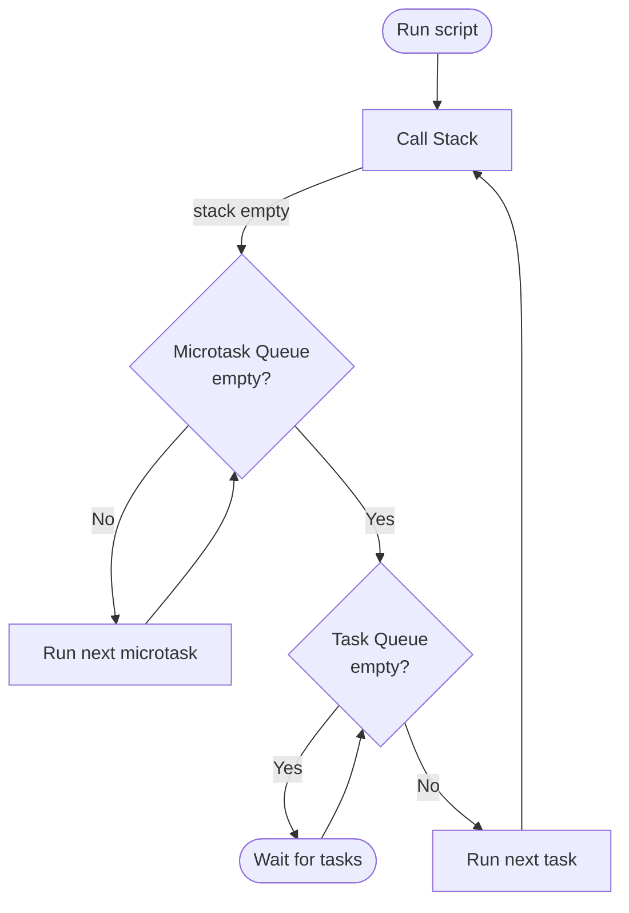
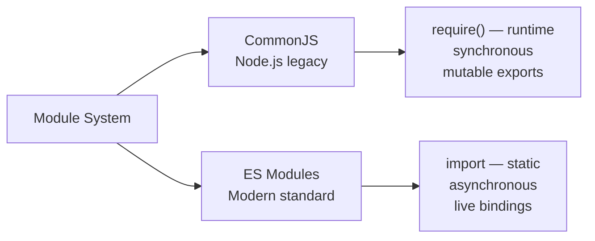
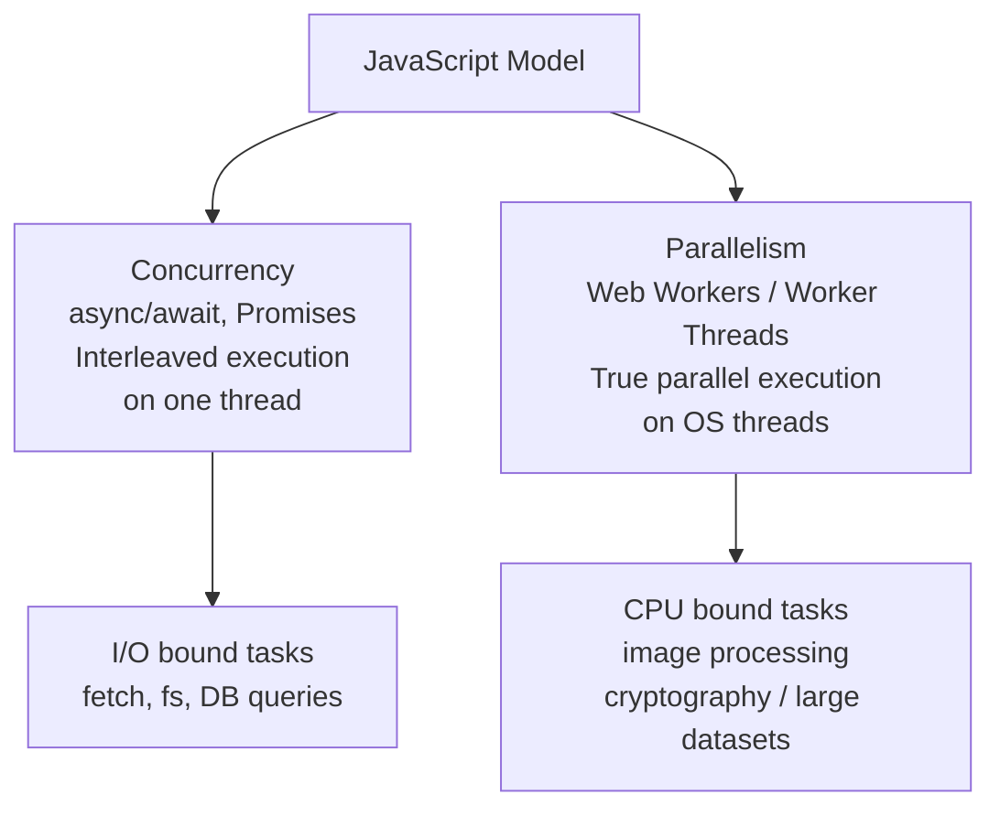

# JavaScript

## Overview

JavaScript is a high-level, dynamically typed, prototype-based language used across browsers, servers, CLIs, and edge runtimes. Interview focus: execution model, closures, `this`, prototypes, async behavior, equality, modules, and practical debugging.

## Mental Model

JavaScript runs one call stack per agent and uses queues to resume async work later. The engine executes synchronous code to completion, drains microtasks such as promise callbacks, then lets the host process the next task such as a timer, network callback, or UI event.



| Interview Question | Strong Practical Answer |
|--------------------|--------------------------|
| Is JavaScript single-threaded? | Your JS call stack is single-threaded per agent, but the host can perform IO, timers, workers, and rendering around it. |
| What runs first: `setTimeout` or `Promise.then`? | Promise callbacks are microtasks, so they run before timer tasks after the current stack clears. |
| Why do closures matter? | They preserve access to outer variables after the outer function returns. |
| What is `this`? | A runtime binding determined mostly by call site, except arrow functions capture lexical `this`. |
| What is prototypal inheritance? | Objects delegate property lookup to a prototype chain instead of copying class members into each object. |

## How It Works

JavaScript evaluates code inside execution contexts. Each context has a lexical environment for variables, a `this` binding, and a link to outer environments. Function calls push new contexts onto the call stack; returning pops them.

### Execution Context and Scope

`let` and `const` are block-scoped. `var` is function-scoped and hoisted, which makes it a common source of interview traps.

```javascript
function scopeDemo() {
  if (true) {
    var functionScoped = "var";
    let blockScoped = "let";
  }

  console.log(functionScoped);
  console.log(typeof blockScoped);
}

scopeDemo();
```

<!-- Output: -->
<!-- var -->
<!-- undefined -->

> [!warning] Gotcha
> `typeof missingIdentifier` is `"undefined"`, but accessing a `let` or `const` binding before initialization throws because it is in the temporal dead zone.

### Closures

A closure is a function plus references to variables from its outer lexical environment.

```javascript
function createCounter() {
  let count = 0;

  return function increment() {
    count += 1;
    return count;
  };
}

const next = createCounter();
console.log(next());
console.log(next());
```

<!-- Output: -->
<!-- 1 -->
<!-- 2 -->

Closures are used for callbacks, memoization, module privacy, function factories, and React hook behavior.

### `this` Binding

Regular functions receive `this` from how they are called. Arrow functions do not bind their own `this`; they close over the surrounding one.

```javascript
const user = {
  name: "Ada",
  regular() {
    return this.name;
  },
  arrow: () => this?.name,
};

const detached = user.regular;

console.log(user.regular());
console.log(detached.call({ name: "Grace" }));
console.log(user.arrow());
```

<!-- Output: -->
<!-- Ada -->
<!-- Grace -->
<!-- undefined -->

| Call Form | `this` Value |
|-----------|--------------|
| `obj.method()` | `obj` |
| `fn()` in strict mode | `undefined` |
| `fn.call(value)` | `value` |
| `new Fn()` | newly created object |
| Arrow function | lexical `this` from surrounding scope |

### Prototypes and Classes

Classes are syntax over prototype-based delegation. Methods live on `Constructor.prototype`; instances link to that prototype.

```javascript
class User {
  constructor(name) {
    this.name = name;
  }

  greet() {
    return `Hi ${this.name}`;
  }
}

const ada = new User("Ada");

console.log(ada.greet());
console.log(Object.getPrototypeOf(ada) === User.prototype);
```

<!-- Output: -->
<!-- Hi Ada -->
<!-- true -->



### Async JavaScript

Promises model eventual completion. `async` functions return promises, and `await` pauses that async function while the current call stack continues.

```javascript
console.log("sync start");

setTimeout(() => console.log("timer"), 0);

Promise.resolve()
  .then(() => console.log("promise 1"))
  .then(() => console.log("promise 2"));

console.log("sync end");
```

<!-- Output: -->
<!-- sync start -->
<!-- sync end -->
<!-- promise 1 -->
<!-- promise 2 -->
<!-- timer -->

> [!tip] Pro Tip
> In UI code, long synchronous work blocks rendering and input. Break CPU-heavy work into chunks, move it to a Worker, or push it behind server-side processing.

### Modules

ES modules are statically analyzable and use live bindings.

```javascript
// counter.js
export let count = 0;
export function increment() { count += 1; }
```

```javascript
// app.js
import { count, increment } from "./counter.js";
console.log(count); // 0
increment();
console.log(count); // 1 — live binding reflects the change
```

## Core Concepts

### Values and Types

JavaScript has primitives (`string`, `number`, `bigint`, `boolean`, `undefined`, `symbol`, `null`) and objects. `typeof null` returns `"object"` for historical reasons.

| Value | `typeof` Result |
|-------|-----------------|
| `"x"` | `"string"` |
| `42` | `"number"` |
| `42n` | `"bigint"` |
| `true` | `"boolean"` |
| `undefined` | `"undefined"` |
| `Symbol("id")` | `"symbol"` |
| `null` | `"object"` |
| `[]` | `"object"` |
| `function () {}` | `"function"` |

### Equality and Coercion

Prefer `===` and `!==` unless you intentionally want JavaScript's abstract equality coercion.

| Expression | Result | Why |
|------------|--------|-----|
| `0 == false` | `true` | boolean coerces to number |
| `0 === false` | `false` | different types |
| `null == undefined` | `true` | special abstract equality rule |
| `Number.isNaN(NaN)` | `true` | reliable NaN check |
| `NaN === NaN` | `false` | NaN is not equal to itself |

### Arrays and Objects

Arrays are objects optimized for indexed collections. Object keys are strings or symbols; `Map` can use arbitrary key values and is usually better for dictionary-style dynamic keys.

```javascript
const map = new Map();
const key = { id: 1 };

map.set(key, "cached");

console.log(map.get(key));
console.log({ [key]: "cached" });
```

<!-- Output: -->
<!-- cached -->
<!-- { '[object Object]': 'cached' } -->

## Event Loop — Deep Dive

The event loop has one call stack, one microtask queue, and one or more macrotask queues (timers, I/O, UI events). After every macrotask, the engine **drains the entire microtask queue** before picking the next macrotask.



```javascript
// Predict the output — classic interview question
console.log("1");                         // sync

setTimeout(() => console.log("2"), 0);   // macrotask (timer)

Promise.resolve()
  .then(() => {
    console.log("3");                     // microtask
    setTimeout(() => console.log("4"), 0); // schedules another macrotask
  })
  .then(() => console.log("5"));         // microtask (chained)

console.log("6");                         // sync
```

<!-- Output: 1, 6, 3, 5, 2, 4 -->
<!-- Reasoning:
  1, 6 = synchronous code
  3, 5 = microtasks drained fully before any macrotask
  2 = first macrotask (setTimeout from outer scope)
  4 = second macrotask (setTimeout scheduled inside microtask)
-->

### Microtask vs Macrotask Sources

| Queue | Sources | When it runs |
|---|---|---|
| **Microtask** | `Promise.then/catch/finally`, `queueMicrotask()`, `MutationObserver` | After every task, before next task |
| **Macrotask** (Task Queue) | `setTimeout`, `setInterval`, `setImmediate` (Node), I/O callbacks, UI events | One per event loop tick, after microtask queue drains |

> [!warning] Microtask starvation
> If microtasks keep scheduling more microtasks, the macrotask queue never runs — the browser stops rendering and the UI freezes. Never create an infinite microtask loop.

```javascript
// DANGER: starves the macrotask queue
function infiniteMicrotask() {
  Promise.resolve().then(infiniteMicrotask); // infinite microtask loop
}
```

## Promises — Complete Guide

### Creating & Chaining

```javascript
// Promise constructor — wraps callback-style APIs
function readFile(path) {
  return new Promise((resolve, reject) => {
    fs.readFile(path, "utf-8", (err, data) => {
      if (err) reject(err);
      else resolve(data);
    });
  });
}

// Chain: each .then() returns a new promise
readFile("./data.json")
  .then(JSON.parse)                   // transform the value
  .then(data => processData(data))    // async or sync — both work
  .then(result => console.log(result))
  .catch(err => console.error(err))   // handles any rejection in the chain
  .finally(() => cleanup());          // always runs
```

### Promise Combinators

```javascript
const p1 = fetch("/api/users");
const p2 = fetch("/api/orders");
const p3 = fetch("/api/products");

// Promise.all — all must succeed; rejects on first failure
const [users, orders, products] = await Promise.all([p1, p2, p3]);

// Promise.allSettled — waits for all, never rejects; useful when some may fail
const results = await Promise.allSettled([p1, p2, p3]);
results.forEach(result => {
  if (result.status === "fulfilled") console.log(result.value);
  else console.error(result.reason);
});

// Promise.race — resolves/rejects with the first settled
const timeout = new Promise((_, reject) =>
  setTimeout(() => reject(new Error("timeout")), 5000)
);
const data = await Promise.race([fetch("/api/data"), timeout]);

// Promise.any — resolves with the first successful; rejects only if ALL fail
const fastest = await Promise.any([mirror1.fetch(), mirror2.fetch(), mirror3.fetch()]);
```

| Combinator | Resolves when | Rejects when |
|---|---|---|
| `Promise.all` | All resolve | First rejects |
| `Promise.allSettled` | All settle (resolve OR reject) | Never |
| `Promise.race` | First settles | First rejects |
| `Promise.any` | First resolves | All reject |

### Error Handling Patterns

```javascript
// Pattern 1: try/catch with async/await (preferred)
async function fetchUser(id) {
  try {
    const res = await fetch(`/api/users/${id}`);
    if (!res.ok) throw new Error(`HTTP ${res.status}`);
    return await res.json();
  } catch (err) {
    console.error("fetchUser failed:", err.message);
    return null; // or rethrow
  }
}

// Pattern 2: Result type — never throws, caller checks
async function safeRequest(url) {
  try {
    const data = await fetch(url).then(r => r.json());
    return { ok: true, data };
  } catch (error) {
    return { ok: false, error };
  }
}

// Pattern 3: unhandledRejection safety net (Node.js)
process.on("unhandledRejection", (reason, promise) => {
  console.error("Unhandled rejection:", reason);
  // log and exit — never silently swallow
});
```

## Modules — CJS vs ESM



### CommonJS (CJS)

```javascript
// math.js
const PI = 3.14159;
function circle(r) { return PI * r * r; }
module.exports = { PI, circle }; // exports is an object you mutate

// app.js
const { PI, circle } = require("./math"); // runtime, synchronous
console.log(circle(5)); // 78.53975

// Dynamic require — valid in CJS
const moduleName = condition ? "./a" : "./b";
const mod = require(moduleName);
```

### ES Modules (ESM)

```javascript
// math.js
export const PI = 3.14159;
export function circle(r) { return PI * r * r; }
export default { PI, circle }; // named + default exports

// app.js
import { PI, circle } from "./math.js"; // static — resolved at parse time
import defaultExport from "./math.js";

// Dynamic import — lazy load (returns a promise)
const { circle } = await import("./math.js");
```

### Key Differences

| | CommonJS | ES Modules |
|---|---|---|
| **Syntax** | `require()` / `module.exports` | `import` / `export` |
| **Resolution** | Runtime | Parse time (static) |
| **Loading** | Synchronous | Asynchronous |
| **Bindings** | Snapshot copy | Live reference |
| **Tree shaking** | Not possible | Yes (bundlers eliminate unused exports) |
| **Top-level `await`** | No | Yes |
| **`__dirname` / `__filename`** | Built-in | Need `import.meta.url` workaround |
| **Default in Node.js** | Yes (`.js` files) | `.mjs` or `"type": "module"` in `package.json` |
| **Browser** | No (bundler required) | Native support |

```json
// package.json — enable ESM for all .js files
{ "type": "module" }
```

```javascript
// ESM equivalent of __dirname
import { fileURLToPath } from "url";
import { dirname } from "path";
const __filename = fileURLToPath(import.meta.url);
const __dirname = dirname(__filename);
```

**Interview tip:** CJS exports are evaluated once and cached — `require()` the same module twice returns the same object. ESM live bindings mean consumers see updated values when the exporting module changes them.

## Concurrency & Parallelism

JavaScript is **single-threaded** per agent — only one piece of JS runs at a time. It achieves concurrency through asynchronous I/O and parallelism through Web Workers / Worker Threads.



### Async Concurrency (I/O Bound)

```javascript
// Sequential — takes 3 seconds
const user    = await fetchUser(id);    // 1s
const orders  = await fetchOrders(id);  // 1s
const profile = await fetchProfile(id); // 1s

// Concurrent — takes 1 second (all fire simultaneously)
const [user, orders, profile] = await Promise.all([
  fetchUser(id),
  fetchOrders(id),
  fetchProfile(id),
]);

// Controlled concurrency — limit to 5 at a time
import pLimit from "p-limit";
const limit = pLimit(5);
const results = await Promise.all(
  urls.map(url => limit(() => fetch(url).then(r => r.json())))
);
```

### True Parallelism with Worker Threads (Node.js)

```javascript
// main.js — offload CPU-heavy work to a worker
import { Worker } from "worker_threads";

function runInWorker(data) {
  return new Promise((resolve, reject) => {
    const worker = new Worker("./worker.js", { workerData: data });
    worker.on("message", resolve);
    worker.on("error", reject);
  });
}

// Process 4 chunks in parallel on separate threads
const chunks = splitIntoChunks(largeDataset, 4);
const results = await Promise.all(chunks.map(runInWorker));
const final = mergeResults(results);
```

```javascript
// worker.js
import { workerData, parentPort } from "worker_threads";

// This runs on a separate OS thread — doesn't block main thread
const result = heavyCpuWork(workerData);
parentPort.postMessage(result);
```

### Web Workers (Browser)

```javascript
// main.js
const worker = new Worker("/worker.js");
worker.postMessage({ imageData: canvas.getImageData(0, 0, 800, 600) });
worker.onmessage = (e) => drawResult(e.data.processed);

// worker.js (separate file, no DOM access)
self.onmessage = (e) => {
  const processed = applyFilter(e.data.imageData); // runs off main thread
  self.postMessage({ processed });
};
```

### SharedArrayBuffer & Atomics

For truly shared memory between workers (requires `Cross-Origin-Isolation` headers):

```javascript
// Shared memory between main thread and worker
const sharedBuffer = new SharedArrayBuffer(4);
const view = new Int32Array(sharedBuffer);

// Atomics prevent race conditions
Atomics.add(view, 0, 1);           // atomic increment
Atomics.wait(view, 0, 0);          // block until view[0] !== 0 (workers only)
Atomics.notify(view, 0, 1);        // wake one waiting thread
```

**When to use each:**
| Problem | Solution |
|---|---|
| Multiple API calls | `Promise.all` — concurrent async |
| Hundreds of parallel requests | `Promise.all` + `p-limit` — controlled concurrency |
| CPU-heavy computation | Worker Threads / Web Workers |
| Shared mutable state across workers | `SharedArrayBuffer` + `Atomics` |
| Streaming large results | Async generators |

## Code Examples

### Debounce

```javascript
function debounce(fn, delayMs) {
  let timerId;

  return (...args) => {
    clearTimeout(timerId);
    timerId = setTimeout(() => fn(...args), delayMs);
  };
}

const search = debounce((query) => console.log(`Searching: ${query}`), 100);

search("r");
search("re");
search("red");
```

<!-- Output: -->
<!-- After roughly 100ms: Searching: red -->

### Promise Error Handling

```javascript
async function loadUser(fetchUser) {
  try {
    const user = await fetchUser();
    return user.name;
  } catch (error) {
    return `fallback: ${error.message}`;
  }
}

loadUser(() => Promise.reject(new Error("offline")))
  .then(console.log);
```

<!-- Output: -->
<!-- fallback: offline -->

### Object Copying

```javascript
const original = {
  user: { name: "Ada" },
  roles: ["admin"],
};

const shallow = { ...original };
shallow.user.name = "Grace";

console.log(original.user.name);
console.log(shallow.roles === original.roles);
```

<!-- Output: -->
<!-- Grace -->
<!-- true -->

> [!warning] Gotcha
> Spread syntax makes a shallow copy. Nested objects and arrays still share references unless you clone those nested values too.

## Key Details

- JavaScript variables hold values or references to objects; object mutation through one reference is visible through other references to the same object.
- Promise callbacks run in the microtask queue, which is drained before the browser or runtime moves to the next task.
- `Object.freeze()` is shallow; nested objects remain mutable unless they are also frozen.
- `for...of` iterates values from an iterable; `for...in` iterates enumerable property names and is rarely the right loop for arrays.
- `try/catch` catches synchronous throws and awaited promise rejections inside the `try`; it does not catch errors thrown later in detached callbacks.

> [!info] Interview Framing
> Good JavaScript answers usually explain both the language rule and the production consequence: stale closures cause wrong UI state, shallow copies cause accidental mutation, and long synchronous loops cause jank.

## Key Interview Questions

### Q1: Explain `var`, `let`, and `const`.

**Answer:** `var` is function-scoped and hoisted with `undefined`. `let` and `const` are block-scoped, hoisted but unavailable before initialization due to the temporal dead zone. `const` prevents reassignment of the binding, not mutation of the referenced object.

### Q2: What is a closure?

**Answer:** A closure is a function that retains access to variables from its outer lexical scope even after that outer function has returned. Use cases include callbacks, private state, memoization, and function factories.

### Q3: What is the event loop?

**Answer:** The event loop coordinates execution between the call stack, microtask queue, and task queue. After each macrotask, the engine fully drains the microtask queue before picking the next macrotask. Synchronous code runs first, then microtasks (promise callbacks, `queueMicrotask`), then timers/IO callbacks. See the **Event Loop — Deep Dive** section above for the full diagram and prediction exercise.

### Q4: What is the difference between microtasks and macrotasks?

**Answer:** Microtasks (Promise `.then`, `queueMicrotask`, `MutationObserver`) drain completely after every macrotask before the next macrotask runs — even if they schedule more microtasks. This means microtasks can starve the task queue. Macrotasks (setTimeout, setInterval, I/O, UI events) are processed one per loop tick. Order: sync → microtasks → next macrotask → microtasks → …

### Q5: How does `this` work?

**Answer:** `this` is determined by call site for regular functions: method call, plain call, explicit `call/apply/bind`, or constructor call. Arrow functions capture `this` lexically and cannot be rebound.

### Q6: What is prototypal inheritance?

**Answer:** Objects have an internal prototype link. When a property is not found on the object, JavaScript looks up the prototype chain until it finds the property or reaches `null`.

### Q7: What is the difference between `==` and `===`?

**Answer:** `===` compares without type coercion. `==` performs abstract equality conversion, which creates surprising cases like `0 == false`. Use `===` by default.

### Q8: What are promises?

**Answer:** A Promise is an object representing eventual completion or failure of async work. States: `pending` → `fulfilled` (`.then`) or `rejected` (`.catch`). Promise chains are built by returning from `.then` handlers — returning a plain value wraps it, returning a Promise flattens it. `async/await` is syntactic sugar over promises. See the **Promises — Complete Guide** section above.

### Q9: What is the difference between `Promise.all` and `Promise.allSettled`?

**Answer:** `Promise.all` — waits for all, rejects immediately on the first rejection. `Promise.allSettled` — waits for all, never rejects, gives `{status, value/reason}` per promise. Also: `Promise.race` (first to settle wins), `Promise.any` (first to *resolve* wins, rejects only if all fail). Use `Promise.allSettled` for independent batch work where partial failure is acceptable.

### Q10: What is hoisting?

**Answer:** Hoisting is the language behavior where declarations are processed before code executes. Function declarations are callable before their declaration line; `var` exists as `undefined`; `let` and `const` exist but are inaccessible until initialized.

### Q11: What is the difference between shallow and deep copy?

**Answer:** A shallow copy copies top-level properties but keeps nested object references. A deep copy recursively copies nested values, but it can lose prototypes, functions, symbols, and special objects depending on the method.

### Q12: What is optional chaining?

**Answer:** `obj?.prop` safely returns `undefined` when the left side is `null` or `undefined`. It does not handle other falsy values like `0`, `false`, or `""`.

### Q13: What is nullish coalescing?

**Answer:** `value ?? fallback` uses the fallback only when `value` is `null` or `undefined`. It preserves valid falsy values such as `0` and `""`.

### Q14: What is a generator?

**Answer:** A generator function can pause and resume execution with `yield`. It returns an iterator and is useful for lazy sequences and custom iteration protocols.

```javascript
// Lazy infinite sequence
function* naturals() {
  let n = 1;
  while (true) yield n++;
}

function* take(n, iter) {
  for (const value of iter) {
    if (n-- <= 0) return;
    yield value;
  }
}

console.log([...take(5, naturals())]); // [1, 2, 3, 4, 5]

// Async generator — stream database rows without loading all into memory
async function* fetchPagedUsers(pageSize = 100) {
  let page = 0;
  while (true) {
    const users = await db.users.findMany({ skip: page * pageSize, take: pageSize });
    if (users.length === 0) return;
    yield* users; // yield each user individually
    page++;
  }
}

for await (const user of fetchPagedUsers()) {
  await processUser(user); // one at a time, memory stays flat
}
```

**Async generators are ideal for:** paginated API consumption, streaming database cursors, reading large files line by line, and implementing async pipelines.

### Q15: How do ES modules differ from CommonJS?

**Answer:** ESM: static analysis at parse time, live bindings (consumer sees updated exports), supports top-level `await`, native in browsers, tree-shaking. CJS: runtime `require()`, synchronous, snapshot copy of exports, native to Node.js. Cannot mix without transpilation or interop wrappers. See the **Modules — CJS vs ESM** section above for the full comparison table and code examples.

### Q16: What is `Object.create(null)` used for?

**Answer:** It creates an object with no prototype, avoiding inherited keys like `toString`. For general dynamic key/value dictionaries, `Map` is often clearer.

### Q17: What is the difference between `Map` and object?

**Answer:** `Map` preserves insertion order, supports any key type, has a reliable `size`, and avoids prototype-key issues. Objects are better for fixed records with known property names.

### Q18: What is debouncing vs throttling?

**Answer:** Debouncing delays work until activity stops. Throttling limits work to at most once per interval. Use debounce for search input; throttle for scroll or resize updates.

### Q19: What does "pass by reference" mean in JavaScript?

**Answer:** JavaScript passes arguments by value. For objects, the value is a reference to the object, so functions can mutate the object but cannot reassign the caller's variable binding.

### Q20: How do you handle cancellation?

**Answer:** Promises do not provide universal cancellation. Use `AbortController` for APIs that support it, ignore stale results with request IDs, or use a library that models cancellation at the operation layer.

## WeakMap & WeakSet

`WeakMap` and `WeakSet` hold **weak references** — they don't prevent garbage collection of their keys/values. Useful for associating metadata with objects without memory leaks.

```javascript
// WeakMap: associate private data with DOM nodes
const metadata = new WeakMap();

function trackClick(element) {
  if (!metadata.has(element)) {
    metadata.set(element, { clicks: 0, firstSeen: Date.now() });
  }
  metadata.get(element).clicks++;
}

document.querySelectorAll("button").forEach((btn) => {
  btn.addEventListener("click", () => trackClick(btn));
});
// When a button is removed from the DOM, its WeakMap entry is GC'd automatically.

// WeakSet: track visited objects without preventing GC
const visited = new WeakSet();

function process(obj) {
  if (visited.has(obj)) return; // already processed
  visited.add(obj);
  // ... do work
}
```

**Key differences from Map/Set:**
| | WeakMap | Map |
|---|---|---|
| Key types | Objects only | Any |
| Prevents GC | No (weak reference) | Yes (strong reference) |
| Iterable | No | Yes |
| `.size` property | No | Yes |
| Use case | Private metadata, caches tied to object lifetime | General key-value storage |

**Common pattern:** caching computed results tied to an object's lifetime — when the object is GC'd, the cached result is automatically freed too.

## When to Use

- Preparing for frontend, full-stack, Node.js, React, or Next.js interviews.
- Reviewing language behavior that affects bugs in production applications.
- Debugging async ordering, closure state, `this`, or mutation issues.
- Building a foundation before [[typescript]], [[react]], and [[nextjs]].

## Related Topics

- [[typescript]] - TypeScript adds static analysis on top of JavaScript.
- [[react]] - React relies heavily on closures, modules, async rendering, and immutable updates.
- [[nextjs]] - Next.js uses JavaScript runtime behavior across server, client, and edge environments.
- [[overview]] - Tests often expose async, module, and DOM timing issues.
- [[WebSockets]] - Real-time browser APIs use JavaScript event and callback patterns.
- [[sse]] - Browser streaming API built on JavaScript event handlers.

## External Links

- [MDN JavaScript Guide](https://developer.mozilla.org/en-US/docs/Web/JavaScript/Guide)
- [MDN Promise Reference](https://developer.mozilla.org/en-US/docs/Web/JavaScript/Reference/Global_Objects/Promise)
- [MDN Event Loop](https://developer.mozilla.org/en-US/docs/Web/JavaScript/Event_loop)
- [ECMAScript Language Specification](https://tc39.es/ecma262/)
