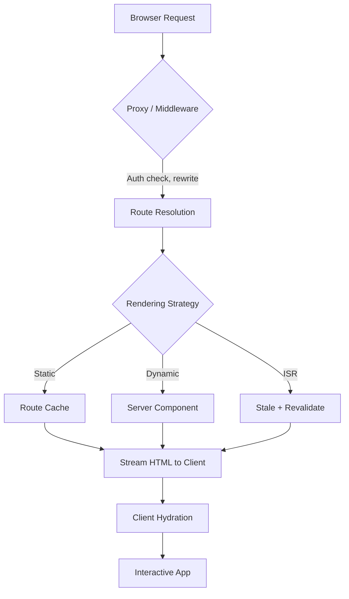
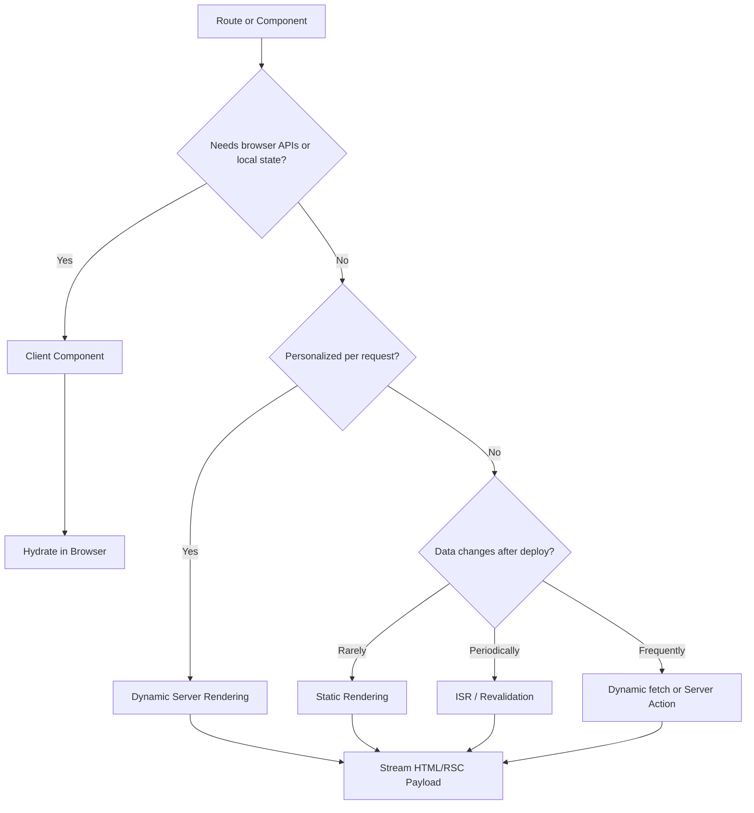

# Next.js Interview Questions

## Overview

Next.js is a full-stack React framework by Vercel that provides server-side rendering, static site generation, file-based routing, API routes, and built-in optimizations — making it the go-to choice for production React applications.

## How It Works

Next.js extends React with a hybrid rendering model. Instead of forcing one rendering strategy, it lets you choose SSR, SSG, ISR, or CSR per page or component. The App Router (default since v13) uses React Server Components — components that render on the server with zero JavaScript shipped to the client.



The request flow shows how Next.js intercepts requests, resolves routes, picks a rendering strategy, and streams HTML to the client before hydrating interactivity.

### App Router File Structure → URL Mapping

```mermaid
graph LR
    A[app/] --> B[page.tsx]
    A --> C[about/page.tsx]
    A --> D[blog/page.tsx]
    A --> E[blog/[slug]/page.tsx]
    A --> F[shop/[...slug]/page.tsx]
    B --> G["/"]
    C --> H["/about"]
    D --> I["/blog"]
    E --> J["/blog/:slug"]
    F --> K["/shop/*"]
```

File-based routing maps directory structure directly to URL paths. Route groups like `(marketing)` organize files without affecting URLs.

### Rendering Decision Flow



The practical default in App Router is: keep components server-side until they need interactivity, isolate the smallest possible client component behind `'use client'`, and make caching/revalidation explicit.

## Comparison Tables

### Rendering Methods

| Method | When Rendered | Where | Use Case |
|--------|--------------|-------|----------|
| **SSR** | Every request | Server | Personalized/dynamic content |
| **SSG** | Build time | Server at build | Content that rarely changes |
| **ISR** | Build + periodically | Server | Large sites with semi-static content |
| **CSR** | After page loads | Browser | Dashboards, interactive apps |

### App Router vs Pages Router

| Aspect | Pages Router | App Router |
|--------|-------------|------------|
| **Default rendering** | CSR (unless data fetching used) | Server Components |
| **Data fetching** | `getStaticProps`, `getServerSideProps` | `fetch`, `'use cache'`, Server Actions |
| **Routing** | `pages/` directory | `app/` directory |
| **Layouts** | `_app.tsx`, `_document.tsx` | `layout.tsx` (nested) |
| **Loading states** | Manual | `loading.tsx` (auto Suspense) |
| **Error handling** | `_error.tsx` | `error.tsx` (per segment) |
| **API routes** | `pages/api/` | `route.ts` (Route Handlers) |
| **Metadata** | `<Head>` component | `metadata` object / `generateMetadata` |

### Server vs Client Components

| Feature | Server Components | Client Components |
|---------|------------------|-------------------|
| **Directive** | Default (no directive) | `'use client'` |
| **Where rendered** | Server only | Client (after hydration) |
| **JS bundle** | Zero | Included in bundle |
| **State/hooks** | ❌ No `useState`, `useEffect` | ✅ Full React API |
| **DB access** | ✅ Direct | ❌ Must use API |
| **Secrets** | ✅ Safe | ❌ Exposed |
| **Browser APIs** | ❌ No `window`, `localStorage` | ✅ Full access |

## Code Examples

### SSR — Dynamic Rendering (App Router)

```tsx
// app/dashboard/page.tsx — Dynamically rendered per request
import { cookies } from 'next/headers'

export default async function Dashboard() {
  const theme = (await cookies()).get('theme')?.value
  return <div>Theme: {theme}</div>
}
```

<!-- Output: -->
<!-- Renders server-side with the user's cookie value on every request. -->

### ISR — Incremental Static Regeneration

```tsx
// app/blog/[slug]/page.tsx
export const revalidate = 60 // Revalidate every 60 seconds

export async function generateStaticParams() {
  const posts = await fetch('https://api.example.com/posts').then(r => r.json())
  return posts.map((post) => ({ slug: post.slug }))
}

export default async function Page({ params }) {
  const { slug } = await params
  const post = await fetch(`https://api.example.com/posts/${slug}`).then(r => r.json())
  return <article><h1>{post.title}</h1><p>{post.content}</p></article>
}
```

<!-- Output: -->
<!-- Pre-generates all blog slugs at build time, regenerates each page 60s after last request. -->

### Server Actions

```tsx
// app/actions.ts
'use server'
import { revalidatePath } from 'next/cache'

export async function createTodo(formData: FormData) {
  const title = formData.get('title') as string
  await db.todos.create({ data: { title } })
  revalidatePath('/todos')
}

// app/todos/page.tsx
import { createTodo } from './actions'

export default function TodosPage() {
  return (
    <form action={createTodo}>
      <input name="title" placeholder="New todo" />
      <button type="submit">Add</button>
    </form>
  )
}
```

<!-- Output: -->
<!-- Form submits to server without a separate API route. Page revalidates automatically. -->

### Route Handler (API Endpoint)

```tsx
// app/api/users/route.ts
import { NextResponse } from 'next/server'

export async function GET() {
  const users = await db.users.findMany()
  return NextResponse.json(users)
}

export async function POST(request: Request) {
  const body = await request.json()
  const user = await db.users.create({ data: body })
  return NextResponse.json(user, { status: 201 })
}
```

<!-- Output: -->
<!-- GET /api/users → JSON array of users. POST /api/users → created user with 201 status. -->

### Server + Client Composition Pattern

```tsx
// app/page.tsx — Server Component
import Modal from './ui/modal'    // Client Component
import Cart from './ui/cart'      // Server Component

export default function Page() {
  return (
    <Modal>
      <Cart />  {/* Rendered on server, passed as child slot */}
    </Modal>
  )
}
```

<!-- Output: -->
<!-- Cart renders on server (zero JS). Modal hydrates on client. Cart HTML is placed in Modal slot. -->

### Dynamic Imports & Lazy Loading

```tsx
import dynamic from 'next/dynamic'

const HeavyChart = dynamic(() => import('@/components/HeavyChart'), {
  loading: () => <p>Loading chart...</p>,
  ssr: false, // Skip server rendering
})
```

<!-- Output: -->
<!-- HeavyChart JS bundle loads only when component mounts on client. -->

### Proxy (Authentication Check)

```tsx
// proxy.ts
import { NextResponse } from 'next/server'
import type { NextRequest } from 'next/server'

export function proxy(request: NextRequest) {
  const token = request.cookies.get('token')
  if (!token && request.nextUrl.pathname.startsWith('/dashboard')) {
    return NextResponse.redirect(new URL('/login', request.url))
  }
  return NextResponse.next()
}

export const config = {
  matcher: ['/dashboard/:path*', '/api/:path*'],
}
```

<!-- Output: -->
<!-- Unauthenticated requests to /dashboard redirect to /login before route resolution. -->

## 25 Interview Questions

### Q1: What is Next.js and why would you choose it over plain React?

**Answer:** Next.js is a full-stack React framework that provides server-side rendering, static site generation, file-based routing, API routes, and built-in optimizations. Choose it over plain React when you need:

- **SEO** — SSR/SSG provides crawlable HTML
- **Performance** — Automatic code splitting, image/font optimization
- **Developer experience** — Zero-config routing, hot reloading, TypeScript support
- **Full-stack capabilities** — API routes, Server Actions, database access in Server Components
- **Flexibility** — Mix SSR, SSG, ISR, and CSR per page

### Q2: Explain the difference between SSR, SSG, ISR, and CSR.

**Answer:**
- **SSR (Server-Side Rendering):** HTML generated on every request. Best for personalized/dynamic content. Slower TTFB but always fresh.
- **SSG (Static Site Generation):** HTML generated at build time. Fastest delivery (CDN-cachable) but requires rebuild for content changes.
- **ISR (Incremental Static Regeneration):** SSG + periodic background regeneration. Best of both worlds — fast static pages that update without full rebuilds.
- **CSR (Client-Side Rendering):** HTML is minimal; JS fetches and renders content in the browser. Good for dashboards but poor for SEO and initial load.

### Q3: What are React Server Components and how do they differ from Client Components?

**Answer:** Server Components are React components that render exclusively on the server. They:
- Have **zero JavaScript bundle size** sent to the client
- Can directly access databases, filesystems, and server-only modules
- Cannot use state (`useState`), effects (`useEffect`), or browser APIs
- Are the **default** in the App Router

Client Components (marked with `'use client'`) render on both server and client, support the full React API, and are needed for interactivity.

### Q4: How does the `'use client'` directive work?

**Answer:** `'use client'` marks a **module boundary** between Server and Client Components. When a file has this directive:
- That component and **all its imports/children** become part of the client bundle
- You don't need to add `'use client'` to every child — it propagates down
- Server Components can pass data as props to Client Components (props must be serializable)
- Server Components can be passed as `children` to Client Components (rendered on server, placed as slots)

### Q5: What is the difference between App Router and Pages Router?

**Answer:**
- **App Router** (`app/` directory, Next.js 13+): Uses React Server Components, nested layouts, streaming, Server Actions, Route Handlers, and file-based metadata. The modern default.
- **Pages Router** (`pages/` directory, legacy): Uses `getStaticProps`/`getServerSideProps` for data fetching, `_app.tsx` for global layout, and `pages/api/` for API routes. Still supported but not recommended for new projects.

### Q6: How does file-based routing work in Next.js?

**Answer:** Next.js automatically maps files in the `app/` directory to URL routes:
- `app/page.tsx` → `/`
- `app/about/page.tsx` → `/about`
- `app/blog/[slug]/page.tsx` → `/blog/:slug` (dynamic)
- `app/shop/[...slug]/page.tsx` → `/shop/*` (catch-all)
- `app/docs/[...slug]/page.tsx` means `/docs/*`; the optional catch-all form uses double brackets around `...slug` and also matches `/docs`.
- `app/(marketing)/about/page.tsx` → `/about` (route group, doesn't affect URL)

### Q7: What is `generateStaticParams` and when do you use it?

**Answer:** `generateStaticParams` replaces `getStaticPaths` in the App Router. It pre-generates routes at build time for dynamic segments:

```tsx
export async function generateStaticParams() {
  const posts = await fetch('https://api.example.com/posts').then(r => r.json())
  return posts.map(post => ({ slug: post.slug }))
}
```

Use it when you want to prerender specific dynamic routes at build time while allowing other routes to be generated on-demand.

### Q8: How do you handle data fetching in the App Router?

**Answer:** In Server Components, use `fetch()` directly or query databases:

```tsx
export default async function Page() {
  const data = await fetch('https://api.example.com/data')
  // or: const data = await db.posts.findMany()
}
```

For caching, use `'use cache'` with `cacheLife()`. For streaming, wrap in `<Suspense>`. For client-side fetching, use `'use client'` with SWR/React Query.

### Q9: What is the difference between `revalidatePath` and `revalidateTag`?

**Answer:**
- **`revalidatePath('/blog')`** — Invalidates the cache for an entire route path. Broader, simpler.
- **`revalidateTag('posts')`** — Invalidates all `fetch` calls tagged with `{ next: { tags: ['posts'] } }`. More granular — one tag can invalidate data across multiple routes.

Prefer `revalidatePath` for most cases; use `revalidateTag` when you need cross-route cache invalidation.

### Q10: How does Next.js handle image optimization?

**Answer:** The `<Image>` component from `next/image`:
- Automatically serves **WebP/AVIF** formats
- Generates responsive `srcset` for different screen sizes
- Lazy loads images (native browser lazy loading)
- Prevents **layout shift** (CLS) by requiring width/height
- Provides blur-up placeholders
- Resizes **remote images** on-demand (configured via `remotePatterns`)

```tsx
import Image from 'next/image'
<Image src="/hero.jpg" alt="Hero" width={1200} height={600} />
```

<!-- Output: -->
<!-- Serves optimized WebP/AVIF with responsive srcset and lazy loading. -->

### Q11: What is Partial Prerendering (PPR)?

**Answer:** PPR is Next.js's rendering model where a single page combines:
- A **static shell** (rendered at build time, served instantly)
- **Dynamic sections** (streamed in at request time via Suspense)

This gives the speed of static pages with the flexibility of dynamic rendering. Enabled via `cacheComponents: true` in `next.config.ts`.

### Q12: How do you implement authentication in Next.js?

**Answer:** Common approaches:
1. **Proxy (Middleware)** — Check auth tokens/cookies before routing
2. **Server Components** — Read cookies server-side, conditionally render
3. **Server Actions** — Handle login/logout with `'use server'`
4. **Third-party** — NextAuth.js, Clerk, Auth0

```tsx
// proxy.ts
export function proxy(request: NextRequest) {
  const token = request.cookies.get('token')
  if (!token && request.nextUrl.pathname.startsWith('/dashboard')) {
    return NextResponse.redirect(new URL('/login', request.url))
  }
  return NextResponse.next()
}
```

### Q13: What are Server Actions and how do they work?

**Answer:** Server Actions are async functions marked with `'use server'` that run on the server and can be called from Client Components:

```tsx
'use server'
export async function submitForm(data: FormData) {
  await db.posts.create({ title: data.get('title') })
  revalidatePath('/posts')
}

<form action={submitForm}>
  <input name="title" />
  <button>Submit</button>
</form>
```

They handle form submissions, mutations, and revalidation without needing separate API routes.

### Q14: How does code splitting work in Next.js?

**Answer:** Next.js automatically splits code by **route** — each page gets its own JS bundle. Additional splitting:
- **Dynamic imports** (`next/dynamic`) — Load components on demand
- **Shared chunks** — Common dependencies extracted into shared bundles
- **Server/Client split** — Server Component code never ships to the client

### Q15: What is the Edge Runtime and when would you use it?

**Answer:** The Edge Runtime is a lightweight JavaScript runtime that runs closer to users (at CDN edge locations). Use it for:
- Fast redirects/rewrites in Proxy
- API routes with low latency requirements
- A/B testing, geolocation, personalization

```tsx
export const runtime = 'edge'
export async function GET() {
  return Response.json({ message: 'Edge!' })
}
```

> [!warning] Gotcha
> Edge Runtime has **no Node.js APIs** — no `fs`, `crypto`, or packages that depend on them. Check package compatibility before using `runtime = 'edge'`.

### Q16: How do you handle errors in Next.js App Router?

**Answer:**
- **`error.tsx`** — Per-route-segment error boundary (Client Component)
- **`global-error.tsx`** — Root-level error (replaces entire shell)
- **`not-found.tsx`** — 404 handling
- **`try/catch`** in Server Components with `notFound()` or `redirect()`

```tsx
// app/blog/[slug]/error.tsx
'use client'
export default function Error({ error, reset }: { error: Error; reset: () => void }) {
  return (
    <div>
      <h2>Something went wrong!</h2>
      <button onClick={() => reset()}>Try again</button>
    </div>
  )
}
```

### Q17: What is the difference between `redirect()` and `rewriting`?

**Answer:**
- **`redirect()`** — Sends a 307/308 HTTP redirect. Browser URL changes. New request.
- **`rewrite()`** (via `NextResponse.rewrite()`) — Internally serves different content. Browser URL stays the same. No new request.

Use redirects for auth flows, URL changes. Use rewrites for A/B testing, multi-tenant routing, i18n.

### Q18: How do you optimize fonts in Next.js?

**Answer:** Use `next/font` which:
- Downloads fonts at **build time** (self-hosted)
- Eliminates external font requests
- Prevents layout shift with automatic `font-display: swap`
- Supports Google Fonts and custom fonts

```tsx
import { Inter } from 'next/font/google'
const inter = Inter({ subsets: ['latin'], display: 'swap' })
// <body className={inter.className}>
```

### Q19: What is the `output: 'standalone'` option and why use it?

**Answer:** `output: 'standalone'` creates a minimal production output containing only the files needed to run the app. Benefits:
- **Smaller Docker images** (~100MB vs ~500MB+)
- No need to copy `node_modules` or source files
- Production-ready out of the box

### Q20: How does Next.js caching work in the App Router?

**Answer:** Next.js has multiple caching layers:
1. **Request Memoization** — Identical `fetch()` calls in a component tree are deduplicated
2. **Data Cache** — `fetch()` results cached across requests (persistent)
3. **Full Route Cache** — prerendered HTML/RSC payload cached at build time
4. **Router Cache** — RSC payload cached on the client for instant navigation

In the modern model (Cache Components), `'use cache'` with `cacheLife()` controls caching, and `<Suspense>` handles streaming fresh data.

### Q21: Can you mix Server and Client Components? How?

**Answer:** Yes, through composition patterns:
1. **Server → Client via props:** Pass serializable data from Server to Client Components
2. **Server as children:** Pass Server Components as `children` to Client Components (rendered on server)
3. **Pattern:** Keep `'use client'` as deep in the tree as possible to minimize bundle size

```tsx
// Server Component
import ClientChart from './client-chart'  // 'use client'
import ServerTable from './server-table'  // Server Component

export default function Page() {
  return (
    <>
      <ClientChart data={/* serializable */} />
      <ServerTable />             {/* Server — zero JS */}
    </>
  )
}
```

### Q22: What happens when you run `next build`?

**Answer:**
1. Compiles all pages/components (Turbopack/Webpack)
2. Generates static HTML for SSG/ISR pages
3. Runs `generateStaticParams` for dynamic routes
4. Creates the `.next/` output directory
5. Generates route manifest and build stats
6. With `output: 'standalone'`, creates minimal deployment bundle

### Q23: How do you handle environment variables in Next.js?

**Answer:**
- **Server-only:** `process.env.DATABASE_URL` — Only available on server
- **Client-accessible:** `process.env.NEXT_PUBLIC_API_URL` — Prefixed with `NEXT_PUBLIC_`, bundled in client JS
- Load from `.env.local` (gitignored), `.env` (committed defaults)
- Available in Server Components, Route Handlers, Server Actions, and Proxy

> [!warning] Gotcha
> Never expose secrets via `NEXT_PUBLIC_` prefix. Anything with that prefix is bundled into client-side JavaScript and visible in the browser.

### Q24: What is the difference between `loading.tsx` and `<Suspense>`?

**Answer:**
- **`loading.tsx`** — Auto-wraps the entire route segment in `<Suspense>`. Shows during navigation.
- **`<Suspense>`** — Granular control. Wrap specific components. Can be used anywhere.

`loading.tsx` is convenient for page-level loading; `<Suspense>` is better for component-level streaming.

### Q25: How would you migrate from Pages Router to App Router?

**Answer:**
1. Create `app/` directory alongside `pages/`
2. Convert pages: `pages/about.tsx` → `app/about/page.tsx`
3. Replace `getStaticProps`/`getServerSideProps` with direct `fetch()` in Server Components
4. Replace `_app.tsx` with root `app/layout.tsx`
5. Replace `pages/api/` with `app/api/.../route.ts`
6. Replace `<Head>` with `metadata` export
7. Use the official codemod: `npx @next/codemod@latest app-new-router .`
8. Run both routers simultaneously during migration (they coexist)

## Key Details

- **`params` is a Promise in Next.js 15+** — You must `await params` before accessing properties. This is a breaking change from Next.js 14.
- **`'use cache'` is the new caching model** — Replaces the old `fetch` cache options. Use `cacheLife('seconds' | 'minutes' | 'hours' | 'days' | 'weeks')` for granular control.
- **Server Components are the default** — No directive needed. Only add `'use client'` when you actually need interactivity.
- **Route Handlers use standard Web APIs** — `Request` and `Response` objects, not Express-style `req`/`res`.

> [!warning] Gotcha
> In Next.js 15+, `params` and `searchParams` are **Promises**. You must `await` them: `const { slug } = await params`. Code from Next.js 14 tutorials will break without this change.

> [!warning] Gotcha
> Passing non-serializable data (functions, class instances, Date objects) as props from Server to Client Components will throw an error. Convert to JSON-safe types first.

> [!tip] Pro Tip
> Keep `'use client'` at the **leaf level** of your component tree. A Client Component at the root pulls all its children into the client bundle. Push interactivity down to maximize Server Component usage.

> [!tip] Pro Tip
> Use `revalidateTag` instead of `revalidatePath` when multiple routes share the same data source. One tag invalidation can refresh data across your entire app.

> [!info] App Router vs Pages Router
> Both routers can coexist in the same project. The `app/` directory takes precedence for matching routes. Use this to migrate incrementally rather than all at once.

## When to Use

- **Content-heavy sites** (blogs, docs, marketing) — SSG/ISR for fast, cacheable pages
- **E-commerce** — ISR for product pages, SSR for cart/checkout
- **Dashboards & SaaS** — SSR with authentication, CSR for interactive charts
- **Full-stack apps** — Server Actions + Route Handlers replace separate backend
- **SEO-critical applications** — SSR/SSG ensures search engines can crawl content

## Related Topics

- [[React Interview]] — Next.js is built on React; Server Components extend React's component model
- [[js-interview|JavaScript]] — Foundation for understanding Next.js runtime and Edge API
- [[web-basics]] — HTTP, caching, and rendering fundamentals that Next.js builds upon
- [[graphql]] — Alternative data fetching pattern usable with Next.js API routes
- [[microservices-architecture]] — Next.js can serve as a BFF (Backend-for-Frontend) layer
- [[frontend-testing]] — Testing strategies for Server and Client Components

## External Links

- [Next.js Official Documentation](https://nextjs.org/docs)
- [React Server Components RFC](https://github.com/reactjs/rfcs/blob/main/text/0188-server-components.md)
- [Next.js App Router Guide](https://nextjs.org/docs/app/getting-started)
- [Vercel Deployment Guide](https://vercel.com/docs/frameworks/nextjs)
