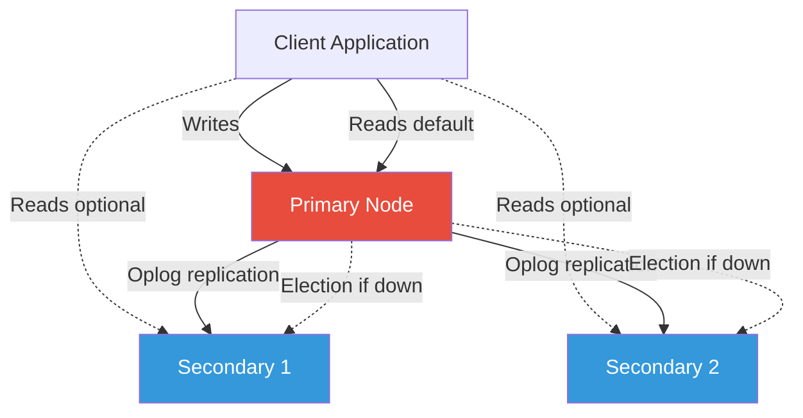
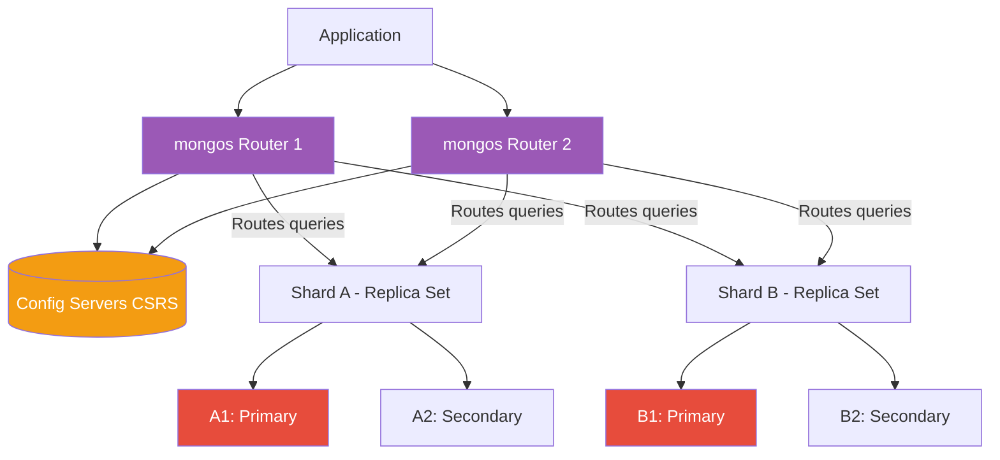

# NoSQL Databases (MongoDB)

## Overview

NoSQL ("Not Only SQL") databases are non-relational database systems designed to handle large volumes of unstructured and semi-structured data. They emerged to solve scalability, flexibility, and performance challenges that traditional relational databases struggle with. This note uses **MongoDB** as the primary reference.

## Types of NoSQL Databases

| Type | Data Model | Examples | Best For |
|------|-----------|----------|----------|
| **Document** | JSON/BSON documents with flexible schemas | MongoDB, CouchDB | Dynamic queries, content management, catalogs |
| **Key-Value** | Simple key-value pairs, often in-memory | Redis, DynamoDB | Caching, sessions, real-time analytics |
| **Column-Family** | Wide-column stores, column-oriented | Cassandra, HBase | Massive datasets, time-series, analytics |
| **Graph** | Nodes and relationships (edges) | Neo4j, OrientDB | Social networks, recommendations, routing |

## CAP Theorem and BASE vs ACID

### CAP Theorem (Brewer's Theorem)

In a distributed system, you can only guarantee 2 of 3 properties:

- **Consistency**: Every read receives the most recent write or an error
- **Availability**: Every request receives a response (without guarantee it's the most recent)
- **Partition Tolerance**: System continues to operate despite network partitions

SQL databases typically choose **CP** (Consistency + Partition Tolerance). NoSQL databases typically choose **AP** (Availability + Partition Tolerance) with eventual consistency.

### BASE vs ACID

| Property | ACID (SQL) | BASE (NoSQL) |
|----------|-----------|--------------|
| Philosophy | Strict consistency | Eventual consistency |
| **A**tomically / **B**asically | All-or-nothing transactions | Basically Available |
| **C**onsistency / **S**oft state | Immediate consistency | Soft state - state may change over time |
| **I**solation / **E**ventual consistency | Transactions are isolated | Eventual consistency over time |
| **D**urability | Committed data persists | Data persists but may be temporarily inconsistent |

## How MongoDB Works

MongoDB is a document database that stores data in **BSON** (Binary JSON) format. Key concepts:

- **Database**: Container for collections (like a schema in SQL)
- **Collection**: Group of documents (like a table in SQL)
- **Document**: BSON object with key-value pairs (like a row in SQL)
- **Field**: Key-value pair within a document (like a column in SQL)
- **_id**: Unique identifier, auto-generated ObjectId if not provided

### BSON Format

Binary-encoded JSON that supports additional data types not available in standard JSON:
- ObjectId, Date, Binary data, Decimal128
- Regular expressions, JavaScript code
- MinKey/MaxKey for comparison operations

### Schema-less Design

Documents in a single collection don't need the same fields. Field types can differ between documents. This enables:
- Iterative development without migrations
- Polymorphic data storage
- Application-driven schema evolution

### Embedded Documents vs References

```javascript
// Embedded (denormalized) - data accessed together stored together
{
  _id: ObjectId("..."),
  name: "John Doe",
  address: {                    // Embedded document
    street: "123 Main St",
    city: "New York",
    state: "NY",
    zip: "10001"
  },
  phones: [                     // Embedded array
    { type: "home", number: "555-0101" },
    { type: "work", number: "555-0102" }
  ]
}

// Referenced (normalized) - separate collections with ObjectIds
// users collection
{ _id: ObjectId("user1"), name: "John Doe" }

// addresses collection  
{ _id: ObjectId("addr1"), userId: ObjectId("user1"), street: "123 Main St", city: "New York" }
```

## Code

### Basic MongoDB Operations

#### Insert Operations

```javascript
// Insert single document
db.users.insertOne({
  name: "Alice",
  age: 30,
  email: "alice@example.com",
  createdAt: new Date()
})

// Insert multiple documents
db.users.insertMany([
  { name: "Bob", age: 25, email: "bob@example.com" },
  { name: "Charlie", age: 35, email: "charlie@example.com" }
])
```

#### Query Operations

```javascript
// Find all documents
db.users.find()

// Find with filter
db.users.find({ age: { $gt: 25 } })

// Find one document
db.users.findOne({ name: "Alice" })

// Projection (select specific fields)
db.users.find({ age: { $gte: 18 } }, { name: 1, email: 1, _id: 0 })
```

#### Query Operators

| Operator | Description | Example |
|----------|-------------|---------|
| `$eq` | Equal | `{ age: { $eq: 25 } }` |
| `$gt` / `$gte` | Greater than / or equal | `{ age: { $gt: 18 } }` |
| `$lt` / `$lte` | Less than / or equal | `{ price: { $lte: 100 } }` |
| `$in` | Match any value in array | `{ status: { $in: ["active", "pending"] } }` |
| `$nin` | Not in array | `{ category: { $nin: ["archived"] } }` |
| `$ne` | Not equal | `{ status: { $ne: "inactive" } }` |
| `$regex` | Pattern matching | `{ name: { $regex: "^A", $options: "i" } }` |
| `$exists` | Field exists | `{ email: { $exists: true } }` |
| `$and` / `$or` | Logical operators | `{ $and: [{ age: { $gt: 18 } }, { status: "active" }] }` |
| `$elemMatch` | Match array element | `{ scores: { $elemMatch: { $gte: 80, $lt: 90 } } }` |

#### Update Operations

```javascript
// Update one document
db.users.updateOne(
  { name: "Alice" },
  { $set: { age: 31 }, $currentDate: { lastModified: true } }
)

// Update many documents
db.users.updateMany(
  { status: "inactive" },
  { $set: { status: "archived" } }
)

// Upsert (update or insert)
db.users.updateOne(
  { email: "new@example.com" },
  { $set: { name: "New User", email: "new@example.com" } },
  { upsert: true }
)

// Array operations
db.users.updateOne({ name: "Alice" }, { $push: { hobbies: "reading" } })
db.users.updateOne({ name: "Alice" }, { $pull: { hobbies: "reading" } })
db.users.updateOne({ name: "Alice" }, { $addToSet: { tags: "premium" } })
```

#### Delete Operations

```javascript
// Delete one document
db.users.deleteOne({ name: "Bob" })

// Delete many documents
db.users.deleteMany({ status: "archived" })
```

### Intermediate MongoDB

#### Aggregation Pipeline

Multi-stage data transformation pipeline. Each stage processes documents and passes results to the next.

```javascript
db.orders.aggregate([
  // Stage 1: Filter documents
  { $match: { status: "completed", orderDate: { $gte: ISODate("2024-01-01") } } },
  
  // Stage 2: Group and calculate
  { $group: {
      _id: "$customerId",
      totalOrders: { $sum: 1 },
      totalAmount: { $sum: "$amount" },
      avgAmount: { $avg: "$amount" }
  }},
  
  // Stage 3: Filter grouped results
  { $match: { totalOrders: { $gt: 5 } } },
  
  // Stage 4: Sort
  { $sort: { totalAmount: -1 } },
  
  // Stage 5: Limit
  { $limit: 10 },
  
  // Stage 6: Reshape output
  { $project: {
      _id: 0,
      customerId: "$_id",
      totalOrders: 1,
      totalAmount: { $round: ["$totalAmount", 2] },
      avgAmount: { $round: ["$avgAmount", 2] }
  }}
])
```

#### Key Aggregation Stages

| Stage | Purpose | SQL Equivalent |
|-------|---------|----------------|
| `$match` | Filter documents | WHERE |
| `$group` | Group and aggregate | GROUP BY |
| `$project` | Reshape documents | SELECT with aliases |
| `$sort` | Sort documents | ORDER BY |
| `$limit` / `$skip` | Pagination | LIMIT / OFFSET |
| `$lookup` | Join collections | LEFT JOIN |
| `$unwind` | Deconstruct arrays | CROSS JOIN |
| `$addFields` | Add computed fields | - |
| `$merge` / `$out` | Write results to collection | INSERT INTO |

#### `$lookup` (Join) Example

```javascript
db.orders.aggregate([
  { $lookup: {
      from: "customers",
      localField: "customerId",
      foreignField: "_id",
      as: "customer"
  }},
  { $unwind: "$customer" },
  { $project: {
      orderId: 1,
      amount: 1,
      customerName: "$customer.name",
      customerEmail: "$customer.email"
  }}
])
```

### Indexing

MongoDB uses B-tree data structures for indexes. Without indexes, MongoDB performs collection scans (COLLSCAN).

```javascript
// Single field index
db.users.createIndex({ email: 1 })  // 1 = ascending, -1 = descending

// Compound index (order matters!)
db.orders.createIndex({ customerId: 1, orderDate: -1 })

// Text index for full-text search
db.articles.createIndex({ title: "text", content: "text" })
db.articles.find({ $text: { $search: "mongodb database" } })

// Geospatial index
db.places.createIndex({ location: "2dsphere" })
db.places.find({
  location: {
    $near: {
      $geometry: { type: "Point", coordinates: [ -73.9667, 40.78 ] },
      $maxDistance: 1000  // meters
    }
  }
})

// TTL index (auto-expire documents)
db.sessions.createIndex({ lastAccess: 1 }, { expireAfterSeconds: 3600 })

// Unique index
db.users.createIndex({ email: 1 }, { unique: true })

// Sparse index (only index documents with the field)
db.users.createIndex({ twitterHandle: 1 }, { sparse: true })

// Partial index (index subset of documents)
db.orders.createIndex(
  { status: 1 },
  { partialFilterExpression: { status: { $in: ["pending", "processing"] } } }
)

// Check query execution plan
db.users.find({ age: { $gt: 25 } }).explain("executionStats")
// Look for: "stage": "IXSCAN" (good) vs "COLLSCAN" (bad)
```

> [!tip] ESR Rule for Compound Indexes
> Build compound indexes following the **ESR** rule: **E**quality fields first, then **S**ort fields, then **R**ange fields. Example: `{ status: 1, createdAt: -1, price: 1 }` supports queries filtering by status, sorting by date, and filtering by price range.

### Advanced MongoDB

#### Replication (Replica Sets)

A replica set is a group of mongod processes maintaining the same data set. Provides redundancy and high availability.



**Components:**
- **Primary**: Receives all write operations, records changes in oplog
- **Secondary**: Replicates primary's oplog asynchronously, applies to own data
- **Arbiter**: Participates in elections but holds no data (breaks ties)

**Key Mechanisms:**
- **Oplog** (operations log): Capped collection on primary recording all data-modifying operations
- **Replication Lag**: Delay between primary operation and secondary application
- **Automatic Failover**: If primary unreachable for `electionTimeoutMillis` (default 10s), secondary holds election

```javascript
// Check replica set status
rs.status()

// Check replication lag
rs.printReplicationInfo()
rs.printSecondaryReplicationInfo()

// Initiate replica set
rs.initiate({
  _id: "myReplicaSet",
  members: [
    { _id: 0, host: "mongo1:27017", priority: 2 },
    { _id: 1, host: "mongo2:27017", priority: 1 },
    { _id: 2, host: "mongo3:27017", priority: 1 }
  ]
})
```

#### Sharding

Horizontal scaling by distributing data across multiple machines.



**Components:**
- **Shard**: Each contains a subset of data, deployed as a replica set
- **mongos**: Query router, interface between clients and sharded cluster
- **Config Servers**: Store metadata and configuration (must be replica set - CSRS)

**Shard Key Strategies:**
- **Hashed Sharding**: Hash of shard key value, even distribution, good for monotonically increasing keys
- **Ranged Sharding**: Ranges based on shard key values, efficient for range queries

```javascript
// Enable sharding on database
sh.enableSharding("myDatabase")

// Shard a collection with hashed key
sh.shardCollection("myDatabase.users", { userId: "hashed" })

// Shard with ranged key (compound)
sh.shardCollection("myDatabase.orders", { customerId: 1, orderDate: 1 })

// Check shard status
sh.status()
```

**Chunks and Balancer:**
- Data partitioned into chunks (default 64MB)
- Each chunk has inclusive lower / exclusive upper range based on shard key
- Balancer migrates chunks between shards for even distribution
- Scatter/gather queries occur when queries don't include shard key

#### Transactions (Multi-document ACID since v4.0)

```javascript
const session = client.startSession();
try {
  session.startTransaction({
    readConcern: { level: "majority" },
    writeConcern: { w: "majority" }
  });
  
  const orders = client.db("store").collection("orders");
  const inventory = client.db("store").collection("inventory");
  
  await orders.insertOne(
    { item: "abc", qty: 10, status: "pending" },
    { session }
  );
  
  await inventory.updateOne(
    { item: "abc", qty: { $gte: 10 } },
    { $inc: { qty: -10 } },
    { session }
  );
  
  await session.commitTransaction();
} catch (error) {
  await session.abortTransaction();
  throw error;
} finally {
  session.endSession();
}
```

#### Change Streams

Real-time data change notifications without tailing oplog:

```javascript
const changeStream = db.collection("orders").watch();
changeStream.on("change", (change) => {
  console.log("Change detected:", change.operationType, change.fullDocument);
});
```

### MongoDB Schema Design

**Core Principle**: "Data accessed together should be stored together"

#### Embedding vs Referencing Decision Matrix

| Scenario | Approach | Reason |
|----------|----------|--------|
| One-to-few, accessed together | Embed | Single query, no joins |
| One-to-many, growing unbounded | Reference | Avoid unbounded array growth |
| Many-to-many | Reference | Avoid data duplication |
| Subdocuments accessed independently | Reference | Query flexibility |
| Subdocuments always accessed with parent | Embed | Performance |

#### Schema Design Patterns

**1. Bucket Pattern** - Group related documents into "buckets" to balance document size:

```javascript
// Instead of one document per sensor reading, bucket by hour
{
  _id: ObjectId("..."),
  sensorId: "sensor-001",
  date: ISODate("2024-01-15T10:00:00Z"),
  readings: [
    { timestamp: ISODate("2024-01-15T10:00:00Z"), value: 23.5 },
    { timestamp: ISODate("2024-01-15T10:05:00Z"), value: 23.7 },
  ]
}
```

**2. Computed Pattern** - Store pre-computed values to avoid expensive aggregation:

```javascript
{
  _id: ObjectId("..."),
  title: "Blog Post",
  content: "...",
  commentCount: 42,        // Computed and updated on each comment
  averageRating: 4.5,      // Pre-computed
  tags: ["mongodb", "nosql"]
}
```

**3. Attribute Pattern** - Handle polymorphic attributes efficiently:

```javascript
{
  _id: ObjectId("..."),
  name: "Laptop",
  category: "electronics",
  attributes: [
    { key: "screen_size", value: "15.6 inches" },
    { key: "ram", value: "16GB" },
    { key: "weight", value: "2.1kg" }
  ]
}
// Index for efficient querying
db.products.createIndex({ "attributes.key": 1, "attributes.value": 1 })
```

**4. Extended Reference Pattern** - Embed frequently accessed reference data:

```javascript
{
  _id: ObjectId("..."),
  productId: ObjectId("..."),
  productName: "Wireless Mouse",     // Denormalized for quick display
  productCategory: "Electronics",    // Denormalized
  productRef: ObjectId("..."),       // Reference for full details
  quantity: 2,
  price: 29.99
}
```

### Write Concerns and Read Preferences

#### Write Concerns

| Write Concern | Acknowledgment | Durability | Use Case |
|--------------|----------------|------------|----------|
| `w: 0` | None | Lowest | Fire-and-forget, logging, metrics |
| `w: 1` | Primary only | Low | Default for simple apps, risk of rollback |
| `w: "majority"` | Majority of nodes | High | Production default, prevents data loss |

```javascript
// Write concern options
db.users.insertOne(
  { name: "Test" },
  { writeConcern: { w: "majority", wtimeout: 5000, j: true } }
)
// w: "majority" - wait for majority acknowledgment
// wtimeout: 5000 - timeout after 5 seconds
// j: true - wait for journal write (durability)
```

#### Read Preferences

| Mode | Behavior | Staleness Risk |
|------|----------|----------------|
| `primary` | Default, read from primary only | None |
| `primaryPreferred` | Primary, fallback to secondary | Low |
| `secondary` | Read from secondaries only | Yes |
| `secondaryPreferred` | Secondary, fallback to primary | Low |
| `nearest` | Any member within latency window | Yes |

```javascript
// Connection string with read preference
mongodb://host1,host2,host3/?readPreference=secondaryPreferred&maxStalenessSeconds=120

// In code
db.collection.find().readPref("secondary")
```

## Key Details

> [!warning] No JOINs Like SQL
> MongoDB's `$lookup` is limited compared to SQL JOINs. It only supports left outer joins and requires the aggregation pipeline. Design your schema to minimize the need for joins.

> [!tip] 6 Rules of Thumb for MongoDB Schema Design
> 1. What does your application need? Design for query patterns
> 2. If you join data in your application, embed it in the database
> 3. If you need to access data independently, reference it
> 4. Favor embedding unless there's a compelling reason not to
> 5. Do joins on write, not on read (denormalize proactively)
> 6. Optimize schema for the most common queries

> [!warning] Unbounded Arrays
> Avoid arrays that grow without bound (e.g., appending every activity to a user document). Use the bucket pattern or separate collections instead.

> [!tip] Covered Queries
> A query is "covered" when all fields are in the index. MongoDB returns results from the index without fetching documents:
> ```javascript
> db.users.createIndex({ status: 1, name: 1 })
> db.users.find({ status: "active" }, { name: 1, _id: 0 })  // Covered!
> ```

## When to Use NoSQL (MongoDB)

- **Content management systems and catalogs** - Flexible schema for varying product attributes
- **Real-time analytics and IoT data** - High write throughput, time-series data
- **Session stores and caching layers** - TTL indexes for auto-expiry
- **Social networks and recommendation systems** - Graph-like relationships, embedded arrays
- **Mobile app backends** - Varying data structures across app versions
- **Gaming leaderboards and player profiles** - Fast reads/writes, embedded stats
- **Rapidly evolving schema** - No migrations needed

## When NOT to Use NoSQL

- **Complex multi-table transactions required** (use [[sql-databases]])
- **Data has well-defined, stable schema with complex relationships**
- **ACID compliance is non-negotiable** (financial systems)
- **Ad-hoc reporting across multiple entity types**
- **Team lacks experience with distributed systems**
- **Dataset is small and won't benefit from horizontal scaling**

## Related Topics

- [[Database Architecture]] — managed vs self-hosted, read replicas, backup strategies
- [[sql-databases]] — Relational alternative with ACID guarantees
- [[sql-vs-nosql-databases]] — Comparison and decision framework
- [[Elasticsearch]] — Full-text search engine, often used alongside MongoDB
- [[CAP Theorem]] — Consistency vs Availability tradeoff in distributed systems
- [[Sharding]] — Horizontal scaling technique used by MongoDB

## External Links

- [MongoDB Official Documentation](https://www.mongodb.com/docs/manual/)
- [MongoDB CRUD Operations](https://www.mongodb.com/docs/manual/crud/)
- [MongoDB Replication](https://www.mongodb.com/docs/manual/replication/)
- [MongoDB Sharding](https://www.mongodb.com/docs/manual/sharding/)
- [MongoDB Data Modeling](https://www.mongodb.com/docs/manual/data-modeling/)
- [MongoDB Aggregation Pipeline](https://www.mongodb.com/docs/manual/core/aggregation-pipeline/)
- [MongoDB Indexes](https://www.mongodb.com/docs/manual/indexes/)
- [MongoDB Write Concern](https://www.mongodb.com/docs/manual/reference/write-concern/)
- [MongoDB Read Preference](https://www.mongodb.com/docs/manual/core/read-preference/)
- [6 Rules of Thumb for MongoDB Schema Design](https://www.mongodb.com/blog/post/6-rules-of-thumb-for-mongodb-schema-design-part-1)
- [CAP Theorem - Wikipedia](https://en.wikipedia.org/wiki/CAP_theorem)
