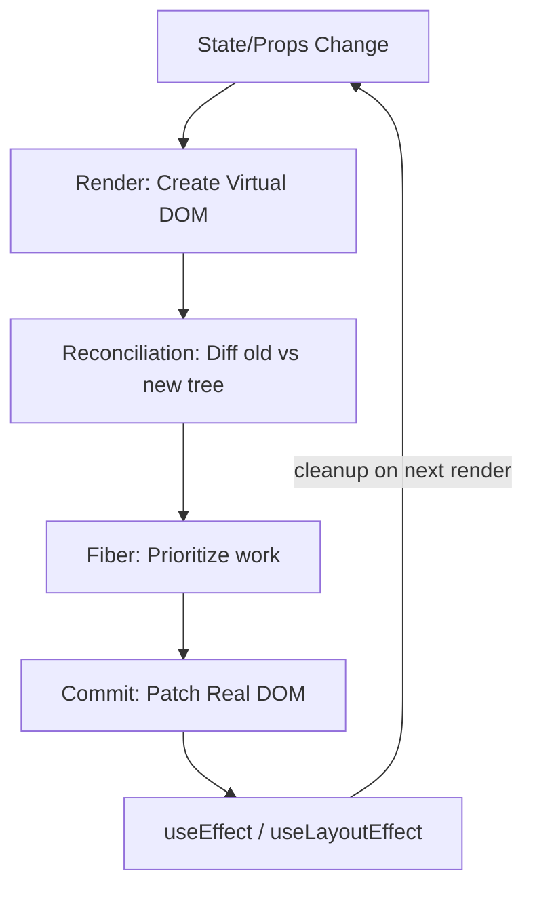

# React (Interview Prep)

## Overview

React is a declarative UI library that renders components to a Virtual DOM and reconciles changes with minimal real DOM updates. Interview focus: hooks, re-rendering, state management, and performance.

## How It Works



## Core Concepts

### Virtual DOM & Reconciliation

React keeps a lightweight JS representation of the DOM. On state change, it diffs the new tree against the old one using an O(n) heuristic: same type + key → reuse node, different type → replace subtree.

**Interview Q:** *How does Virtual DOM differ from Real DOM?*
> Real DOM repaints entire subtrees on change. Virtual DOM computes a diff and applies only the minimal patch.

**Interview Q:** *What is Fiber?*
> React 16+'s reconciliation engine. Enables incremental rendering — work is split into units (fibers) that can yield to the browser, making concurrent features (`useTransition`, `Suspense`) possible.

### JSX

JSX compiles to `React.createElement()` calls:

```jsx
const el = <div className="app"><h1>Hello</h1></div>;
// → React.createElement('div', { className: 'app' }, React.createElement('h1', null, 'Hello'))
```

### Class vs Functional Components

```jsx
class Counter extends React.Component {
  state = { count: 0 };
  increment = () => this.setState({ count: this.state.count + 1 });
  render() { return <button onClick={this.increment}>{this.state.count}</button>; }
}

function Counter() {
  const [count, setCount] = useState(0);
  return <button onClick={() => setCount(c => c + 1)}>{count}</button>;
}
```

> [!tip] Interview Answer
> Use functional components with hooks. Class components are legacy — only needed for error boundaries (until React 19).

## Hooks

### useState

```jsx
const [count, setCount] = useState(0);
const [data, setData] = useState(() => computeExpensiveValue()); // lazy init

setCount(c => c + 1); // functional updater — avoids stale closure
```

> [!warning] Gotcha
> `useState` replaces state entirely (no shallow merge like `this.setState`). Use `setState(prev => ({ ...prev, key: val }))` for objects.

### useEffect

```jsx
useEffect(() => {
  const controller = new AbortController();
  fetch(url, { signal: controller.signal })
    .then(r => r.json())
    .then(setData)
    .catch(e => { if (e.name !== 'AbortError') throw e; });
  return () => controller.abort();
}, [url]);
```

**Common bugs:**

| Bug | Cause | Fix |
|-----|-------|-----|
| Infinite loop | Missing deps or state update in effect | Check deps; use `useRef` for mutable values |
| Stale data | Closure captures old values | Add to dep array or use functional updater |
| Race condition | Earlier fetch returns after later one | AbortController or cancel flag |

### useCallback & useMemo

```jsx
const handleClick = useCallback((id) => {
  setItems(prev => prev.filter(item => item.id !== id));
}, []);

const sortedItems = useMemo(
  () => [...items].sort((a, b) => a.priority - b.priority),
  [items]
);
```

> [!tip] Pro Tip
> Only memoize when: (1) passing to a `React.memo` child, (2) computation is expensive, or (3) value used as a hook dependency. Memoization itself has cost — profile first.

### useRef

```jsx
const inputRef = useRef(null);
const countRef = useRef(0);

useEffect(() => { countRef.current += 1; }); // mutation doesn't trigger re-render
```

| | Ref | State |
|---|---|---|
| Triggers re-render? | No | Yes |
| Use for | DOM refs, timers, previous values | UI data, form values |

### useReducer

```jsx
function reducer(state, action) {
  switch (action.type) {
    case 'increment': return { count: state.count + 1 };
    case 'decrement': return { count: state.count - 1 };
    default: throw new Error(`Unknown: ${action.type}`);
  }
}

const [state, dispatch] = useReducer(reducer, { count: 0 });
dispatch({ type: 'increment' });
```

Use when: next state depends on previous, logic is complex, or you want state decoupled from components.

### useContext

```jsx
const ThemeContext = createContext('light');

function App() {
  return (
    <ThemeContext.Provider value="dark">
      <Toolbar />
    </ThemeContext.Provider>
  );
}

function ThemedButton() {
  const theme = useContext(ThemeContext);
  return <button className={theme}>Click</button>;
}
```

> [!warning] Gotcha
> Every context value change re-renders ALL consumers. Split contexts or `useMemo` the provider value.

### Custom Hooks

```jsx
function useDebounce(value, delay) {
  const [debouncedValue, setDebouncedValue] = useState(value);
  useEffect(() => {
    const timer = setTimeout(() => setDebouncedValue(value), delay);
    return () => clearTimeout(timer);
  }, [value, delay]);
  return debouncedValue;
}

function useFetch(url) {
  const [data, setData] = useState(null);
  const [error, setError] = useState(null);
  const [loading, setLoading] = useState(true);

  useEffect(() => {
    const controller = new AbortController();
    setLoading(true);
    fetch(url, { signal: controller.signal })
      .then(r => r.json())
      .then(d => { setData(d); setLoading(false); })
      .catch(e => { if (e.name !== 'AbortError') { setError(e); setLoading(false); } });
    return () => controller.abort();
  }, [url]);

  return { data, error, loading };
}
```

**Rule:** Custom hooks must start with `use`.

## State Management

### When to Use What

| Approach | Use When | Pros | Cons |
|----------|----------|------|------|
| `useState`/`useReducer` | Local, component-scoped | Simple, no deps | Can't share across distant components |
| Context API | Theme, auth, locale — low-frequency global | Built-in, no deps | Re-renders all consumers |
| Redux Toolkit | Large apps, complex state, need dev tools | Predictable, time-travel, middleware | Boilerplate, learning curve |
| Zustand | Medium apps, simple global state | Tiny, no providers, selectors | Less ecosystem than Redux |

### Context API Optimization

```jsx
// BAD: new object every render
<ThemeContext.Provider value={{ theme, setTheme }}>

// GOOD: stable reference
const value = useMemo(() => ({ theme, setTheme }), [theme]);
<ThemeContext.Provider value={value}>
```

### Zustand Example

```jsx
import { create } from 'zustand';

const useStore = create((set) => ({
  bears: 0,
  increase: () => set(state => ({ bears: state.bears + 1 })),
}));

function BearCounter() {
  const bears = useStore(state => state.bears);
  const increase = useStore(state => state.increase);
  return <><h1>{bears}</h1><button onClick={increase}>+</button></>;
}
```

### Redux Toolkit Quick

```jsx
const counterSlice = createSlice({
  name: 'counter',
  initialState: { value: 0 },
  reducers: {
    increment: state => { state.value += 1; },
  },
});

const store = configureStore({ reducer: { counter: counterSlice.reducer } });
const count = useSelector(state => state.counter.value);
const dispatch = useDispatch();
dispatch(counterSlice.actions.increment());
```

## Component Patterns

### Controlled vs Uncontrolled

```jsx
function Controlled() {
  const [value, setValue] = useState('');
  return <input value={value} onChange={e => setValue(e.target.value)} />;
}

function Uncontrolled() {
  const inputRef = useRef();
  return <input ref={inputRef} defaultValue="hello" />;
}
```

Prefer **controlled** for validation, conditional rendering, formatting. Use **uncontrolled** for non-React integration or simple prototypes.

### HOCs

```jsx
function withAuth(WrappedComponent) {
  return function AuthComponent(props) {
    const { user, loading } = useAuth();
    if (loading) return <Spinner />;
    if (!user) return <Redirect to="/login" />;
    return <WrappedComponent {...props} user={user} />;
  };
}
```

> [!warning] Gotcha
> Never use HOCs inside `render()` — they recreate the component, unmounting all state.

### Compound Components

```jsx
function Tabs({ children, defaultIndex = 0 }) {
  const [activeIndex, setActiveIndex] = useState(defaultIndex);
  const context = useMemo(() => ({ activeIndex, setActiveIndex }), [activeIndex]);
  return <TabsContext.Provider value={context}>{children}</TabsContext.Provider>;
}

Tabs.Panel = function Panel({ index, children }) {
  const { activeIndex } = useContext(TabsContext);
  return activeIndex === index ? children : null;
};
```

## Re-rendering & Performance

### Why Re-renders Happen

A component re-renders when:
1. Its **state** changes
2. Its **props** change
3. Its **context** value changes
4. Its **parent** re-renders (even if props are same)

### React.memo

```jsx
const ExpensiveList = React.memo(function ExpensiveList({ items, onSelect }) {
  return items.map(item => <Item key={item.id} item={item} onSelect={onSelect} />);
});
```

For deep comparison (profile first — custom comparators can be slower than re-rendering):

```jsx
React.memo(Component, (prev, next) => prev.data.id === next.data.id);
```

### Memoization Strategy

```jsx
function Parent() {
  const [count, setCount] = useState(0);
  const [items, setItems] = useState([]);

  const handleSelect = useCallback((id) => {
    setItems(prev => prev.filter(i => i.id !== id));
  }, []);

  const sortedItems = useMemo(
    () => [...items].sort((a, b) => a.priority - b.priority),
    [items]
  );

  return (
    <>
      <button onClick={() => setCount(c => c + 1)}>{count}</button>
      <ExpensiveList items={sortedItems} onSelect={handleSelect} />
    </>
  );
}
```

### React Profiler

```jsx
import { Profiler } from 'react';

<Profiler id="Dashboard" onRender={(id, phase, duration) => {
  console.log(`${id} ${phase} took ${duration}ms`);
}}>
  <Dashboard />
</Profiler>
```

## Lifecycle & Side Effects

### Class → Hooks Mapping

| Class Method | Hooks Equivalent |
|-------------|-----------------|
| `componentDidMount` | `useEffect(() => {}, [])` |
| `componentDidUpdate` | `useEffect(() => {}, [dep])` |
| `componentWillUnmount` | `useEffect(() => () => cleanup, [])` |
| `shouldComponentUpdate` | `React.memo` / `useMemo` |

### Stale Closures

```jsx
// BUG: count is stale in interval callback
useEffect(() => {
  const id = setInterval(() => setCount(count + 1), 1000);
  return () => clearInterval(id);
}, []);

// FIX: functional updater
useEffect(() => {
  const id = setInterval(() => setCount(c => c + 1), 1000);
  return () => clearInterval(id);
}, []);
```

## Key Interview Questions

### Why Do Keys Matter?

```jsx
// BAD: index as key — causes bugs on reorder
{items.map((item, i) => <Item key={i} item={item} />)}

// GOOD: stable unique id
{items.map(item => <Item key={item.id} item={item} />)}
```

Keys tell React which items correspond across renders. Index keys cause: wrong component state, unnecessary DOM updates, broken animations.

### Synthetic Events

React uses event delegation (attached to root node since React 17). Handlers receive a `SyntheticEvent` wrapper. React 17+ removed event pooling — `e` is no longer nullified after callback.

### useEffect vs useLayoutEffect

- `useEffect` — runs **after** paint (async, non-blocking)
- `useLayoutEffect` — runs **before** paint (sync, blocks visual)

Use `useLayoutEffect` for DOM measurements that affect layout (e.g., tooltip positioning).

### State Batching

```jsx
function handleClick() {
  setCount(c => c + 1);
  setFlag(f => !f);
  // React 18+: ONE re-render (batched everywhere)
  // React 17: TWO re-renders (only batched in React event handlers)
}
```

React 18+ batches updates in event handlers, `setTimeout`, promises, and native events. Use `ReactDOM.flushSync()` to opt out.

### Concurrent Features

```jsx
// useTransition — mark non-urgent updates
const [isPending, startTransition] = useTransition();

function handleSearch(query) {
  setSearchQuery(query);                           // urgent
  startTransition(() => setFilteredItems(filter)); // non-urgent
}

// Suspense
const LazyComponent = React.lazy(() => import('./HeavyComponent'));
<Suspense fallback={<Spinner />}>
  <LazyComponent />
</Suspense>

// useDeferredValue
const deferredQuery = useDeferredValue(searchQuery);
const filteredItems = useMemo(() => filter(items, deferredQuery), [deferredQuery, items]);
```

## React Server Components

```jsx
// ServerComponent — runs on server only, zero client JS
export default async function UserProfile({ userId }) {
  const user = await db.user.findUnique({ where: { id: userId } });
  return <h1>{user.name}</h1>;
}

// ClientComponent — "use client" directive
'use client';
import { useState } from 'react';
export default function ClientInteractions({ userId }) {
  const [isOpen, setIsOpen] = useState(false);
  return <button onClick={() => setIsOpen(!isOpen)}>Toggle</button>;
}
```

> [!tip] Interview answer for "use client"
> Marks a module and its transitive deps as client code. Server Components can't import Client Components with hooks directly, but can pass them as props (e.g., `children`).

## Testing

```jsx
import { render, screen, fireEvent, waitFor } from '@testing-library/react';
import userEvent from '@testing-library/user-event';

test('increments counter', () => {
  render(<Counter />);
  fireEvent.click(screen.getByRole('button', { name: /increment/i }));
  expect(screen.getByText('1')).toBeInTheDocument();
});

test('loads data asynchronously', async () => {
  render(<UserProfile userId={1} />);
  expect(screen.getByText(/loading/i)).toBeInTheDocument();
  await waitFor(() => expect(screen.getByText(/john/i)).toBeInTheDocument());
});
```

> [!tip] Testing Philosophy
> Test behavior, not implementation. Prefer `getByRole`, `getByLabelText`, `getByText` over `getByTestId`.

## Architecture

### Error Boundaries

```jsx
class ErrorBoundary extends React.Component {
  state = { hasError: false, error: null };

  static getDerivedStateFromError(error) {
    return { hasError: true, error };
  }

  componentDidCatch(error, info) {
    logErrorToService(error, info);
  }

  render() {
    return this.state.hasError
      ? <FallbackComponent error={this.state.error} />
      : this.props.children;
  }
}
```

Catch errors during rendering, lifecycle, and constructors of children. Do NOT catch: event handler errors (use try/catch), async errors, errors in the boundary itself.

### Code Splitting

```jsx
import { lazy, Suspense } from 'react';

const AdminPanel = lazy(() => import('./AdminPanel'));

<Suspense fallback={<Spinner />}>
  {isAdmin && <AdminPanel />}
</Suspense>
```

### Prop Drilling Solutions

| Solution | Complexity | Best For |
|----------|-----------|----------|
| Prop drilling | Low | 2-3 levels |
| Context | Medium | Theme, auth, locale |
| Zustand | Low | Medium apps, simple global state |
| Redux Toolkit | High | Large apps, dev tools, complex async |

## Quick Reference: Top 20 Interview Questions

1. **Virtual DOM** — Lightweight JS tree; React diffs and patches minimal changes
2. **Why keys?** — Identity for list items; index keys cause reorder bugs
3. **Class vs functional** — Functionals + hooks are modern; classes for error boundaries
4. **What are hooks?** — Functions letting functional components use state and effects
5. **Rules of hooks** — Top level only, no loops/conditions; only from React functions
6. **useEffect vs useLayoutEffect** — After paint vs before paint
7. **Prevent re-renders** — `React.memo`, `useCallback`, `useMemo`, split context, move state down
8. **Reconciliation** — Diffing algorithm comparing new vs old virtual DOM
9. **Controlled vs uncontrolled** — React state drives input vs DOM/ref
10. **useCallback** — Memoizes function reference; prevents child re-renders
11. **useMemo vs useCallback** — Memoizes value vs function; `useCallback(fn, deps) ≡ useMemo(() => fn, deps)`
12. **Error boundaries** — Class components catching render errors in children
13. **Fiber** — Incremental rendering engine enabling concurrent features
14. **Fragments** — `<>` returns multiple elements without extra DOM nodes
15. **useRef** — Mutable `.current` that persists but doesn't trigger re-render
16. **State batching** — Multiple `setState` in one re-render; React 18+ batches everywhere
17. **Context API** — Avoid prop drilling; all consumers re-render on change
18. **Server Components** — Server-only, zero client JS, can access DB directly
19. **Stale closures** — Hooks capture values from render; fix with functional updaters or refs
20. **Forms** — Controlled (React manages via value/onChange) or uncontrolled (ref access)

## Related Topics

- [[frontend-testing]] — testing strategies for React and other frontend frameworks
- [[graphql]] — data fetching layer commonly paired with React
- [[JavaScript]] — language fundamentals underpinning React
- [[WebSockets]] — real-time data patterns in React apps
- [[Virtual DOM]] — React's rendering optimization strategy

## External Links

- [React Official Docs](https://react.dev)
- [React Beta Docs (new)](https://react.dev/blog/2023/03/16/react-18-upgrade-guide)
- [React Testing Library](https://testing-library.com/docs/react-testing-library/intro/)
- [Zustand](https://github.com/pmndrs/zustand)
- [Redux Toolkit](https://redux-toolkit.js.org/)