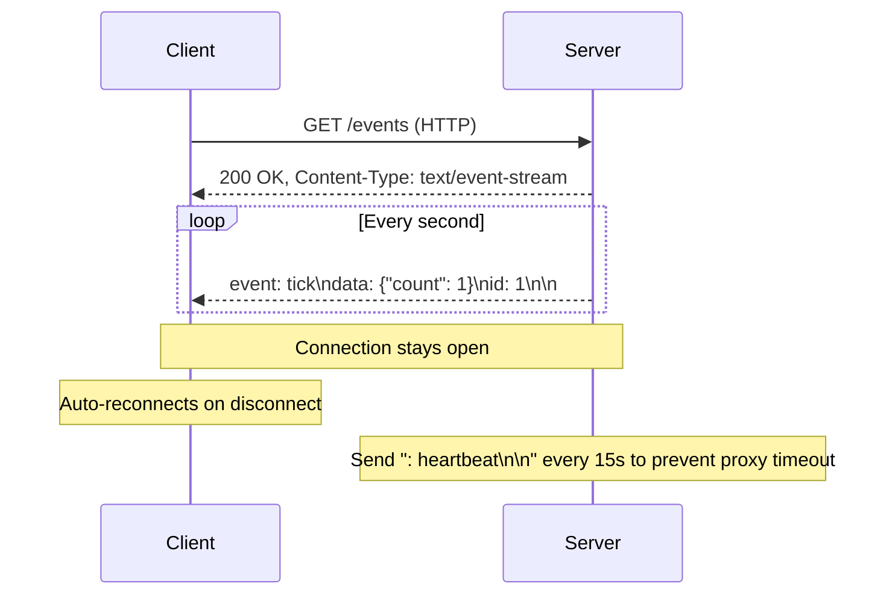

# Server-Sent Events (SSE)

## Overview

Server-Sent Events (SSE) is a web technology that enables a server to push real-time updates to a client over a single, long-lived HTTP connection. Unlike WebSockets, SSE is **unidirectional** — server to client only. The client uses the built-in `EventSource` API to receive events, and the browser automatically reconnects if the connection drops.

## How It Works

The client opens an HTTP request to an SSE endpoint. The server responds with `Content-Type: text/event-stream` and keeps the connection open, streaming text-based events whenever there's new data. Each event is separated by a double newline (`\n\n`).



### Event Stream Format

The SSE protocol uses a simple text-based format with four valid fields:

| Field | Purpose |
|-------|---------|
| `data:` | The payload (required). Multiple lines are concatenated with `\n` |
| `event:` | Event type name. Defaults to `"message"` if omitted |
| `id:` | Event ID for reconnection. Client sends `Last-Event-ID` header on reconnect |
| `retry:` | Reconnection time in milliseconds |

Lines starting with `:` are **comments** (ignored by client) — useful for keep-alive heartbeats.

### Required HTTP Headers

```
Content-Type: text/event-stream
Cache-Control: no-cache
Connection: keep-alive
X-Accel-Buffering: no   # For nginx to disable proxy buffering
```

### Reconnection Behavior

- Browser **automatically reconnects** if connection closes (unless server responds with `204 No Content`)
- On reconnect, browser sends `Last-Event-ID` header with the last received `id:` value
- Default reconnection delay is a few seconds; can be overridden with `retry:` field
- HTTP `204 No Content` tells the client to **stop** reconnecting

## Code

### Client-Side (JavaScript EventSource API)

```javascript
// Basic usage
const evtSource = new EventSource("/events");

// Connection opened
evtSource.onopen = () => {
  console.log("Connection opened");
};

// Default message events (no event: field)
evtSource.onmessage = (event) => {
  console.log("Received:", event.data);
};

// Custom named events
evtSource.addEventListener("ping", (event) => {
  const data = JSON.parse(event.data);
  console.log("Ping at:", data.time);
});

evtSource.addEventListener("userconnect", (event) => {
  const user = JSON.parse(event.data);
  console.log("User connected:", user.username);
});

// Error handling
evtSource.onerror = (err) => {
  console.error("EventSource failed:", err);
};

// Close connection manually
// evtSource.close();

// ReadyState values:
// EventSource.CONNECTING = 0
// EventSource.OPEN = 1
// EventSource.CLOSED = 2
```

### Server-Side: Node.js (Express)

```javascript
const express = require("express");
const crypto = require("crypto");
const app = express();

// Store connected clients
const clients = new Map();

app.get("/events", (req, res) => {
  const clientId = crypto.randomUUID();

  // Set SSE headers
  res.setHeader("Content-Type", "text/event-stream");
  res.setHeader("Cache-Control", "no-cache");
  res.setHeader("Connection", "keep-alive");
  res.flushHeaders();

  // Send initial connection event
  res.write(`event: connected\ndata: ${JSON.stringify({ id: clientId })}\n\n`);

  clients.set(clientId, res);

  // Remove client on disconnect
  req.on("close", () => {
    clients.delete(clientId);
  });
});

// Broadcast to all clients
function broadcast(event, data) {
  const payload = `event: ${event}\ndata: ${JSON.stringify(data)}\n\n`;
  for (const [, res] of clients) {
    res.write(payload);
  }
}

app.post("/notify", express.json(), (req, res) => {
  broadcast("notification", req.body);
  res.sendStatus(200);
});

app.listen(3000);
```

<!-- Output: -->
<!-- Server listening on port 3000. Clients receive events at /events. POST /notify broadcasts to all connected clients. -->

### Server-Side: Python (FastAPI)

```python
# pip install fastapi uvicorn sse-starlette
from fastapi import FastAPI
from sse_starlette.sse import EventSourceResponse
import asyncio
import json
import time

app = FastAPI()

async def event_generator():
    counter = 0
    while True:
        counter += 1
        yield {
            "event": "tick",
            "data": json.dumps({"count": counter, "time": time.time()}),
            "id": counter,
        }
        await asyncio.sleep(1)

@app.get("/events")
async def sse_endpoint():
    return EventSourceResponse(event_generator())
```

<!-- Output: -->
<!-- Server streams {"count": N, "time": <timestamp>} every second. -->

### Fetch API Alternative (works in Service Workers)

```javascript
const response = await fetch("/events");
const reader = response.body.getReader();
const decoder = new TextDecoder();

while (true) {
  const { done, value } = await reader.read();
  if (done) break;
  const text = decoder.decode(value);
  // Parse SSE events manually from text
  console.log("Chunk:", text);
}
```

## Key Details

### SSE vs WebSockets vs HTTP Polling

| Feature | SSE | WebSockets | HTTP Polling |
|---------|-----|------------|--------------|
| **Direction** | Server → Client only | Full duplex (bidirectional) | Client → Server (request/response) |
| **Protocol** | HTTP/1.1 or HTTP/2 | `ws://` or `wss://` (upgrade from HTTP) | HTTP/1.1 or HTTP/2 |
| **Data format** | UTF-8 text only | Binary or text | Any (JSON, XML, etc.) |
| **Auto-reconnect** | Built-in | Manual implementation | N/A |
| **Event IDs / replay** | Built-in (`id:` + `Last-Event-ID`) | Manual implementation | N/A |
| **Firewall/proxy friendly** | Yes (standard HTTP) | May be blocked | Yes |
| **Complexity** | Simple | Moderate | Simple but inefficient |

> [!warning] HTTP/1.1 Connection Limit
> Browsers limit to **6 concurrent SSE connections per domain**. Each `EventSource` uses one connection. Opening multiple tabs can exhaust this limit. HTTP/2 solves this with multiplexing (~100 streams).

> [!tip] Disable Proxy Buffering
> Reverse proxies (nginx, CDNs) may buffer SSE responses, defeating real-time delivery. Always disable buffering:
> - nginx: `proxy_buffering off;`
> - Express: `res.flushHeaders()`

> [!warning] Text-Only Data
> SSE only supports UTF-8 text. Binary data must be Base64-encoded (~33% overhead). Use [[websockets]] if you need binary data.

> [!tip] Keep-Alive Heartbeats
> Proxies and load balancers may drop idle connections. Send comment heartbeats (`: heartbeat\n\n`) every 15-30 seconds to keep the connection alive.

## When to Use

- **Live notifications** — Social media alerts, email notifications
- **Real-time dashboards** — Stock tickers, monitoring metrics, analytics
- **AI/LLM streaming** — Token-by-token response streaming (ChatGPT-style)
- **Progress updates** — File upload/download progress, build status
- **Live feeds** — News feeds, sports scores, social media timelines
- **IoT telemetry** — Sensor data streaming to web dashboards

## When NOT to Use

- Need **bidirectional** communication (use [[websockets]])
- Need **binary** data transfer (use [[websockets]])
- Need to support **Internet Explorer** (no SSE support)
- High-frequency client-to-server messaging (use [[websockets]])

## Related Topics

- [[HTTP]] — SSE runs over standard HTTP connections
- [[websockets]] — Alternative for bidirectional real-time communication
- [[Long Polling]] — Older technique that SSE replaces
- [[HTTP/2]] — Solves the 6-connection-per-domain limit via multiplexing

## External Links

- [WHATWG HTML Standard — Server-sent events](https://html.spec.whatwg.org/multipage/server-sent-events.html)
- [MDN — Using server-sent events](https://developer.mozilla.org/en-US/docs/Web/API/Server-sent_events/Using_server-sent_events)
- [MDN — EventSource API](https://developer.mozilla.org/en-US/docs/Web/API/EventSource)
- [High Performance Browser Networking — SSE chapter](https://hpbn.co)
- [EventSource Polyfill](https://github.com/Yaffle/EventSource)


- [[Microservices Architecture]] — server-to-client streaming in distributed architectures