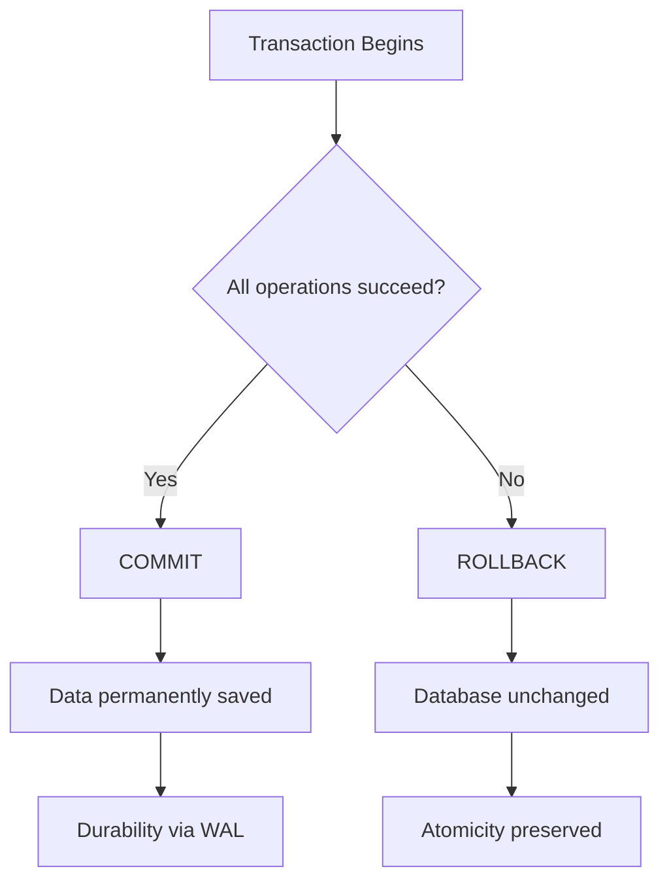
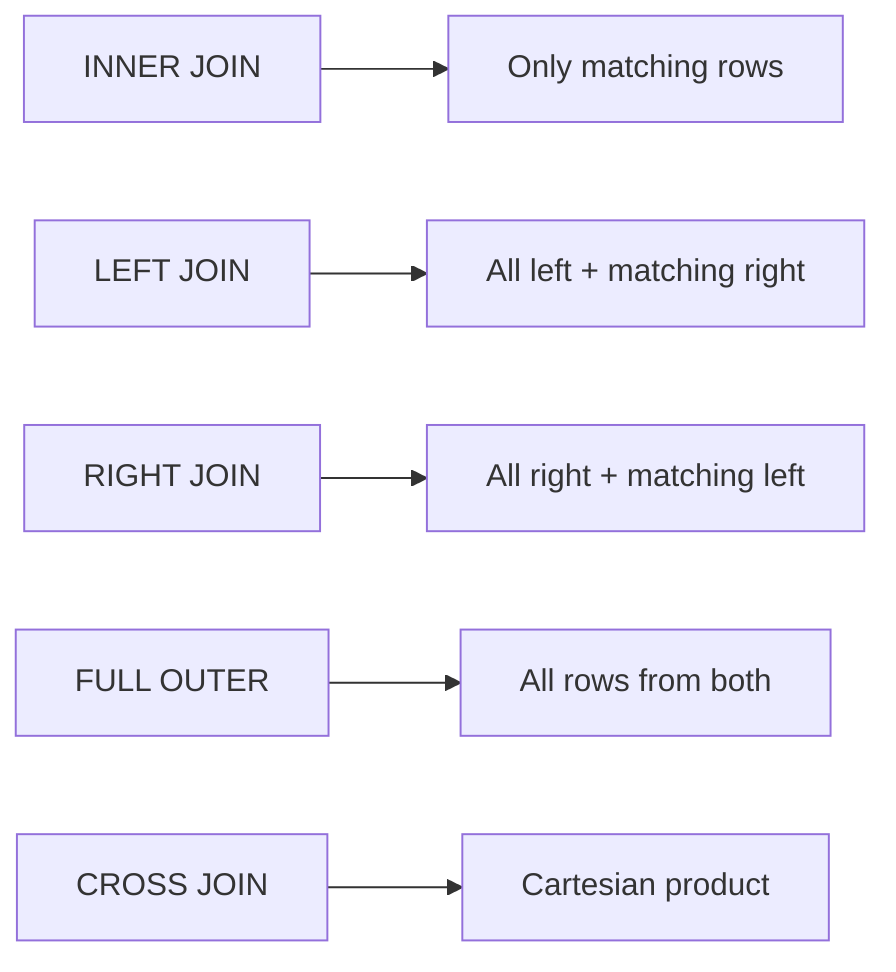
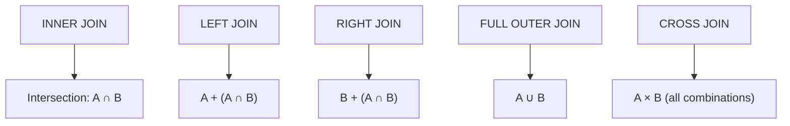
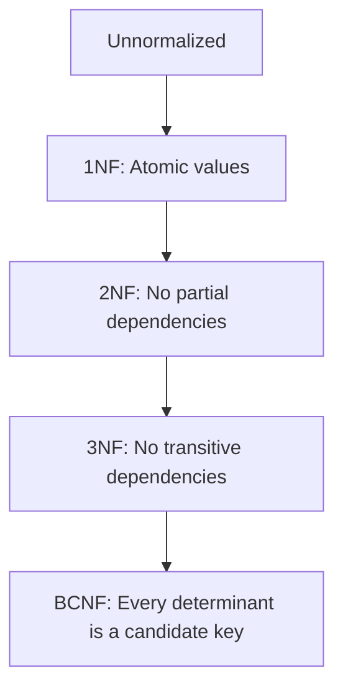

# SQL Databases

## Overview

SQL (Structured Query Language) databases, also called relational databases (RDBMS), store data in structured tables with rows and columns, enforcing a predefined schema. They power most of the world's critical systems — from banking and e-commerce to healthcare and logistics — because they guarantee data integrity through ACID properties and provide a powerful, declarative query language.

## How It Works

### Relational Model

Data is organized into **tables** (relations), where each table has:
- **Columns** (attributes) — define the structure and data types
- **Rows** (tuples) — individual records
- **Schema** — the blueprint defining tables, columns, types, and constraints

The relational model was introduced by Edgar F. Codd in 1970. His core insight: every piece of information should be stored in exactly one place, reducing redundancy and inconsistency.

### ACID Properties

Every SQL transaction guarantees four properties:

| Property | Meaning | Example |
|----------|---------|---------|
| **Atomicity** | All-or-nothing: a transaction either fully succeeds or fully fails | A bank transfer debits one account AND credits another — never just one |
| **Consistency** | Data moves from one valid state to another, respecting all constraints | A constraint preventing negative balances rejects invalid updates |
| **Isolation** | Concurrent transactions don't interfere with each other | Two users booking the last ticket can't both succeed |
| **Durability** | Once committed, data survives system crashes | Power failure after `COMMIT` — data is preserved via write-ahead logs |



## Code

### Basic SQL — DDL and DML

```sql
-- CREATE: Define the schema
CREATE TABLE departments (
    department_id INT PRIMARY KEY,
    department_name VARCHAR(100) NOT NULL,
    location VARCHAR(50)
);

CREATE TABLE employees (
    employee_id INT PRIMARY KEY,
    first_name VARCHAR(50) NOT NULL,
    last_name VARCHAR(50) NOT NULL,
    email VARCHAR(100) UNIQUE NOT NULL,
    salary DECIMAL(10, 2) CHECK (salary >= 0),
    department_id INT,
    hire_date DATE DEFAULT CURRENT_DATE,
    FOREIGN KEY (department_id) REFERENCES departments(department_id)
        ON DELETE SET NULL
        ON UPDATE CASCADE
);

-- INSERT: Add data
INSERT INTO departments VALUES
    (1, 'Engineering', 'San Francisco'),
    (2, 'Sales', 'New York'),
    (3, 'Marketing', 'Chicago');

INSERT INTO employees (employee_id, first_name, last_name, email, salary, department_id) VALUES
    (101, 'Alice', 'Chen', 'alice@company.com', 95000.00, 1),
    (102, 'Bob', 'Smith', 'bob@company.com', 85000.00, 1),
    (103, 'Carol', 'Davis', 'carol@company.com', 78000.00, 2),
    (104, 'Dan', 'Wilson', 'dan@company.com', 72000.00, 2),
    (105, 'Eve', 'Brown', 'eve@company.com', 88000.00, 3);

-- SELECT: Query data
SELECT first_name, last_name, salary
FROM employees
WHERE salary > 80000
ORDER BY salary DESC
LIMIT 3;

-- UPDATE: Modify existing data
UPDATE employees
SET salary = salary * 1.10
WHERE department_id = 1;

-- DELETE: Remove data
DELETE FROM employees
WHERE employee_id = 105;
```

<!-- Output for SELECT: -->
<!-- | first_name | last_name | salary   | -->
<!-- |------------|-----------|----------| -->
<!-- | Alice      | Chen      | 95000.00 | -->
<!-- | Eve        | Brown     | 88000.00 | -->
<!-- | Bob        | Smith     | 85000.00 | -->

### Intermediate SQL — JOINs, GROUP BY, Subqueries

```sql
-- INNER JOIN: Only matching rows in both tables
SELECT e.first_name, e.last_name, d.department_name
FROM employees e
INNER JOIN departments d ON e.department_id = d.department_id;

-- LEFT JOIN: All rows from left table, matching from right (NULL if no match)
SELECT e.first_name, d.department_name
FROM employees e
LEFT JOIN departments d ON e.department_id = d.department_id;

-- RIGHT JOIN: All rows from right table, matching from left
SELECT e.first_name, d.department_name
FROM employees e
RIGHT JOIN departments d ON e.department_id = d.department_id;

-- FULL OUTER JOIN: All rows from both tables
SELECT e.first_name, d.department_name
FROM employees e
FULL OUTER JOIN departments d ON e.department_id = d.department_id;

-- CROSS JOIN: Cartesian product (every row paired with every row)
SELECT e.first_name, d.department_name
FROM employees e
CROSS JOIN departments d;

-- GROUP BY + Aggregate Functions + HAVING
SELECT
    d.department_name,
    COUNT(e.employee_id) AS employee_count,
    AVG(e.salary) AS avg_salary,
    SUM(e.salary) AS total_salary,
    MIN(e.salary) AS min_salary,
    MAX(e.salary) AS max_salary
FROM departments d
LEFT JOIN employees e ON d.department_id = e.department_id
GROUP BY d.department_name
HAVING AVG(e.salary) > 80000
ORDER BY avg_salary DESC;

-- Subquery: Find employees earning above average
SELECT first_name, last_name, salary
FROM employees
WHERE salary > (SELECT AVG(salary) FROM employees);

-- EXISTS: More efficient than IN for correlated subqueries
SELECT first_name, last_name
FROM employees e
WHERE EXISTS (
    SELECT 1 FROM departments d
    WHERE e.department_id = d.department_id
    AND d.location = 'San Francisco'
);
```

<!-- Output for GROUP BY: -->
<!-- | department_name | employee_count | avg_salary | total_salary | min_salary | max_salary | -->
<!-- |-----------------|----------------|------------|--------------|------------|------------| -->
<!-- | Engineering     | 2              | 90000.00   | 180000.00    | 85000.00   | 95000.00   | -->

### Advanced SQL — Window Functions, CTEs, Views, Transactions

```sql
-- Window Functions: ROW_NUMBER, RANK, DENSE_RANK, LAG, LEAD
SELECT
    first_name,
    last_name,
    department_id,
    salary,
    ROW_NUMBER() OVER (PARTITION BY department_id ORDER BY salary DESC) AS row_num,
    RANK() OVER (PARTITION BY department_id ORDER BY salary DESC) AS rank,
    DENSE_RANK() OVER (PARTITION BY department_id ORDER BY salary DESC) AS dense_rank,
    LAG(salary, 1) OVER (PARTITION BY department_id ORDER BY salary DESC) AS prev_salary,
    LEAD(salary, 1) OVER (PARTITION BY department_id ORDER BY salary DESC) AS next_salary,
    salary - LAG(salary, 1) OVER (PARTITION BY department_id ORDER BY salary DESC) AS salary_diff
FROM employees;

-- CTE (Common Table Expression): Named temporary result set
WITH DepartmentStats AS (
    SELECT
        department_id,
        AVG(salary) AS avg_salary,
        COUNT(*) AS emp_count
    FROM employees
    GROUP BY department_id
)
SELECT e.first_name, e.last_name, e.salary, ds.avg_salary,
       CASE
           WHEN e.salary > ds.avg_salary THEN 'Above Average'
           WHEN e.salary = ds.avg_salary THEN 'At Average'
           ELSE 'Below Average'
       END AS salary_comparison
FROM employees e
JOIN DepartmentStats ds ON e.department_id = ds.department_id;

-- Recursive CTE: Employee hierarchy
WITH RECURSIVE OrgChart AS (
    -- Base case: top-level managers (no manager)
    SELECT employee_id, first_name, manager_id, 1 AS level
    FROM employees
    WHERE manager_id IS NULL

    UNION ALL

    -- Recursive case: subordinates
    SELECT e.employee_id, e.first_name, e.manager_id, oc.level + 1
    FROM employees e
    JOIN OrgChart oc ON e.manager_id = oc.employee_id
)
SELECT * FROM OrgChart ORDER BY level, first_name;

-- View: Saved query as a virtual table
CREATE VIEW employee_department_view AS
SELECT
    e.employee_id,
    e.first_name,
    e.last_name,
    e.salary,
    d.department_name,
    d.location
FROM employees e
JOIN departments d ON e.department_id = d.department_id;

-- Query the view like a regular table
SELECT * FROM employee_department_view WHERE location = 'San Francisco';

-- Transactions: BEGIN, COMMIT, ROLLBACK
BEGIN;

UPDATE accounts SET balance = balance - 1000 WHERE account_id = 1;
UPDATE accounts SET balance = balance + 1000 WHERE account_id = 2;

-- If both succeed:
COMMIT;

-- If something fails:
-- ROLLBACK;  -- Undoes all changes in the transaction

-- Isolation level
SET TRANSACTION ISOLATION LEVEL SERIALIZABLE;

-- Stored Procedure
CREATE PROCEDURE transfer_funds(
    IN from_account INT,
    IN to_account INT,
    IN amount DECIMAL(10,2)
)
BEGIN
    DECLARE current_balance DECIMAL(10,2);

    SELECT balance INTO current_balance
    FROM accounts WHERE account_id = from_account;

    IF current_balance >= amount THEN
        UPDATE accounts SET balance = balance - amount WHERE account_id = from_account;
        UPDATE accounts SET balance = balance + amount WHERE account_id = to_account;
        COMMIT;
    ELSE
        ROLLBACK;
        SIGNAL SQLSTATE '45000' SET MESSAGE_TEXT = 'Insufficient funds';
    END IF;
END;

-- Trigger: Automatically execute on data changes
CREATE TRIGGER log_salary_changes
AFTER UPDATE OF salary ON employees
FOR EACH ROW
BEGIN
    INSERT INTO salary_audit (employee_id, old_salary, new_salary, changed_at)
    VALUES (OLD.employee_id, OLD.salary, NEW.salary, CURRENT_TIMESTAMP);
END;
```

### Database Design — ER Diagram and Constraints

```sql
-- One-to-One: User and Profile
CREATE TABLE users (
    user_id INT PRIMARY KEY,
    username VARCHAR(50) UNIQUE NOT NULL,
    email VARCHAR(100) UNIQUE NOT NULL
);

CREATE TABLE user_profiles (
    user_id INT PRIMARY KEY,
    bio TEXT,
    avatar_url VARCHAR(255),
    FOREIGN KEY (user_id) REFERENCES users(user_id) ON DELETE CASCADE
);

-- One-to-Many: Department and Employees (already shown above)
-- The "many" side (employees) holds the foreign key

-- Many-to-Many: Students and Courses via junction table
CREATE TABLE students (
    student_id INT PRIMARY KEY,
    name VARCHAR(100) NOT NULL
);

CREATE TABLE courses (
    course_id INT PRIMARY KEY,
    title VARCHAR(200) NOT NULL,
    credits INT CHECK (credits BETWEEN 1 AND 6)
);

CREATE TABLE enrollments (
    student_id INT,
    course_id INT,
    enrollment_date DATE DEFAULT CURRENT_DATE,
    grade CHAR(2),
    PRIMARY KEY (student_id, course_id),
    FOREIGN KEY (student_id) REFERENCES students(student_id) ON DELETE CASCADE,
    FOREIGN KEY (course_id) REFERENCES courses(course_id) ON DELETE CASCADE
);
```

## Key Details

### JOIN Types Visual Guide



### JOIN Venn Diagram



### Index Types

| Index Type | Best For | Time Complexity | Notes |
|------------|----------|-----------------|-------|
| **B-Tree** (default) | Equality + range queries, sorting | O(log n) | Self-balancing tree; works for `=`, `<`, `>`, `BETWEEN`, `LIKE 'prefix%'` |
| **Hash** | Exact match only | O(1) | Useless for range queries; memory-optimized tables |
| **Bitmap** | Low-cardinality columns (few unique values) | O(1) per bitmap | Efficient for `AND`/`OR` across multiple low-cardinality columns |
| **Composite** | Multi-column WHERE/ORDER BY | O(log n) | Column order matters — leftmost prefix rule |
| **Covering** | Avoiding table lookups | O(log n) | Includes all needed columns via `INCLUDE` clause |
| **Partial/Filtered** | Subset of rows | O(log n) on subset | `WHERE` clause on index; saves space |

```sql
-- B-Tree (default)
CREATE INDEX idx_email ON employees(email);

-- Hash index (PostgreSQL)
CREATE INDEX idx_email_hash ON employees USING HASH(email);

-- Composite index — column order matters!
CREATE INDEX idx_dept_salary ON employees(department_id, salary DESC);

-- Covering index (PostgreSQL)
CREATE INDEX idx_orders_covering
ON orders(user_id, created_at) INCLUDE (total, status);

-- Partial index
CREATE INDEX idx_pending_orders
ON orders(created_at) WHERE status = 'pending';
```

> [!warning] Index Tradeoff
> Indexes speed up reads but slow down writes (INSERT, UPDATE, DELETE) because every index must be updated. Over-indexing is a common mistake. Only index columns used in WHERE, JOIN, ORDER BY, or GROUP BY clauses.

### Query Execution Plans

```sql
-- EXPLAIN: Shows the planned execution strategy
EXPLAIN SELECT * FROM employees WHERE email = 'alice@company.com';

-- EXPLAIN ANALYZE: Actually runs the query and shows real timing
EXPLAIN ANALYZE SELECT * FROM employees WHERE email = 'alice@company.com';
```

Common scan types:
- **Seq Scan** — reads entire table (fine for small tables or when most rows match)
- **Index Scan** — finds row via index, then fetches from table
- **Index Only Scan** — returns from index alone (no table access; requires covering index)
- **Bitmap Index Scan** — builds bitmap from index, then accesses table (medium selectivity)

### Normalization

Normalization eliminates redundancy and anomalies by progressively splitting tables:

| Normal Form | Rule | Eliminates |
|-------------|------|------------|
| **1NF** | Atomic values, no repeating groups, unique rows | Repeating groups |
| **2NF** | 1NF + no partial dependencies (non-key columns depend on full primary key) | Partial dependencies |
| **3NF** | 2NF + no transitive dependencies (non-key columns depend only on primary key) | Transitive dependencies |
| **BCNF** | 3NF + every determinant is a candidate key | Remaining anomalies with overlapping candidate keys |



### Transaction Isolation Levels

| Isolation Level | Dirty Read | Non-repeatable Read | Phantom Read | Performance |
|-----------------|------------|---------------------|--------------|-------------|
| **READ UNCOMMITTED** | Possible | Possible | Possible | Fastest |
| **READ COMMITTED** | Prevented | Possible | Possible | Fast (Oracle/SQL Server default) |
| **REPEATABLE READ** | Prevented | Prevented | Possible | Medium (MySQL default) |
| **SERIALIZABLE** | Prevented | Prevented | Prevented | Slowest |

```sql
-- Set isolation level
SET TRANSACTION ISOLATION LEVEL READ COMMITTED;

-- PostgreSQL default: READ COMMITTED
-- MySQL default: REPEATABLE READ
-- SQL Server default: READ COMMITTED
-- Oracle default: READ COMMITTED
```

> [!tip] Practical Guidance
> Use `READ COMMITTED` for most applications. Use `SERIALIZABLE` only when correctness is critical (financial transactions). `READ UNCOMMITTED` is rarely appropriate — it's equivalent to `NOLOCK` in SQL Server.

### N+1 Query Problem

The N+1 problem occurs when an ORM fetches a list of N records, then issues a separate query for each record's related data:

```sql
-- Problem: 1 query for posts + N queries for authors
SELECT * FROM posts;                    -- 1 query
SELECT * FROM authors WHERE id = 1;     -- N queries (one per post)
SELECT * FROM authors WHERE id = 2;
-- ...

-- Solution: Single JOIN query
SELECT p.*, a.name AS author_name
FROM posts p
INNER JOIN authors a ON p.author_id = a.id;
```

### Index Selectivity

Selectivity = (number of distinct values) / (total rows)

- **High selectivity** (close to 1.0) — good for indexing (e.g., email, SSN)
- **Low selectivity** (close to 0.0) — poor for indexing (e.g., gender, boolean)

```sql
-- Check selectivity
SELECT
    COUNT(DISTINCT department_id) * 1.0 / COUNT(*) AS selectivity
FROM employees;
```

### Connection Pooling

```
Client App → Connection Pool (PgBouncer, HikariCP) → Database Server
              Reuses existing connections
              Limits max concurrent connections
              Reduces connection overhead
```

## When to Use

- **Financial systems** — ACID guarantees for banking, payments, accounting
- **E-commerce** — inventory management, order processing, customer data
- **Healthcare** — patient records, compliance (HIPAA), audit trails
- **ERP/CRM systems** — complex relationships, reporting, data integrity
- **Analytics/BI** — complex queries, aggregations, window functions
- **Any system where data integrity is non-negotiable**

## Drawbacks

- **Rigid schema** — schema changes require migrations; not ideal for rapidly evolving data models
- **Horizontal scaling is hard** — sharding adds complexity; read replicas only help with read-heavy workloads
- **Not ideal for unstructured data** — JSON support exists but is not as flexible as document databases
- **Write bottlenecks** — single primary node for writes; high write throughput requires sharding
- **Complexity overhead** — normalization, indexing strategy, query optimization require expertise
- **Not the best choice for**: session storage, caching, time-series data at massive scale, graph traversals, full-text search (use Redis, Elasticsearch, or specialized databases instead)

## SQL Database Comparison

| Feature | PostgreSQL | MySQL | SQLite | SQL Server | Oracle |
|---------|------------|-------|--------|------------|--------|
| **Type** | Open-source | Open-source | Embedded | Commercial | Commercial |
| **License** | PostgreSQL | GPL (Oracle) | Public Domain | Proprietary | Proprietary |
| **Best For** | Complex queries, analytics, extensibility | Web apps, read-heavy OLTP | Embedded, mobile, edge | Enterprise Windows ecosystems | Large enterprise, mission-critical |
| **ACID** | Full | Full (InnoDB) | Full | Full | Full |
| **JSON** | Excellent (JSONB) | Good | Limited | Good | Good |
| **Extensions** | Rich (PostGIS, etc.) | Limited | None | Limited | Limited |
| **Concurrency** | MVCC, excellent | Thread-per-connection | Serialized writes | MVCC | MVCC |
| **Window Functions** | Yes (since 8.4) | Yes (since 8.0) | Yes (since 3.25) | Yes | Yes |
| **CTEs** | Yes | Yes (since 8.0) | Yes (since 3.8.3) | Yes | Yes |
| **Cost** | Free | Free | Free | Expensive | Very expensive |

## Related Topics

- [[Database Architecture]] — managed vs self-hosted, read replicas, connection pooling, backups
- [[Database Normalization]] — deeper dive into 1NF through BCNF with examples
- [[Indexing Strategies]] — B-tree internals, covering indexes, index-only scans
- [[CAP Theorem]] — tradeoffs in distributed databases
- [[NoSQL Databases]] — when SQL isn't the right choice
- [[Connection Pooling]] — PgBouncer, HikariCP, and connection management
- [[Query Optimization]] — EXPLAIN ANALYZE, execution plans, cost-based optimizers
- [[Sharding]] — horizontal scaling for SQL databases
- [[Transactions and Concurrency]] — MVCC, lock types, deadlock detection

## External Links

- [PostgreSQL Official Documentation](https://www.postgresql.org/docs/)
- [MySQL Reference Manual](https://dev.mysql.com/doc/)
- [SQLite Documentation](https://www.sqlite.org/docs.html)
- [SQL Tutorial - W3Schools](https://www.w3schools.com/sql/)
- [Database Normalization Guide - Dataquest](https://www.dataquest.io/blog/sql-normalization/)
- [SQL Isolation Levels Explained - CockroachDB](https://www.cockroachlabs.com/blog/sql-isolation-levels-explained/)
- [SQL Window Functions - ThoughtSpot](https://www.thoughtspot.com/sql-tutorial/sql-window-functions)
- [Database Indexing Explained](https://www.gocodeo.com/post/types-of-database-indexes-when-to-use-b-tree-hash-and-full-text-indexes)
- [N+1 Query Problem - PlanetScale](https://planetscale.com/blog/what-is-n-1-query-problem-and-how-to-solve-it)
- [Database Scaling Strategies - Codelit](https://codelit.io/blog/database-scaling-strategies)
- [Consistent Hashing - GeeksforGeeks](https://www.geeksforgeeks.org/system-design/consistent-hashing/)
