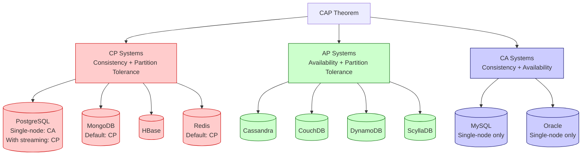
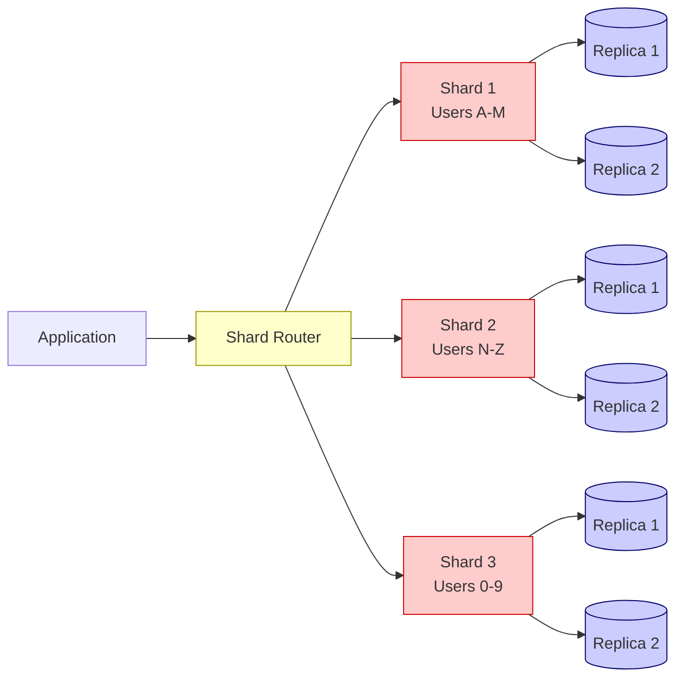
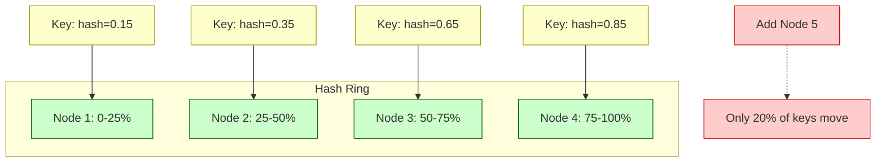
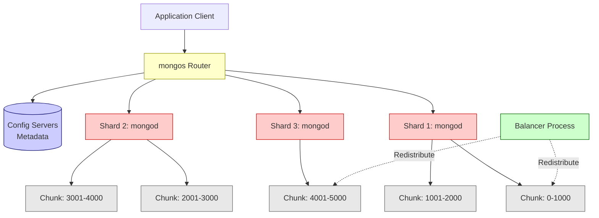
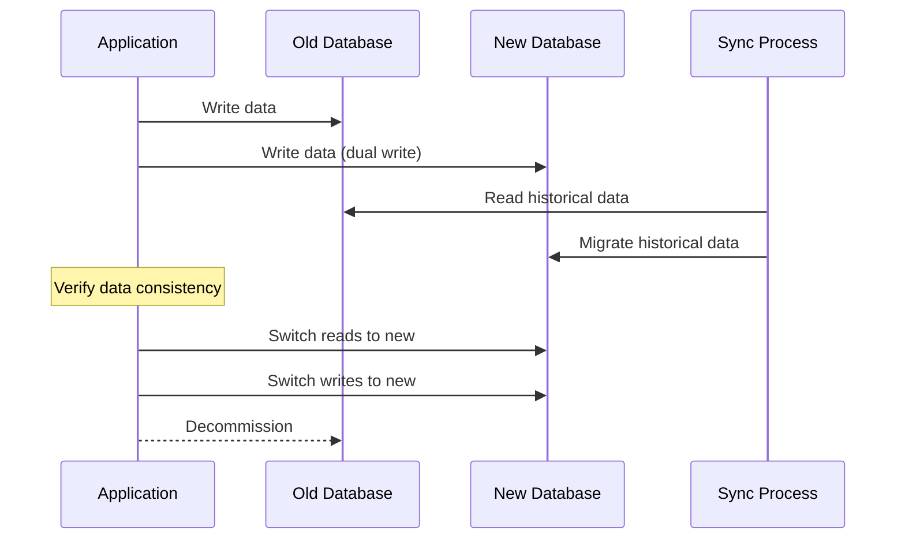

# SQL vs NoSQL Databases

## Overview

SQL (relational) and NoSQL (non-relational) databases represent two fundamentally different approaches to data storage, retrieval, and management. SQL databases use structured tables with rigid schemas and ACID transactions, while NoSQL databases offer flexible data models (documents, key-value, wide-column, graph) with horizontal scalability. Understanding their tradeoffs is essential for system design decisions.

## Core Differences

### Data Model & Schema

| Aspect | SQL (Relational) | NoSQL (Non-Relational) |
|--------|-----------------|----------------------|
| **Data Model** | Tables with rows and columns | Documents, key-value pairs, wide-columns, graphs |
| **Schema** | Rigid, predefined schema (DDL) | Flexible, schema-less or dynamic schema |
| **Relationships** | Foreign keys, JOINs across tables | Denormalization, embedded documents, application-level joins |
| **Normalization** | Highly normalized (1NF-5NF) | Denormalized by design |
| **Data Types** | Strictly typed columns | Heterogeneous data within collections |
| **Examples** | PostgreSQL, MySQL, Oracle, SQL Server | MongoDB, Cassandra, Redis, Neo4j, DynamoDB |

### SQL Table Example

```sql
CREATE TABLE users (
    id SERIAL PRIMARY KEY,
    email VARCHAR(255) NOT NULL UNIQUE,
    name VARCHAR(100) NOT NULL,
    created_at TIMESTAMP DEFAULT NOW()
);

CREATE TABLE orders (
    id SERIAL PRIMARY KEY,
    user_id INTEGER REFERENCES users(id),
    total DECIMAL(10,2) NOT NULL,
    status VARCHAR(50) DEFAULT 'pending'
);

-- JOIN across tables
SELECT u.name, o.total
FROM users u
JOIN orders o ON u.id = o.user_id
WHERE o.status = 'completed';
```

### MongoDB Document Example

```javascript
// Single document embeds related data (denormalized)
db.users.insertOne({
    name: "Alice",
    email: "alice@example.com",
    orders: [
        { id: 1, total: 99.99, status: "completed", items: [...] },
        { id: 2, total: 45.50, status: "pending", items: [...] }
    ],
    preferences: { theme: "dark", notifications: true }
});

// Query by nested field
db.users.find({ "orders.status": "pending" });
```

### ACID vs BASE

| Property | ACID (SQL) | BASE (NoSQL) |
|----------|-----------|-------------|
| **Philosophy** | Strong consistency, safety first | Eventual consistency, availability first |
| **Atomicity** | All-or-nothing transactions | Not guaranteed (multi-document transactions in some) |
| **Consistency** | Every read sees latest write | Eventual consistency; replicas converge over time |
| **Isolation** | Concurrent transactions don't interfere | Weak isolation; concurrent writes may conflict |
| **Durability** | Committed data survives crashes | Usually durable, but tradeoffs exist |
| **Use Case** | Banking, payments, inventory | Social feeds, caching, IoT, analytics |

> [!warning] ACID vs CAP Consistency
> ACID **Consistency** means database invariants are preserved (constraints, triggers). CAP **Consistency** means all nodes see the same data at the same time. These are different concepts despite the same name.

### Scaling

| Aspect | SQL | NoSQL |
|--------|-----|-------|
| **Primary Scaling** | Vertical (scale up: bigger CPU, more RAM) | Horizontal (scale out: more servers) |
| **Read Replicas** | Supported but writes bottleneck on primary | Native distributed writes across nodes |
| **Sharding** | Complex, often manual or via extensions | Built-in, automatic in most systems |
| **Max Data Size** | Limited by single server capacity | Virtually unlimited across clusters |
| **Performance** | Predictable for complex queries | Optimized for simple, high-throughput operations |

### Query Language

| Feature | SQL | NoSQL |
|---------|-----|-------|
| **Language** | Standardized SQL (ANSI) | Vendor-specific APIs or query languages |
| **Joins** | Native, optimized JOIN operations | Limited or absent; application-level resolution |
| **Aggregations** | GROUP BY, HAVING, window functions | Aggregation pipelines (MongoDB), CQL aggregations |
| **Transactions** | Multi-table, multi-row ACID transactions | Single-document or limited scope |
| **Ad-hoc Queries** | Excellent — query any field with indexes | Requires pre-planned indexes; full scans otherwise |

## CAP Theorem

The **CAP theorem** (Brewer's theorem) states that any distributed data store can guarantee at most **two of three** properties:

- **Consistency (C)** — Every read receives the most recent write or an error
- **Availability (A)** — Every request receives a response (without guarantee it's the latest)
- **Partition Tolerance (P)** — System continues operating despite network partitions

> [!important] The Reality
> In distributed systems, partition tolerance is **non-negotiable** — networks will fail. The real choice is between **Consistency** and **Availability** when partitions occur.

### CAP Positioning



### PACELC Extension

The **PACELC theorem** extends CAP: even without partitions, there's a tradeoff between **Latency** and **Consistency**.

- **P**artition → choose **A**vailability or **C**onsistency
- **E**lse → choose **L**atency or **C**onsistency

| Database | During Partition | During Normal Operation |
|----------|-----------------|----------------------|
| MongoDB | Consistency | Consistency |
| Cassandra | Availability | Latency |
| PostgreSQL | Consistency | Consistency |
| DynamoDB | Availability | Latency |
| CockroachDB | Consistency | Consistency |

## When to Use SQL

### Decision Criteria

Choose SQL databases when:

1. **ACID compliance is non-negotiable** — financial transactions, inventory management
2. **Complex queries and reporting** — multi-table JOINs, aggregations, window functions
3. **Data integrity is critical** — foreign key constraints, unique constraints, check constraints
4. **Structured, predictable data** — schema changes infrequently
5. **Regulatory compliance** — audit trails, data lineage, referential integrity

### Specific Use Cases

| Use Case | Why SQL | Example |
|----------|---------|---------|
| **Banking & Payments** | ACID transactions prevent double-spending, lost updates | Core banking systems, payment gateways |
| **ERP Systems** | Complex relationships between entities, reporting needs | SAP, Oracle ERP, inventory management |
| **E-commerce Inventory** | Stock consistency, order processing, ACID guarantees | Order management, stock tracking |
| **Healthcare Records** | Data integrity, audit trails, compliance (HIPAA) | Patient records, prescription systems |
| **Government Systems** | Strict schema, compliance, audit requirements | Tax systems, census data, registries |

### PostgreSQL Example: Banking Transaction

```sql
BEGIN;

-- Deduct from sender
UPDATE accounts
SET balance = balance - 1000.00
WHERE account_id = 'ACC_001'
  AND balance >= 1000.00;

-- Add to receiver
UPDATE accounts
SET balance = balance + 1000.00
WHERE account_id = 'ACC_002';

-- Record the transaction
INSERT INTO transactions (from_account, to_account, amount, status)
VALUES ('ACC_001', 'ACC_002', 1000.00, 'completed');

COMMIT;
-- If any step fails, ROLLBACK ensures no partial state
```

## When to Use NoSQL

### Decision Criteria

Choose NoSQL databases when:

1. **Rapidly evolving schema** — agile development, frequent feature changes
2. **Massive scale** — millions of reads/writes per second, petabytes of data
3. **Unstructured/semi-structured data** — JSON, logs, sensor data, user-generated content
4. **Horizontal scaling required** — distributed architecture from day one
5. **Real-time analytics** — high-throughput ingestion, time-series data

### NoSQL Types and Use Cases

| Type | Best For | Examples | Real-World Use |
|------|----------|----------|---------------|
| **Document** | Content management, catalogs, user profiles | MongoDB, CouchDB | Product catalogs, CMS |
| **Key-Value** | Caching, session storage, real-time data | Redis, DynamoDB | Shopping carts, session tokens |
| **Wide-Column** | Time-series, IoT, analytics at scale | Cassandra, ScyllaDB | IoT telemetry, messaging systems |
| **Graph** | Social networks, recommendations, fraud detection | Neo4j, Amazon Neptune | Social graphs, recommendation engines |

### Specific Use Cases

| Use Case | Why NoSQL | Example |
|----------|-----------|---------|
| **Social Media Feeds** | High write throughput, flexible schema, horizontal scale | Twitter timelines, Facebook posts |
| **IoT Telemetry** | Massive ingestion rate, time-series patterns | Sensor data, smart home devices |
| **Session Storage** | Low-latency key-value access, TTL support | User sessions, rate limiting |
| **Content Management** | Flexible document structure, nested data | Blog posts with variable metadata |
| **Real-time Analytics** | High-throughput writes, eventual consistency acceptable | Clickstream analysis, A/B testing |

### MongoDB Example: Product Catalog

```javascript
// Flexible schema — different products have different fields
db.products.insertMany([
    {
        name: "Laptop",
        category: "electronics",
        price: 999.99,
        specs: { cpu: "M2", ram: "16GB", storage: "512GB SSD" },
        reviews: [{ user: "alice", rating: 5, comment: "Great!" }]
    },
    {
        name: "T-Shirt",
        category: "clothing",
        price: 29.99,
        sizes: ["S", "M", "L", "XL"],
        colors: ["red", "blue"],
        material: "cotton"
    }
]);
```

## Why We Need Elasticsearch

### What Is Elasticsearch?

Elasticsearch is a **distributed, RESTful search and analytics engine** built on Apache Lucene. It is fundamentally different from both SQL databases and document stores like MongoDB because it uses an **inverted index** optimized for full-text search.

### How It Differs

| Feature | PostgreSQL | MongoDB | Elasticsearch |
|---------|-----------|---------|--------------|
| **Primary Purpose** | Transactional data storage | Document storage | Full-text search & analytics |
| **Index Type** | B-tree indexes | B-tree indexes | **Inverted index** |
| **Text Search** | LIKE, full-text search (basic) | Text indexes (limited) | **Advanced: fuzzy, stem, synonym, phrase** |
| **Relevance Scoring** | None (binary match) | None (binary match) | **BM25, TF-IDF, custom scoring** |
| **Analyzers** | Basic tokenization | Basic tokenization | **Language analyzers, custom analyzers, n-grams** |
| **Aggregations** | SQL GROUP BY | Aggregation pipeline | **Real-time analytics on search results** |
| **Latency** | ms for indexed queries | ms for key lookups | **sub-ms for text search** |

### Inverted Index Explained

An inverted index maps **terms to documents** (opposite of a document-to-terms mapping):

```
Term       → Documents containing the term
"database" → [doc1, doc3, doc7]
"search"   → [doc1, doc2, doc5]
"fast"     → [doc2, doc3, doc6]
"elasticsearch" → [doc1, doc4, doc7]
```

Query "database search" → intersect [doc1, doc3, doc7] ∩ [doc1, doc2, doc5] = **[doc1]**

### Analyzers and Tokenization

```json
// Elasticsearch analyzer pipeline
{
  "analyzer": {
    "my_analyzer": {
      "tokenizer": "standard",
      "filter": ["lowercase", "stop", "snowball"]
    }
  }
}

// "The Quick Brown Foxes" → ["quick", "brown", "fox"]
// Steps: tokenize → lowercase → remove stopwords → stem
```

### Relevance Scoring (BM25)

Elasticsearch scores documents using the **BM25 algorithm**:

$$
\text{score}(D, Q) = \sum_{i=1}^{n} \text{IDF}(q_i) \cdot \frac{f(q_i, D) \cdot (k_1 + 1)}{f(q_i, D) + k_1 \cdot (1 - b + b \cdot \frac{|D|}{\text{avgdl}})}
$$

Where:
- `f(q_i, D)` = term frequency in document
- `IDF(q_i)` = inverse document frequency
- `|D|` = document length
- `avgdl` = average document length

### When to Use Elasticsearch

| Scenario | Why Elasticsearch Over SQL/MongoDB |
|----------|-----------------------------------|
| **E-commerce search** | Fuzzy matching, synonyms, typo tolerance, relevance ranking |
| **Log analysis (ELK)** | Ingest millions of logs/sec, full-text search across unstructured logs |
| **Autocomplete** | Edge n-grams, prefix matching, instant suggestions |
| **Content search** | Multi-language support, stemming, phrase matching |
| **Geospatial search** | Geo-distance, geo-shapes, spatial aggregations |
| **Vector/AI search** | Dense vector storage, semantic search, hybrid retrieval |

### Why MongoDB/PostgreSQL Aren't Enough for Search

> [!warning] The LIKE Problem
> `SELECT * FROM products WHERE name LIKE '%wireless%'` performs a **full table scan** — O(n) complexity. It cannot handle typos, synonyms, or relevance ranking.

| Limitation | SQL/MongoDB | Elasticsearch |
|------------|-------------|--------------|
| Typo tolerance | No native support | Fuzzy queries, edit distance |
| Synonyms | Manual mapping | Synonym token filters |
| Relevance ranking | None (match/no-match) | BM25 scoring, custom boost |
| Multi-language | Basic | Language-specific analyzers |
| Autocomplete | Prefix indexes only | Edge n-grams, completion suggester |
| Phrase search | Exact match only | Proximity queries, slop |

## What Is Sharding

### Definition

**Sharding** is horizontal partitioning of data across multiple database servers. Each shard holds a subset of the total data, and together they form the complete dataset. Unlike replication (copies of the same data), sharding distributes **different** data across servers.



### Shard Key Selection

Choosing the right shard key is critical. Evaluate on three dimensions:

| Criterion | Good | Bad | Why |
|-----------|------|-----|-----|
| **Cardinality** | High (user_id, email) | Low (country, status) | High cardinality distributes data evenly |
| **Query Frequency** | Appears in most queries | Rarely queried | Avoids scatter-gather across all shards |
| **Monotonicity** | Hashed values | Timestamps, auto-increment IDs | Monotonic keys create hot shards (all writes to one shard) |

> [!tip] Hash-Based Shard Keys
> Use `hash(user_id)` instead of `user_id` directly to avoid hotspots from sequential IDs.

### Sharding Strategies

| Strategy | How It Works | Pros | Cons | Best For |
|----------|-------------|------|------|----------|
| **Range-Based** | Shard by value ranges (A-M, N-Z) | Easy to understand, range queries efficient | Hot spots if data is skewed | Geographic data, alphabetical |
| **Hash-Based** | `hash(key) % num_shards` | Even distribution, no hotspots | Range queries require scatter-gather | User IDs, session tokens |
| **Directory-Based** | Lookup table maps keys to shards | Flexible, can rebalance easily | Single point of failure (lookup service) | Dynamic workloads |
| **Consistent Hashing** | Hash ring with virtual nodes | Minimal data movement on add/remove | Complex implementation | Distributed caches, DynamoDB |

### Consistent Hashing



**Key property:** When adding or removing a node, only `1/n` of keys need to be remapped (vs. `hash % n` which remaps almost everything).

### MongoDB Sharding Architecture



**Components:**
- **mongos** — Query router, directs operations to correct shards
- **Config servers** — Store metadata (chunk ranges, shard locations)
- **Shards** — Actual data storage (mongod instances)
- **Chunks** — Data ranges (default 64MB), the unit of migration
- **Balancer** — Background process that migrates chunks to balance load

### PostgreSQL Sharding

PostgreSQL implements sharding through two approaches:

**1. Declarative Partitioning (built-in, single server):**

```sql
CREATE TABLE orders (
    id SERIAL,
    user_id INTEGER,
    amount DECIMAL,
    created_at DATE
) PARTITION BY RANGE (created_at);

CREATE TABLE orders_2024_q1 PARTITION OF orders
    FOR VALUES FROM ('2024-01-01') TO ('2024-04-01');

CREATE TABLE orders_2024_q2 PARTITION OF orders
    FOR VALUES FROM ('2024-04-01') TO ('2024-07-01');
```

**2. Citus Extension (distributed, multi-server):**

```sql
-- Convert table to distributed (sharded)
SELECT create_distributed_table('orders', 'user_id');

-- Queries are automatically routed to the correct shard
SELECT * FROM orders WHERE user_id = 42;  -- Goes to one shard
SELECT user_id, SUM(amount) FROM orders GROUP BY user_id;  -- Scatter-gather
```

### Sharding Pros and Cons

| Pros | Cons |
|------|------|
| Horizontal scalability — add servers for more capacity | Cross-shard queries require scatter-gather (slow) |
| Write throughput increases with more shards | Rebalancing is complex and resource-intensive |
| Fault isolation — one shard failure doesn't affect others | Hot shards — uneven data distribution |
| Data locality — can place shards near users | Multi-shard transactions are complex or impossible |
| Reduced index size per shard | Schema changes require coordination across shards |
| Independent backup/restore per shard | Operational complexity increases significantly |

> [!warning] Sharding is a Last Resort
> Sharding adds significant complexity. Always exhaust these optimizations first: better indexes, query optimization, read replicas, caching, vertical scaling.

## Hybrid Approaches

### Polyglot Persistence

Modern systems often use **multiple databases** for different purposes:

```mermaid
graph LR
    App[Application]
    
    App --> PostgreSQL[(PostgreSQL<br/>Transactions, Users, Orders)]
    App --> MongoDB[(MongoDB<br/>Product Catalog, Content)]
    App --> Redis[(Redis<br/>Sessions, Cache, Rate Limiting)]
    App --> ES[(Elasticsearch<br/>Search, Log Analysis)]
    App --> Neo4j[(Neo4j<br/>Recommendations, Social Graph)]
    
    CDC[CDC Pipeline] -.->|Sync| ES
    CDC -.->|Sync| Redis
    
    classDef app fill:#ffffcc,stroke:#999900
    classDef sql fill:#ffcccc,stroke:#cc0000
    classDef nosql fill:#ccffcc,stroke:#006600
    classDef cache fill:#ccccff,stroke:#000066
    classDef search fill:#ffccff,stroke:#990099
    classDef graph fill:#ccffff,stroke:#009999
    classDef cdc fill:#e8e8e8,stroke:#666666
    
    class App app
    class PostgreSQL sql
    class MongoDB nosql
    class Redis cache
    class ES search
    class Neo4j graph
    class CDC cdc
```

**Real-world example: E-commerce platform**

| Component | Database | Why |
|-----------|----------|-----|
| Orders, Payments | PostgreSQL | ACID transactions, financial integrity |
| Product Catalog | MongoDB | Flexible schema, nested attributes |
| Search | Elasticsearch | Full-text search, relevance, autocomplete |
| Session/Cart | Redis | Sub-millisecond latency, TTL |
| Recommendations | Neo4j | Graph traversal for "users who bought X" |

### NewSQL

NewSQL databases combine SQL interface and ACID guarantees with horizontal scalability:

| Database | Architecture | Consensus | Best For |
|----------|-------------|-----------|----------|
| **CockroachDB** | Distributed SQL, PostgreSQL-compatible | Raft | Global deployments, multi-region |
| **TiDB** | MySQL-compatible, separated compute/storage | Raft | HTAP (hybrid transactional/analytical) |
| **YugabyteDB** | PostgreSQL-compatible, distributed | Raft | Cloud-native, microservices |
| **Google Spanner** | Globally distributed, TrueTime API | Paxos | Global consistency, financial systems |

### PostgreSQL with JSONB

PostgreSQL bridges SQL and NoSQL with JSONB:

```sql
-- JSONB column with flexible schema
CREATE TABLE products (
    id SERIAL PRIMARY KEY,
    name VARCHAR(255) NOT NULL,
    price DECIMAL(10,2) NOT NULL,
    attributes JSONB,  -- Flexible document storage
    created_at TIMESTAMP DEFAULT NOW()
);

-- Insert JSON data
INSERT INTO products (name, price, attributes)
VALUES ('Laptop', 999.99, '{"cpu": "M2", "ram": "16GB", "colors": ["silver", "space gray"]}');

-- Query JSON fields with GIN index
CREATE INDEX idx_products_attributes ON products USING GIN (attributes);

SELECT * FROM products
WHERE attributes->>'cpu' = 'M2'
  AND attributes @> '{"ram": "16GB"}';
```

## Decision Framework

```mermaid
graph TD
    Start{What are your<br/>primary requirements?}
    
    Start -->|ACID Transactions| ACID{Need horizontal<br/>scale?}
    Start -->|Flexible Schema| Schema{Data volume<br/>and velocity?}
    Start -->|Full-Text Search| ES[Use Elasticsearch<br/>+ primary database]
    Start -->|Graph Relationships| Graph[Use Neo4j /<br/>Amazon Neptune]
    
    ACID -->|No, single server| SQL[PostgreSQL / MySQL]
    ACID -->|Yes, distributed| NewSQL{Need SQL<br/>compatibility?}
    
    NewSQL -->|Yes| Cockroach[cockroachDB / TiDB /<br/>YugabyteDB]
    NewSQL -->|No, accept tradeoffs| Evaluate[Evaluate CP vs AP]
    
    Schema -->|High volume,<br/>horizontal scale| NoSQLType{Data pattern?}
    Schema -->|Low volume,<br/>simple scale| SQL
    
    NoSQLType -->|Documents, nested data| Mongo[MongoDB / CouchDB]
    NoSQLType -->|Key-value, caching| Redis[Redis / DynamoDB]
    NoSQLType -->|Time-series, wide columns| Cassandra[Cassandra / ScyllaDB]
    NoSQLType -->|Social, recommendations| Graph
    
    classDef decision fill:#ffffcc,stroke:#999900
    classDef sql fill:#ffcccc,stroke:#cc0000
    classDef nosql fill:#ccffcc,stroke:#006600
    classDef search fill:#ffccff,stroke:#990099
    classDef graph fill:#ccffff,stroke:#009999
    classDef newsql fill:#ccccff,stroke:#000066
    
    class Start,ACID,Schema,NoSQLType,NewSQL,Evaluate decision
    class SQL sql
    class Mongo,Redis,Cassandra nosql
    class ES search
    class Graph graph
    class Cockroach newsql
```

### Quick Decision Matrix

| Requirement | Best Choice | Alternative |
|------------|-------------|------------|
| Financial transactions | PostgreSQL | CockroachDB |
| Product catalog with search | MongoDB + Elasticsearch | PostgreSQL JSONB |
| User sessions | Redis | DynamoDB |
| Social graph | Neo4j | Amazon Neptune |
| IoT telemetry | Cassandra | TimescaleDB |
| Global multi-region | CockroachDB | YugabyteDB |
| Log aggregation | Elasticsearch | ClickHouse |
| Content management | MongoDB | PostgreSQL JSONB |
| E-commerce (full stack) | PostgreSQL + Redis + Elasticsearch | MongoDB + Redis + Elasticsearch |

## Migration Considerations

### When to Migrate

| From | To | Trigger |
|------|----|---------|
| SQL | NoSQL | Schema too rigid, write throughput bottleneck |
| NoSQL | SQL | Need ACID, complex JOINs, data integrity issues |
| Single SQL | Sharded SQL | Data exceeds single server capacity |
| Any | Elasticsearch | Search performance unacceptable |
| Monolithic DB | Polyglot | Different workloads have different optimal stores |

### Migration Patterns

**1. Dual Write (Zero Downtime):**



**2. Strangler Pattern:**
- Gradually migrate functionality piece by piece
- Route new features to new database
- Migrate old data in batches
- Eventually decommission old system

**3. Change Data Capture (CDC):**
- Use tools like Debezium, Maxwell, or AWS DMS
- Capture all changes from source database
- Replay changes to target database in real-time
- Cutover when caught up

### Migration Challenges

| Challenge | Description | Mitigation |
|-----------|-------------|-----------|
| **Data model mismatch** | Relational → document requires denormalization | Careful schema redesign, embed vs reference decisions |
| **Downtime** | Migration may require service interruption | Dual write, CDC, blue-green deployment |
| **Data consistency** | Ensuring no data loss during migration | Checksums, row counts, sampling verification |
| **Query rewriting** | SQL queries don't translate to NoSQL APIs | Abstraction layer, rewrite queries incrementally |
| **Rollback plan** | What if migration fails? | Keep old system running, reversible dual-write |
| **Performance regression** | New system may not handle all query patterns | Load testing, gradual traffic shifting |

### Migration Checklist

```
[ ] Analyze current workload (read/write ratio, query patterns)
[ ] Choose target database based on requirements
[ ] Design new data model (denormalization strategy)
[ ] Set up migration infrastructure (CDC, dual-write layer)
[ ] Create data migration scripts
[ ] Run migration on staging environment
[ ] Performance test with production-like load
[ ] Plan cutover window and rollback procedure
[ ] Execute migration (preferably during low-traffic period)
[ ] Verify data integrity (checksums, counts, sampling)
[ ] Monitor closely for 24-48 hours post-migration
[ ] Decommission old system after confidence period
```

## Key Details

> [!warning] NoSQL ≠ No Transactions
> Modern NoSQL databases like MongoDB (4.0+) and Cassandra support multi-document/row transactions. The distinction is narrowing — evaluate specific capabilities, not categories.

> [!tip] Start Simple
> Begin with PostgreSQL. It handles JSONB, full-text search, and geospatial queries. Only add specialized databases when you hit real limits, not hypothetical ones.

> [!info] The "Not Only SQL" Meaning
> NoSQL originally meant "Not Only SQL" — embracing polyglot persistence rather than rejecting relational databases entirely.

## When to Use

- **System design interviews** — choosing databases for different components
- **Architecture decisions** — evaluating tradeoffs for new projects
- **Migration planning** — understanding when and how to switch databases
- **Performance optimization** — identifying when sharding or specialized stores are needed
- **Interview preparation** — common senior engineering interview topic

## Related Topics

- [[CAP Theorem]] — consistency, availability, partition tolerance tradeoffs
- [[Database Indexing]] — B-tree, hash, GIN, and inverted indexes
- [[Database Transactions]] — ACID properties, isolation levels
- [[Database Normalization]] — 1NF through 5NF, when to denormalize
- [[Distributed Systems]] — consensus algorithms, replication strategies
- [[System Design]] — architectural patterns for scalable applications
- [[Elasticsearch]] — inverted indexes, full-text search, relevance scoring
- [[Database Sharding]] — horizontal partitioning strategies

## External Links

- [CAP Theorem — Wikipedia](https://en.wikipedia.org/wiki/CAP_theorem)
- [NoSQL — Wikipedia](https://en.wikipedia.org/wiki/NoSQL)
- [Database Sharding — Wikipedia](https://en.wikipedia.org/wiki/Shard_(database_architecture))
- [Elasticsearch Official Documentation](https://www.elastic.co/guide/en/elasticsearch/reference/current/index.html)
- [Martin Fowler — Polyglot Persistence](https://martinfowler.com/bliki/PolyglotPersistence.html)
- [MongoDB Sharding Documentation](https://www.mongodb.com/docs/manual/sharding/)
- [Citus PostgreSQL Extension](https://www.citusdata.com/)
- [Designing Data-Intensive Applications — Martin Kleppmann](https://dataintensive.net/)
- [PACELC Theorem — Wikipedia](https://en.wikipedia.org/wiki/PACELC_theorem)
- [CockroachDB Architecture](https://www.cockroachlabs.com/docs/stable/architecture/overview.html)
