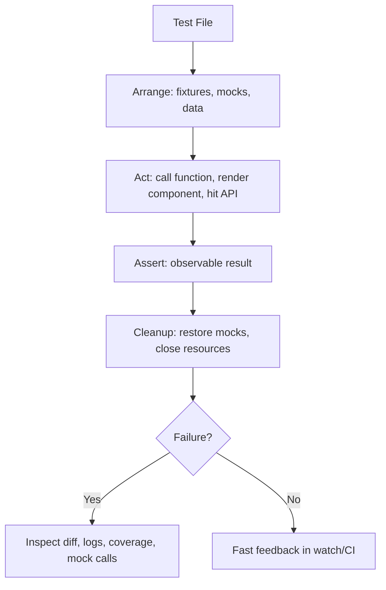
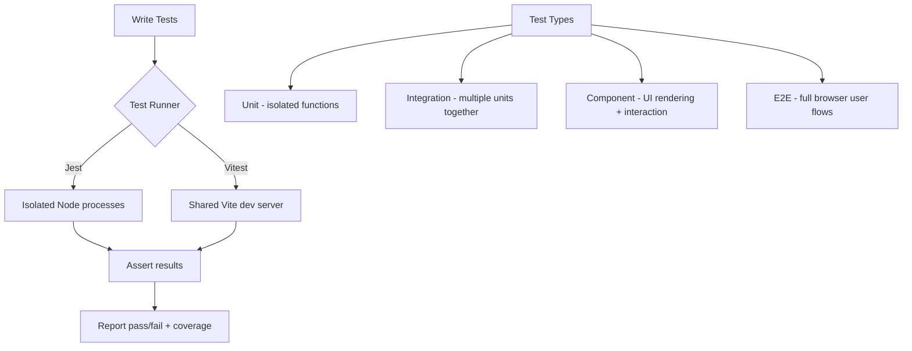
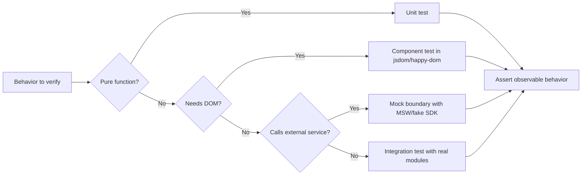
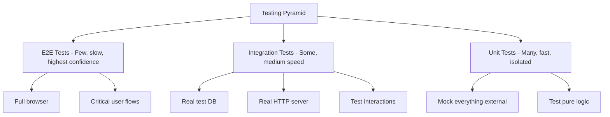

# Testing with Vitest and Jest

## Overview

Vitest and Jest are JavaScript testing frameworks for writing unit, integration, and component tests. Jest (by Meta, 2014) is the mature industry standard. Vitest (by the Vite team, 2021) is a faster, Vite-native alternative with near-identical APIs. Both support mocking, snapshots, coverage, and parallel test execution.

## Suite Design Model



The best tests are deterministic, isolated, and focused on externally visible behavior. Use mocks at process boundaries such as HTTP, filesystem, queues, clocks, and third-party SDKs; avoid mocking the code you are trying to gain confidence in.

## How It Works



### Vitest vs Jest

| Feature | Jest | Vitest |
|---------|------|--------|
| **Origin** | Meta, 2014 | Vite team, 2021 |
| **Runtime** | Isolated Node processes per test file | Worker threads sharing Vite pipeline |
| **TypeScript** | Requires `ts-jest` or `babel-jest` | Native, zero-config |
| **Watch mode** | Interactive but slower | Ultra-fast, Vite HMR-powered |
| **Test UI** | Terminal-only | Browser UI via `@vitest/ui` |
| **DOM env** | `jsdom` via `testEnvironment` | `jsdom`, `happy-dom`, or real browser (Browser Mode) |
| **Mocking API** | `jest.fn()`, `jest.mock()`, `jest.spyOn()` | `vi.fn()`, `vi.mock()`, `vi.spyOn()` |
| **Config** | `jest.config.js` | `vitest.config.ts` (extends Vite config) |
| **Performance** | Baseline | 3-5x faster in watch mode |

> [!tip] When to Use Each
> **Use Vitest** for new projects, Vite-based apps, or when you want native TypeScript and fast watch mode. **Use Jest** for legacy codebases, Next.js projects, or when you depend on Jest-specific plugins.

### Test Boundary Decision Flow



## Code

### Basic Test Structure (Both Frameworks)

```typescript
// math.test.ts
import { describe, it, expect } from 'vitest'; // or @jest/globals
import { add, subtract } from './math';

describe('math utilities', () => {
  it('adds two numbers', () => {
    expect(add(2, 3)).toBe(5);
  });

  it('subtracts two numbers', () => {
    expect(subtract(5, 3)).toBe(2);
  });

  it('handles negative numbers', () => {
    expect(add(-1, -1)).toBe(-2);
  });
});
```

### API Testing

#### Testing REST APIs with Supertest

```typescript
// tests/api/users.test.ts
import { describe, it, expect, beforeAll, afterAll } from 'vitest';
import request from 'supertest';
import app from '../../app';

describe('GET /api/users', () => {
  it('returns all users with 200 status', async () => {
    const res = await request(app)
      .get('/api/users')
      .set('Authorization', 'Bearer test-token')
      .expect('Content-Type', /json/)
      .expect(200);

    expect(res.body).toHaveProperty('data');
    expect(Array.isArray(res.body.data)).toBe(true);
    expect(res.body.data[0]).toMatchObject({
      id: expect.any(Number),
      name: expect.any(String),
      email: expect.any(String),
    });
  });

  it('returns 401 without auth token', async () => {
    const res = await request(app)
      .get('/api/users')
      .expect(401);

    expect(res.body).toHaveProperty('error', 'Unauthorized');
  });

  it('creates a user with POST', async () => {
    const res = await request(app)
      .post('/api/users')
      .send({ name: 'Alice', email: 'alice@test.com' })
      .expect(201);

    expect(res.body).toMatchObject({
      name: 'Alice',
      email: 'alice@test.com',
    });
    expect(res.body).toHaveProperty('id');
  });
});
```

#### Mocking `fetch`

```typescript
// quote.service.ts
export async function fetchQuote() {
  const response = await fetch('https://api.example.com/quotes/random');
  if (!response.ok) throw new Error('Failed to fetch');
  const data = await response.json();
  return data;
}

// quote.service.test.ts
import { describe, it, expect, vi, beforeEach } from 'vitest';
import { fetchQuote } from './quote.service';

describe('fetchQuote', () => {
  beforeEach(() => {
    vi.restoreAllMocks();
  });

  it('returns a quote on success', async () => {
    const dummyQuote = { id: 1, quote: 'Hello', author: 'World' };
    const mockResponse = {
      ok: true,
      json: vi.fn().mockResolvedValue(dummyQuote),
    } as unknown as Response;

    globalThis.fetch = vi.fn().mockResolvedValue(mockResponse);

    const result = await fetchQuote();
    expect(result).toEqual(dummyQuote);
    expect(globalThis.fetch).toHaveBeenCalledWith(
      'https://api.example.com/quotes/random'
    );
  });

  it('throws on network error', async () => {
    globalThis.fetch = vi.fn().mockResolvedValue({ ok: false });

    await expect(fetchQuote()).rejects.toThrow('Failed to fetch');
  });
});
```

#### Mocking `axios`

```typescript
// __mocks__/axios.ts
import { vi } from 'vitest';

const mockAxios = {
  get: vi.fn(),
  post: vi.fn(),
  put: vi.fn(),
  delete: vi.fn(),
};
export default mockAxios;

// api.test.ts -- Vitest auto-detects __mocks__/axios.ts
import { describe, it, expect, vi } from 'vitest';
import axios from 'axios';
import { getUser } from './api';

describe('getUser', () => {
  it('calls axios.get with correct URL', async () => {
    vi.mocked(axios.get).mockResolvedValue({
      data: { id: 1, name: 'Alice' },
    });

    const user = await getUser(1);
    expect(axios.get).toHaveBeenCalledWith('/api/users/1');
    expect(user).toEqual({ id: 1, name: 'Alice' });
  });
});
```

#### Using MSW (Mock Service Worker) -- Works with Both

```typescript
// tests/handlers.ts
import { http, HttpResponse } from 'msw';

export const handlers = [
  http.get('/api/users', () => {
    return HttpResponse.json({
      data: [
        { id: 1, name: 'Alice' },
        { id: 2, name: 'Bob' },
      ],
    });
  }),

  http.post('/api/users', async ({ request }) => {
    const body = await request.json() as Record<string, unknown>;
    return HttpResponse.json(
      { data: { id: 3, ...body } },
      { status: 201 }
    );
  }),

  http.get('/api/users/:id', ({ params }) => {
    const id = Number(params.id);
    if (id === 999) {
      return HttpResponse.json({ error: 'Not found' }, { status: 404 });
    }
    return HttpResponse.json({ data: { id, name: 'Alice' } });
  }),
];

// tests/setup.ts
import { beforeAll, afterEach, afterAll } from 'vitest';
import { setupServer } from 'msw/node';
import { handlers } from './handlers';

const server = setupServer(...handlers);

beforeAll(() => server.listen());
afterEach(() => server.resetHandlers());
afterAll(() => server.close());
```

<!-- Output: -->
<!-- MSW intercepts HTTP requests at the network level, so your code uses real fetch/axios without modification. -->

### Mocks, Stubs, Spies, Fakes, and Dummies

#### Test Doubles Explained

| Type | Definition | When to Use | Example |
|------|------------|-------------|---------|
| **Dummy** | Object passed but never used | Satisfy function signatures | `null`, `{}`, placeholder user |
| **Fake** | Working but simplified implementation | Replace heavy dependencies | In-memory database, fake email service |
| **Stub** | Provides pre-programmed answers | Control indirect inputs | Return fixed data from a DB call |
| **Spy** | Stub that records how it was called | Verify behavior + partial control | Track function call count |
| **Mock** | Pre-set object with expectations | Verify expected interactions | Assert payment service called exactly once |

> [!info] Key Distinction
> **Stubs** = "Just give me this answer, I don't care how you're used." **Spies** = "Do your real job, but let me watch." **Mocks** = "I have expectations about how you'll be called; verify them."

#### `vi.fn()` / `jest.fn()` -- Creating Mocks and Stubs

```typescript
import { describe, it, expect, vi, beforeEach } from 'vitest';

describe('mock functions', () => {
  it('tracks calls and arguments', () => {
    const mockFn = vi.fn();
    mockFn('hello', 42);
    mockFn('world');

    expect(mockFn).toHaveBeenCalledTimes(2);
    expect(mockFn).toHaveBeenCalledWith('hello', 42);
    expect(mockFn).toHaveBeenNthCalledWith(1, 'hello', 42);
    expect(mockFn).toHaveBeenNthCalledWith(2, 'world');
  });

  it('returns canned values (stub)', () => {
    const mockAdd = vi.fn((a: number, b: number) => a + b);
    expect(mockAdd(2, 3)).toBe(5);
    expect(mockAdd).toHaveBeenCalledWith(2, 3);
  });

  it('handles async resolutions', async () => {
    const mockFetch = vi.fn()
      .mockResolvedValue({ data: 'ok' })
      .mockResolvedValueOnce({ data: 'first' })
      .mockResolvedValueOnce({ data: 'second' });

    expect(await mockFetch()).toEqual({ data: 'first' });
    expect(await mockFetch()).toEqual({ data: 'second' });
    expect(await mockFetch()).toEqual({ data: 'ok' });
  });

  it('handles rejections', async () => {
    const mockFail = vi.fn().mockRejectedValue(new Error('network error'));
    await expect(mockFail()).rejects.toThrow('network error');
  });
});
```

#### `vi.mock()` / `jest.mock()` -- Module Mocking

```typescript
// math.ts
export function add(a: number, b: number) { return a + b; }
export function subtract(a: number, b: number) { return a - b; }

// math.test.ts -- vi.mock() is HOISTED to top of file
import { describe, it, expect, vi } from 'vitest';

vi.mock('./math', () => ({
  add: vi.fn((a: number, b: number) => 999),
  subtract: vi.fn(),
}));

import { add, subtract } from './math';

describe('mocked module', () => {
  it('uses mocked add', () => {
    expect(add(2, 3)).toBe(999);
  });
});
```

#### Partial Mock with `importOriginal`

```typescript
// Mock only one function, keep the rest original
vi.mock('./math', async (importOriginal) => {
  const actual = await importOriginal<typeof import('./math')>();
  return {
    ...actual,
    add: vi.fn(() => 999), // only mock add
  };
});
```

#### `vi.doMock()` -- Non-Hoisted Mocking

```typescript
// vi.doMock() is NOT hoisted -- allows using variables from scope
it('uses doMock with dynamic value', async () => {
  const dynamicValue = 'test-value';

  vi.doMock('./config', () => ({
    getValue: vi.fn(() => dynamicValue),
  }));

  const { getValue } = await import('./config');
  expect(getValue()).toBe('test-value');

  vi.resetModules(); // Required before next doMock
});
```

#### `vi.spyOn()` / `jest.spyOn()` -- Spies

```typescript
import { describe, it, expect, vi, afterEach } from 'vitest';

describe('spies', () => {
  afterEach(() => {
    vi.restoreAllMocks();
  });

  it('tracks calls to existing method', () => {
    const consoleSpy = vi.spyOn(console, 'log');
    console.log('hello');

    expect(consoleSpy).toHaveBeenCalledWith('hello');
    expect(consoleSpy).toHaveBeenCalledTimes(1);
  });

  it('spy with custom implementation', () => {
    const obj = { greet: () => 'hi' };
    const spy = vi.spyOn(obj, 'greet').mockImplementation(() => 'mocked');

    expect(obj.greet()).toBe('mocked');
    expect(spy).toHaveBeenCalled();
  });

  it('spy on getters', () => {
    import * as mod from './module';
    vi.spyOn(mod, 'value', 'get').mockReturnValue(42);
    expect(mod.value).toBe(42);
  });
});
```

#### `vi.mocked()` -- Type-Safe Mock Access

```typescript
import { vi } from 'vitest';
import { fetchData } from './api';

vi.mock('./api');

// vi.mocked() gives TypeScript access to mock methods
const mockedFetch = vi.mocked(fetchData);
mockedFetch.mockResolvedValue({ id: 1, name: 'Alice' });
```

#### When to Use Each Test Double

| Scenario | Use | Code |
|----------|-----|------|
| Verify a function was called with specific args | **Spy** | `vi.spyOn(obj, 'method')` |
| Replace external API with canned response | **Stub** | `vi.fn().mockResolvedValue(data)` |
| Verify interaction patterns (called exactly once) | **Mock** | `vi.fn()` + assertions |
| Need a working but lightweight replacement | **Fake** | In-memory class implementing interface |
| Just need to satisfy a parameter | **Dummy** | `{}` or `null` |

> [!warning] Anti-Pattern: Over-Mocking
> Don't mock the function you're testing. Don't mock internal helpers -- mock at the boundary (external APIs, DB calls, file system). If you're testing mocks instead of real behavior, your tests pass but your code may be broken.

### Test Fixtures

#### What Are Fixtures?

Test fixtures are **pre-defined, reusable test data** that represent the known state needed for a test to run. They provide consistent, deterministic inputs.

#### JSON Fixtures (Static Data)

```json
// fixtures/user.json
{
  "id": 1,
  "name": "Alice",
  "email": "alice@example.com",
  "role": "admin"
}
```

```typescript
// tests/user.test.ts
import { describe, it, expect } from 'vitest';
import userFixture from './fixtures/user.json';
import { getUser } from '../api';

describe('User API', () => {
  it('returns user matching fixture shape', async () => {
    const result = await getUser(1);
    expect(result).toMatchObject(userFixture);
  });
});
```

#### HTML Fixtures (DOM Testing)

```html
<!-- fixtures/login-form.html -->
<form id="login-form">
  <input name="email" type="email" placeholder="Email" />
  <input name="password" type="password" placeholder="Password" />
  <button type="submit">Login</button>
</form>
```

```typescript
import { it, expect } from 'vitest';
import formHtml from './fixtures/login-form.html?raw';
import { render, screen } from '@testing-library/react';

it('renders login form', () => {
  document.body.innerHTML = formHtml;
  expect(document.querySelector('#login-form')).toBeTruthy();
  expect(screen.getByPlaceholderText('Email')).toBeTruthy();
});
```

#### Database Fixtures (Seed Data)

```typescript
// fixtures/db-seed.ts
export const seedUsers = [
  { id: 1, name: 'Alice', email: 'alice@test.com', role: 'admin' },
  { id: 2, name: 'Bob', email: 'bob@test.com', role: 'user' },
  { id: 3, name: 'Charlie', email: 'charlie@test.com', role: 'user' },
];

export const seedPosts = [
  { id: 1, userId: 1, title: 'Hello World', body: 'First post' },
  { id: 2, userId: 2, title: 'Second Post', body: 'Another post' },
];

// tests/integration/posts.test.ts
import { describe, it, expect, beforeEach, afterAll } from 'vitest';
import { seedUsers, seedPosts } from '../fixtures/db-seed';
import { Pool } from 'pg';
import request from 'supertest';
import app from '../../app';

const testPool = new Pool({ connectionString: process.env.TEST_DATABASE_URL });

describe('Posts API', () => {
  beforeEach(async () => {
    await testPool.query('DELETE FROM posts');
    await testPool.query('DELETE FROM users');
    for (const user of seedUsers) {
      await testPool.query(
        'INSERT INTO users (id, name, email, role) VALUES ($1, $2, $3, $4)',
        [user.id, user.name, user.email, user.role]
      );
    }
    for (const post of seedPosts) {
      await testPool.query(
        'INSERT INTO posts (id, user_id, title, body) VALUES ($1, $2, $3, $4)',
        [post.id, post.userId, post.title, post.body]
      );
    }
  });

  afterAll(async () => {
    await testPool.end();
  });

  it('GET /api/posts returns all posts', async () => {
    const res = await request(app).get('/api/posts').expect(200);
    expect(res.body.data).toHaveLength(2);
  });
});
```

#### Factory Functions vs Fixtures

```typescript
// factories/user.ts -- Dynamic data generation
let idCounter = 1;

export function createUser(overrides = {}) {
  return {
    id: idCounter++,
    name: `User ${idCounter}`,
    email: `user${idCounter}@test.com`,
    role: 'user',
    createdAt: new Date(),
    ...overrides,
  };
}

// Usage
const admin = createUser({ role: 'admin', name: 'Admin User' });
const user1 = createUser();
const user2 = createUser();
```

| Approach | Best For | Pros | Cons |
|----------|----------|------|------|
| **Fixtures** | Stable, well-known test data; API response shapes | Easy to read, version-controlled, deterministic | Brittle when data model changes |
| **Factories** | Tests needing varied data, edge cases | Flexible, DRY, easy to create variations | More code, can hide test intent |
| **Mocks** | External dependencies (APIs, DBs, services) | Isolates test, fast, no side effects | Tests mocks not real behavior |

> [!tip] When to Use Fixtures vs Mocks
> Use **fixtures** for test data (users, posts, products). Use **mocks** for external dependencies (APIs, databases, third-party services). Fixtures describe *what* you're testing; mocks isolate *what you're not* testing.

### Integration Tests

#### What Are Integration Tests?

Integration tests verify that **multiple units work together correctly**. Unlike unit tests (which isolate a single function with mocks), integration tests exercise real interactions between components -- e.g., an API route talking to a real test database.



#### When to Write Integration Tests vs Unit Tests

| Write Unit Tests For | Write Integration Tests For |
|---------------------|----------------------------|
| Pure functions, algorithms | API endpoints with DB access |
| Business logic rules | Authentication/authorization flows |
| Data transformations | Third-party service integrations |
| Edge cases in isolation | Request/response lifecycle |

#### Full Integration Test Example

```typescript
// tests/integration/users.test.ts
import { describe, it, expect, beforeAll, afterAll, beforeEach, afterEach } from 'vitest';
import request from 'supertest';
import express from 'express';
import { Pool } from 'pg';
import usersRouter from '../../routes/users';

const app = express();
app.use(express.json());

const testPool = new Pool({
  connectionString: process.env.TEST_DATABASE_URL || 'postgresql://localhost:5432/test_db',
});

app.use('/api/users', usersRouter);
app.set('db', testPool);

describe('Users API Integration', () => {
  beforeEach(async () => {
    await testPool.query('DELETE FROM users');
    await testPool.query('ALTER SEQUENCE users_id_seq RESTART WITH 1');
  });

  afterAll(async () => {
    await testPool.end();
  });

  it('POST /api/users creates a user and persists to DB', async () => {
    const res = await request(app)
      .post('/api/users')
      .send({ name: 'Alice', email: 'alice@test.com' })
      .expect(201);

    expect(res.body).toMatchObject({
      name: 'Alice',
      email: 'alice@test.com',
    });
    expect(res.body).toHaveProperty('id');

    // Verify in DB directly
    const dbRes = await testPool.query('SELECT * FROM users WHERE id = $1', [res.body.id]);
    expect(dbRes.rows[0].email).toBe('alice@test.com');
  });

  it('GET /api/users/:id returns 404 for non-existent user', async () => {
    await request(app)
      .get('/api/users/999')
      .expect(404);
  });

  it('GET /api/users returns paginated results', async () => {
    await testPool.query(
      "INSERT INTO users (name, email) VALUES ('Alice', 'a@test.com'), ('Bob', 'b@test.com')"
    );

    const res = await request(app)
      .get('/api/users?page=1&limit=1')
      .expect(200);

    expect(res.body.data).toHaveLength(1);
    expect(res.body).toHaveProperty('total', 2);
    expect(res.body).toHaveProperty('page', 1);
  });
});
```

#### Transaction-Wrapped Tests (Fastest Integration Approach)

```typescript
let client: PoolClient;

beforeEach(async () => {
  client = await testPool.connect();
  await client.query('BEGIN'); // Start transaction
});

afterEach(async () => {
  await client.query('ROLLBACK'); // Undo all changes
  client.release();
});

// Each test runs in isolation -- no cleanup needed, no parallel conflicts
```

#### Test Database Strategies

| Strategy | Description | Pros | Cons |
|----------|-------------|------|------|
| **In-memory (SQLite)** | Lightweight, no setup | Fast, zero config | Not production-accurate |
| **Dockerized DB** | Real DB in Docker container | Production-accurate, isolated | Slower startup, needs Docker |
| **Testcontainers** | Programmatically spins up DB containers | Automated, production-accurate | Complex setup |
| **Shared test DB + transactions** | Single DB, wrap each test in transaction | Fast, simple | Parallel test conflicts |
| **Separate DB per worker** | Each parallel test gets own DB | Safe parallelism | Resource-heavy |

### Frontend Tests

#### Types of Frontend Tests

| Type | What It Tests | Tools | Speed | Confidence |
|------|---------------|-------|-------|------------|
| **Unit tests** | Individual functions, utilities | Vitest/Jest alone | Fastest | Low |
| **Component tests** | UI components in isolation | Testing Library + jsdom/happy-dom | Fast | Medium |
| **Integration tests** | Multiple components together | Testing Library + jsdom/Browser Mode | Medium | High |
| **E2E tests** | Full user flows in real browser | Playwright, Cypress | Slowest | Highest |
| **Visual tests** | Pixel-perfect UI regression | Playwright screenshots, Percy | Medium | Visual only |

#### Component Testing with Testing Library

```tsx
// Counter.test.tsx
import { render, screen, fireEvent } from '@testing-library/react';
import { describe, it, expect, vi } from 'vitest';
import Counter from './Counter';

describe('Counter', () => {
  it('renders with initial count of 0', () => {
    render(<Counter />);
    expect(screen.getByText('Count: 0')).toBeInTheDocument();
  });

  it('increments on button click', () => {
    render(<Counter />);
    const button = screen.getByRole('button', { name: /increment/i });
    fireEvent.click(button);
    expect(screen.getByText('Count: 1')).toBeInTheDocument();
  });

  it('calls onChange callback with new count', () => {
    const onChange = vi.fn();
    render(<Counter onChange={onChange} />);
    const button = screen.getByRole('button', { name: /increment/i });
    fireEvent.click(button);
    expect(onChange).toHaveBeenCalledWith(1);
  });
});
```

#### Testing API Calls in Components (with MSW)

```tsx
// UserProfile.test.tsx
import { render, screen, waitFor } from '@testing-library/react';
import { describe, it, expect } from 'vitest';
import { http, HttpResponse } from 'msw';
import { setupServer } from 'msw/node';
import UserProfile from './UserProfile';

const server = setupServer(
  http.get('/api/users/1', () => {
    return HttpResponse.json({ id: 1, name: 'Alice', email: 'alice@test.com' });
  })
);

beforeAll(() => server.listen());
afterEach(() => server.resetHandlers());
afterAll(() => server.close());

describe('UserProfile', () => {
  it('fetches and displays user data', async () => {
    render(<UserProfile userId={1} />);

    expect(screen.getByText('Loading...')).toBeInTheDocument();

    await waitFor(() => {
      expect(screen.getByText('Alice')).toBeInTheDocument();
      expect(screen.getByText('alice@test.com')).toBeInTheDocument();
    });
  });

  it('shows error on API failure', async () => {
    server.use(
      http.get('/api/users/1', () => {
        return HttpResponse.json({ error: 'Not found' }, { status: 404 });
      })
    );

    render(<UserProfile userId={1} />);

    await waitFor(() => {
      expect(screen.getByText('User not found')).toBeInTheDocument();
    });
  });
});
```

#### DOM Environments

```typescript
// vitest.config.ts
import { defineConfig } from 'vitest/config';

export default defineConfig({
  test: {
    // jsdom: most common, simulates full browser API in Node
    environment: 'jsdom',

    // happy-dom: faster alternative to jsdom
    // environment: 'happy-dom',
  },
});
```

#### Vitest Browser Mode (Real Browser Testing)

```typescript
// vitest.config.ts
import { defineConfig } from 'vitest/config';
import { playwright } from '@vitest/browser-playwright';

export default defineConfig({
  test: {
    browser: {
      enabled: true,
      provider: playwright(),
      instances: [{ browser: 'chromium' }],
    },
  },
});

// tests/browser.test.ts
import { test, expect } from 'vitest';
import { page, userEvent } from 'vitest/browser';
import { render } from 'vitest-browser-react';
import MyForm from './MyForm';

test('form interaction in real browser', async () => {
  render(<MyForm />);

  const input = page.getByLabelText(/username/i);
  await input.fill('Alice');

  await expect.element(page.getByText('Hi, my name is Alice')).toBeInTheDocument();
});
```

#### E2E Testing with Playwright

```typescript
// tests/e2e/login.spec.ts
import { test, expect } from '@playwright/test';

test('user can log in and see dashboard', async ({ page }) => {
  await page.goto('/login');
  await page.getByLabel('Email').fill('user@test.com');
  await page.getByLabel('Password').fill('password123');
  await page.getByRole('button', { name: 'Sign In' }).click();

  await expect(page).toHaveURL('/dashboard');
  await expect(page.getByText('Welcome back')).toBeVisible();
});

test('shows error on invalid credentials', async ({ page }) => {
  await page.goto('/login');
  await page.getByLabel('Email').fill('wrong@test.com');
  await page.getByLabel('Password').fill('wrongpassword');
  await page.getByRole('button', { name: 'Sign In' }).click();

  await expect(page.getByText('Invalid credentials')).toBeVisible();
});
```

#### When to Do Frontend Testing

| Test Type | When to Use | What to Skip |
|-----------|-------------|--------------|
| **Component tests** | Reusable components, complex UI logic, state management | Pure presentational components with no logic |
| **E2E tests** | Critical user flows (login, checkout, signup) | Every single page -- reserve for high-value flows |
| **Visual tests** | Design-system components, preventing CSS regressions | Pages that change frequently |
| **Unit tests** | Utility functions, formatters, validators | Third-party library internals |

> [!tip] Recommended Testing Strategy
> **70% Component/Integration** (Testing Library) -- **20% E2E** (Playwright/Cypress) -- **10% Unit** (pure functions, utils). Test what the user sees and does, not implementation details.

> [!warning] Anti-Pattern: Testing Implementation Details
> Don't test component state or internal methods. Test what the user sees and interacts with. Use `getByRole`, `getByText`, `getByLabel` instead of querying by class names or data attributes.

## Key Details

### Mocking Best Practices

> [!warning] Always Clear Mocks Between Tests
> Failing to clear mocks causes test pollution -- one test's mock state leaks into another.

```typescript
// In your setup file or each test file:
beforeEach(() => {
  vi.clearAllMocks(); // Clears call history but keeps implementation
  // OR
  vi.resetAllMocks(); // Clears call history AND resets implementation
});
```

> [!tip] Mock at the Boundary
> Mock external dependencies (APIs, databases, file system) at the edge of your system. Don't mock internal helper functions -- that tests your mocks, not your code.

### Vitest-Specific Features

```typescript
// vitest.config.ts
import { defineConfig } from 'vitest/config';

export default defineConfig({
  test: {
    // Run tests in parallel
    pool: 'threads',

    // Coverage
    coverage: {
      provider: 'v8',
      reporter: ['text', 'html'],
    },

    // Global test timeout
    testTimeout: 10000,

    // Setup files (run before tests)
    setupFiles: ['./tests/setup.ts'],

    // Include only these files
    include: ['tests/**/*.test.ts'],

    // Watch only changed files
    watch: true,
  },
});
```

## When to Use

- **Unit tests**: Pure functions, business logic, data transformations, edge cases
- **Integration tests**: API endpoints with database, auth flows, service interactions
- **Component tests**: UI components with state, user interactions, API data display
- **E2E tests**: Critical user journeys (login, checkout, signup, key workflows)
- **API tests**: REST/GraphQL endpoints -- status codes, response shape, error handling
- **Fixtures**: Stable test data that multiple tests share
- **Mocks/Stubs**: External dependencies you don't want to call in tests

## Related Topics

- [[js-interview|JavaScript]] -- Language being tested
- [[HTTP]] -- API testing relies on HTTP protocol knowledge
- [[websockets]] -- Real-time features that need specialized testing approaches

## External Links

- [Vitest Official Docs](https://vitest.dev/guide/)
- [Vitest Mocking Guide](https://vitest.dev/guide/mocking)
- [Vitest Browser Mode](https://vitest.dev/guide/browser/)
- [Jest Official Docs](https://jestjs.io/docs/getting-started)
- [Jest Mock Functions](https://jestjs.io/docs/mock-functions)
- [Testing Library](https://testing-library.com/docs/)
- [MSW (Mock Service Worker)](https://mswjs.io/)
- [Supertest](https://github.com/ladjs/supertest)
- [Playwright Testing](https://playwright.dev/docs/intro)
- [Martin Fowler on Test Doubles](https://martinfowler.com/articles/mocksArentStubs.html)
