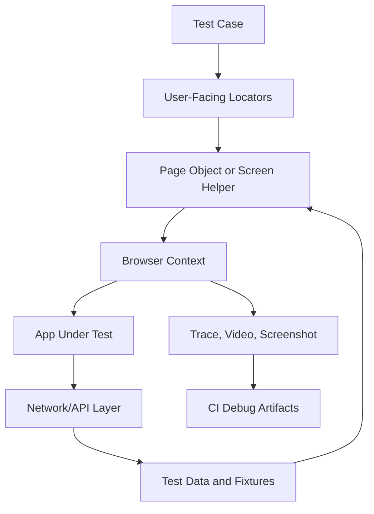
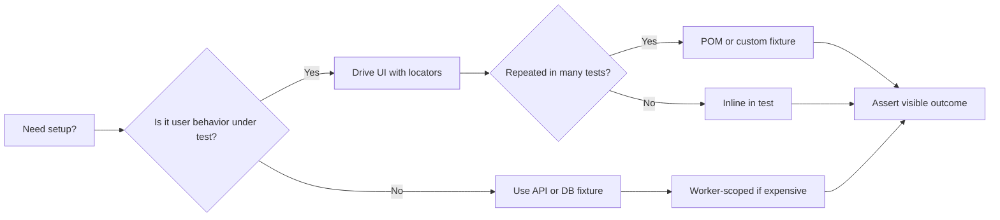

# Playwright Patterns

## Overview

Playwright is a modern E2E testing framework with built-in auto-waiting, cross-browser support, and a powerful fixture system. This note covers scalable patterns: Page Object Model, fixtures, authentication, API testing, visual regression, and CI configuration.



The goal is to test user-visible behavior while keeping setup, authentication, and test data isolated. Good Playwright suites use browser contexts as isolation boundaries, fixtures as dependency injection, locators as accessibility contracts, and traces as the first debugging artifact in CI.

## Pattern Selection Guide

| Problem | Prefer | Avoid |
|---------|--------|-------|
| Repeated workflows | POM method or fixture | Copy-pasted click chains |
| Shared login state | Setup project + `storageState` | Logging in through the UI in every test |
| Backend setup | API fixture or direct seed helper | Long UI flows just to create preconditions |
| Flaky timing | Locator assertions and auto-waiting | `waitForTimeout()` |
| Complex roles | Separate storage state per role | One global account shared by all tests |
| CI failures | Trace on first retry | Re-running locally without artifacts |



## Page Object Model (POM)

### What It Is

POM encapsulates page interactions into reusable classes. Each page object represents a part of your application, exposing high-level methods that hide implementation details (locators, selectors).

### When to Use

- **Use POM when:** You have multiple tests interacting with the same page, complex page interactions, or a large test suite
- **Skip POM when:** Tests are simple, single-page apps with few interactions, or prototyping

### Implementation

```typescript
// pages/checkout-page.ts
import { type Page, type Locator, expect } from '@playwright/test';

export class CheckoutPage {
  readonly page: Page;
  readonly nameInput: Locator;
  readonly emailInput: Locator;
  readonly addressInput: Locator;
  readonly placeOrderButton: Locator;
  readonly confirmationMessage: Locator;

  constructor(page: Page) {
    this.page = page;
    this.nameInput = page.getByLabel('Full name');
    this.emailInput = page.getByLabel('Email');
    this.addressInput = page.getByLabel('Address');
    this.placeOrderButton = page.getByRole('button', { name: 'Place order' });
    this.confirmationMessage = page.getByText('Order confirmed');
  }

  async goto() {
    await this.page.goto('/checkout');
  }

  async fillShippingInfo(info: { name: string; email: string; address: string }) {
    await this.nameInput.fill(info.name);
    await this.emailInput.fill(info.email);
    await this.addressInput.fill(info.address);
  }

  async placeOrder() {
    await this.placeOrderButton.click();
  }

  async expectConfirmation() {
    await expect(this.confirmationMessage).toBeVisible();
  }
}
```

```typescript
// tests/checkout.spec.ts
import { test, expect } from '@playwright/test';
import { CheckoutPage } from '../pages/checkout-page';

test('completes checkout', async ({ page }) => {
  const checkout = new CheckoutPage(page);
  await checkout.goto();
  await checkout.fillShippingInfo({
    name: 'John Doe',
    email: 'john@example.com',
    address: '123 Main St',
  });
  await checkout.placeOrder();
  await checkout.expectConfirmation();
});
```

### POM + Fixtures (Recommended)

Combine POM with Playwright fixtures for cleaner tests:

```typescript
// fixtures/checkout-fixture.ts
import { test as base } from '@playwright/test';
import { CheckoutPage } from '../pages/checkout-page';

type CheckoutFixtures = {
  checkoutPage: CheckoutPage;
};

export const test = base.extend<CheckoutFixtures>({
  checkoutPage: async ({ page }, use) => {
    const checkoutPage = new CheckoutPage(page);
    await checkoutPage.goto();
    await use(checkoutPage);
  },
});

export { expect } from '@playwright/test';
```

```typescript
// tests/checkout-with-fixture.spec.ts
import { test, expect } from '../fixtures/checkout-fixture';

test('completes checkout', async ({ checkoutPage }) => {
  // checkoutPage is already navigated to /checkout
  await checkoutPage.fillShippingInfo({
    name: 'John Doe',
    email: 'john@example.com',
    address: '123 Main St',
  });
  await checkoutPage.placeOrder();
  await checkoutPage.expectConfirmation();
});
```

## Test Fixtures

### Built-in Fixtures

| Fixture | Type | Description |
|---------|------|-------------|
| `page` | `Page` | Isolated page for this test |
| `context` | `BrowserContext` | Isolated browser context (like incognito) |
| `browser` | `Browser` | Shared browser instance across tests |
| `browserName` | `string` | Current browser: `chromium`, `firefox`, `webkit` |
| `request` | `APIRequestContext` | Isolated API request context |

### Custom Fixtures

```typescript
// fixtures/index.ts
import { test as base } from '@playwright/test';

type AppFixtures = {
  // Page objects
  loginPage: LoginPage;
  dashboardPage: DashboardPage;
  // Test data
  testUser: { username: string; password: string };
  // Helpers
  apiHelper: ApiHelper;
};

export const test = base.extend<AppFixtures>({
  // Test data fixture
  testUser: async ({}, use) => {
    await use({
      username: 'testuser',
      password: 'Test1234!',
    });
  },

  // Page object fixture with setup
  loginPage: async ({ page }, use) => {
    const loginPage = new LoginPage(page);
    await loginPage.goto();
    await use(loginPage);
  },

  // Dashboard fixture (depends on loginPage)
  dashboardPage: async ({ page, loginPage, testUser }, use) => {
    await loginPage.login(testUser.username, testUser.password);
    await expect(page).toHaveURL('/dashboard');
    await use(new DashboardPage(page));
  },

  // API helper fixture
  apiHelper: async ({ request }, use) => {
    await use(new ApiHelper(request));
  },
});

export { expect } from '@playwright/test';
```

### Worker-Scoped Fixtures

For expensive setup that should run once per worker process:

```typescript
// fixtures/worker-fixtures.ts
import { test as base } from '@playwright/test';

export const test = base.extend<{}, { sharedDatabase: Database }>({
  sharedDatabase: [async ({}, use, workerInfo) => {
    // Runs once per worker
    const db = await setupTestDatabase(`test_db_${workerInfo.workerIndex}`);
    await seedDatabase(db);
    await use(db);
    // Teardown after all tests in this worker
    await cleanupDatabase(db);
  }, { scope: 'worker' }],
});
```

### Automatic Fixtures

Run automatically for every test without explicit dependency:

```typescript
// fixtures/auto-fixtures.ts
import { test as base } from '@playwright/test';

export const test = base.extend<{ autoSetup: void }>({
  autoSetup: [async ({ page }, use) => {
    // Runs before every test
    await page.goto('/');
    await use();
    // Runs after every test
    console.log(`Test ended at: ${page.url()}`);
  }, { auto: true }],
});
```

### Merging Fixtures from Multiple Modules

```typescript
// fixtures/combined.ts
import { mergeTests } from '@playwright/test';
import { test as authTest } from './auth-fixtures';
import { test as dbTest } from './db-fixtures';
import { test as uiTest } from './ui-fixtures';

export const test = mergeTests(authTest, dbTest, uiTest);
export { expect } from '@playwright/test';
```

## Best Practices

### Locator Strategies (Priority Order)

```typescript
// 1. getByRole — Best for accessibility and resilience
page.getByRole('button', { name: 'Submit' });
page.getByRole('link', { name: 'View Profile' });
page.getByRole('textbox', { name: 'Email' });

// 2. getByLabel — For form inputs
page.getByLabel('Username');
page.getByLabel('Accept terms');

// 3. getByText — For visible text content
page.getByText('Welcome back');
page.getByText(/order confirmed/i); // regex for partial match

// 4. getByTestId — For elements without accessible names
// Requires: <div data-testid="user-avatar">
page.getByTestId('user-avatar');

// 5. getByPlaceholder — For input placeholders
page.getByPlaceholder('Enter your email');

// 6. Locator with chaining — For complex scenarios
page.getByRole('listitem')
    .filter({ hasText: 'Product 2' })
    .getByRole('button', { name: 'Add to cart' });

// AVOID: CSS selectors and XPath (fragile to DOM changes)
page.locator('.btn.btn-primary.episode-actions-later'); // BAD
page.locator('//div[@class="product"]/button[2]');        // BAD
```

> [!tip] Locator Priority
> Always prefer `getByRole` — it's resilient to DOM changes, enforces accessibility, and mirrors how users find elements. Use `getByTestId` only as a last resort for elements without semantic meaning.

### Handling Flaky Tests

```typescript
// Playwright config — retries on CI only
export default defineConfig({
  retries: process.env.CI ? 2 : 0,
  fullyParallel: true,
});
```

**Common flakiness causes and fixes:**

| Cause | Fix |
|-------|-----|
| Element not ready | Use web-first assertions: `await expect(locator).toBeVisible()` |
| Timing issues | Never use `waitForTimeout()` — use `await expect()` or `await locator.waitFor()` |
| Test order dependency | Each test must be fully isolated; use `beforeEach` for shared setup |
| Shared state between tests | Use isolated browser contexts; reset state in `afterEach` |
| Network race conditions | Mock APIs with `page.route()` or use `waitForResponse()` |

```typescript
// GOOD: Web-first assertion (auto-retries)
await expect(page.getByText('Success')).toBeVisible();

// BAD: Manual check (no retry, instant fail)
const isVisible = await page.getByText('Success').isVisible();
expect(isVisible).toBe(true);

// GOOD: Wait for specific network response
const [response] = await Promise.all([
  page.waitForResponse('/api/submit'),
  page.getByRole('button', { name: 'Submit' }).click(),
]);
expect(response.status()).toBe(200);
```

### Test Isolation and Parallelization

```typescript
// playwright.config.ts
export default defineConfig({
  fullyParallel: true, // Run all tests in parallel
  workers: process.env.CI ? 4 : undefined, // 4 workers on CI, auto-detect locally
  use: {
    // Each test gets a fresh browser context
    storageState: undefined,
  },
});

// For tests within a file that are independent
test.describe.configure({ mode: 'parallel' });

test('test A', async ({ page }) => { /* isolated */ });
test('test B', async ({ page }) => { /* isolated */ });
```

### Authentication Patterns

#### Pattern 1: Login Once, Reuse via storageState (Recommended)

```typescript
// tests/auth.setup.ts
import { test as setup, expect } from '@playwright/test';
import path from 'path';

const authFile = path.join(__dirname, '../playwright/.auth/user.json');

setup('authenticate', async ({ page }) => {
  await page.goto('/login');
  await page.getByLabel('Email').fill('user@example.com');
  await page.getByLabel('Password').fill('password123');
  await page.getByRole('button', { name: 'Sign in' }).click();
  await page.waitForURL('/dashboard');
  await expect(page.getByRole('button', { name: 'Profile' })).toBeVisible();

  // Save authenticated state
  await page.context().storageState({ path: authFile });
});
```

```typescript
// playwright.config.ts
export default defineConfig({
  projects: [
    // Setup project — runs first
    { name: 'setup', testMatch: /.*\.setup\.ts/ },
    // Test projects — depend on setup
    {
      name: 'chromium',
      use: {
        ...devices['Desktop Chrome'],
        storageState: 'playwright/.auth/user.json',
      },
      dependencies: ['setup'],
    },
  ],
});
```

```typescript
// tests/dashboard.spec.ts — already authenticated
import { test, expect } from '@playwright/test';

test('view dashboard', async ({ page }) => {
  // page is already authenticated
  await page.goto('/dashboard');
  await expect(page.getByText('Welcome')).toBeVisible();
});
```

#### Pattern 2: One Account Per Worker (For Tests That Modify Server State)

```typescript
// fixtures/auth-fixture.ts
import { test as baseTest, expect } from '@playwright/test';
import fs from 'fs';
import path from 'path';

export * from '@playwright/test';

export const test = baseTest.extend<{}, { workerStorageState: string }>({
  storageState: ({ workerStorageState }, use) => use(workerStorageState),

  workerStorageState: [async ({ browser }, use) => {
    const id = test.info().parallelIndex;
    const fileName = path.resolve(
      test.info().project.outputDir,
      `.auth/${id}.json`
    );

    if (fs.existsSync(fileName)) {
      await use(fileName);
      return;
    }

    // Create unique account per worker
    const page = await browser.newPage({ storageState: undefined });
    const account = await createTestAccount(id); // Your account creation logic

    await page.goto('/signup');
    await page.getByLabel('Email').fill(account.email);
    await page.getByLabel('Password').fill(account.password);
    await page.getByRole('button', { name: 'Sign up' }).click();
    await expect(page).toHaveURL('/dashboard');

    await page.context().storageState({ path: fileName });
    await page.close();
    await use(fileName);
  }, { scope: 'worker' }],
});
```

#### Pattern 3: Multiple Roles

```typescript
// tests/auth.setup.ts
import { test as setup } from '@playwright/test';

setup('authenticate as admin', async ({ page }) => {
  // ... login as admin ...
  await page.context().storageState({ path: 'playwright/.auth/admin.json' });
});

setup('authenticate as user', async ({ page }) => {
  // ... login as user ...
  await page.context().storageState({ path: 'playwright/.auth/user.json' });
});
```

```typescript
// tests/permissions.spec.ts
import { test } from '@playwright/test';

test.describe('Admin permissions', () => {
  test.use({ storageState: 'playwright/.auth/admin.json' });

  test('can access admin panel', async ({ page }) => {
    await page.goto('/admin');
    await expect(page.getByText('Admin Panel')).toBeVisible();
  });
});

test.describe('User permissions', () => {
  test.use({ storageState: 'playwright/.auth/user.json' });

  test('cannot access admin panel', async ({ page }) => {
    await page.goto('/admin');
    await expect(page.getByText('Access Denied')).toBeVisible();
  });
});
```

#### Pattern 4: Multi-Role Interaction in Single Test

```typescript
test('admin approves user request', async ({ browser }) => {
  const adminContext = await browser.newContext({
    storageState: 'playwright/.auth/admin.json',
  });
  const adminPage = await adminContext.newPage();

  const userContext = await browser.newContext({
    storageState: 'playwright/.auth/user.json',
  });
  const userPage = await userContext.newPage();

  // User submits a request
  await userPage.goto('/requests/new');
  await userPage.getByLabel('Description').fill('Need access');
  await userPage.getByRole('button', { name: 'Submit' }).click();

  // Admin approves it
  await adminPage.goto('/admin/requests');
  await adminPage.getByRole('button', { name: 'Approve' }).first().click();

  // User sees approval
  await userPage.goto('/requests');
  await expect(userPage.getByText('Approved')).toBeVisible();

  await adminContext.close();
  await userContext.close();
});
```

### API Testing Within Playwright

```typescript
// playwright.config.ts
export default defineConfig({
  use: {
    baseURL: 'https://api.example.com',
    extraHTTPHeaders: {
      'Authorization': `Bearer ${process.env.API_TOKEN}`,
    },
  },
});
```

```typescript
// tests/api-setup.spec.ts
import { test, expect } from '@playwright/test';

// Use API to set up test data before UI test
test('create issue via API, verify in UI', async ({ page, request }) => {
  // Create via API
  const response = await request.post('/issues', {
    data: {
      title: 'Bug report',
      body: 'Description here',
    },
  });
  expect(response.ok()).toBeTruthy();
  const issue = await response.json();

  // Verify in UI
  await page.goto('/issues');
  await expect(page.getByText('Bug report')).toBeVisible();
});

// Pure API test
test('API returns correct schema', async ({ request }) => {
  const response = await request.get('/users');
  expect(response.ok()).toBeTruthy();

  const users = await response.json();
  expect(users).toBeInstanceOf(Array);
  expect(users[0]).toHaveProperty('id');
  expect(users[0]).toHaveProperty('name');
  expect(users[0]).toHaveProperty('email');
});

// API teardown after test
test.afterAll(async ({ request }) => {
  await request.delete('/cleanup');
});
```

### Visual Regression Testing

```typescript
// tests/visual.spec.ts
import { test, expect } from '@playwright/test';

test('homepage looks correct', async ({ page }) => {
  await page.goto('/');
  await expect(page).toHaveScreenshot('homepage.png');
});

test('product card renders correctly', async ({ page }) => {
  await page.goto('/products/123');
  await expect(page.locator('.product-card')).toHaveScreenshot(
    'product-card.png',
    { maxDiffPixels: 100 } // Allow minor rendering differences
  );
});

// Hide dynamic elements during screenshot
test('dashboard snapshot', async ({ page }) => {
  await page.goto('/dashboard');
  await expect(page).toHaveScreenshot({
    stylePath: './screenshot.css', // CSS to hide dynamic elements
  });
});
```

```css
/* screenshot.css */
.timestamp, .live-counter, .animated-element {
  visibility: hidden;
}
```

### Data Management

```typescript
// fixtures/data-fixture.ts
import { test as base } from '@playwright/test';

export const test = base.extend<{ seededData: TestData }>({
  seededData: async ({ request }, use) => {
    // Create test data via API
    const user = await request.post('/api/test/users', {
      data: { name: 'Test User', role: 'admin' },
    }).then(r => r.json());

    const products = await request.post('/api/test/products', {
      data: [
        { name: 'Product A', price: 100 },
        { name: 'Product B', price: 200 },
      ],
    }).then(r => r.json());

    await use({ user, products });

    // Teardown: clean up test data
    await request.delete(`/api/test/users/${user.id}`);
  },
});

// tests/shopping.spec.ts
import { test, expect } from '../fixtures/data-fixture';

test('can add seeded product to cart', async ({ page, seededData }) => {
  await page.goto('/products');
  await page.getByText(seededData.products[0].name).click();
  await page.getByRole('button', { name: 'Add to cart' }).click();
  await expect(page.getByText('Added to cart')).toBeVisible();
});
```

## Playwright Config for CI

```typescript
// playwright.config.ts
import { defineConfig, devices } from '@playwright/test';

export default defineConfig({
  testDir: './tests/e2e',
  fullyParallel: true,
  forbidOnly: !!process.env.CI, // Fail if .only() is used in CI
  retries: process.env.CI ? 2 : 0,
  workers: process.env.CI ? 4 : undefined,
  reporter: process.env.CI ? 'blob' : 'html',

  use: {
    baseURL: process.env.BASE_URL || 'http://localhost:3000',
    trace: process.env.CI ? 'on-first-retry' : 'off',
    screenshot: 'only-on-failure',
    video: process.env.CI ? 'retain-on-failure' : 'off',
    actionTimeout: 10_000,
    navigationTimeout: 30_000,
  },

  projects: [
    // Auth setup
    { name: 'setup', testMatch: /.*\.setup\.ts/ },

    // Desktop browsers
    {
      name: 'chromium',
      use: { ...devices['Desktop Chrome'] },
      dependencies: ['setup'],
    },
    {
      name: 'firefox',
      use: { ...devices['Desktop Firefox'] },
      dependencies: ['setup'],
    },
    {
      name: 'webkit',
      use: { ...devices['Desktop Safari'] },
      dependencies: ['setup'],
    },

    // Mobile browsers (run only on main, not every PR)
    {
      name: 'Mobile Chrome',
      use: { ...devices['Pixel 5'] },
      dependencies: ['setup'],
    },
  ],

  webServer: {
    command: 'npm run dev',
    url: 'http://localhost:3000',
    reuseExistingServer: !process.env.CI,
  },
});
```

### CI Config Breakdown

| Setting | Local | CI | Why |
|---------|-------|-----|-----|
| `retries` | 0 | 2 | Handle transient failures on CI |
| `workers` | auto | 4 | Control resource usage on CI |
| `trace` | off | on-first-retry | Only capture traces when needed (performance) |
| `screenshot` | only-on-failure | only-on-failure | Debug failures |
| `video` | off | retain-on-failure | Debug failures, delete passing videos |
| `reporter` | html | blob | Blob reports can be merged from shards |
| `forbidOnly` | false | true | Prevent `.only()` from accidentally skipping tests |

## Common Anti-Patterns

### 1. Hardcoded Waits

```typescript
// BAD: Arbitrary wait
await page.waitForTimeout(5000);
await page.click('.submit-btn');

// GOOD: Auto-waiting (Playwright handles it)
await page.getByRole('button', { name: 'Submit' }).click();

// GOOD: Wait for specific condition
await expect(page.getByText('Saved')).toBeVisible();
```

### 2. Fragile Selectors

```typescript
// BAD: CSS selector tied to implementation
await page.locator('div.card > div.actions > button:nth-child(2)').click();

// GOOD: Semantic locator
await page.getByRole('button', { name: 'Edit' }).click();
```

### 3. Test Dependencies

```typescript
// BAD: Test B depends on Test A
test('A: create user', async ({ page }) => { /* creates user */ });
test('B: edit user', async ({ page }) => { /* edits user from A */ });

// GOOD: Each test is self-contained
test('create and edit user', async ({ page }) => {
  // Create user
  await page.goto('/users/new');
  await page.getByLabel('Name').fill('Test User');
  await page.getByRole('button', { name: 'Create' }).click();

  // Edit user
  await page.getByRole('button', { name: 'Edit' }).click();
  await page.getByLabel('Name').fill('Updated User');
  await page.getByRole('button', { name: 'Save' }).click();
  await expect(page.getByText('Updated User')).toBeVisible();
});
```

### 4. Overusing beforeEach

```typescript
// BAD: Heavy beforeEach with multiple logins and navigation
test.beforeEach(async ({ page }) => {
  await page.goto('/login');
  await page.fill('input[name=email]', 'user@test.com');
  await page.fill('input[name=password]', 'password');
  await page.click('button[type=submit]');
  await page.waitForURL('/dashboard');
  await page.goto('/settings');
  await page.click('button.edit-profile');
});

// GOOD: Use auth fixture + page object
// Auth is handled by storageState fixture
// Navigation is handled by page object
test('edit profile', async ({ settingsPage }) => {
  await settingsPage.editProfile({ name: 'New Name' });
  await expect(settingsPage.profileName).toHaveText('New Name');
});
```

### 5. Missing Assertions

```typescript
// BAD: No assertion — test passes even if nothing works
test('click submit', async ({ page }) => {
  await page.goto('/form');
  await page.getByRole('button', { name: 'Submit' }).click();
});

// GOOD: Verify the outcome
test('submit form shows confirmation', async ({ page }) => {
  await page.goto('/form');
  await page.getByRole('button', { name: 'Submit' }).click();
  await expect(page.getByText('Form submitted')).toBeVisible();
});
```

### 6. Testing Third-Party Services

```typescript
// BAD: Testing Stripe payment page
await page.goto('https://checkout.stripe.com/pay/...');
await expect(page.getByText('Stripe')).toBeVisible();

// GOOD: Mock third-party responses
await page.route('**/api/payment', route => route.fulfill({
  status: 200,
  body: JSON.stringify({ success: true, id: 'pi_123' }),
}));
```

## Real-World Codebase Patterns

### Monorepo Setup

```typescript
// apps/web/playwright.config.ts
import { defineConfig } from '@playwright/test';
import baseConfig from '../../packages/test-config/playwright.base';

export default defineConfig({
  ...baseConfig,
  testDir: './tests/e2e',
  use: {
    ...baseConfig.use,
    baseURL: 'http://localhost:3000',
  },
});
```

```typescript
// packages/test-config/playwright.base.ts
import { defineConfig } from '@playwright/test';

export default defineConfig({
  fullyParallel: true,
  forbidOnly: !!process.env.CI,
  retries: process.env.CI ? 2 : 0,
  reporter: process.env.CI ? 'blob' : 'html',
  use: {
    trace: process.env.CI ? 'on-first-retry' : 'off',
    screenshot: 'only-on-failure',
  },
});
```

### Shared Test Utilities

```typescript
// packages/test-utils/src/fixtures.ts
import { mergeTests } from '@playwright/test';
import { test as authTest } from './auth-fixtures';
import { test as apiTest } from './api-fixtures';
import { test as dataTest } from './data-fixtures';

export const test = mergeTests(authTest, apiTest, dataTest);
export { expect } from '@playwright/test';
```

```typescript
// packages/test-utils/src/factories.ts
export function createUser(overrides = {}) {
  return {
    email: `user-${Date.now()}@test.com`,
    password: 'Test1234!',
    name: 'Test User',
    ...overrides,
  };
}

export function createProduct(overrides = {}) {
  return {
    name: `Product-${Date.now()}`,
    price: 1000,
    currency: 'USD',
    ...overrides,
  };
}
```

### Tag-Based Test Selection

```typescript
// playwright.config.ts
export default defineConfig({
  projects: [
    {
      name: 'smoke',
      testMatch: /.*\.spec\.ts/,
      grep: /@smoke/,
    },
    {
      name: 'regression',
      testMatch: /.*\.spec\.ts/,
      grep: /@regression/,
    },
    {
      name: 'api',
      testMatch: /.*\.api\.spec\.ts/,
    },
  ],
});
```

```typescript
// tests/checkout.spec.ts
import { test, expect } from '@playwright/test';

test('@smoke @checkout completes purchase', async ({ page }) => {
  // Critical path — runs in smoke tests
});

test('@regression @checkout applies discount code', async ({ page }) => {
  // Edge case — runs in regression suite only
});
```

```bash
# Run only smoke tests
npx playwright test --project=smoke

# Run only tests tagged with @smoke
npx playwright test --grep "@smoke"

# Run tests NOT tagged with @skip
npx playwright test --grep-invert "@skip"
```

## Key Details

> [!warning] Never Check In Auth State Files
> `playwright/.auth/*.json` contains cookies and tokens. Add to `.gitignore`. Regenerate via setup project on each CI run.

> [!tip] Use `trace: 'on-first-retry'` Not `'on'`
> Traces are expensive. Only capture them when a test fails and is being retried. This gives you debugging info without the performance cost.

> [!tip] `fullyParallel: true` for Better Sharding
> With `fullyParallel: true`, Playwright shards at the test level (not file level), giving more balanced distribution across CI machines.

> [!warning] Avoid `.only()` in Committed Code
> Use `forbidOnly: !!process.env.CI` to catch accidental `.only()` calls that skip other tests.

## Mobile & Responsive Testing

Playwright ships with device descriptors that emulate real mobile viewports, user agents, and touch behavior.

### Device Emulation in Config

```typescript
// playwright.config.ts
import { defineConfig, devices } from "@playwright/test";

export default defineConfig({
  projects: [
    { name: "Desktop Chrome", use: { ...devices["Desktop Chrome"] } },
    { name: "Desktop Safari", use: { ...devices["Desktop Safari"] } },
    { name: "Mobile Chrome", use: { ...devices["Pixel 5"] } },
    { name: "Mobile Safari", use: { ...devices["iPhone 14"] } },
    { name: "Tablet", use: { ...devices["iPad Pro 11"] } },
  ],
});
```

### Writing Mobile-Aware Tests

```typescript
import { test, expect, devices } from "@playwright/test";

// Test a specific device in a single test file
test.use({ ...devices["iPhone 14"] });

test("hamburger menu opens on mobile", async ({ page }) => {
  await page.goto("/");

  // Desktop nav should be hidden
  await expect(page.getByRole("navigation", { name: "Desktop nav" })).not.toBeVisible();

  // Open hamburger menu
  await page.getByRole("button", { name: "Open menu" }).tap(); // use .tap() for touch
  await expect(page.getByRole("navigation", { name: "Mobile nav" })).toBeVisible();
});

test("responsive image loads correct size", async ({ page }) => {
  await page.goto("/products/123");
  const img = page.getByRole("img", { name: "Product photo" });

  // Verify srcset is rendering the mobile-appropriate size
  const naturalWidth = await img.evaluate((el: HTMLImageElement) => el.naturalWidth);
  expect(naturalWidth).toBeLessThan(600); // mobile gets the small variant
});

test("form is usable on small viewport", async ({ page }) => {
  // Custom viewport override
  await page.setViewportSize({ width: 375, height: 667 });
  await page.goto("/checkout");

  // Inputs should be visible and not overlapping
  const emailInput = page.getByLabel("Email");
  await expect(emailInput).toBeVisible();
  await expect(emailInput).toBeInViewport();
  await emailInput.fill("test@example.com");
});
```

### Touch Gestures

```typescript
// Swipe gesture (e.g., carousel navigation)
test("swipe navigates carousel", async ({ page }) => {
  await page.goto("/gallery");
  const carousel = page.locator('[data-testid="carousel"]');
  const box = await carousel.boundingBox();

  if (box) {
    await page.touchscreen.tap(box.x + box.width * 0.8, box.y + box.height / 2);
    await page.mouse.move(box.x + box.width * 0.8, box.y + box.height / 2);
    await page.mouse.down();
    await page.mouse.move(box.x + box.width * 0.2, box.y + box.height / 2, { steps: 10 });
    await page.mouse.up();
  }

  await expect(page.locator('[data-testid="slide-2"]')).toBeVisible();
});
```

**Run only mobile tests:** `npx playwright test --project="Mobile Chrome" --project="Mobile Safari"`

## When to Use

- **POM:** When multiple tests interact with the same page or feature
- **Custom fixtures:** When you need reusable setup/teardown across test files
- **storageState auth:** When tests don't modify shared server state
- **Worker-scoped auth:** When tests modify server state and run in parallel
- **API testing:** For setup/teardown, or testing API endpoints directly
- **Visual regression:** For design system components, marketing pages, critical UI
- **Tag-based selection:** When you need different test suites for different CI stages

## Related Topics

- [[overview]] — Testing pyramid, unit/integration testing, CI/CD pipeline
- [[Web Development]] — Frontend architecture and component patterns

## External Links

- [Playwright — Page Object Model](https://playwright.dev/docs/pom)
- [Playwright — Fixtures](https://playwright.dev/docs/test-fixtures)
- [Playwright — Best Practices](https://playwright.dev/docs/best-practices)
- [Playwright — Authentication](https://playwright.dev/docs/auth)
- [Playwright — API Testing](https://playwright.dev/docs/api-testing)
- [Playwright — Visual Comparisons](https://playwright.dev/docs/test-snapshots)
- [Playwright — Sharding](https://playwright.dev/docs/test-sharding)
- [Playwright — CI Setup](https://playwright.dev/docs/ci-intro)
- [Playwright — Locators](https://playwright.dev/docs/locators)
- [Combine Fixtures & POMs (Checkly)](https://www.checklyhq.com/blog/playwright-fixtures-page-object-models/)
