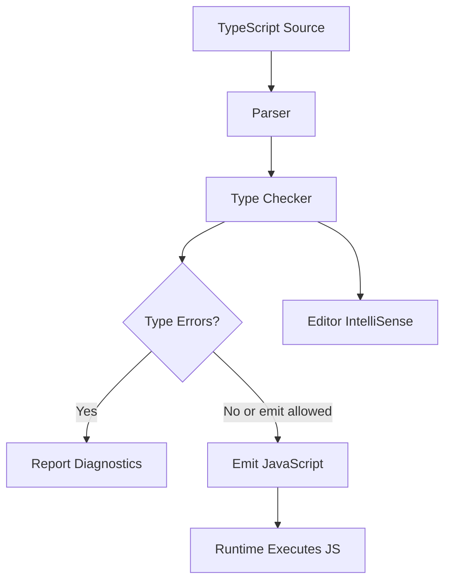
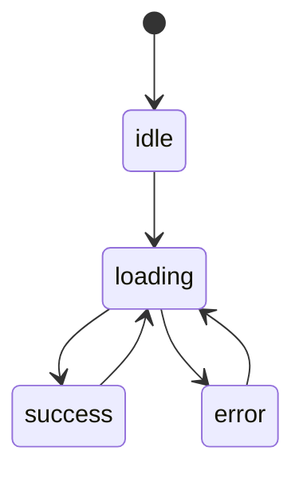

# TypeScript (Interview Prep)

## Overview

TypeScript is JavaScript with a structural static type system that catches many bugs before runtime while preserving JavaScript runtime behavior. Interview focus: type narrowing, generics, unions, interfaces vs types, utility types, `unknown` vs `any`, strictness, and how types disappear at runtime.

## Mental Model

TypeScript analyzes JavaScript before it runs. The compiler checks types, emits JavaScript, and then the runtime executes plain JavaScript with no TypeScript types present.



| Interview Question | Strong Practical Answer |
|--------------------|--------------------------|
| Does TypeScript exist at runtime? | No. Types are erased; runtime validation still needs JavaScript checks or schemas. |
| Is TypeScript nominal or structural? | Mostly structural: compatibility is based on shape, not declared name. |
| When do you use `unknown`? | For untrusted values that must be narrowed before use. |
| When do you use generics? | When input and output types need to stay related without losing information. |
| What is narrowing? | TypeScript refines a union based on control flow checks such as `typeof`, `in`, equality, and discriminants. |

## How It Works

TypeScript builds a type model from annotations, inference, declarations, and control flow. It checks that every operation is valid for the possible values at that point in the program.

### Structural Typing

Two object types are compatible when their required members line up.

```typescript
type User = {
  id: string;
  email: string;
};

type Customer = {
  id: string;
  email: string;
  plan: "free" | "pro";
};

const customer: Customer = {
  id: "u1",
  email: "ada@example.com",
  plan: "pro",
};

const user: User = customer;
console.log(user.email);
```

<!-- Output: -->
<!-- Compiles. Runtime output: ada@example.com -->

> [!info] Structural Type System
> `Customer` can be assigned to `User` because it has at least the fields `User` requires. The extra `plan` field is allowed.

### Type Erasure

Types do not protect runtime boundaries by themselves.

```typescript
type ApiUser = {
  id: string;
  name: string;
};

async function loadUser(response: Response): Promise<ApiUser> {
  const data = await response.json();
  return data as ApiUser;
}
```

<!-- Output: -->
<!-- Compiles, but does not validate that JSON really has id and name. -->

For API, form, environment, and database boundaries, pair TypeScript with runtime validation.

### Control-Flow Narrowing

```typescript
function formatId(id: string | number) {
  if (typeof id === "string") {
    return id.toUpperCase();
  }

  return id.toFixed(0);
}

console.log(formatId("abc"));
console.log(formatId(42));
```

<!-- Output: -->
<!-- ABC -->
<!-- 42 -->

TypeScript follows branches, returns, assignments, and type guards to refine union types.

### Discriminated Unions

Discriminated unions model state machines and API variants with a shared literal field.

```typescript
type LoadState =
  | { status: "idle" }
  | { status: "loading" }
  | { status: "success"; data: string[] }
  | { status: "error"; error: Error };

function render(state: LoadState) {
  switch (state.status) {
    case "idle":
      return "Nothing loaded";
    case "loading":
      return "Loading";
    case "success":
      return state.data.join(", ");
    case "error":
      return state.error.message;
  }
}
```

<!-- Output: -->
<!-- Compiles. Each switch branch sees the correct variant. -->



### Exhaustiveness Checking

Use `never` to force every union variant to be handled.

```typescript
function assertNever(value: never): never {
  throw new Error(`Unhandled case: ${JSON.stringify(value)}`);
}

function renderStrict(state: LoadState) {
  switch (state.status) {
    case "idle":
      return "Nothing loaded";
    case "loading":
      return "Loading";
    case "success":
      return state.data.join(", ");
    case "error":
      return state.error.message;
    default:
      return assertNever(state);
  }
}
```

<!-- Output: -->
<!-- Compiles. If a new LoadState variant is added, the default branch becomes a compiler error until handled. -->

## Core Concepts

### `type` vs `interface`

| Feature | `interface` | `type` |
|---------|-------------|--------|
| Object shapes | Yes | Yes |
| Declaration merging | Yes | No |
| Union/intersection aliases | No | Yes |
| Primitive/function/tuple aliases | No | Yes |
| Common default | Public object contracts | Unions, utilities, composed types |

**Interview answer:** Either works for object shapes. Use `interface` when you want extension or declaration merging; use `type` for unions, intersections, mapped types, tuples, and aliases.

### `unknown` vs `any` vs `never`

| Type | Meaning | Use |
|------|---------|-----|
| `any` | Turn off checking | Migration escape hatch; avoid in new code |
| `unknown` | Value exists but type is not known yet | Untrusted input that must be narrowed |
| `never` | No possible value | Exhaustiveness checks and impossible paths |

```typescript
function parseJson(value: string): unknown {
  return JSON.parse(value);
}

const parsed = parseJson('{"name":"Ada"}');

if (
  typeof parsed === "object" &&
  parsed !== null &&
  "name" in parsed &&
  typeof parsed.name === "string"
) {
  console.log(parsed.name.toUpperCase());
}
```

<!-- Output: -->
<!-- ADA -->

> [!tip] Pro Tip
> Prefer `unknown` over `any` at system boundaries. It forces the caller to prove what the value is before using it.

### Generics

Generics preserve relationships between values.

```typescript
function first<T>(items: T[]): T | undefined {
  return items[0];
}

const name = first(["Ada", "Grace"]);
const score = first([10, 20]);

console.log(name?.toUpperCase());
console.log(score?.toFixed(1));
```

<!-- Output: -->
<!-- ADA -->
<!-- 10.0 -->

Without the generic `T`, the function would either be too specific or lose information through `any`/`unknown`.

### Generic Constraints

```typescript
function getById<T extends { id: string }>(items: T[], id: string): T | undefined {
  return items.find((item) => item.id === id);
}

const users = [
  { id: "u1", name: "Ada" },
  { id: "u2", name: "Grace" },
];

console.log(getById(users, "u2")?.name);
```

<!-- Output: -->
<!-- Grace -->

### Utility Types

| Utility | Purpose |
|---------|---------|
| `Partial<T>` | Make all properties optional |
| `Required<T>` | Make all properties required |
| `Pick<T, K>` | Select a subset of keys |
| `Omit<T, K>` | Remove keys |
| `Record<K, V>` | Build object type from keys to values |
| `ReturnType<T>` | Extract function return type |
| `Awaited<T>` | Unwrap promises recursively |
| `NonNullable<T>` | Remove `null` and `undefined` |

```typescript
type User = {
  id: string;
  email: string;
  passwordHash: string;
};

type PublicUser = Omit<User, "passwordHash">;
type UserPatch = Partial<Pick<User, "email">>;

const publicUser: PublicUser = {
  id: "u1",
  email: "ada@example.com",
};

console.log(publicUser.email);
```

<!-- Output: -->
<!-- ada@example.com -->

### `as const` and `satisfies`

`as const` preserves literal values and readonly structure. `satisfies` checks that a value conforms to a type without widening the value more than necessary.

```typescript
type RouteConfig = Record<string, { auth: boolean }>;

const routes = {
  "/": { auth: false },
  "/dashboard": { auth: true },
} as const satisfies RouteConfig;

type RoutePath = keyof typeof routes;

const home: RoutePath = "/";
console.log(routes[home].auth);
```

<!-- Output: -->
<!-- false -->

## Code Examples

### Typed Fetch Result

```typescript
type Result<T> =
  | { ok: true; data: T }
  | { ok: false; error: string };

type User = {
  id: string;
  name: string;
};

async function fetchUser(id: string): Promise<Result<User>> {
  const response = await fetch(`/api/users/${id}`);

  if (!response.ok) {
    return { ok: false, error: `HTTP ${response.status}` };
  }

  const data = (await response.json()) as User;
  return { ok: true, data };
}

async function showUser(id: string) {
  const result = await fetchUser(id);

  if (result.ok) {
    return result.data.name;
  }

  return result.error;
}
```

<!-- Output: -->
<!-- Compiles. Caller must handle both success and error variants before accessing data. -->

### Strongly Typed Events

```typescript
type EventMap = {
  login: { userId: string };
  logout: { userId: string };
  purchase: { userId: string; amount: number };
};

function track<K extends keyof EventMap>(event: K, payload: EventMap[K]) {
  console.log(event, payload);
}

track("purchase", { userId: "u1", amount: 49 });
```

<!-- Output: -->
<!-- purchase { userId: 'u1', amount: 49 } -->

```typescript
track("purchase", { userId: "u1" });
```

<!-- Output: -->
<!-- Compiler error: property 'amount' is missing. -->

## Key Details

- TypeScript checks compile-time possibilities; it does not prove runtime data is valid.
- Inference is usually better than annotations for local variables; annotate function boundaries and public APIs.
- `strict: true` catches the most valuable bugs and should be the default for new projects.
- Avoid broad type assertions like `as any`; they silence the checker exactly where you need it most.
- Prefer discriminated unions over boolean flag combinations for async state and domain state.
- Use `readonly` for intent, but remember it is compile-time only unless the runtime object is frozen.

> [!warning] Gotcha
> `as Type` does not convert a value. It only tells the compiler to treat the value as that type. If the runtime value is wrong, the bug still exists.

> [!tip] Pro Tip
> Put the strongest types at module boundaries: API clients, form parsers, database adapters, event emitters, and shared library exports.

## Key Interview Questions

### Q1: What problem does TypeScript solve?

**Answer:** It catches type-related mistakes before runtime, documents contracts, powers editor tooling, and makes refactors safer while still emitting JavaScript.

### Q2: Does TypeScript run in production?

**Answer:** No. TypeScript types are erased during compilation. Production runs JavaScript, so runtime validation is still required for untrusted input.

### Q3: What is structural typing?

**Answer:** Compatibility is based on shape. If a value has the required properties with compatible types, it can be used even if it was declared under a different name.

### Q4: `interface` or `type`?

**Answer:** Use either for object shapes. Use `interface` for extendable public object contracts and declaration merging. Use `type` for unions, intersections, tuples, mapped types, and aliases.

### Q5: What is a union type?

**Answer:** A union means a value can be one of several types, such as `string | number`. You can only perform operations valid for every member until you narrow it.

### Q6: What is narrowing?

**Answer:** Narrowing is TypeScript refining a type based on control flow, such as `typeof`, `instanceof`, truthiness, equality checks, `in`, discriminant fields, and custom type guards.

### Q7: What are generics?

**Answer:** Generics are type parameters. They let functions, components, and types work with many input types while preserving relationships between inputs and outputs.

### Q8: What is the difference between `unknown` and `any`?

**Answer:** `any` disables checking. `unknown` accepts any value but prevents usage until the value is narrowed, which is safer for untrusted data.

### Q9: What is `never`?

**Answer:** `never` represents impossible values. It appears for functions that never return, impossible branches, and exhaustiveness checks.

### Q10: What are literal types?

**Answer:** Literal types represent exact values, such as `"success"` or `404`. They are useful for discriminated unions and precise configuration.

### Q11: What is a type guard?

**Answer:** A type guard is a runtime check that TypeScript understands as narrowing, such as `typeof value === "string"` or a custom predicate returning `value is User`.

### Q12: What is a discriminated union?

**Answer:** A union where each variant has a shared literal field, usually `type`, `kind`, or `status`. Checking that field narrows the union to the matching variant.

### Q13: What is declaration merging?

**Answer:** TypeScript can merge multiple declarations with the same interface name. This is useful for extending library types but can be surprising in application code.

### Q14: What is module augmentation?

**Answer:** Module augmentation extends types from an existing module, commonly used when a library exposes extension points such as framework request objects.

### Q15: What is `keyof`?

**Answer:** `keyof T` creates a union of property keys from `T`. It is commonly used with generic helpers, mapped types, and strongly typed object access.

### Q16: What are mapped types?

**Answer:** Mapped types transform each property in a type, such as making all fields optional, readonly, nullable, or selecting fields by key.

### Q17: What are conditional types?

**Answer:** Conditional types choose one type or another based on assignability, such as `T extends Promise<infer U> ? U : T`.

### Q18: What is `infer`?

**Answer:** `infer` declares a type variable inside a conditional type so TypeScript can extract part of another type, such as a function return type.

### Q19: What is the difference between `private` and JavaScript `#private` fields?

**Answer:** TypeScript `private` is checked at compile time and emits normal JavaScript properties. JavaScript `#private` is enforced by the runtime.

### Q20: What is `readonly`?

**Answer:** `readonly` prevents assignment through that typed reference at compile time. It does not deeply freeze runtime objects.

### Q21: What is `satisfies`?

**Answer:** `satisfies` checks that an expression conforms to a target type while preserving the expression's more specific inferred type.

### Q22: What does `strictNullChecks` do?

**Answer:** It prevents `null` and `undefined` from being assigned everywhere by default. Code must explicitly include and handle them.

### Q23: What is excess property checking?

**Answer:** Object literals assigned directly to a target type are checked for unexpected properties. Variables with extra properties can still be assigned if required properties match.

### Q24: How do you type React props?

**Answer:** Use a named `type` or `interface` for props, narrow event types where needed, avoid `React.FC` unless the team prefers it, and model variants with discriminated unions.

### Q25: How do you migrate JavaScript to TypeScript?

**Answer:** Start with `allowJs` or isolated modules, add types at boundaries, enable strict flags incrementally, replace `any` with `unknown` plus narrowing, and add runtime validation for external data.

## When to Use

- Preparing for TypeScript, React, Next.js, Node.js, or frontend platform interviews.
- Designing safer API clients, UI state machines, event systems, and shared libraries.
- Refactoring JavaScript code with more confidence.
- Reviewing before [[React Interview]], [[Next.js Interview Questions]], [[GraphQL]], and [[Frontend Testing]].

## Related Topics

- [[js-interview|JS Interview]] - TypeScript builds directly on JavaScript runtime behavior.
- [[React Interview]] - React props, hooks, reducers, and state variants benefit from strong TypeScript modeling.
- [[Next.js Interview Questions]] - Next.js projects commonly use TypeScript across server and client components.
- [[GraphQL]] - Schema code generation maps GraphQL operations to TypeScript types.
- [[Frontend Testing]] - Type-safe test helpers and mocks reduce brittle test setup.
- [[Testing with Vitest and Jest]] - Test runners often need TypeScript-aware configuration.

## External Links

- [TypeScript Handbook: Everyday Types](https://www.typescriptlang.org/docs/handbook/2/everyday-types.html)
- [TypeScript Handbook: Narrowing](https://www.typescriptlang.org/docs/handbook/2/narrowing.html)
- [TypeScript Handbook: Generics](https://www.typescriptlang.org/docs/handbook/2/generics.html)
- [TypeScript Utility Types](https://www.typescriptlang.org/docs/handbook/utility-types.html)
